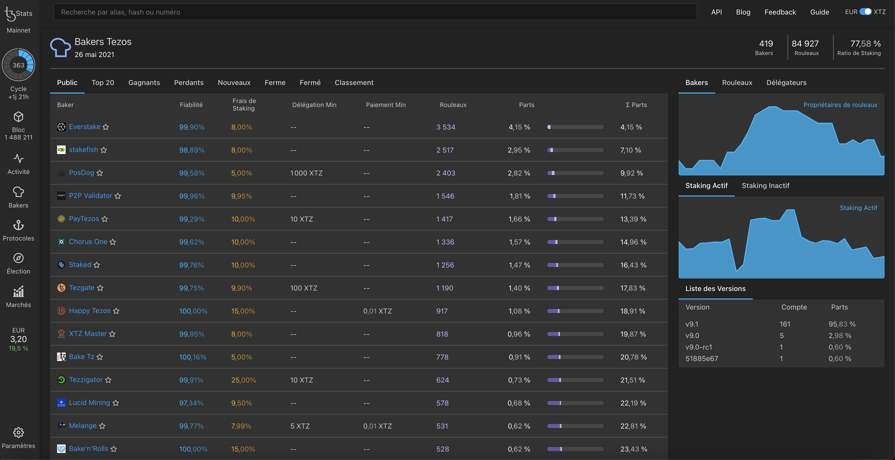
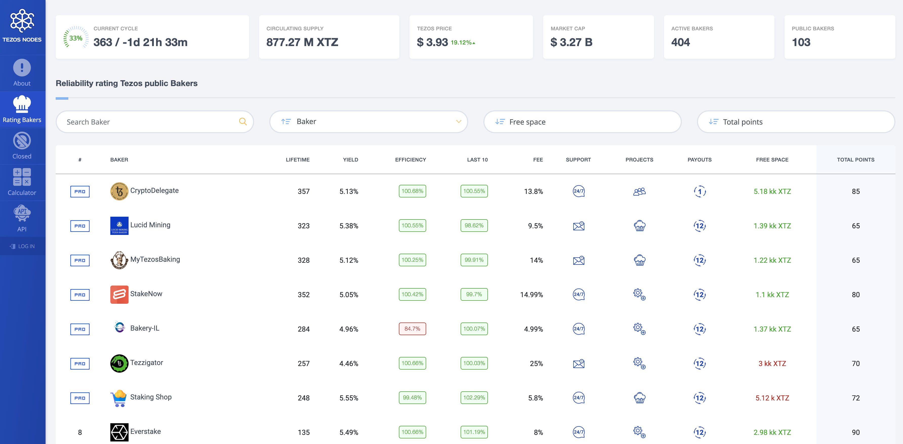

In this section, we will see how to find lists of bakers. As a delegator, we will see how to choose a baker.

## List of bakers

Most Tezos blockchain explorers have a list of bakers ordered according to different criteria. This allows delegators to choose their baker in the most comfortable way. Check out [the explorer module](/explorer/available-tezos-indexers) a an in-depth list of block explorers.

[Baking Bad](https://tzkt.io/bakers/), [TzStats](https://tzstats.com/bakers) or [Tezos Nodes](https://tezos-nodes.com/) allow you to browse through bakers.

<small className="figure">FIGURE 1: Baking Bad Bakers</small>

<small className="figure">FIGURE 2: TzStats Bakers</small>

<small className="figure">FIGURE 3: Tezos Nodes Bakers</small>

### What kind of baker?

You have probably come across terms like **public bakers**, **private bakers** or **corporate bakers**. How are they different? In terms of protocol, i.e., participation in block validation, there is no difference. The actual differences are as follows.

#### Public bakers

A public baker is different from a private one by functioning as a public staking service promising to share its profits with anyone who had delegated them their stakes.

#### Private bakers

A private baker doesn’t offer everyone to delegate their stakes. Technically speaking, they can’t forbid you to delegate your Tez to them, but they are under no obligation to share their baking profits with you.

These days, it is the centralized exchanges like Coinbase, Binance or Kraken, that hold the biggest stakes. They offer their users an opportunity to stake Tez from their exchange accounts and get profits.

#### Corporate bakers

A corporate baker only means that someone wants to emphasize that it is a corporation that bakes on Tezos. Such a baker can be private or public.

## How to choose a baker?

### Criteria

There are a few factors to consider when choosing a baker to delegate to:

#### Staking balance

This is the Tezos baker’s staking balance, which includes his own Tez funds (bonds) and all the delegated funds. In the short term, the greater the stake, the less the baker’s profit fluctuates from cycle to cycle. This happens due to the randomness in the distribution of baking rights in Tezos, which means the more rolls, the less variance, and the less rolls, the more variance.

#### ROI (Return On Investment)

This is how much Tezos staking rewards you would earn per year if you delegate to a particular baker, assuming the baker accurately pays all the rewards, doesn’t miss payouts, and doesn’t change the fee and other terms.

#### Fee

This is how much the Tezos baker charges from the staking rewards he distributes between his delegators. On average, the profitability is the same across all bakers, yet their customers have varying profits as different bakers have different fees. If the fee is too high or too low, it’s a good reason to start thinking why.

#### Free space

This is how much Tez you can delegate to the baker. A negative value indicates that the baker is likely _overdelegated_, which is very unwanted as he will miss blocks and endorsements.

> Each time a baker/endorser creates/confirms a block, they have to lock a certain amount for 5 cycles as a security deposit. _Overdelegation_ is when the available Tez balance is not enough (because the entire balance has already been locked) so, they skip block/endorsement.

#### Minimum delegated amount.

Bakers can set up a minimum amount they expect to get from a delegator. Some accept stakes starting from 1 Tez while others from 1000 Tez.

#### Payouts accuracy

This value indicates how accurate the baker’s payouts are.

#### Payouts periodicity

This value indicates whether the baker pays according to his payment schedule or not.

## Conclusion

Those were the things you should check when choosing a baker. It is up to you to decide which criteria are more important than the others. But no matter what, your choice of a baker should be conscious and well-reasoned.

## References

[1] https://tzkt.io/bakers

[2] https://tzstats.com/bakers

[3] https://tezos-nodes.com/

[4] https://baking-bad.org/docs/tezos-baker-metrics/

[5] https://tezos.org.ua/en/blog/how-to-choose-a-baker/
