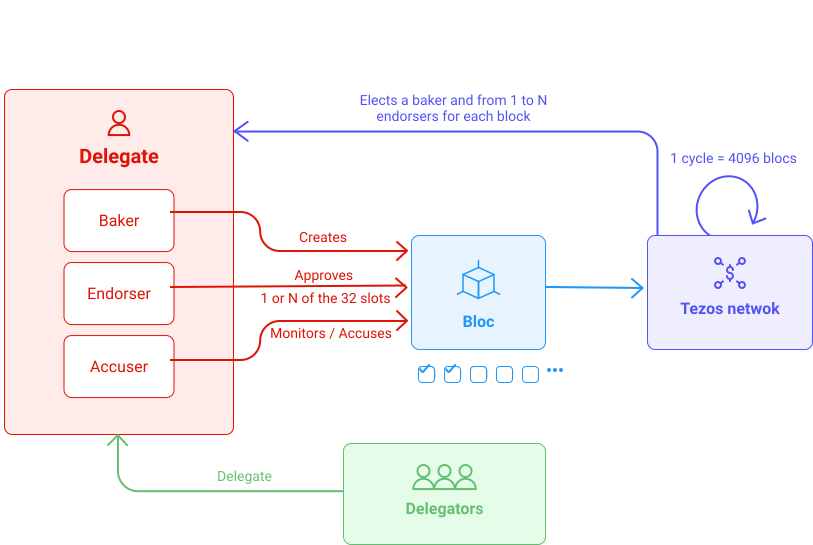
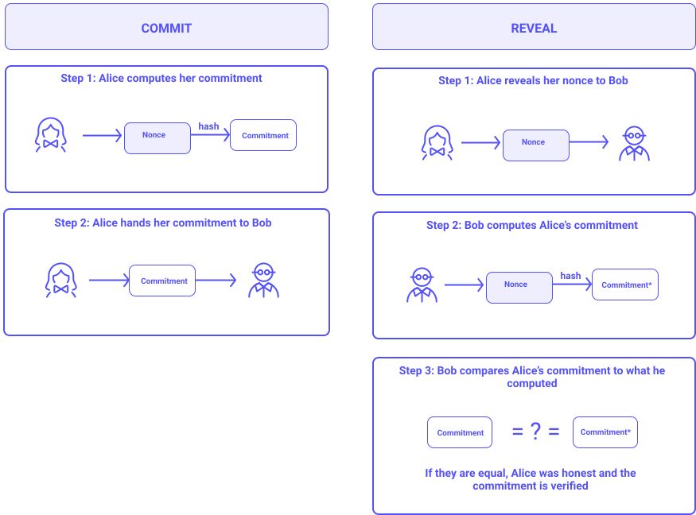

In this section, we will discuss how baking works. The different actors of the mechanism and the technological solutions will be presented.


<small className="figure">FIGURE 1: How Baking Works?</small>

**Delegators** can delegate their tokens to a **Delegate**. A delegate can be:
- a **Baker**, who participates in the consensus by **creating** new blocks.
- an **Endorser**, who participates in the consensus by **validating** the blocks created by other bakers.
- an **Accuser**, who participates in the consensus by **monitoring** bakers and endorsers works.

**A roll** represents 8,000ꜩ delegated to a given public key and are updated every `BLOCKS_PER_ROLL_SNAPSHOT` = 256 blocks.

**A roll snapshots** represents the state of rolls for a given block. 

We also define:
- `BLOCKS_PER_CYLCE` = 4096 blocks.
- `n`, th current cycle.
- `PRESERVED_CYCLES` = 5 cyles, i.e. the number of cycles during which the tokens are frozen.

## Cycle

The Tezos consensus is organized in cycles. One cycle corresponds to `BLOCKS_PER_CYLCE` = 4096 blocks (≈ 2.8 days).
At any point, the shell will not implicitly accept a branch (chain of blocks) which fork point is in a cycle more than `PRESERVED_CYCLES` = 5 cycles in the past (≈ 14 days).

## Baking

**Baking** is the act of creating, signing and, publishing blocks. 

Bakers select and validate all transactions and add them to the blockchain. If a baker behaves dishonestly, the protocol has a built-in mechanism that can cause them to lose their security deposit.

Bakers are rewarded with Tez for securing the network.

In Tezos, the right to produce a block in cycle `n` is assigned to a randomly selected roll in a randomly selected roll snapshot from cycle `n-PRESERVED_CYCLES-2`.

**Bakers** are randomly selected from the list of all nodes that have declared themselves as delegates, in proportion to the amount of Tez they have.

A baker is a delegate, while a coin holder who delegates his Tez is a **delegator**. Note that a baker does not necessarily need delegators to function, he can play solo, but he has fewer chances to be selected for baking.

The selected baker is allowed to create the next block and add it to the chain then communicate it to the network. He receives a certain number of Tez as a reward.

Several bakers are elected to create a block with a priority list. The one with the highest priority will try to create a block. If he fails to do so within the time limit, the hand will pass to the next baker. A block generated by the baker that does not have priority will be invalid and refused by the network.

To create a block, a baker has to freeze part of his tokens, which will be made available back to him only `PRESERVED_CYCLES` = 5 cycles later.

A baker can be marked as either active or passive. A passive delegate cannot be selected for baking or endorsing. A baker becomes passive in cycle `n` if he fails to create any block or endorsement in the past `PRESERVED_CYCLES` cycles, that is to say, in cycles `n-1`, `n-2`, …, `n - PRESERVED_CYCLES`.

## Endorsing

Tezos also relies on **endorsers** to approve the newly created block in exchange for a reward. Then, each other member of the network will have to validate the block on its own version of the chain.

Endorsers are responsible for ensuring the proper "baking" of each new block.

Endorsing rights are set in the same way as baking rights. For every block level, 32 rolls are randomly selected. Their owners are supposed to endorse a block. Endorsing serves as a vote on a block.

Each endorser verifies the last block that was baked, say at the level `n`, and emits an endorsement operation. The endorsement operations are then baked in block `n+1`. Once block `n+1` is baked, no other endorsement for block `n` will be considered valid.

Note that an endorser may have more than one endorsement slot (over 32). However, the endorser injects a single endorsement operation, which represents all of its endorsement slots

Endorsing is a sign of activity, so the more endorsement blocks contain, the healthier the chain.

## Rolls

A roll represents 8,000ꜩ delegated to a given public key. So, the more rolls someone has, the higher the chance to bake the next block. If 10 rolls are active, and a baker owns $\frac{2}{10}$ of these rolls, he has a 20% chance of being selected. Note that 8,000ꜩ or 15,999ꜩ still represent 1 roll and have the same probability of baking.

Baking rights are called priorities and given in turns. For example, if 10 rolls are active, the protocol can randomly select a priority list as follows:

```
 Priority1 = Roll 6
 Priority2 = Roll 9
 Priority3 = Roll 4
 Priority4 = Roll 3
 .
 .
 .
 Priority10 = Roll 7
```

Consequently, the person who owns roll #6 would have priority to propose the new block. If he does not create and broadcast it within a certain period, the next baker who owns roll #9 may take over. Note that a baker may have several rolls selected and therefore receive several priorities.

### Roll selection

At each cycle, a random seed is created. A pseudo-random number generator uses the seed to generate the priority list based on a snapshot of existing rolls 2 cycles ago.

#### Roll snapshots

Snapshots of owned rolls are done every 256 blocks and define who can bake. The order of baking is then defined by assigning priorities to each roll. The ordering is done using a pseudo-random number generator based on a seed.

#### Random seed

Since Tezos runs a deterministic protocol, there is no real randomness. More specifically, there is no randomness in the snapshot selection and baking/endorsement slots attribution, i.e., we know the result before the operation occurs (unlike in _PoW_ where you can only estimate it).

The seed is created by requesting a secret number (nonce) from all roll owners. All secret numbers are gathered and used to create a hash that will be used as the random seed. Since the last owner to reveal his secret already knows the other numbers, a 2-phase process called "Commit & Reveal" is necessary.

The random seed for cycle `n` is a 256-bit number generated at the very end of cycle `n-1` from the previous seed and the nonces that delegates commit during cycle `n-2`.

> In cryptography, **a nonce** (number used once) is an arbitrary number intended to be used only once.  
> **A commitment** is the hash of a nonce.


<small className="figure">FIGURE 2: Commit & Reveal</small>

One out of every `BLOCKS_PER_COMMITMENT` (= 32 blocks) can contain a commitment. There are therefore, at most `BLOCKS_PER_CYCLE / BLOCKS_PER_COMMITMENT` (= 128 commitments) per cycle. The commitment is generated by the baker who produces the block and is included in the block header.

In summary, the seed for cycle `n` is a hash created from:
- the seed of cycle `n-1`, a constant. 
- every nonce that was revealed in cycle `n-1`

This seed is used to randomly select:
- a roll snapshot from cycle `n-2`
- rolls in the selected snapshot

The selected rolls determine the baking and endorsing rights in cycle `n+PRESERVED_CYCLES`.

#### Baker and endorser selection

The generated list of priorities identifies which roll has the responsibility to bake a block and which rolls have to endorse this new block. It is a round-robin process that cycles on the list of priorities until the end of the cycle (4096 blocks).

> **A round robin** is a way of choosing all elements in a group equally in some rational order, usually from the top to the bottom of a list and then starting again at the top of the list and so on.

## Accusation

There are also **accusers**. This type of delegates monitor that:

- a baker does not create two competing blocks at the same level
- an endorser does not endorse a block twice or more at the same baking slot

If an accusation is correct, the accuser gets a part of the funds that were frozen by the baker or the endorser, as a reward. The other part is burned.

Any attempt to fraud is therefore punished.

> Cryptocurrency tokens or coins are _burned_ when they are permanently removed from the circulating supply on purpose.

## In summary

- At each [cycle](/baking/baking_explained#cycle), a priority list of **bakers** is chosen and 32 other **delegates** are chosen as **endorsers**. The endorsers are thus delegates who will validate the block of bakers. The bakers are elected [pseudo randomly](/baking/baking_explained#roll-selection) in proportion to the quantity of Tez that they possess.

> By abuse of language, we often designate by **bakers**: **the bakers and the endorsers**. Because in practice, they are the same entities that carry out the operations of creation and validation of blocks. Of course, a baker cannot also be an endorser for the same block. Otherwise, he would validate his own block. However, when he is not elected baker for a cycle, he can validate the blocks of other bakers.

- To become a delegate, one must freeze a part of his tokens, at least 8000ꜩ, which will be made available to him only 5 cycles later (14 days).
  
- A baker is a delegate and the one who delegates his Tez is a delegator. Note that a baker does not necessarily need delegators to operate, he can play solo, but he will be less likely to be selected to create the block, because he will have less funds at his disposal.

- Several bakers are added to a [priority list](/baking/baking_explained#rolls). The one with the highest priority will try to create a block. If he fails to do so within the time limit, the hand will pass to the next baker. And so on.

- The first baker who manages to create the block will be able to add it to the blockchain. He will receive a certain number of Tez as a [reward](/baking/reward). In turn, bakers share the additional revenue generated from the delegated tokens with the delegators, in proportion to their participation.

- The accusers monitor the process and punish the cheaters.

## Conclusion

The Tezos consensus protocol uses the _Liquid Proof of Stake algorithm_. Delegates (people who have at least 8,000 ꜩ of delegated funds) are given the responsibility of creating and endorsing blocks. They are rewarded for their action. They are also required to lock a portion of their capital as a security deposit to ensure honest behavior.

## References

[1] https://tezos.gitlab.io/008/proof_of_stake.html

[2] https://wiki.tezosagora.org/learn/baking/proofofstake/consensus
