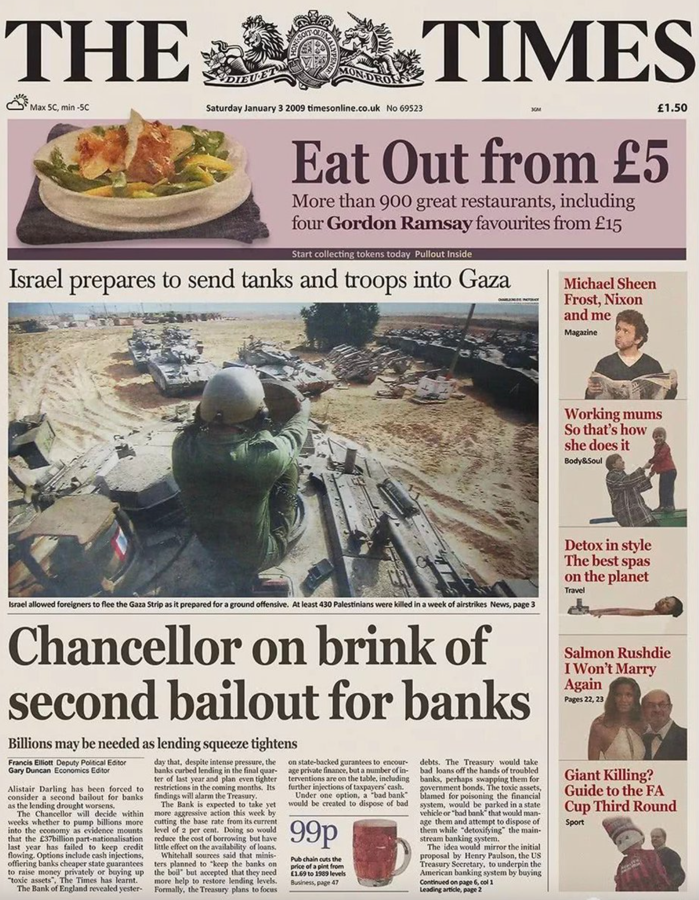
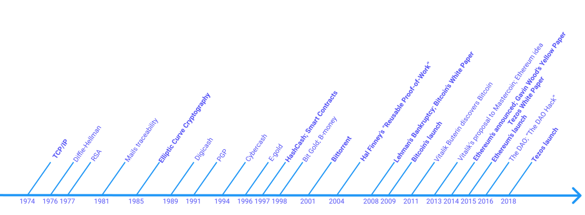

Welcome to _OpenTezos_, the most complete and open-source documentation on Tezos.

Before we start digging into Tezos itself, let's review the basics of blockchain and cryptocurrencies. This module will first present a brief history of the blockchain, then its main components and consensuses, and finally introduce the notion of _smart contract_. All these notions will later be helpful for you in the next modules to understand how Tezos works, and how it builds upon Bitcoin and Ethereum to become part of the new generation of blockchains.

## A brief history of blockchain
### The tipping point
In 2005, Greece imposed restrictions on the amount people could withdraw from their bank account, in an attempt to prevent banks from failing, as talks between the government and bailout creditors appeared to be on the verge of collapse.

In 2008, the [subprime mortgage crisis](https://en.wikipedia.org/wiki/Subprime_mortgage_crisis) triggered a *global* financial crisis. _Lehman Brothers_ went bankrupt, and many other banks and financial institutions across the world failed to the point that they had to be bailed out by governments. 

These events and many others of the same kind exposed the fragility of the modern financial system, and that banks and other financial institutions could not be trusted with the money people give them.

[Fractional reserve banking](https://en.wikipedia.org/wiki/Fractional-reserve_banking), the most common form of banking practised by commercial banks worldwide, is the embodiment of such issue. When you give a bank $1,000, the bank does not keep that amount in reserve for you. It legally only needs to keep $100 in reserves (generally around 10%), and is allowed to spend $900 of your money in various investments. At this point, not only are you not able to withdraw your $1,000 if the bank doesn't have enough reserves from other depositors, but they risk losing your money altogether if the bank goes bankrupt. If a bank has net deposits of a billion dollars, it only needs to keep around 100 million on hand at any given time. This usually works fine when bank customers don't withdraw all their money altogether at once. However, the moment customers start to question the bank's financial stability and decide to withdraw their money, the bank can rapidily empty its reserve and things can go south very quickly.

On another note, one of the solutions to a crisis often used by governments is to create more of their national [fiat currency](https://en.wikipedia.org/wiki/Fiat_money) (e.g. US Dollar, Euro, etc.) to pay for recovery plans. This leads to [hyperinflation](https://en.wikipedia.org/wiki/Hyperinflation) of the fiat currency and devaluation of people's holdings. Fiat currencies are entirely controlled in their supply and creation by a national government and are backed by nothing but faith in the government. Many countries such as Venezuela have experienced hyperinflation to the point that their fiat currency is only now worth a small fraction of its past value.

All these factors, the lack of faith in governments to protect their fiat currencies, the lack of trust in banks to protect people's holdings, and so on, led to a new questioning about the modern financial system: *Is there a better alternative?*

### And then came Bitcoin
On **October 31st, 2008**, under the _pseudonym_ of "Satoshi Nakamoto", the [Bitcoin whitepaper](https://bitcoin.org/bitcoin.pdf) was discreetly released. From its very title and abstract, one could understand that the aim of _his_ invention was to create an "electronic cash system", an alternative to fiat currency, able to function free of control or manipulation from a centralised entity.

On **January 3rd, 2009**, this "blockchain" went live and the first _block_ was created, called the "Genesis Block" (you will learn about what is a _block_ in the next chapter). The Genesis block contained the first few exchanges of this newly created electronic currency called Bitcoin, and some data. It is indeed possible to store some raw data inside a block, and Satoshi Nakamoto included in the first block a message saying: "_Chancellor on brink of second bailout for banks_", the title of _The Times_ newspaper of the day describing the second bank bailout following the subprime crisis.

This message clearly showed the intention of Satoshi Nakamoto and his Bitcoin to trigger the so-called **de-centralisation of money**.

<small className="figure">FIGURE 1: _The Times_ newspaper from January 3rd, 2009</small>

### What is Bitcoin?
Bitcoin is a computer program made of various cryptographic components (e.g. asymmetric cryptography, hash functions, proof-of-work, etc.) ensuring its functionality and security. This is why Bitcoin and other coins are referred to as **crypto-currencies**.

Contrary to popular belief, Bitcoin wasn't the first attempt at creating a crypto-currency. _Digicash_ (1989), _CyberCash_ (1994), _E-gold_ (1996), _HashCash_ (from Adam Back in 1997), _Bit Gold_ (1998) and _B-money_ (from Wei Dai in 1998) were all very close to such goal but all failed because of technical or security issues. _Bit Gold_ and _B-money_ even used a decentralized database for transactions and an older version of Bitcoin's _Proof-of-Work_. Bitcoin was actually the first to have components assembled in such a way that made it viable.

Bitcoin's components were not new either and were based on technologies used for years before that. Bitcoin relies on a lot of "old" Information Technologies (IT). Some from as far as 1973, and up until the Genesis Block in 2009.

Bitcoin's system actually spans across 36 years of research, trials, experiments, and failures.

First of all, Bitcoin relies on the Internet, which itself has been relying on _TCP/IP_ since 1974.

Bitcoin also relies heavily on so-called _Modern Cryptography_, e.g. the Diffie-Hellman protocol (1976, in collaboration with Ralph Merkle), the Merkle Tree (1979), and the RSA (Rivest–Shamir–Adleman) public-key cryptosystem (1977).

The blocks of data are cryptographically chained with [Cipher Block Chaining (CBC)](https://en.wikipedia.org/wiki/Block_cipher_mode_of_operation#Cipher_block_chaining_(CBC)) from 1976, meaning that chains of blocks are actually that old.

From there, countless reflections on ethics, research on technologies, and of course cryptography have taken place: Mails traceability and privacy in 1981, Elliptic Curve Cryptography in 1985 (used for _Public Key Cryptography_ in most blockchains), PGP in 1991 (developed for privacy providing authentication and encryption), etc. Even "smart contracts" were first conceptualized by Nick Szabo in 1997.

In 2001, the _Bittorent_ client provided more support to the peer-to-peer networks experimental research. An important opening towards more decentralisation.

Finally, before the bankruptcy of Lehman Brothers and the global financial crisis in 2008, Hal Finney (1956-2014), who had developed on PGP, released his "Reusable Proof-of-Work" in 2004. Later, he became one of the first persons exchanging Bitcoins with Satoshi Nakamoto.

### The 2nd generation of blockchains
Following the success of Bitcoin, many forked its code and started creating new blockchains with differentiating new features or capabilities.

Note that Bitcoin's transactions are programmable. One can program how funds are spent using scripts. However, going beyond these basic uses are quite difficult as Bitcoin's scripting language is very limited.

In 2011, Vitalik Buterin encountered Bitcoin, and two years later (October 2013) worked on a proposal for [_Mastercoin_](https://web.archive.org/web/20150627031414/http://vbuterin.com/ultimatescripting.html) a protocol with more programmable capabilities than Bitcoin.

However the team at _Mastercoin_ didn't want to go in this direction, and Vitalik Buterin began to re-work his proposal into another project named _Ethereum_ (December 2013). The need for even more complex scripts was driven by the interest into [_**D**ecentralized **A**utonomous **O**rganizations_](https://en.wikipedia.org/wiki/Decentralized_autonomous_organization) (or DAO), a form of investor-directed venture capital fund that no blockchain could so far implement. It was also in December 2013 that Gavin Wood (protocol-side) and Jeffrey Wilcke (client-side) joined forces with Vitalik Buterin to work on Ethereum, and a [white paper was first published in January 2014](https://ethereum.org/en/whitepaper/).

In April 2014, Gavin Wood published a [Yellow paper](https://ethereum.github.io/yellowpaper/paper.pdf) (a yellow paper is a document containing research that has not yet been formally accepted or published in an academic journal. It usually contains unannotated statements, with sufficient details to implement the idea).

Crowdfunding in bitcoins during the same summer took place, and Ethereum was launched on July 30th, 2015 with its own cryptocurrency called "_Ether_".

Ethereum was a revolution, a new generation of blockchain, thanks to its **EVM** ([Ethereum Virtual Machine](https://ethereum.org/en/developers/docs/evm/)), a [Turing Complete](https://en.wikipedia.org/wiki/Turing_completeness) system able to solve any computation problem using its new low-level scripting language called "[_EVM Code_](https://ethereum.org/en/whitepaper/#code-execution)". On top was also provided one of the most used high-level languages called "[_Solidity_](https://soliditylang.org/)".

The first DAO of Ethereum, simply called "[_The DAO_](https://en.wikipedia.org/wiki/The_DAO_(organization))" was created and more than 150 millions of US Dollars in Ethers were raised in June 2016. However, an error in the a *smart contract* (high-level Solidity code) [permitted a hacker to steal 50 millions](https://www.nytimes.com/2016/06/18/business/dealbook/hacker-may-have-removed-more-than-50-million-from-experimental-cybercurrency-project.html). To recover the stolen funds, it was decided to modify the history of transactions. This decision was not approved by the entire community and created a split of the history ("*hard fork*") into two different blockchains: _Ethereum_ and _Ethereum Classic_.

Today, Bitcoin and Ethereum remain the two main protocols, but a lot of very interesting alternatives have been created, notably Tezos in 2018.

<small className="figure">FIGURE 2: A non-hexaustive timeline</small>

## Terminology
A *blockchain* is a special type of [_**D**istributed **L**edger **T**echnology_](https://en.wikipedia.org/wiki/Distributed_ledger) (DLT), a consensus of replicated, shared, and synchronized digital data geographically spread across multiple sites.

Not all blockchains are then cryptocurrencies. For instance, [Corda](https://www.corda.net/) and [Fabric](https://www.hyperledger.org/use/fabric) are blockchains often used for immutable and cryptographically verified storage of data in various domains: Secure sharing of medical data, Music royalties tracking, Personal identity security, Supply chain and logistics monitoring, Voting mechanism, etc.

It is important not to confuse a cryptocurrency (first made for exchanging money) with its supporting component: a *blockchain*. Note that **originally** the word "*blockchain*" did **not** designate a technology, but the name of the **data-structure** used to store the data.

The exact word "blockchain" does not even appear in the Bitcoin whitepaper but **now reflects the technology** used to arrange and chain data ensuring _immutability_ and _cryptographic verifiability_.

Crypto-currencies have 2 important characteristics:
- They are public
- There is no _double-spending_, meaning that you cannot spend the same coins twice.

To create a distributed currency without a central authority, Satoshi Nakamoto had to solve the double-spending problem **in a large distributed environment** which was no easy task as we will see in the next chapters.

## References

[1] https://medium.com/@noogin/the-financial-crisis-and-history-of-bitcoin-27ebdb932b99

[2] https://en.wikipedia.org/wiki/Subprime_mortgage_crisis

[3] https://en.wikipedia.org/wiki/Fractional-reserve_banking

[4] https://bitcoin.org/bitcoin.pdf

[5] https://ethereum.org/en/whitepaper/