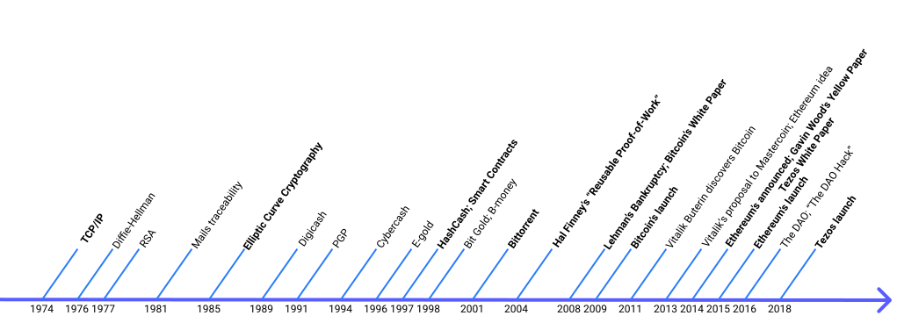

import NotificationBar from '../../src/components/docs/NotificationBar';

<h1 className="p">Under construction.</h1>

<NotificationBar>
  

    Lorem ipsum
  

</NotificationBar>

# Introduction to decentralisation and cryptocurrencies

In this chapter, the reader will get a glimpse on the "cryptocurrencies" and "blockchains" global context of emergence. From the first "blockchain" _Bitcoin_ to other systems like _Tezos_, a brief history of these protocols is pictured.

## Context
On **October 31st, 2008**, under the "Satoshi Nakamoto" _pseudonym_, the Bitcoin whitepaper is discreetly released. In the title and the "abstract", we can understand that the aim of _his_ invention is creating an "electronic cash system", a kind of currency, which is able to disconnect itself from any centralised entity.

On **January 3rd, 2009**, the first data of this system are locked inside a _block_, called the "Genesis Block", which actually contains the first exchanges of the created electronic currency in "bitcoins". The Genesis Block also includes a message in English which is _The Times_ newspaper's main title of the same day:
"_Chancellor on brink of second bailout for banks_".

At these dates, the financial crisis struck, it's then easy to reinforce the conclusion that Bitcoin was created mostly for **de-centralisation of money**. To achieve such an aim, Bitcoin uses various Cryptography's techniques and tools (_e.g. Public-Key Cryptography_). This explains why we refer to Bitcoin or new systems based on the same mechanics as **crypto-currencies**.

## Terminology: An important note
With time, the word "cryptocurrency" has been replaced by "blockchain". Other systems were created to lift Bitcoin's limitations or propose another phylosophy. And new use-cases exceeded the "currency" one.

The exact word "blockchain" does not appear anywhere in Bitcoin's whitepaper but reflects the technique to arrange and chain data for the purpose of validation and _immutability_ of _bitcoins transactions_ (see below).

These _bitcoins exchanges_ are called **transactions**, but are not as usual as classic transactions (e.g. putting coins in a coffee machine).

In Bitcoin's whitepaper, we can find what "blocks" or "chains" are, but they are "just" arranged in a _chain of blocks_.

Hence, the polysemy to take into account: "Blockchain" could refer the entire system; or the chained data-structure.

## A brief history of the "Blockchain"
New systems directly copied Bitcoin or implemented their own similar mechanics. On the other hand, Bitcoin relies on a lot of pretty old Information Technologies (IT). From as far as 1973, and until the Genesis Block from 2009.

Bitcoin's system is actually around 36 years of research, trials and experiments, and failures.

First of all, Bitcoin relies on Internet, which itself relies on _TCP/IP_ from 1974.

Bitcoin and newer systems also use _Cryptography_, which is, actually, as old as Ancient History. However, what we mean by "Cryptography" in these systems is _Modern Cryptography_.

Modern Cryptography is linked to first calculating machines and research in modern Mathematics. Very important researchs like for the Diffie, Hellman, and Merkle protocol, or RSA (_Rivest, Shamir, Adleman_), are both respectively from 1976 and 1977.

From there, countless reflexions on ethics, researchs on technologies, and of course Cryptography took place.

Mails traceability (1981); Elliptic Curve Cryptography (1985); Digicash (1989); PGP (1991); CyberCash (1994); E-gold (1996); HashCash (1997, with Proof-of-Work); Smart Contracts (1997, defined by Nick Szabo).

Even _Bit Gold_ and _B-money_ (from Wei Dai) are from 1998. The latter already used a decentralized database for transactions and an older version of the Bitcoin's _Proof-of-Work_ (more details in next chapters on this matter).

In 2001, the Bittorent client provided more support to the Peer-to-Peer networks experimental researchs. An important opening to more decentralisation.

Finally, before Lehman bankruptcy and the financial crisis (2008), Hal Finney (1956-2014), developper on PGP (1991), released his "_Reusable Proof-of-Work_" (2004). Later, he was one of the first exchanging bitcoins with Satoshi Nakamoto.

From 2009, many projects copied Bitcoin, or tried to enhance its capabilities.

In 2011, Vitalik Buterin discovered Bitcoin, and two years later (October, 2013), worked on a proposal for _Mastercoin_[[1]](/blockchain-basics/introduction#references), that would have upgraded the programmable side of this system.

Bitcoin's transactions also are programmable. They define how funds can be spent with scripts. However, the idea is going beyond the main use-case of a currency, and Bitcoin's scripts are too limited.

But the Mastercoin team didn't want to go in this direction, so Vitalik began to re-work his proposal into another project named _Ethereum_ (December, 2013). The need for even more complex scripts was driven by the interest into _**D**ecentralized **A**utonomous **O**rganizations_ (DAO), that other systems couldn't allow. That is also around December, 2013, that Gavin Wood (protocol-side) and Jeffrey Wilcke (client-side) joined Vitalik Buterin to work on Ethereum. The white paper was published, and in January, 2014, Ethereum was announced.

Followed the _Yellow Paper_ from Gavin Wood in April, 2014, a crowdfunding in bitcoins during the same summer, and the launch on July 30th, 2015, the next year. Ethereum was then a new system, with its own cryptocurrency called "_Ether_".

The first DAO of Ethereum simply called "_The DAO_"[[2]](/blockchain-basics/introduction#references) is created and more than 150 millions of dollars (\$) are  fundraised in June, 2016. But the 16th, 50 millions (\$) are stolen through the famous "_The DAO hack_"[[3]](/blockchain-basics/introduction#references).

To recover the stolen funds, it has been decided to modify the history of transactions. This decision was not approved by the entire community and created a split of the history into two different _blockchains_: _Ethereum_ and _Ethereum Classic_.

Today, Bitcoin and Ethereum remain the two main protocols of the kind, but a lot of very interesting alternatives are still created, including Tezos.

Tezos white paper was published on September 2nd, 2014. Tezos leverages and enhances principles, capabilities, and allows new possibilities.

<small className="figure">FIGURE 1: A non-hexaustive timeline.</small>

## What have we learned so far?
In this chapter, we briefly described what are "blockchains", on what ground and when they were created.

In the next chapter _Main components of the first "blockchain"_, we'll use Bitcoin as reference to introduce "blockchains" components and the mechanics that bounds them.

## References
[1] https://web.archive.org/web/20150627031414/http://vbuterin.com/ultimatescripting.html

[2] https://en.wikipedia.org/wiki/The_DAO_(organization)

[3] https://www.nytimes.com/2016/06/18/business/dealbook/hacker-may-have-removed-more-than-50-million-from-experimental-cybercurrency-project.html