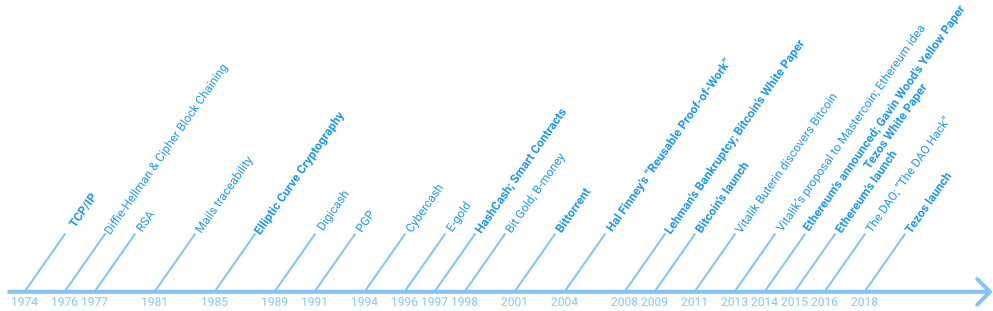

import NotificationBar from '../../src/components/docs/NotificationBar';

<h1 className="p">Under construction.</h1>

<NotificationBar>
  

    Lorem ipsum
  

</NotificationBar>

This module introduces the basics of blockchains and cryptocurrencies. It briefly runs through the history of the first blockchain *Bitcoin*. Describing the main Bitcoin's components and shows how it laid the foundation for newer systems. The basics of Bitcoin's smart contracts are explained, as well as how Ethereum was born to lift these limitations.

This module is useful to understand Tezos principles and how it pushes the borders even more.

# Introduction to decentralisation and cryptocurrencies

In this chapter, the reader will get a glimpse of the global context of "cryptocurrencies" and "blockchains" when they emerged.

## Context
On **October 31st, 2008**, under the _pseudonym_ "Satoshi Nakamoto", the Bitcoin whitepaper was discreetly released. From its very title and abstract, we could understand that the aim of _his_ invention was to create an "electronic cash system", a kind of alternative currency, able to disconnect itself and function free from any centralised entity.

On **January 3rd, 2009**, the first lot of data were locked inside a _block_, called the "Genesis Block". It contained the first exchanges of the newly created electronic currency in "bitcoins". The Genesis Block also included a message in English with the main title of _The Times_ newspaper of the day:
"_Chancellor on brink of second bailout for banks_".

As the global financial crisis was striking the world's economy at the time, it is easy to forge the conclusion that Bitcoin was created to allow for the **de-centralisation of money**. To achieve this aim, Bitcoin used various Cryptographic techniques and tools (_e.g. Public-Key Cryptography_). This is the reason Bitcoin or new systems based on the same mechanics are referred to as **crypto-currencies**.

## Terminology: An important note
With time, the word "cryptocurrency" has partly been replaced by "blockchain", the name of its enabling technology. As other systems were created to lift Bitcoin's limitations or to propose other phylosophies, new use-cases exceeded the "currency" one into a myriad of technological possibilities.

The exact word "blockchain" does not appear anywhere in Bitcoin's whitepaper but reflects the technique to arrange and chain data for the purpose of validation and to ensure the _immutability_ of _bitcoins transactions_ (see below).

In Bitcoin's whitepaper, we can find the terms "blocks" or "chains", but they are "just" arranged in a _chain of blocks_.

Hence, the polysemy to take into account: "Blockchain" must refer to the entire system; or the structure of chained-data.

<small className="figure">FIGURE 1: "Blockchain" polysemy</small>

## A brief history of "Blockchain"
As Bitcoin proved viable, new systems directly copied its technological structure or implemented their own similar mechanics. As the first blockchain-based cryptocurrency, Bitcoin relies on a lot of now old Information Technologies (IT). Some from as far as 1973, and up until the Genesis Block from 2009.

Bitcoin's system actually spans across 36 years of research, trials and experiments, and failures.

First of all, Bitcoin relies on Internet, which itself relies on _TCP/IP_ from 1974.

Todo: Bitcoin and newer systems also use _Cryptography_, which is, actually, as old as Ancient History. However, what we mean by "Cryptography" in these systems is _Modern Cryptography_.

Modern Cryptography is linked to the first calculating machines and its research in modern Mathematics. Very important research like Diffie, Hellman, and Merkle protocol, or RSA (_Rivest, Shamir, Adleman_), are respectively from 1976 and 1977.

From there, countless reflections on ethics, research on technologies, and of course Cryptography has taken place.

Mails traceability in (1981); Elliptic Curve Cryptography (1985); Digicash (1989); PGP (1991); CyberCash (1994); E-gold (1996); HashCash (1997, with Proof-of-Work); Smart Contracts (1997, defined by Nick Szabo).

Even _Bit Gold_ and _B-money_ (from Wei Dai) are from 1998. The latter already used a decentralized database for transactions and an older version of Bitcoin's _Proof-of-Work_ (more details in the next chapters on this matter).

In 2001, the Bittorent 'client' provided more support to the Peer-to-Peer networks experimental research. An important opening towards more decentralisation.

Finally, before the bankruptcy of Lehman Brothers and the global financial crisis (2008), Hal Finney (1956-2014), had developed on PGP (1991), released his "_Reusable Proof-of-Work_" (2004). Later, he became one of the first exchanging bitcoins with Satoshi Nakamoto.

From 2009, many projects copied Bitcoin, or tried to enhance its capabilities.

Due to their blockchain base, Bitcoin's transactions are also programmable. They can define how funds will be spent using scripts. However, the idea of going beyond its main use-case of a currency is highly restricted as Bitcoin's scripts are too limited.

In 2011, Vitalik Buterin encountered Bitcoin, and two years later (October 2013), worked on a proposal for _Mastercoin_[[1]](/blockchain-basics/introduction#references), that would have upgraded the programmable side of this system.

But the team at Mastercoin didn't want to go in this direction, so Vitalik began to re-work his proposal into another project named _Ethereum_ (December 2013). The need for even more complex scripts was driven by the interest into _**D**ecentralized **A**utonomous **O**rganizations_ (DAO), that other systems didn't allow. It was also in December 2013, that Gavin Wood (protocol-side) and Jeffrey Wilcke (client-side) joined Vitalik Buterin to work on Ethereum with a white paper published in January 2014.

Followed the _Yellow Paper_ from Gavin Wood in April, 2014, a crowdfunding in bitcoins during the same summer, and the launch on July 30th of the next year. Ethereum was then a new system, with its own cryptocurrency called "_Ether_".

The first DAO of Ethereum, simply called, "_The DAO_"[[2]](/blockchain-basics/introduction#references) was created and more than 150 millions of dollars (\$) were fundraised in June, 2016. But on the 16th, 50 million (\$) were stolen through the famous "_The DAO hack_"[[3]](/blockchain-basics/introduction#references).

To recover the stolen funds, it was decided to modify the history of transactions. This decision was not approved by the entire community and created a split of the history into two different _blockchains_: _Ethereum_ and _Ethereum Classic_.

Today, Bitcoin and Ethereum remain the two main protocols, but a lot of very interesting alternatives are been created, notably Tezos.

<small className="figure">FIGURE 2: A non-hexaustive timeline</small>

## What have we learned so far?
In this chapter, we briefly described what are "blockchains", on what ground and when they were created.

In the next chapter _Main components of the first "blockchain"_, we'll use Bitcoin as a reference to introduce "blockchains" components and the mechanics that bounds them.

## References
[1] https://web.archive.org/web/20150627031414/http://vbuterin.com/ultimatescripting.html

[2] https://en.wikipedia.org/wiki/The_DAO_(organization)

[3] https://www.nytimes.com/2016/06/18/business/dealbook/hacker-may-have-removed-more-than-50-million-from-experimental-cybercurrency-project.html
