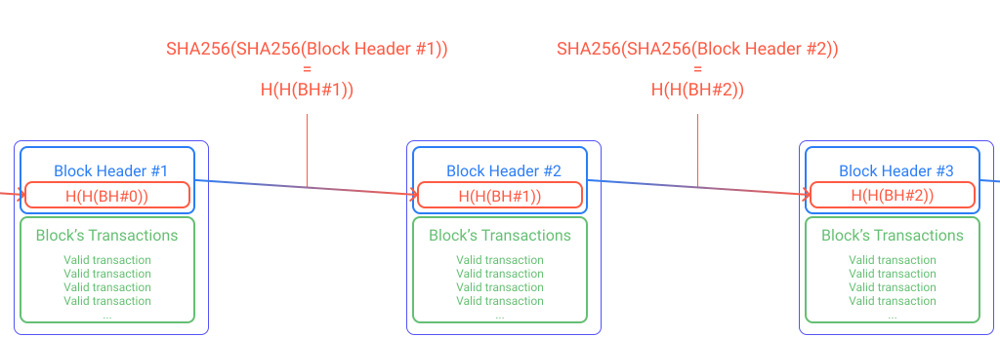

In this chapter, we will go a little bit deeper into details of the main components of the Bitcoin protocol. The developers, who are the builders part of the community. The P2P network with the distributed ledger and the miners who validate it. A few Economy basics on which Bitcoin was created. And finally, the consensus and the Proof-of-Work, crux of the system.

## Open-Source developers
An important part of the community is made from all the developers who write the code of the protocol. Everyone can verify the code, correct it, and make proposals. This openness is essential in a public blockchain to ensure trust. It is common to hear this famous phrase in the Bitcoin community: "*Don't trust, verify!*".

The code written defines the validation rules of all the transactions and their scripts. This code is also used to create the software that runs a node of the network, and how data are recorded, or explored.

There are different implementations, on different operating systems and devices. The code can be written in almost any programming language (e.g. _C++, Python, Java, Go, Scala_...).

The original implementation from Satoshi Nakamoto in C++ is [_Bitcoin Core_](https://bitcoincore.org/). Most of the nodes of the network use this software today.

The openness of the code, the permissionless access to the network, the free software, all allow freedom and trust. Although, this induces a responsibility transfer to the user, encouraged to verify what he uses.

## Peer-to-Peer network and shared ledger
One could think that all the power and influence is in the hand of the developers, but the rules they code still have to be accepted and used. The P2P network of Bitcoin has a mesh design spread over the planet (or space[[1]](/blockchain-basics/main-components#references)). The more nodes enforce the rules, the more the protocol is distributed and secured.

There are different types of nodes, but for the sake of simplicity, let's only quickly describe two categories: Full nodes and Lightweight nodes.

- Full nodes enforce the rules no matter what happens and validate transactions. They _usually_[[2]](/blockchain-basics/main-components#references) also record all transactions in a distributed ledger. This ledger is shared by all the full nodes of the network.

- Lightweight nodes are used for devices with limited space capacity, limited calculating speed, or limited connectivity. They usually refer to little devices like smartphones. They don't record the ledger and ask full nodes.

From now on, "node" refers to a full node. 

### Chained Data-structure
The ledger's structure must be very special because of the following constraints:
- The ledger is distributed across Earth, and everyone should be able to agree on its state around the same time
- Transactions are grouped inside packages named "**blocks**" to ease management. Most of the time, blocks shouldn't be too little (e.g. zero or one transaction only), or too big
- The history must not be modified (immutability) so the difficulty to attack the network and modify the ledger must increase over time (as computers become more powerful)
- Verifying the history, or picking a specific information inside the ledger has to be fast (e.g. check a balance)
- The part of the community securing the blocks must be rewarded; enough and not too much (more details in "_Introduction to Mining_" below)

The data-structure which permits all of the above is a chain of blocks aka "blockchain".

Valid transactions are grouped and enclosed inside a block. Every 10 minutes on Bitcoin, each block can be verified by the maximum of available nodes across Earth. The number of transactions inside a block is only limited by its space available (in bytes). Same time, the more transactions in a block, the more rewarding it is for the blocks validators (see below "_Introduction to Mining_").

Each new block is linked to the previous one: they are chained. The more blocks there are, the more difficult it is to modify anything in the ledger. They are cryptographically chained. That means, that if you want to cheat (basically double-spending), you would need to modify everything until the Genesis Block. This is like *Matryoshka dolls* with an enormous number of dolls.
This is achieved through [Cipher Block Chaining (CBC)](https://en.wikipedia.org/wiki/Block_cipher_mode_of_operation#Cipher_block_chaining_(CBC)), where instead of a "XOR" function, the "SHA256" function is used. Twice:

SHA256 is a special type of [one-way function](https://en.wikipedia.org/wiki/One-way_function) called [hash function](https://en.wikipedia.org/wiki/Hash_function). The same function is also used (twice) for mining.

### Introduction to Mining
The blocks validators are called the "**miners**" (see below "_Consensus: Nakamoto and the Proof-of-Work’s account units issuance_" for more about this word).

They put _valid_ transactions inside a block, and then try to _validate that block_. When the block _is found valid_, they get two types of rewards:
- Fees in bitcoins from each transaction, that each **sender** chose
- **Pre-determined** quantity of bitcoins for the valid block found

The fees are simply **the sum of the transactions values** ($S_v$) minus **the sum of the amounts really sent** ($S_a$).

For "T" transactions in a block, let "v" a transaction's value, and "a" the amount really sent:
$$
\text{Fees} = \sum_{i=1}^{T} v_i - \sum_{i=1}^{T} a_i
$$
Or more simply:
$$
\text{Fees} = S_v - S_a
$$
That means **a sender actually chooses the fees given to the miner**. The more he gives, the faster the transaction is included in a block. Yes, in case you wonder, a transaction could actually have zero fees, but it could take months or years to be included in a block (if ever).

The block reward is sent through a special transaction called a "_Coinbase Transaction_" directly to the miner. It's always the first transaction of a validated ("*mined*") block.

To get these two rewards, a miner basically plays a lottery, a game of chance. This game is to find a binary number lesser than a target (called "_Target_") with the specific hash function _SHA256_. The fact is a miner can't guess in advance the result of this function. He **must** try values (by [*Brute Force*](https://en.wikipedia.org/wiki/Brute-force_attack)). He must *hash* the previous block header (twice) with the number of the attempt called the "*nounce*".

The more a miner tries values (the more he has lottery tickets), the more he uses energy to make his computers work.

When a miner finds a number that is valid, he finally finds a valid block. His node tells to the network its discovery with the final nounce (so anyone can verify!).

If two miners find a valid number, then two valid blocks are possible. The winner is the one adding his block to the chain with the most of _work_ done (we also say "_the longest chain_").

## Account unit and Economy basics
Because miners find blocks containing valid transactions that are chained together, they secure the system. That's why they are rewarded for it. The rewards are in the account unit. Bitcoin uses bitcoins, while Ethereum uses ethers.

To get these rewards they must _work_, and then _proove they worked_. In Bitcoin, they work using electricity. So to make this activity profitable, miners have to find efficient calculators, and low-cost electricity.

Over time, miners group more and more powerful machines together, and more people begin this activity. This increases the number of attempts (the number of tickets) of the global network to find a valid block. Because of the SHA256 hash function used, this is called "**hashing power**".

While the network gains more hashing power, constraints stay the same. Each block still has to appear around every 10 minutes. To maintain this and adapt, the protocol calculates the "_Difficulty_". If the hashing power is too high, Difficulty increases. If the hashing power is too low, Difficulty decreases.

The Difficulty modifies the binary Target. To increase the difficulty for miners to find a valid block, the Target becomes smaller and smaller. This means the leading zeros of this binary number are more and more.

The Difficulty is calculated every 2016 blocks (~2 weeks).

Economically, this is more and more difficult to get rewards. This is also the sign that more and more people try to find bitcoins. So the *demand* increases.

Bitcoin relies on the simple free market law of *supply* and *demand*. It is intrinsically **deflationary**. The more bitcoins are hard to get, the heigher their price. The rarest they are, the hardest they are to find, the higher their price. And vice versa.

The total theoric limited *supply* of bitcoins is pre-determined and hardcoded in the protocol: 21,000,000 (21 millions).

## Consensus: Nakamoto and the Proof-of-Work’s account units issuance
Relying only on hashing power and the law of supply and demand wouldn't quite be enough to assure deflation.

Another rule is coded in the Bitcoin protocol that increases scarcity of bitcoins. Its name is the "**Halving**". Every 210,000 blocks (~4 years), the block reward is simply cut in half.

At the very beginning (2008 / 2009), the block reward was 50 bitcoins. These days (2021), the reward is 6.25 bitcoins until 2024[[3]](/blockchain-basics/main-components#references).

Block reward is how the currency's issuance is produced. So the Halving has a strong economical impact. Usually, this event leads to an increasing price phase, namely "Bull Market"[[3]](/blockchain-basics/main-components#references). It's worth noting it's also an event that federates the community, the adoption, and in return, makes the network stronger, and the price higher[[4]](/blockchain-basics/main-components#references).

The numbers chosen by Satoshi Nakamoto for the total supply or the Halving are inspired by _gold mining_. The more you dig to find gold, the less there is, and the harder it is to dig. That's exactly why the blocks validators are called the "Miners".

The Nakamoto Consensus which allows Bitcoin is driven by:
- The decentralization
- The Proof-of-Work
- A probabilistic solution to the Byzantin General Problem
- The _MAD_ property

In Bitcoin's mesh network, the rewards make it possible to support until 50% of bad actors. The network is said to be "Byzantin Fault Tolerant" (BFT). Probalistically, Bitcoin's solution is more efficient than the actual strict solution. The actual strict solution needs less than one third (1/3) of bad actors.

The _**M**utual **A**ssured **D**estruction_ (**_MAD_**) property reinforce this BFT solution:  
_It is more profitable to earn bitcoins participating to the procotol than to attack it. If you want to attack it, you'd have to invest a lot of ressources. In the extreme case your attack would be effective, you'd loose your investment..._

You would also face the community, which can detect the attack and adapt.

## What have we learned so far?
In this chapter, we described the pillars of the Bitcoin protocol, and how they articulate around the Nakamoto Consensus.

They are now the ones used in the new systems with variations and adaptations. By example, new systems try different consensuses to reduce energy consumption.

In the next chapter "_Introduction to other consensuses_", we'll describe a few other important consensuses.

## References
[1] https://blockstream.com/satellite/

[2] https://bitcoin.org/en/release/v0.12.0#wallet-pruning

[3] http://bitcoinhalvingdates.com/

[4] https://www.bitcoinhalving.com/