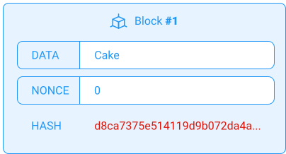
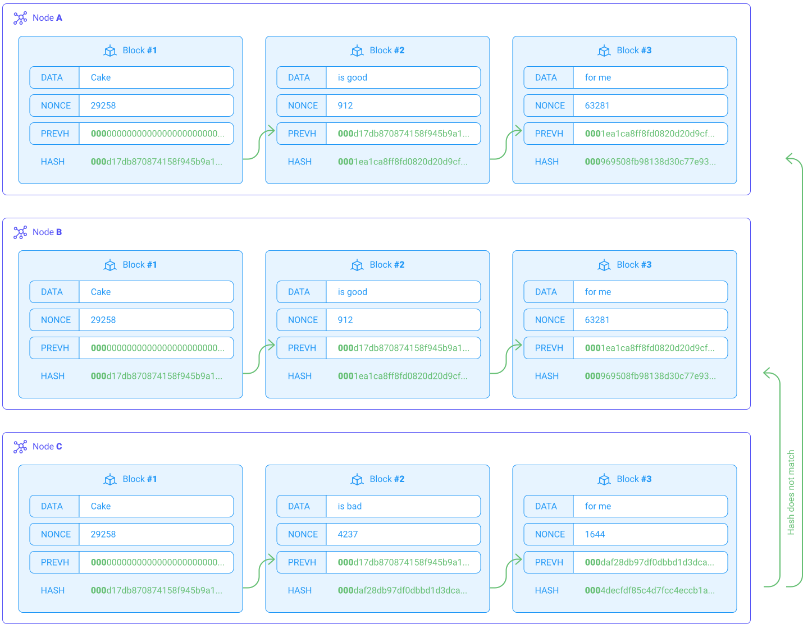

import NotificationBar from '../../src/components/docs/NotificationBar';

_Proof-of-work_ was the first fully functional blockchain consensus ever created. It is still in use by Bitcoin and many other blockchains. It requires its users to _mine_ for getting a chance to earn a reward for validating transactions. In this chapter, we will look into the technical side of things and how mining works.

We will see that the blockchain is a brilliant assembly of cryptographic technical bricks that have already existed for many years or even several decades for some. The beauty of the blockchain is to have been able to organize these bricks in a coherent way to create a decentralized and secure data exchange system.

## Hash
Let's start with the basics: the **hash**. A hash is a hexadecimal number calculated from some data. In a way, it represents a unique fingerprint used to identify the initial data quickly. There are several hash functions. The most common is _SHA256_, used among others by Bitcoin. The _SHA256_ algorithm transforms any string of characters into a hexadecimal number of 64 characters (or 256 bits). For example, fig. 1 shows the hash of the small string "Cake" and fig. 2 shows the hash of a longer string. Note that the two hashes are completely different, but both are 64 characters long.

In the same way, you could enter all the books from a library or nothing at all (empty string), and you would still have a hash of 64 hexadecimal characters. Note that you will always have the same hash for two identical strings. You will always have two different hashes (except for a few statistically improbable collisions). This allows you to verify that the initial data has not been modified quickly. 

<small className="figure">FIGURE 1: The hash of a small string of characters</small>

<small className="figure">FIGURE 2: The hash of a large string</small>

<NotificationBar>

You have probably used a hash already in your life without knowing it. Indeed, when you download a file on your computer, some browsers check the hash of the downloaded file and compare it to the hash announced by the source before download. If the two hashes match, it means that the file you have downloaded is a perfect match to the one intended to be sent by the source. If the hashes don't match, your download has been corrupted. You can try this out manually by downloading the latest release of _Ubuntu_, computing the hash of the downloaded file, and comparing it to the one announced on [their website](https://ubuntu.com/tutorials/how-to-verify-ubuntu#5-verify-the-sha256-checksum).

</NotificationBar>

## Block
A block is simply a structure containing:
- its block number
- some data
- an arbitrary number called _NONCE_ (diminutive of _Number used ONCE_ )
- and the hash of all these data

Fig. 3 shows an example of a block. Notice that the hash of the block starts with "_d8ca_". So far, this block is considered _invalid_. There are different rules for validating a block depending on the blockchain considered. Most blockchains use *Proof-of-Work*, which consists of proving that validation's work has been done on the block.

<small className="figure">FIGURE 3: The hash of DATA, NONCE and block number does not start with 000: The block is invalid.</small>

For example, a widely used validation rule is that the hash must start with _000_. Therefore, the block will have to be "mined"; that is to say, it will be necessary to find a random _NONCE_ such that the hash of the block (including the _NONCE_) starts with _000_. Note that this problem is arbitrary. Other consensuses choose to have a hash starting with _123_ or that the hash in base 10 is lower than 1000 (case of Ethereum). You just need a rule that proves that a validation's work has been done on the block and that allows finding one validator in the world (i.e., the first one to find a valid _NONCE_). When the rule is validated, the block is then valid.

In fig. 4, we have repeatedly incremented _NONCE_ and calculated the hash of the block until we got a hash starting with "000". This process is not fixed in time, it can be very short or very long, because each NONCE is *equally probable*. In this case, we have incremented the _NONCE_ up to 29258. The block is now valid.

<small className="figure">FIGURE 4: The hash of DATA, NONCE and block number starts with 000, the block is signed</small>

<NotificationBar>
  

  As a miner, you might want to try out random NONCE instead of incrementing it. As everyone in the world is in competition, anyone with a faster machine would always beat you to it. Using random guesses, your chances are proportional to the amount of _hashing power_ you have compared to the rest of the world.
  
  

</NotificationBar>

Therefore, mining consists of calculating the hash of a block repeatedly until the validation rule is validated. This is why it is possible to create _ASICs_ (Application Specific Integrated Circuit) optimized for mining. For Bitcoin, ASICs integrate chips specifically designed to do only SHA256 to find _NONCE_ very quickly [[5]](/blockchain-basics/proof-of-work#references). 

Finally, note that if you try to modify anything in a validated block, it loses its validity because you would change the hash of the block, and you would have to mine the block again to find a new hash starting with "000".

## Blockchain
You now have all the elements to understand what a blockchain is. It is simply a list of blocks where each block contains a reference to the previous block: a hash. They are, therefore, "chained". In fig. 5, you can see that block #2 contains all previously mentioned information in addition to _PREVH_, the hash of the previous block, i.e., the hash of block #1. To validate block #2, you have to mine it to find a hash starting with "000"; then this hash is used in "_PREVH_" in block #3, etc.

<small className="figure">FIGURE 5: A valid blockchain (all blocks are signed)</small>

If we change anything in a block, this block and all the following blocks lose their validity. Why? Because, if I change "good" by "bad" in block #2, the hash of block #2 changes, which changes "_PREVH_" inside block #3, changing its own hash; which in turn changes "_PREVH_" in block #4, changing its hash, and so on... This invalidates the whole blockchain after block #2. Therefore, it is straightforward to know if any information on a blockchain has been changed and in which block.

<small className="figure">FIGURE 6: An invalid blockchain (some blocks are not signed because of the data modification)</small>

Now you may be wondering: why not *re-hash all the invalidated blocks*? It is indeed possible to re-mine these blocks from the last valid block and revalidate the entire chain (see fig. 7).

<small className="figure">FIGURE 7: A valid blockchain again (all the blocks following the modification have been signed again)</small>

So can the blockchain be altered? No. Why?

- Firstly, because mining a block requires a lot of computing power. For Bitcoin, it would take several **years** for your desktop computer to mine **a few blocks**, and the more you go back in time and modify an old block, the more blocks you would have to mine.

- Secondly, *and most importantly*, because of the distributed nature of the blockchain, which makes it statistically impossible to rewrite its history.

## Distributed
Any blockchain needs to be distributed to be secured; that is to say that all the valid blocks have to be replicated on all network nodes.

Like everyone else, you can use your computer as a node and mine. To do this, you need to download all the valid blocks so far. For Bitcoin, this already represents more than 330GB [[6]](/blockchain-basics/proof-of-work#references).

When any node in the world validates a new block (first to find a valid _NONCE_), it is added to the blockchain of all the other nodes using a _gossip protocol_ [[7]](/blockchain-basics/proof-of-work#references), so every node has an up-to-date blockchain. There are many nodes in the world, and they all have a complete copy of the blockchain.

Let's consider a node decides to fraudulently modify a block. Fig. 8 shows a network of 3 nodes (_A_, _B_, and _C_), which all have a copy of the blockchain. If "_C_ " decides to modify some data on the blockchain, this can be seen immediately by the other nodes (_A_ and _B_), because the hash of the last block in their chain (_000969..._) is different from the hash of the last block of "_C_" (_dec59db..._).

<small className="figure">FIGURE 8: The blockchain is identical on all the nodes of the network except when a hacker tries to modify it. We see here that node "_C_" tries to modify the data of block #2</small>

Even if node "_C_" *validated all of its blocks again* as shown in fig. 9, the final hash (_0004de..._) is still different from the other nodes (_000969..._). There is no way to change the data of a block while preserving the same final hash as the rest of the network. The incorrect blockchain no longer corresponds to the majority of the other nodes. This block will become an orphan and will not be integrated into the general ledger.

<small className="figure">FIGURE 9: Even if _C_ re-mines all its block following its modification, the hash of the latest block still does not match the rest of the network.</small>

The only known way to corrupt Proof-of-Work is through the infamous "51% attack" [[8]](/blockchain-basics/proof-of-work#references), which consists, for a pirate, in obtaining more than 50% of the world's mining power, allowing him to rewrite the history (the technical details are explained [here](https://hackernoon.com/ethereum-classic-attacked-how-does-the-51-attack-occur-a5f3fa5d852e)). 

Fortunately, getting 51% of the world's mining power for popular blockchains is very difficult. For instance, it would cost several billions for Bitcoin. However, for less popular blockchains (with fewer nodes), this is quite doable and happens quite regularly [[9]](/blockchain-basics/proof-of-work#references). Some blockchains are trying to solve this problem by implementing different consensus algorithms, such as Tezos, in the following chapters.

## Coins or tokens
When we talk about "blockchains", we do not necessarily talk about "cryptocurrencies". "Blockchain" has been used for many non-financial applications [[10]](/blockchain-basics/proof-of-work#references). Note that until now, the data stored in the blocks of our examples were simple strings. You can store any type of data: identities, electronic documents, insurance contracts, etc. Whenever it is necessary to have an immutable record, or a system of secure exchanges between parties without trust, or on an unsecured network, you should ask yourself whether or not a blockchain can and should be used.

If we use the "_DATA_" field to store financial transactions, we do indeed have a crypto-currency. Figures 9 and 10 respectively show a block and a blockchain with transactions in "_TX_" instead of "_DATA_" (e.g., _$13 from John to Chris_). By _"\$"_, we denote a monetary value that is not necessarily dollars, but which could be any "coin" or "token", such as Bitcoin (BTC), Ethereum (ETH), etc.

<small className="figure">FIGURE 9: A block containing financial transactions</small>

<small className="figure">FIGURE 10: A blockchain containing financial transactions</small>

However, in our example, how do we know that John has enough money to send Chris $13?

The Bitcoin blockchain does not contain a ledger showing the balance of each account at all times. Instead, when John attempts to complete a transaction, the process will go back in time on the blockchain and calculate the difference between his *inbound* transactions against all of his *outbound* transactions deduce how much money John can spend.

## Coinbase
You now understand how the blockchain can calculate each person's balance and whether or not to authorize their transactions. However, where does all this money come from in the first place? If we were to completely trace the blockchain all the way back to its first block, there would be a point where money has to be created. If the users' balances are only calculated from transactions between users, there would be no creation of new tokens. There would be 0 bitcoin.

New bitcoins are generated by the blockchain itself when a new block is created (validated). New tokens are created and given to the miner of the block. In fig. 12, assume that Chris is mining the block. You can see that $100 is made from scratch and given to Chris to thank him for investing his computational power and electricity into mining a block. This is called the "_reward_" or "_coinbase_" ("*coinbase reward*" and "*coinbase transaction*" are also used). Chris can then spend this money in the next block as if he had received it from another user. This process allows new tokens to be put into circulation in the same way that a central bank can print new banknotes. The advantage of a blockchain over a central bank is that the process is entirely autonomous, decentralized, and unalterable. Inflation on Bitcoin is fully known in advance, and it is not possible to have over-inflation. Currently, 17 million Bitcoin have been minted, namely offered as a coinbase. The maximum is 21 million, at which point the source code of Bitcoin shows that no more coinbase will ever be offered. The source of income for miners will then only be the transaction fees, but there is still some time as this will happen around 2140 due to the ever-increasing difficulty of mining [[11]](/blockchain-basics/proof-of-work#references). Indeed, the Bitcoin protocol states that a new block must be mined on average every 10 minutes. As the total computational power put into bitcoin increased with more miners and more technological advancements, the average time to mine a block naturally lowers. Bitcoin compensates by increasing the mining difficulty. E.g., instead of finding a _nonce_ such that the hash of the block starts with three zeros, it may increase to 4 zeros, making the whole process much longer and more difficult for the hardware.  

<small className="figure">FIGURE 12: A block that gives a coinbase of $100 to Chris, which allows him to spend it in the next block</small>

<NotificationBar>
  

    
  Note that the first block has no previous hash. Thus the _PREVH_ is set to a series of zeros. The first block of any blockchain is called the **genesis block**.

  

</NotificationBar>

There is still one big issue in our blockchain schema so far. Please take a minute and try to identify it.

[...]

Did you find it? Consider how the transactions are authenticated.

[...]

Knowing that Chris has a positive balance of \$100, could Jane add the transaction "\$ 40 from Chris to Jane" herself in a new block without Chris ever giving his consent? At this point of the chapter, anyone seems to be able to spend anyone else's money!

## Keys
It is essential for the proper functioning of the crypto-money that only Chris can send the transaction "$40 from Chris to Jane". For that, we need to use one of the bases of modern cryptography, the _Diffie–Hellman key exchange_ or _asymmetric key algorithm_, which consists of a private key and a public key.

Fig. 13 shows a pair of keys. The private key is a very long, randomly generated number (you could create that number yourself by flipping a coin randomly a large number of times). A public key is a hexadecimal number that is calculated from the private key. It is possible to calculate the public key from the private key, but it is practically impossible to find the private key from the public key.

As the name suggests, **the private key must be kept private**. You should **never** share it with anyone. On the other hand, the public key can be accessible to anyone that wants to send you money (but keep in mind that this public key can then be linked to your data. You should use other generated public keys whenever possible).

<small className="figure">FIGURE 13: A private key that has been randomly generated and its associated public key computed from the asymetric key algorithm</small>

## Signatures
Now what's great with a **private key** is that you can sign a message that can be **authenticated** using only your **public key and signature**. Indeed, fig. 14 shows first a signature generated by our private key for the message "I like cake!". Notice that if we change the message, the signature changes.

<small className="figure">FIGURE 14: Signing some data with a private key</small>

Let's give someone our message and signature to someone. That person can verify the authenticity of the message simply by finding our public key and applying the *cryptographic verification algorithm* on the message and its signature.

Remember that the person **does not have access to the private key**, but using only the public key, the cryptographic algorithm will tell this person (see fig. 15): "Yes, this message has been written by the person that owns the private key, and the message has not been altered in any way"  

Or, in case of attempted identity theft or corrupted message (see fig. 16): "No, the signature is invalid, meaning that either the message has been altered or it's not the person that owns the corresponding private key that signed this message"

<small className="figure">FIGURE 15: Thanks to the public key and the signature, anyone can verify that this data has indeed been sent by the holder of the private key associated with this public key...</small>

<small className="figure">FIGURE 16: ... Or inversely, that the data has been altered or does not come from the holder of the private key associated with this public key.</small>

## Transactions
Instead of using a simple string of characters in the "DATA" field, let's use transactions and public keys. So, note that from now, instead of using names, our transactions will use _the **public key** of the sender_, and _the **public key** of the recipient_. Instead of "\$ 40 from Chris to Jane", we now have "\$ 40 from 0x4cf6... to 0x2f1f...".

The sender then signs the transaction with his private key. See fig. 17 as an example.

<small className="figure">FIGURE 17: We sign our transaction with our private key</small>

Miners can now verify that the private key owner has indeed sent a transaction and that the amount and recipient have not been altered by any third party (fig. 18). Otherwise, the signature would be invalid.

<small className="figure">FIGURE 18: Miners verify that this transaction has been sent by the owner of the private key</small>

<NotificationBar>
  

  Note that transactions do not actually use public keys in the _from_ and _to_ fields. They use **addresses**, which are hashed versions of the public key. Because the public key is made up of an extremely long string of numbers, it is compressed and shortened to form the public address. That way, it is more easily readable and more secured as nobody can know your public key from your address.
  
  To sum up, the private key generates the public key, which, in turn, generates the public address.

  

</NotificationBar>

## Complete blockchain
Let's now modify our "insecure" blockchain diagram fig. 10 and add the signatures of each sender to their transaction.

If a hacker tries to change anything, e.g., the value of the amount of a transaction, two things happen:

- the block is no longer valid because the hash has changed, as seen previously

- the signature is no longer valid

The hacker could mine the block again to make it valid. However, he has no way of signing the transaction again without the private key of the sender. 

This is how transactions in the blockchain are protected by only allowing the sender to sign their transactions, and it works perfectly.

To recap, here is a complete schema of a block, a blockchain, and a blockchain network.

<small className="figure">FIGURE 19: A complete block</small>

<small className="figure">FIGURE 20: A complete blockchain</small>

<small className="figure">FIGURE 21: A complete and distributed blockchain network</small>

## Conclusion
You can now understand the power of the blockchain, a fully secured system without the need for a bank or any centralized entity. All you need is a random number to create a private key and then a public key, and start receiving money. Note that public keys are pseudonymous and not anonymous. You will need to associate your public key with your identity documents if you want to transfer some money to your bank account.

## About Energy consumption
You know that mining is nothing more than repeatedly trying random _nonce_ to solve a very arbitrary problem in the first place and obtain the coinbase reward. Everyone is basically in competition, and the more computational power and the electricity you use, the better your chances. This, unfortunately, has a detrimental effect on the environment. Bitcoin mining has recently passed 100 TWh [[2]](/blockchain-basics/proof-of-work#references) in energy consumption, more than entire countries like Switzerland (56 TWh) or Finland (84 TWh). All this just to find an arbitrary number that does nothing except selecting a person in the world to be the next validator. Isn't there a better alternative? Isn't there a consensus that would be more cooperative and less competitive? We're going to see in the next chapter a few examples of so-called _next generation consensuses_ (including the consensus used by Tezos) that work just as well as _PoS_ but with much lower energy consumption.

## References

[1] https://andersbrownworth.com/blockchain/

[2] https://digiconomist.net/bitcoin-energy-consumption

[3] https://en.wikipedia.org/wiki/List_of_countries_by_electricity_consumption

[4] https://ubuntu.com/tutorials/how-to-verify-ubuntu#5-verify-the-sha256-checksum

[5] https://www.bitmain.com/

[6] https://www.statista.com/statistics/647523/worldwide-bitcoin-blockchain-size/

[7] https://academy.bit2me.com/en/what-is-gossip-protocol/

[8] https://academy.binance.com/en/articles/what-is-a-51-percent-attack

[9] https://medium.com/hackernoon/the-history-of-51-attacks-and-the-implications-for-bitcoin-ec1aa0f20b94

[10] https://builtin.com/blockchain/blockchain-applications

[11] https://www.blockchain.com/charts/difficulty