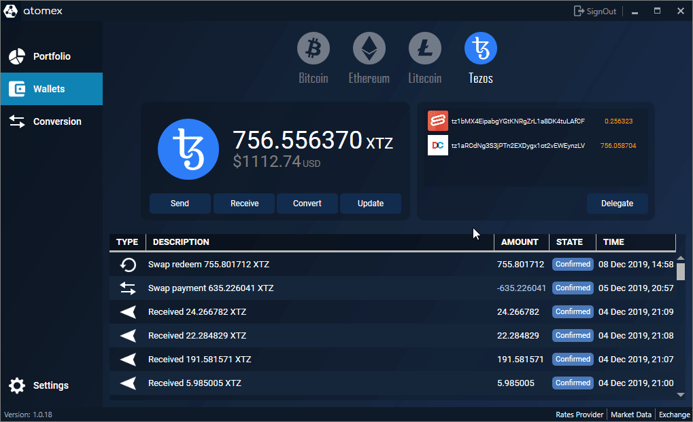

Becoming a baker or a delegate on Tezos is a great way to contribute to the ecosystem while earning some profits. _Baking_ (also called _staking_) is the process of forming new blocks on Tezos. This process is part of the Proof-of-Stake consensus (more on that in the [Tezos basics module](/tezos-basics)). The more bakers, the more decentralized and statistically safe this process is. 

## How to bake?

Everyone with at least 8,000 XTZ can produce, sign and validate blocks and get rewards in proportion to their stake. The only thing you need to exercise your baking rights is to run a node with baking software and keep it online and up to date.

OpenTezos has dedicated modules on [How baking works](/baking) and [How to setup your own baker](/baker). However this might be quite complicated for inexperienced users. An easier alternative it to delegate instead of bake.

## Delegation

Self-baking lets a baker earn a higher yield, but requires technical expertise and time in setting up a baker and running the baking software reliably with as little downtime as possible. By delegating Tezos tokens, a token holder avoids this process altogether but usually earns a lower yield. In the current protocol, token holders with less than 8,000 XTZ can only participate in baking by delegating to another baker.

Delegation is when you delegate your staking/baking rights to another person (the baker), rather than setting your own Tezos node. It’s a quite useful feature as it allows you to participate in staking and receive Tezos staking rewards without the necessity of maintaining a node.

In that case all staking rewards are credited to the baker and the baker manually (or by using automated tools) pays delegators (people who delegated to him) their share of staking rewards after charging some service fee.

Delegation in Tezos is absolutely safe! Your funds are not locked or frozen and do not move anywhere. You can spend them at any time and without any delay. Just keep in mind, you only delegate your rights, that’s it.

In short, delegation is much better for an average user. Yes, Tezos bakers get slightly more staking rewards, because they don’t pay the fee (but charge fee), but also, they pay for hosting, they spend time maintaining a node and moreover they have a risk of losing money on double baking (e.g. if the node was configured incorrectly). Thus, for an average user delegation is the most preferred and safe way to participate in Tezos staking.

## How to delegate?
Most wallet (e.g. [Atomex](https://atomex.me/), [Exodus](https://www.exodus.com/), etc.) offer built-in delegation, making the whole process very simple. Just open the wallet, select your XTZ balance, click delegate and choose a baker from the list. 

<small className="figure">FIGURE 1: Delegating your XTZ on _Atomex_.</small>

That’s it. The only thing you should worry about is choosing a good and reliable Tezos baker or delegation service. 

[Baking Bad](https://baking-bad.org/docs/where-to-stake-tezos) or [Tezos Nodes](https://tezos-nodes.com/) allow you to browse through bakers. There are a few factors to consider when choosing a baker to delegate with:

- *Fees*: How much of the rewards the baker is keeping? 

- *Capacity*: Each baker has a capacity of how many coins it can accept, which is based on how many coins it currently holds itself. A baker is "overdelegated" when it has exceeded the amount of delegation it can take considering the coins they currently hold.    

- *Reliability + Responsiveness*: Does this baker pay out on time? Does this baker pay correctly? Will this baker respond to my questions about their services? Many bakers operate forums and chat rooms in which they engage with delegators.

- *Security*: Is this baker's staking setup secure? Does this baker have a track record? Has this baker double-baked in the past and lost coins?

## How much can I earn by baking or delegating?
The current Tezos protocol increases the token supply by approximately 5.51% in the first year (based on constant block rewards of 16 XTZ/block and 2 XTZ/endorsement).

This means that if *all* Tezos token holders bake with all of their tokens (i.e. the entire Tezos supply), baking rewards would be near ~5.51% per year. However, given variance in time preferences, knowledge, and capabilities, it is unlikely that all token holders will bake and the expected return on baking is in practice greater than 5.51% a year. By illustration, if 50% of the Tezos token supply is being staked, the baking reward will be closer to 11% (double the inflation rate).

In practice, the rewards for token holders who delegate are less than that of baking directly, because delegates share only part of their baking rewards with delegators. The portion they keep is often called a “fee” and ranges between 5% and 20%, varying by the baker.

## References

[1] https://wiki.tezosagora.org/learn/baking/bakeordelegate

[2] https://baking-bad.org/docs/tezos-staking-for-beginners

[3] https://baking-bad.org/docs/where-to-stake-tezos/