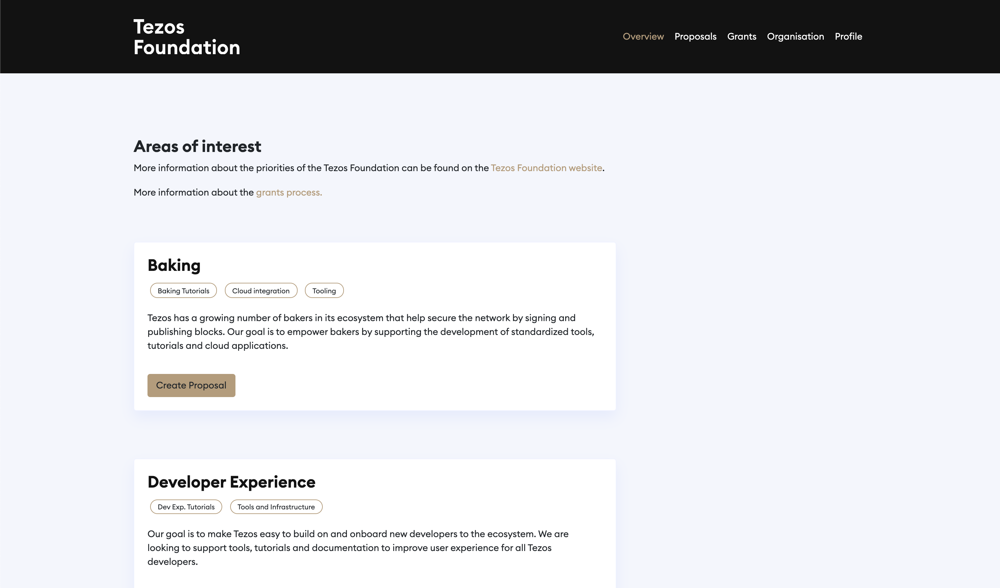
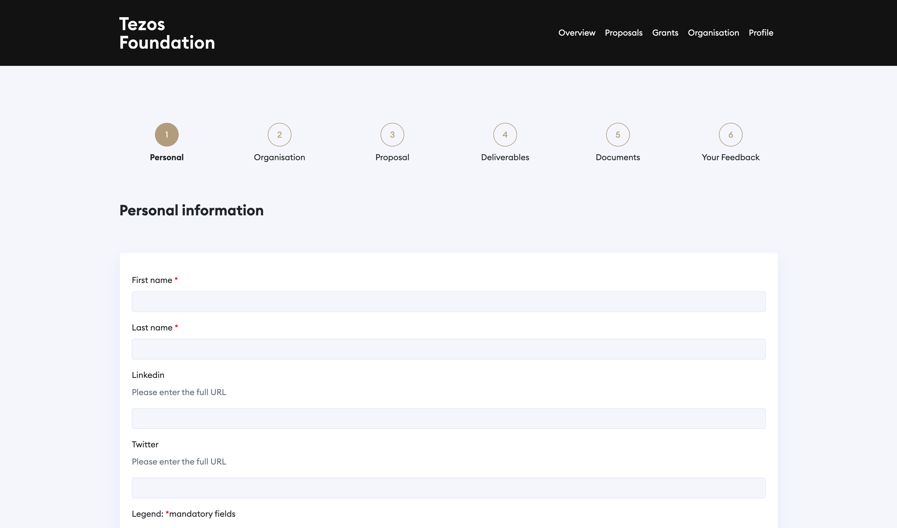

The _Tezos Foundation_ goal is to develop the Tezos ecosystem, which includes offering [grant programs](https://tezos.foundation/grants). In this chapter, we'll take a closer look at how it works.

To receive a _Tezos Foundation_ grant, one has to devise a project idea, apply for a grant, wait for the application to be reviewed, and react to the review's findings. Let's look at each of those phases in more detail.

## Devise a project
Anyone can apply for a _Tezos Foundation_ grant if they have an idea that would boost the development of the Tezos ecosystem. The Foundation accepts applications in the following areas:

- *Baking*: Tezos has a growing number of bakers in its ecosystem that help secure the network by signing and publishing blocks. The Foundation's goal is to empower bakers by supporting the development of standardized tools, tutorials, and cloud applications.
Examples: Baking Tutorials, Cloud integration, Tooling, etc.
  
- *Developer Experience*: The Foundation's goal is to make Tezos easy to build on and onboard new developers to the ecosystem. The Foundation is looking to support tools, tutorials, and documentation to improve the user experience for all Tezos developers.
Examples: Dev Exp. Tutorials, Tools, and Infrastructure, etc.

- *Education and Training*: The growth and success of Tezos are heavily linked to the Tezos community. To grow and support the community, the Foundation want to enable all ecosystem members around the world.
Examples: Global Adoption, Learning Resources, etc.

- *End-User Applications*: Tezos enables new types of applications, which can address problems that have been traditionally difficult to solve using legacy software stacks. The Foundation is looking to support new applications that drive wide adoption and benefit standardization, censorship-resistance, or user control on the Tezos protocol.
Examples: Collectibles, Communication applications, Creator tokenization, Crowdfunding, Decentralized Finance, Gaming, Payment Solutions, Smart Contract Templates, etc.

- *Privacy*: Censorship resistance is critical for all developments on Tezos. The Foundation's goal is to support research and development of infrastructure to build on Tezos' strengths and enhance privacy-preserving solutions.
Examples: Infrastructure and applications, Research and Development, etc.

- *Security*: Tezos has the assurance required for high-value use cases and a focus on formal methods. Given this strength, the Foundation aims to support projects building security solutions for Tezos.
Examples: Formal Verification, Key Management, etc.

- *Other*: Projects targeting categories not listed here that may advance the Tezos ecosystem.
Examples: Community Ecosystem, Tools & Applications, Education & Core Development, etc.

<small className="figure">FIGURE 1: Choose the category of your grant application.</small>

## Apply for a grant
The first step is to register at the [_Tezos Foundation_'s platform for grants](https://grants.tezos.foundation/). Choose the category that corresponds to your project and make an offer. Fill the application, including:

- Your personal information

- Your organization details

- The description of your proposal

- The list of your project's deliverables
  
- An attachment with an expanded description of your offer, its technical details, team info, roadmap, and budget breakdown.
  
As long as you don't push the submit button, you can still edit your application by returning to any of the five steps above. Once you press the button, no change is possible.

<small className="figure">FIGURE 2: Fill up all the details regarding your organisation and your proposal.</small>

## Wait for the application to be reviewed
The review process takes eight to twelve weeks, and applications go through several steps:

- Applications are initially vetted to ensure they fulfill the _Tezos Foundation_'s formal and substantial requirements. Several contributors from the Tezos ecosystem perform vetting. The Technical Advisory Committee (TAC) has complete visibility over reviewers and ensures adequate management of potential conflicts of interest.

- Applications that pass through the initial review phase are sent to the _Tezos Foundation_'s TAC for technical due diligence and evaluation. The list of current TAC members can be found in the "About Us" section. The TAC does not make grant decisions but instead offers advice on an application's technological strength and usefulness to the Tezos ecosystem.

- Applications that receive positive recommendations from the TAC complete a due diligence process before final decisions to approve, decline, or revise grant applications are made by the Executive Committee or the _Tezos Foundation_ Council.

- Final decisions about grant applications are communicated to applicants after the _Tezos Foundation_ makes them. Lastly, approved applicants collaborate with the _Tezos Foundation_ to complete legal paperwork before a grant is finalized.

You can always see your application's current status in your account at the _Tezos Foundation_'s platform for grants.

## React to the review's findings
Your application can either be fully approved, entirely rejected or in-between in a _to revise_ status. In that case, modify your proposal as requested and submit it again.

If your application passes, the _Tezos Foundation_ will contact you to help with the grant's paperwork. Once it is over, you will get the funding you asked for, but not the entire amount at once. The budget will be partitioned and paid following the milestones pointed out in your roadmap.

## Conclusion
According to the _Tezos Foundation_'s biannual report, 56 projects had received grants in different areas from February to September 2020, with 41% of the project founders receiving a grant for the first time. The Tezos ecosystem as a whole and the _Tezos Foundation_ as its integral part always welcome new teams and new ideas.

## References

[1] https://grants.tezos.foundation/ 

[2] https://tezos.foundation/grants/

[3] https://tezos.org.ua/en/blog/tezos-foundation-grants/
