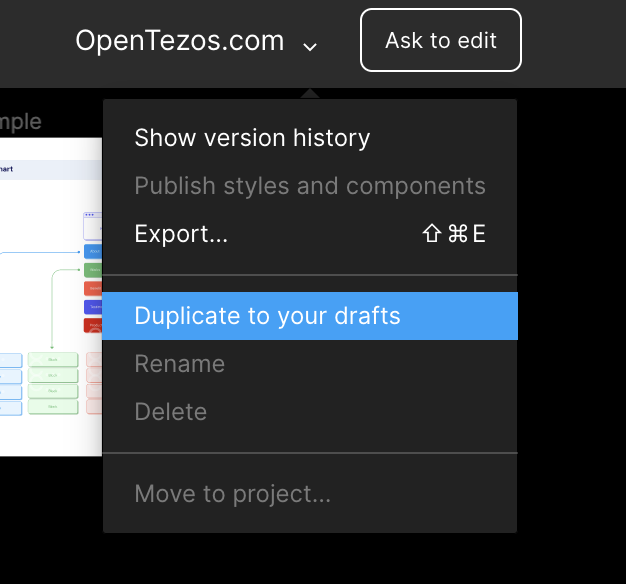

The excellent website you are currently browsing is called _OpenTezos_ and will later be merged with the upcoming `wiki.tezos.com`. It is, therefore, important that all the content here is up-to-date and error-free. If you see an error, you can either [submit an issue](/contribute/report-issue) or go a step further by actually correcting the mistake yourself and submitting it for review. Here is how to proceed:

- On the page that you see the error on, scroll down and click the link `Edit this page`. 

<small className="figure">FIGURE 1: Click `Edit this page` on the page containing an error</small>

- You are being redirected to the file on Gitlab corresponding to this chapter. Click on the pen logo on the upper right corner saying `Fork this project and edit the file`.

<small className="figure">FIGURE 2: Click `Fork this project and edit the file` on the github file</small>

- The chapter file is now opening in your browser. Proceed to edit its content to correct the error, then scroll down to the `Propose changes` section. Enter a title and a description of your correction proposal, then click `Propose changes`.

<small className="figure">FIGURE 3: Edit the chapter file and propose the changes</small>

- Gitlab offers you to create a `Merge request`, i.e., propose your changes to the admins of the _OpenTezos_ repository. Click `Create merge request`.

<small className="figure">FIGURE 4: Create a pull request.</small>

- Your pull request is now opened and will be accepted and refused by the admins in the next few days. If accepted, your correction will be merged into the main code repository and published on OpenTezos.com. Thank you for your contribution!

<small className="figure">FIGURE 5: Create a pull request.</small>

Note that this tutorial only shows you the _graphic_ way to proceed with a pull request using the Gitlab interface. If you are proficient with Git, you can instead go through all these steps using the CLI.

## Rules
We have a few basic rules for contributors, which are designed for quality control:

- No _--force_ pushes or modifications of Git history in any way.

- Pull requests are preferred for issues, especially for minor changes such as typos. Issues should be used for generic or broad-based changes or missing content.

- Only use non-master branches.

- If there are significant modifications, even by contributors, they should be subject to a pull request to solicit feedback from other contributors.

- Pull requests to solicit feedback are encouraged for any other non-trivial contribution; however, they are left to the contributor's discretion.

- Contributors should attempt to adhere to the prevailing **Markdown** style, language, and layout.

- Correct grammar should be used at all times. Pull requests with typos will not be merged until fixed. All content contributions must be made in English. We advise that you install [Grammarly](https://www.grammarly.com/) to spell-check your work before submitting it. (Note that it has a VSCode extension). All the authors of OpenTezos are actively using Grammarly as it is a great tool.

- Care should be taken to remain as objective and informative as possible. There should be no editorializing, nor should there be any external bias.

## Edit diagrams

You might want to edit a diagram or create a new one. As you can see, OpenTezos has its own UI theme for diagrams and we ask all contributors to follow the same theme. To help you with this, you can find the source Figma file [here](https://www.figma.com/file/adw1YDUdxJYMLdIUoRE8m4/OpenTezos.com?node-id=654%3A0). Duplicate it to your Figma account to edit existing diagrams.

<small className="figure">FIGURE 6: Duplicate the design files to your account.</small>

The page *GRAPHIC STYLE* contains examples of new diagrams along with all the graphic elements such as boxes and arrows. Note that you should never use custom colors, all allowed colors are saved in the Figma colors profile. Just pick colors from there when you need one.

## To go further

Any other type of contribution is also welcome. You can even write new chapters or new modules for OpenTezos or modify graphic elements if you want to. We look into all pull requests with great attention. However, please do not try to pull-request any marketing material as this will be immediately rejected.

