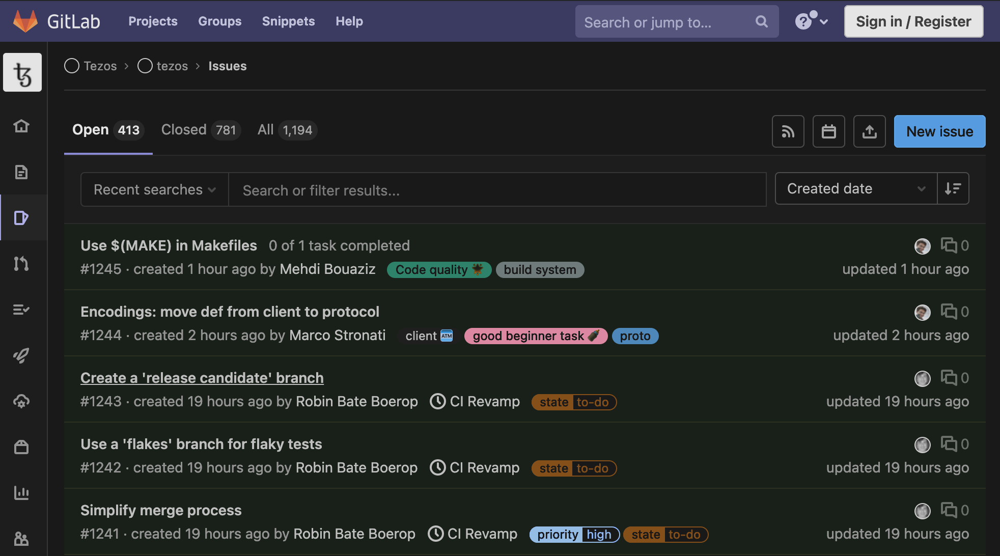
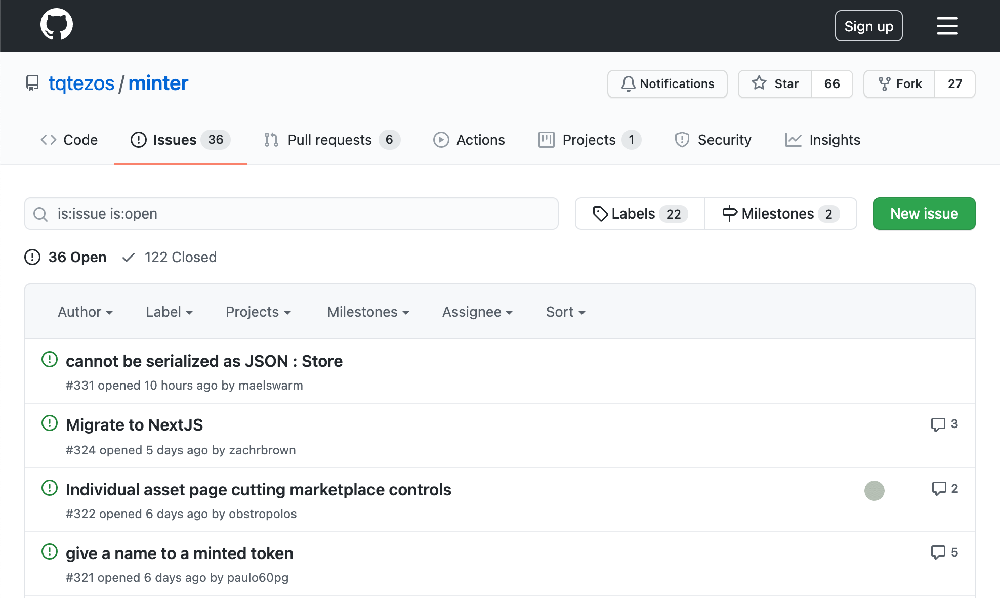

The simplest way to contribute is to report issues that you may have encounter while using Tezos or its related platforms. 

The first step is to find out the repository of the platform you encountered the issue on. **All developments on Tezos are open source** so there will always be a public repository associated with the platform, either on [Github](https://github.com), [Gitlab](https://gitlab.com), [Bitbucket](https://bitbucket.com) or so on.

For instance, if you encounter an issue with the _Tezos core protocol_, please refer to [gitlab.com/tezos/tezos](https://gitlab.com/tezos/tezos). If you find a mistake on _OpenTezos_, refer to [github.com/octo-technology/OpenTezos](https://github.com/octo-technology/OpenTezos). If you see an issue on _OpenMinter_, refer to [github.com/tqtezos/minter](https://github.com/tqtezos/minter).

Once you are on the repository, click the _issues_ tab. Use the search field to make sure there isn't already an opened issue on the subject. If there are none, open a new issue and enter a title and description explaining the problem with as much detail as possible. The maintainers of the repository will then be notified of your submission and usually reply within a couple days.

<small className="figure">FIGURE 1: The _issues_ tab of the _Tezos core protocol_ repository. Click _New issue_ in the upper right corner to report an issue.</small>

<small className="figure">FIGURE 2: The _issues_ tab of the _OpenMinter_ repository. Click _New issue_ in the upper right corner to report an issue.</small>

Reporting issues is really important as it helps developers identify breaking bugs and potential security threats. By reporting issues, you are helping the whole ecosystem.