Now that we have a deployed contract and a ready-to-use Wallet, we can start to develop a frontend that will interact
with a raffle smart contract.

This chapter requires knowledge about CSS, React and React Hooks. This is not a tutorial about React, nor how to build a
nice UI. This tutorial shows the basics usage of Temple in a dapp use case

# Project initialisation

```shell
$ npx create-react-app my-dapp --template typescript
$ cd my-dapp
$ yarn start
```

We have a running React application, that displays some text. So far, it does not do anything. The first step is to
integrate the Temple Wallet within our app.

# Temple Integration

The [temple-wallet/dapp](https://www.npmjs.com/package/@temple-wallet/dapp) module enables a React application to use
the Temple Wallet to interact with a Tezos blockchain. Let's install this module:

```shell
$ yarn add @temple-wallet/dapp
$ yarn add @taquito/taquito
$ yarn add constate
```

The _Madfish Solutions_ team provides developers with a ready-to-use script, which integrates the Temple Wallet into our
React app:
https://github.com/madfish-solutions/counter-dapp/blob/master/src/dapp.js

Let's create a `dapp` folder into `src/`, and put the dapp.js file into it:

```shell
$ mkdir src/dapp
$ cd src/dapp
$ curl https://raw.githubusercontent.com/madfish-solutions/counter-dapp/master/src/dapp.js -O
```

It exports a [React context](https://reactjs.org/docs/context.html) and the necessary functions to interact with a Tezos
network:

- **DAppProvider**: React context that will contain all the below hooks
- **useWallet**: returns a Wallet instance
- **useTezos**: returns a TezosToolkit, using the wallet instance
- **useAccountPkh**: returns the current wallet account address
- **useReady**: returns a boolean indicating if the wallet is connected to the tezos network
- **useConnect**: react callback to change the used account
- **useOnBlock**: react effect to retrieve the latest baked block. It subscribe to the stream of block (watching head),
  thanks to the `SubscribeProvider` _Taquito_ class.

These hooks will connect our React frontend to the Temple wallet extension.

Let's modify the src/App.tsx. 
We will remove all the HTML element, and we will add the `DAppProvider` context, from the `dapp/dapp.js` file.

```js
// dapp/dapp.js
function useDApp({ appName }) {
  const [{ wallet, tezos, accountPkh }, setState] = React.useState(() => ({
    wallet: undefined,
    tezos: undefined,
    accountPkh: undefined,
  }))

  const ready = Boolean(tezos)

  React.useEffect(() => {
    return TempleWallet.onAvailabilityChange((available) => {
      setState({
        wallet: available ? new TempleWallet(appName) : undefined,
        tezos: undefined,
        accountPkh: undefined,
      })
    })
  }, [setState, appName])

//...
```
`useDApp` expects one argument, which is the app name. Let's call our application "Raffle", and put its name into a constants file in `src/dapp/default.ts`

```typescript
// src/dapp/default.ts
export const APP_NAME = 'Raffle';
```

We can add the context into `src/App.tsx`:
```typescript jsx
// src/App.tsx
import React from 'react';
import { DAppProvider } from "dapp/dapp";
import { APP_NAME } from './dapp/defaults';
import './App.css';

function App() {
    return (
        <DAppProvider appName={APP_NAME}>
            <React.Suspense fallback={null}>

            </React.Suspense>
        < /DAppProvider>
    );
}

export default App;

```

## Wallet connexion 
The first step is to connect our react app to the Temple Wallet.

Let's create a `Page` component, that will contain all our component

```typescript jsx
import React from 'react';
import { DAppProvider } from './dapp/dapp'
import './App.css';

const Page = (props: { children: string | number | boolean | {} | React.ReactElement<any, string | React.JSXElementConstructor<any>> | React.ReactNodeArray | React.ReactPortal | null | undefined; }) => {
  return <div className="App"> {props.children} </div>
}

function App() {
  return (
          <DAppProvider appName={APP_NAME}>
            <React.Suspense fallback={null}>
              <Page> </Page>
            </React.Suspense>
          </DAppProvider>
  );
}

export default App;
```

Let's add a connexion button: when it is clicked, the app connects to the temple wallet. 
We will use the `useConnect` hook from `src/dapp/dapp.js`. Let's take a look at this callback definition:

```js
// src/dapp/dapp.js
const connect = React.useCallback(
    async (network, opts) => {
      try {
        if (!wallet) {
          throw new Error('Thanos Wallet not available')
        }
        await wallet.connect(network, opts) // expects a network and some options
        const tzs = wallet.toTezos()
        const pkh = await tzs.wallet.pkh()
        setState({
          wallet,
          tezos: tzs,
          accountPkh: pkh,
        })
      } catch (err) {
        console.error(`Failed to connect ThanosWallet: ${err.message}`)
      }
    },
    [setState, wallet],
  )
```
`useConnect` expects two arguments: a Tezos network and some options. Let's define a `NETWORK` global variable into `dapp/default.ts`

```typescript
// src/dapp/default.ts
export const APP_NAME = 'Raffle';
export const NETWORK = 'edo2net';
```

Our smart contract is deployed on edonet: the network is therefore set to `edo2net`.

We can now use the `useConnect` callback. We define a `ConnexionButton` component, that will execute a connexion callback when clicked.
The application connects the wallet to the specified `NETWORK` (edonet in our case). 
We add the option `forcePermission: true` to force a new connexion if the button is clicked with an already authenticated user
```typescript jsx
function ConnexionButton() {
  const connect = useConnect()
  const handleConnect = React.useCallback(async () => {
    try {
      await connect(NETWORK, { forcePermission: true })
    } catch (err) {
      console.error(err.message)
    }
  }, [connect])
  return <button onClick={handleConnect}>Connect account</button>
}
```

The app looks now:

```typescript jsx
import React from 'react';
import { DAppProvider, useConnect } from './dapp/dapp'
import './App.css';
import { APP_NAME, NETWORK } from './dapp/defaults';

const Page = (props: { children: string | number | boolean | {} | React.ReactElement<any, string | React.JSXElementConstructor<any>> | React.ReactNodeArray | React.ReactPortal | null | undefined; }) => {
  return <div className="App"> {props.children} </div>
}

function ConnexionButton() {
  const connect = useConnect()
  const handleConnect = React.useCallback(async () => {
    try {
      await connect(NETWORK, { forcePermission: true })
    } catch (err) {
      console.error(err.message)
    }
  }, [connect])
  return <button onClick={handleConnect}>Connect account</button>
}

function App() {
  return (
          <DAppProvider appName={APP_NAME}>
            <React.Suspense fallback={null}>
              <Page>
                <ConnexionButton></ConnexionButton>
              </Page>
            </React.Suspense>
          </DAppProvider>
  );
}

export default App;
```

Our application contains a single button: if we push it, a pop-up appears and offers the user the possibility to connect to the address of its choice.

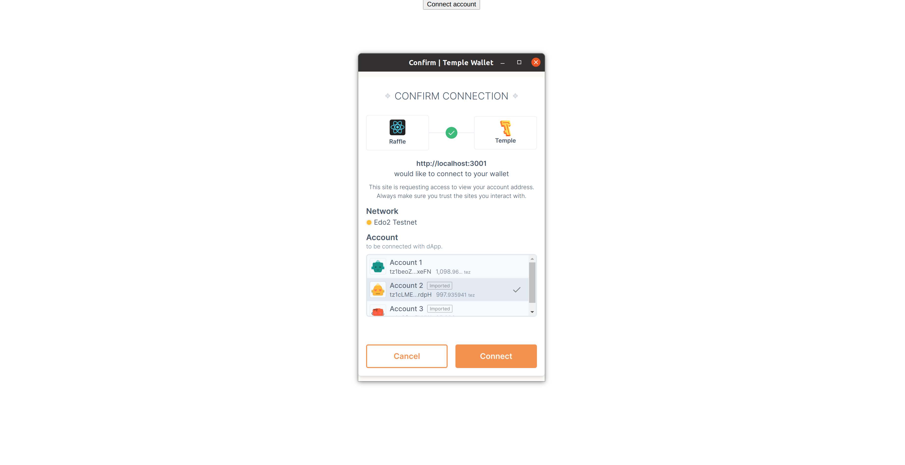

## Wallet information
Our application now connects to an account, with the Temple Wallet. 
However, the application does not display some crucial information: the used address and its balance.
The user needs to know which address is going to interact with the smart contract, and will therefore need some funds.

Let's add the used address. We will use the `useAccountPkh` callback from `dapp/dapp.js`.
The information is set when the connexion is established:

````typescript jsx
  const connect = React.useCallback(
        async (network, opts) => {
          try {
            if (!wallet) {
              throw new Error('Thanos Wallet not available')
            }
            await wallet.connect(network, opts)
            const tzs = wallet.toTezos()
            const pkh = await tzs.wallet.pkh()
            setState({
              wallet,
              tezos: tzs,
              accountPkh: pkh, // set here
            })
          } catch (err) {
            console.error(`Failed to connect ThanosWallet: ${err.message}`)
          }
        },
        [setState, wallet],
)
````

We will call the `useAccountPkh` hook, and reformat the address. 
The user needs to know which address he is using but does not need to know the full address: the beginning and the end of the address is enough.

```typescript jsx
function ConnectionSection() {
  const connect = useConnect()
  const accountPkh = useAccountPkh()
  const tezos = useTezos()
  const [balance, setBalance] = React.useState(null)
  const handleConnect = React.useCallback(async () => {
    try {
      await connect(NETWORK, { forcePermission: true })
    } catch (err) {
      console.error(err.message)
    }
  }, [connect])


  const accountPkhPreview = React.useMemo(() => {
    if (!accountPkh) return undefined
    else {
      const accPkh = (accountPkh as unknown) as string
      const ln = accPkh.length
      return `${accPkh.slice(0, 7)}...${accPkh.slice(ln - 4, ln)}` 
    }
  }, [accountPkh]) // updates when the connected account changes
//..
```

The `accountPkhPreview` variable must be updated when the connected account changes

Next, we will display the balance associated to the connected account.
We will need to interact with the Tezos network, so we will need the `useTezos` hook.
The balance is likely to change when:
- the network changes
- the account changes
- a new block is baked
- the app is 

We will write our balance update into a react callback, what will be updated if the network, connected account or the page changes.

This callback will be used in a effect (if the callback has changed).
It will also be used in the `useOnBlock` hook. When a new block is baked, the app will update the balance if it has changed.

```typescript jsx
  const accountPkh = useAccountPkh()
  const tezos = useTezos()
  const loadBalance = React.useCallback(async () => {
    if (tezos) {
      const tezosOk = tezos as any
      const bal = await tezosOk.tz.getBalance(accountPkh)
      setBalance(tezosOk.format('mutez', 'tz', bal).toString())
    }
  }, [tezos, accountPkh, setBalance])

  React.useEffect(() => {
    loadBalance()
  }, [loadBalance])

  useOnBlock(tezos, loadBalance)
```

Let's change our component into an array of three elements: the balance, the connected user, and the connect button


``` typescript jsx
function ConnectionSection() {
  const connect = useConnect()
  const accountPkh = useAccountPkh()
  const tezos = useTezos()
  const [balance, setBalance] = React.useState(null)
  const handleConnect = React.useCallback(async () => {
    try {
      await connect(NETWORK, { forcePermission: true })
    } catch (err) {
      console.error(err.message)
    }
  }, [connect])


  const accountPkhPreview = React.useMemo(() => {
    if (!accountPkh) return undefined
    else {
      const accPkh = (accountPkh as unknown) as string
      const ln = accPkh.length
      return `${accPkh.slice(0, 7)}...${accPkh.slice(ln - 4, ln)}`
    }
  }, [accountPkh])

  const loadBalance = React.useCallback(async () => {
    if (tezos) {
      const tezosOk = tezos as any
      const bal = await tezosOk.tz.getBalance(accountPkh)
      setBalance(tezosOk.format('mutez', 'tz', bal).toString())
    }
  }, [tezos, accountPkh, setBalance])

  React.useEffect(() => {
    loadBalance()
  }, [loadBalance])

  useOnBlock(tezos, loadBalance)

  return <div style={{ display: "grid", gridTemplateColumns: '1fr 1fr 1fr', margin: '0 auto', width: "500px" }}>
      <div>{balance}</div>
      <div>{accountPkhPreview}</div>
      <button onClick={handleConnect}>Connect account</button>
    </div>
}
```

# Displaying Storage

So far, our application uses the Temple Wallet to connect to a Tezos network, with an address. It is time now to connect our React application to our Raffle smart contract and then to retrieve the contract information (entrypoints and storage)

Let's create a new component, that will display the information from the storage. First, we need to retrieve the contract. 
We will need:
- the contract address
- to connect to a Tezos network, so we will use the `useTezos` hook
- to save the contract into the component state
- to reload the contract whenever the tezos toolkit changes

We will put the logic that retrieves the contract into an effect like this:

``` typescript jsx
function RaffleInformation() {
  const tezos = useTezos();
  const [contract, setContract] = useState(undefined);

  useEffect(() => {
    (async () => {
      if (tezos) {
        const ctr = await (tezos as any).wallet.at(RAFFLE_ADDRESS);
        setContract(ctr);
      }
    })();
  }, [tezos]);

  return (
    <div>
    </div>

  );
};
```

The contract object holds several pieces of information:
- the address
- the entrypoints
- the code and storage definition


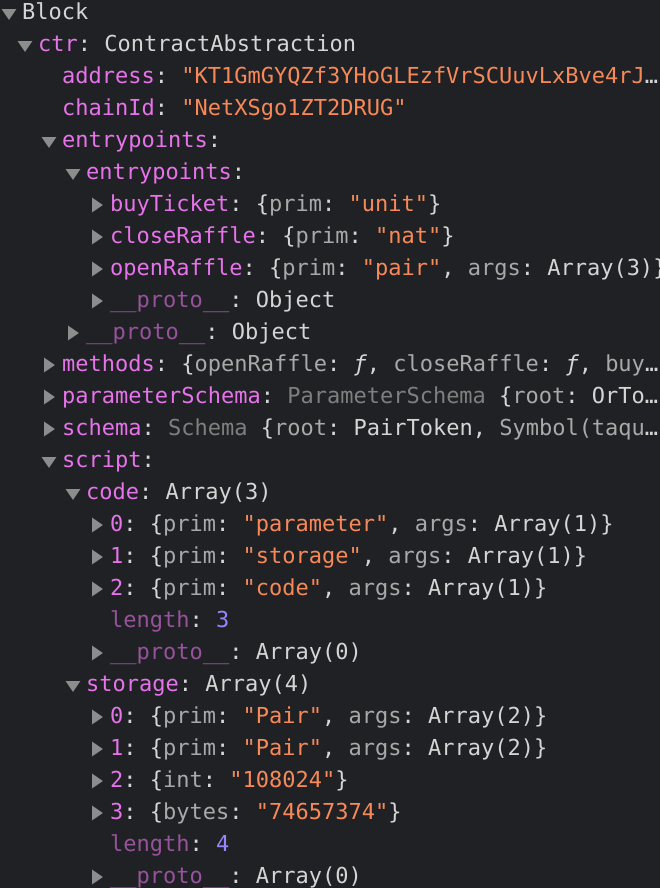


Let's now take a look at the contract storage.
The storage will be kept within the component state.
Let's define a `RaffleStorage` type, that will follows the storage definition

``` typescript jsx
type RaffleStorage = {
  admin: string;
  close_date: string;
  description: string;
  jackpot: number;
  players: [string];
  raffle_is_open: boolean;
  sold_tickets: BigMapAbstraction;
  winning_ticket_number_hash: string;
};
```

`BigMapAbstraction` is an abstraction exported by `@taquito/taquito`: it allows the application to handle [maps and big maps](https://tezostaquito.io/typedoc/classes/_taquito_taquito.bigmapabstraction.html)


Let's fetch the storage from the contract. We will the put logic of fetching the storage in a react callback `loadStorage`. 
The storage is likely to change if the contract object changes and if a new block is baked. So, this callback will be called in an effect and in the `useOnBlock` hook

``` typescript jsx

type RaffleStorage = {
  admin: string;
  close_date: string;
  description: string;
  jackpot: number;
  players: [string];
  raffle_is_open: boolean;
  sold_tickets: BigMapAbstraction;
  winning_ticket_number_hash: string;
};


function RaffleInformation() {
  const tezos = useTezos();
  const [contract, setContract] = useState();
  const [tickets, setTickets] = useState<string[]>([]);

  useEffect(() => {
    (async () => {
      if (tezos) {
        const ctr = await (tezos as any).wallet.at(RAFFLE_ADDRESS);
        setContract(ctr);
      }
    })();
  }, [tezos]);

    const loadStorage = React.useCallback(async () => {
    if (contract) {
      const str = await (contract as any).storage();
      setStorage(str)
    }
  }, [contract]);

    React.useEffect(() => {
    loadStorage();
  }, [loadStorage]);

  useOnBlock(tezos, loadStorage)

  return (
    <div>
    </div>

  );
};
```
One example of a retrieved storage is:

``` typescript jsx
admin: "tz1cGftgD3FuBmBhcwY24RaMm5D2UXLr5LHW"
close_date: "2021-07-23T12:59:48.000Z"
description: "Test from dapp"
jackpot: BigNumber {s: 1, e: 1, c: Array(1)}
players: (3) ["tz1beoZXxjqsXGoZnwW4TZD3MWGFpLHRxeFN", "tz1cGftgD3FuBmBhcwY24RaMm5D2UXLr5LHW", "tz1cLMENL1FJYMBJ3WPg5UQAEFobdVPFrdpH"]
raffle_is_open: true
sold_tickets: BigMapAbstraction {id: BigNumber, schema: Schema, provider: RpcContractProvider}
winning_ticket_number_hash: "74657374"

```

Almost all the values are fetched with `contract.storage()`, except the `sold_tickets`  big map.

## Big map handling
Big maps cannot be directly handled with taquito. This comes as no surprise. Indeed big maps are meant to store a huge amount of data: retrieving the whole big map can take a long time. That's why the wallet returns a `BigMapAbstraction`. This object will be used to retrieved specific values of the big map.

In our case, we want to display the tickets and their owner: we need to retrieve all the values. For that, we need to know the keys, which mean we need to know the sold ticket ids. When this article was written, [big map keys discovery](https://github.com/ecadlabs/taquito/projects/2#card-34204687) was not yet implemented.

Usually, there are two ways of getting big map keys:
- making an api call on an [indexer api](/explorer/tzstats-smart-contract/#api-calls). An indexer monitors a tezos network and extract and transform data so they can be easily fetched. Those indexers retrieve the contract big maps, which can be read on an API endpoint. First, you need to retrieve the big map number. You can find this number in the `BigMapAbstraction` or from an explorer. Once you have this number, you can fetch its keys (and values) with an API key (we use [tzstats](https://tzstats.com/))

``` shell
$ GET https://api.edo.tzstats.com/explorer/bigmap/108024/keys
[{"key":"0","key_hash":"exprtZBwZUeYYYfUs9B9Rg2ywHezVHnCCnmF9WsDQVrs582dSK63dC","key_binary":"0"},{"key":"1","key_hash":"expru2dKqDfZG8hu4wNGkiyunvq2hdSKuVYtcKta7BWP6Q18oNxKjS","key_binary":"1"},{"key":"2","key_hash":"expruDuAZnFKqmLoisJqUGqrNzXTvw7PJM2rYk97JErM5FHCerQqgn","key_binary":"2"}]
```

- refactoring the smart contract: the big map keys can be kept into a `set`.

In our raffle smart contracts, we don't need this. There is a one-to-one correspondence between the tickets and the players: if there are five players, it means that exactly five sold tickets. Since all tickets are numbered in the ascending order, we can infer that the big map keys range from zero to four.


So, we will create an array of number, which range from `0` to `players.length`.
Now that we have our keys, we will retrieve the mapped values.


A `BigMapAbstraction` exposes two asynchronous methods: 
- `get`: takes a big map key as input. Fetches one value
- `getMultipleValues`: takes a list of big map key as input. Fetches several values at the same time

The correct way to retrieve several values is to use `getMultipleValues` when we need to get several values. Putting `get` into a `for` loop to retrieve n values will make n calls: it is not effective when the big map grows.

Our `loadStorage` callback now looks like:
``` typescript jsx
    const loadStorage = React.useCallback(async () => {
    if (contract) {
      const str = await (contract as any).storage();
      const ticket_ids = Array.from(Array(str.players.length).keys()) // creating the keys array
      const tckts = await str.sold_tickets.getMultipleValues(ticket_ids) // fetching the values
      setStorage(str)
      setTickets([...tckts.valueMap])

    }
  }, [contract]);
```

Finally, our storage information will be display as plain text. Our Raffle app is:

``` typescript jsx
import React, { useState } from 'react';
import { DAppProvider, useAccountPkh, useConnect, useOnBlock, useReady, useTezos, useWallet } from './dapp/dapp'
import './App.css';
import { APP_NAME, NETWORK, RAFFLE_ADDRESS } from './dapp/defaults';
import { BigMapAbstraction } from "@taquito/taquito";

type RaffleStorage = {
  admin: string;
  close_date: string;
  description: string;
  jackpot: number;
  players: [string];
  raffle_is_open: boolean;
  sold_tickets: BigMapAbstraction;
  winning_ticket_number_hash: string;
};


const Page = (props: { children: string | number | boolean | {} | React.ReactElement<any, string | React.JSXElementConstructor<any>> | React.ReactNodeArray | React.ReactPortal | null | undefined; }) => {
  return <div className="App"> {props.children} </div>
}


function ConnectionSection() {
  const connect = useConnect()
  const accountPkh = useAccountPkh()
  const tezos = useTezos()
  const [balance, setBalance] = React.useState(null)
  const handleConnect = React.useCallback(async () => {
    try {
      await connect(NETWORK, { forcePermission: true })
    } catch (err) {
      console.error(err.message)
    }
  }, [connect])


  const accountPkhPreview = React.useMemo(() => {
    console.log("usememo")
    if (!accountPkh) return undefined
    else {
      const accPkh = (accountPkh as unknown) as string
      const ln = accPkh.length
      return `${accPkh.slice(0, 7)}...${accPkh.slice(ln - 4, ln)}`
    }
  }, [accountPkh])

  const loadBalance = React.useCallback(async () => {
    console.log(loadBalance)
    if (tezos) {
      const tezosOk = tezos as any
      const bal = await tezosOk.tz.getBalance(accountPkh)
      setBalance(tezosOk.format('mutez', 'tz', bal).toString())
    }
  }, [tezos, accountPkh, setBalance])

  React.useEffect(() => {
    loadBalance()
  }, [loadBalance])

  useOnBlock(tezos, loadBalance)

  return <div>
    <div style={{ display: "grid", gridTemplateColumns: '1fr 1fr 1fr', margin: '0 auto', width: "500px" }}>
      <div>{balance}</div>
      <div>{accountPkhPreview}</div>
      <button onClick={handleConnect}>Connect account</button>
    </div>
  </div>

}

function RaffleInformation() {
  const wallet = useWallet();
  const ready = useReady();
  const tezos = useTezos();

  const [contract, setContract] = useState();
  const [storage, setStorage] = useState<RaffleStorage>();
  const [tickets, setTickets] = useState<string[]>([]);

  React.useEffect(() => {
    (async () => {
      if (tezos) {
        const ctr = await (tezos as any).wallet.at(RAFFLE_ADDRESS);
        setContract(ctr);
      }
    })();
  }, [tezos]);

  const loadStorage = React.useCallback(async () => {
    if (contract) {
      const str = await (contract as any).storage();
      const ticket_ids = Array.from(Array(str.players.length).keys())
      const tckts = await str.sold_tickets.getMultipleValues(ticket_ids)
      setStorage(str)
      setTickets([...tckts.valueMap])
    }
  }, [contract]);

  React.useEffect(() => {
    loadStorage();
  }, [loadStorage]);

  useOnBlock(tezos, loadStorage)

  return (
    <div>
      <div>
        Administrator: {!!storage ? storage.admin.toString() : ""}
      </div>
      <div>
        Reward: {!!storage ? storage.jackpot.toString() : ""}
      </div>
      <div>
        Description: {!!storage ? storage.description.toString() : ""}
      </div>
      <div>
        Players:
        <div>
          {!!storage ? storage.players.map((value, index) => {
            return <li key={index}>{value}</li>
          }) : ""}
        </div>
      </div>
      <div>
        Tickets sold:
        <div>
          {tickets.map((value, index) => {
            return <li key={index}>{value[0]} : {value[1]}</li>
          })}
        </div>
      </div>

      <div>
        Closing date: {!!storage ? storage.close_date.toString() : ""}
      </div>
    </div>

  );
};

function App() {
  return (
    <DAppProvider appName={APP_NAME}>
      <React.Suspense fallback={null}>
        <Page>
          <ConnectionSection></ConnectionSection>
          <RaffleInformation></RaffleInformation>
        </Page>
      </React.Suspense>
    </DAppProvider>
  );
}

export default App;
```


# Launching a new raffle

It is time now to add interactions with the smart contract: let's add the possibility to launch a raffle. For this, the user will have to enter the raffle pieces of information, and then to call the `openRaffle` entrypoint.

Let's create a `LaunchRaffleSection` component, that will contains a `form` to enter the raffle information, and a button to call the entrypoint.

## New raffle information

First, we will add a form. Four pieces of information are needed:
- the **reward**: it will be entered as a `string`
- the **description**: it will be entered as a `string`
- the **closing date**: it will be entered as a `Date`
- the **winning ticket hash**: it will entered a `string`

For the reward, description and winning ticket hash, a simple `<input>` component will be enough. For the closing date, we will use a `DatePicker` ([https://www.npmjs.com/package/react-datepicker]).

These four pieces of information will be kept into the component state.

### DatePicker installation

Let's add the [react-datepicker](https://www.npmjs.com/package/react-datepicker) package:

``` shell
$ yarn add react-datepicker
```

We then need two add two imports into *App.tsx*:
``` typescript jsx
import DatePicker from "react-datepicker";
import "react-datepicker/dist/react-datepicker.css";
```

### Form creation

The raffle information will be entered in a basic React component like this:

```typescript jsx 

function LaunchRaffleSection() {
  const [description, setDescription] = useState("");
  const [reward, setReward] = useState("100");
  const [closingDate, setClosingDate] = useState(new Date());
  const [winningTicketHash, setwinningTicketHash] = useState("");

  const setNewDate = (date: any) => {
    if (!!date) {
      setClosingDate(date)
    }
  }

  return <div style={{ border: "1px solid black" }}>
    <form>
      <label>
        Reward:
  <input type="text" name="reward" value={reward}
          onChange={(e) => setReward(e.target.value)} />
      </label>
      <br />
      <label>
        Description:
  <input type="text" name="description" value={description}
          onChange={(e) => setDescription(e.target.value)} />
      </label>
      <br />
      <label>
        Closing Date:
    <DatePicker selected={closingDate} onChange={date => setNewDate(date)}></DatePicker>
      </label>
      <br />
      <label>
        Winning Hash number:
    <input type="text" name="winningTicketHash" value={winningTicketHash}
          onChange={(e) => setwinningTicketHash(e.target.value)} />
      </label>
    </form>
  </div>

}
```

## New raffle button

### web3 installation
In this part, we will need the standard [web3 package](https://www.npmjs.com/package/web3). It is used to interact with _Ethereum_ networks. In our case, we will use the `utils.asciiToHex` function, to convert string into bytes

``` shell
$ yarn add web3
```

### Implementation
The raffle information entered by the user will be used during the contract call. First, let's add a button that will trigger this call.

Let's create a `LaunchRaffleButton` component. This component will contain the contract call logic.

We will call the `openRaffle` entrypoint: it needs the four pieces of information from the form. Let's create a props type for this component:


``` typescript jsx
type launchRaffleButtonProps = { raffleReward: number; raffleDescription: string; raffleClosingDate: Date; raffleWinningHashNumber: string };

function LaunchRaffleButton({ raffleReward, raffleDescription, raffleClosingDate, raffleWinningHashNumber }: launchRaffleButtonProps) {

}
```

Before making this contract call, we need to connect to the tezos network (using the `useTezos` hook) and to get the contract (the same way as for the `RaffleInformation`) component.

``` typescript jsx
type launchRaffleButtonProps = { raffleReward: number; raffleDescription: string; raffleClosingDate: Date; raffleWinningHashNumber: string };

function LaunchRaffleButton({ raffleReward, raffleDescription, raffleClosingDate, raffleWinningHashNumber }: launchRaffleButtonProps) {
  const tezos = useTezos();
  const [contract, setContract] = useState(undefined);

  useEffect(() => {
    (async () => {
      if (tezos) {
        const ctr = await (tezos as any).wallet.at(RAFFLE_ADDRESS);
        setContract(ctr);
      }
    })();
  }, [tezos]);
}
```


The next step is to create the callback that will perform the contract call. This callback will receive the same four arguments as the component. This callback is likely to change if the contract changes.

The `ContractAbstraction` holds the callable entrypoints in `methods`. 

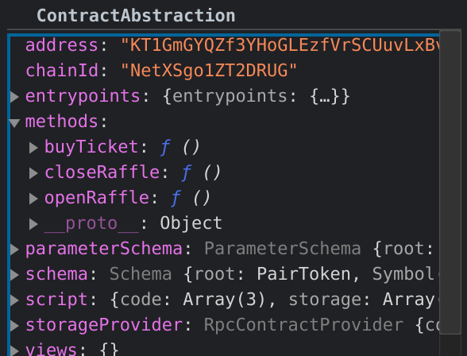

It returns three callbacks, matching our three entrypoints: we will use the `openRaffle` function. It expects four arguments: the order the arguments are expected is can be found in `entrypoints` in the `ContractAbstraction`.


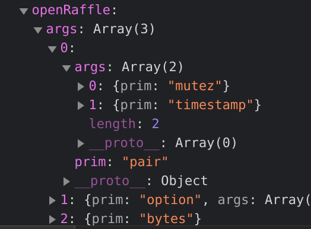

The order is given by the type order:
1. reward (`mutez`)
2. closing date (`timestamps`)
3. description (`option`)
4. winning ticket hash (`bytes`)

We can write our callback

``` typescript jsx
  type launchRaffleParameters = { reward: number; description: string; closingDate: Date; winningTicketHash: string };

  const launchRaffleCallback = React.useCallback(
    ({ reward, description, closingDate, winningTicketHash }: launchRaffleParameters) => {
      return (contract as any).methods
        .openRaffle(reward, closingDate, description, web3.utils.asciiToHex(winningTicketHash).slice(2))
    },
    [contract]
  );
```
`web3.utils.asciiToHex(string).slice(2)` is the way to convert a string into a bytes, using the standard [web3 package](https://www.npmjs.com/package/web3).

However, even though the contract arguments are correct, the execution will fail. Indeed, when a raffle is opened, the reward must be sent to the smart contract: an `amount` must be specified. It can be carried out with the `send` method, which allow to specify some parameters of the call:
``` typescript jsx
  type launchRaffleParameters = { reward: number; description: string; closingDate: Date; winningTicketHash: string };

  const launchRaffleCallback = React.useCallback(
    ({ reward, description, closingDate, winningTicketHash }: launchRaffleParameters) => {
      return (contract as any).methods
        .openRaffle(reward, closingDate, description, web3.utils.asciiToHex(winningTicketHash).slice(2))
        .send({ amount: reward });
    },
    [contract]
  );
```

The last thing is to connect this callback to a button. Our final component is:

``` typescript jsx
type launchRaffleButtonProps = { raffleReward: number; raffleDescription: string; raffleClosingDate: Date; raffleWinningHashNumber: string };

function LaunchRaffleButton({ raffleReward, raffleDescription, raffleClosingDate, raffleWinningHashNumber }: launchRaffleButtonProps) {
  const tezos = useTezos();
  const [contract, setContract] = useState(undefined);

  useEffect(() => {
    (async () => {
      if (tezos) {
        const ctr = await (tezos as any).wallet.at(RAFFLE_ADDRESS);
        setContract(ctr);
      }
    })();
  }, [tezos]);

  type launchRaffleParameters = { reward: number; description: string; closingDate: Date; winningTicketHash: string };

  const launchRaffleCallback = React.useCallback(
    ({ reward, description, closingDate, winningTicketHash }: launchRaffleParameters) => {
      return (contract as any).methods
        .openRaffle(reward, closingDate, description, web3.utils.asciiToHex(winningTicketHash).slice(2))
        .send({ amount: reward });
    },
    [contract]
  );
  return <button onClick={() => {
    launchRaffleCallback({
      reward: raffleReward,
      description: raffleDescription,
      closingDate: raffleClosingDate,
      winningTicketHash: raffleWinningHashNumber
    })
  }}>Launch</button>
}
```

## End-to-end testing

Our app now looks like: 

``` typescript jsx
import React, { useState } from 'react';
import { DAppProvider, useAccountPkh, useConnect, useOnBlock, useReady, useTezos, useWallet } from './dapp/dapp'
import './App.css';
import { APP_NAME, NETWORK, RAFFLE_ADDRESS } from './dapp/defaults';
import { BigMapAbstraction } from "@taquito/taquito";
import DatePicker from "react-datepicker";
import "react-datepicker/dist/react-datepicker.css";
import web3 from "web3";

type RaffleStorage = {
  admin: string;
  close_date: string;
  description: string;
  jackpot: number;
  players: [string];
  raffle_is_open: boolean;
  sold_tickets: BigMapAbstraction;
  winning_ticket_number_hash: string;
};


const Page = (props: { children: string | number | boolean | {} | React.ReactElement<any, string | React.JSXElementConstructor<any>> | React.ReactNodeArray | React.ReactPortal | null | undefined; }) => {
  return <div className="App"> {props.children} </div>
}


function ConnectionSection() {
  const connect = useConnect()
  const accountPkh = useAccountPkh()
  const tezos = useTezos()
  const [balance, setBalance] = React.useState(null)
  const handleConnect = React.useCallback(async () => {
    try {
      await connect(NETWORK, { forcePermission: true })
    } catch (err) {
      console.error(err.message)
    }
  }, [connect])


  const accountPkhPreview = React.useMemo(() => {
    console.log("usememo")
    if (!accountPkh) return undefined
    else {
      const accPkh = (accountPkh as unknown) as string
      const ln = accPkh.length
      return `${accPkh.slice(0, 7)}...${accPkh.slice(ln - 4, ln)}`
    }
  }, [accountPkh])

  const loadBalance = React.useCallback(async () => {
    console.log(loadBalance)
    if (tezos) {
      const tezosOk = tezos as any
      const bal = await tezosOk.tz.getBalance(accountPkh)
      setBalance(tezosOk.format('mutez', 'tz', bal).toString())
    }
  }, [tezos, accountPkh, setBalance])

  React.useEffect(() => {
    loadBalance()
  }, [loadBalance])

  useOnBlock(tezos, loadBalance)

  return <div>
    <div style={{ display: "grid", gridTemplateColumns: '1fr 1fr 1fr', margin: '0 auto', width: "500px" }}>
      <div>{balance}</div>
      <div>{accountPkhPreview}</div>
      <button onClick={handleConnect}>Connect account</button>
    </div>
  </div>

}

function RaffleInformation() {
  const wallet = useWallet();
  const ready = useReady();
  const tezos = useTezos();

  const [contract, setContract] = useState();
  const [storage, setStorage] = useState<RaffleStorage>();
  const [tickets, setTickets] = useState<string[]>([]);

  React.useEffect(() => {
    (async () => {
      if (tezos) {
        const ctr = await (tezos as any).wallet.at(RAFFLE_ADDRESS);
        setContract(ctr);
      }
    })();
  }, [tezos]);

  const loadStorage = React.useCallback(async () => {
    if (contract) {
      const str = await (contract as any).storage();
      const ticket_ids = Array.from(Array(str.players.length).keys())
      const tckts = await str.sold_tickets.getMultipleValues(ticket_ids)
      setStorage(str)
      setTickets([...tckts.valueMap])
    }
  }, [contract]);

  React.useEffect(() => {
    loadStorage();
  }, [loadStorage]);

  useOnBlock(tezos, loadStorage)

  return (
    <div>
      <div>
        Administrator: {!!storage ? storage.admin.toString() : ""}
      </div>
      <div>
        Reward: {!!storage ? storage.jackpot.toString() : ""}
      </div>
      <div>
        Description: {!!storage ? storage.description.toString() : ""}
      </div>
      <div>
        Players:
        <div>
          {!!storage ? storage.players.map((value, index) => {
            return <li key={index}>{value}</li>
          }) : ""}
        </div>
      </div>
      <div>
        Tickets sold:
        <div>
          {tickets.map((value, index) => {
            return <li key={index}>{value[0]} : {value[1]}</li>
          })}
        </div>
      </div>

      <div>
        Closing date: {!!storage ? storage.close_date.toString() : ""}
      </div>
    </div>

  );
};

type launchRaffleButtonProps = { raffleReward: number; raffleDescription: string; raffleClosingDate: Date; raffleWinningHashNumber: string };

function LaunchRaffleButton({ raffleReward, raffleDescription, raffleClosingDate, raffleWinningHashNumber }: launchRaffleButtonProps) {
  const tezos = useTezos();
  const [contract, setContract] = useState(undefined);

  React.useEffect(() => {
    (async () => {
      if (tezos) {
        const ctr = await (tezos as any).wallet.at(RAFFLE_ADDRESS);
        setContract(ctr);
      }
    })();
  }, [tezos]);

  type launchRaffleParameters = { reward: number; description: string; closingDate: Date; winningTicketHash: string };

  const launchRaffleCallback = React.useCallback(
    ({ reward, description, closingDate, winningTicketHash }: launchRaffleParameters) => {
      return (contract as any).methods
        .openRaffle(reward, closingDate, description, web3.utils.asciiToHex(winningTicketHash).slice(2))
        .send({ amount: reward });
    },
    [contract]
  );
  return <button onClick={() => {
    launchRaffleCallback({
      reward: raffleReward,
      description: raffleDescription,
      closingDate: raffleClosingDate,
      winningTicketHash: raffleWinningHashNumber
    })
  }}>Launch</button>
}

function LaunchRaffleSection() {
  const [description, setDescription] = useState("");
  const [reward, setReward] = useState("100");
  const [closingDate, setClosingDate] = useState(new Date());
  const [winningTicketHash, setwinningTicketHash] = useState("");

  const setNewDate = (date: any) => {
    if (!!date) {
      setClosingDate(date)
    }
  }

  return <div style={{ border: "1px solid black" }}>
    <form>
      <label>
        Reward:
  <input type="text" name="reward" value={reward}
          onChange={(e) => setReward(e.target.value)} />
      </label>
      <br />
      <label>
        Description:
  <input type="text" name="description" value={description}
          onChange={(e) => setDescription(e.target.value)} />
      </label>
      <br />
      <label>
        Closing Date:
    <DatePicker selected={closingDate} onChange={date => setNewDate(date)}></DatePicker>
      </label>
      <br />
      <label>
        Winning Hash number:
    <input type="text" name="winningTicketHash" value={winningTicketHash}
          onChange={(e) => setwinningTicketHash(e.target.value)} />
      </label>
    </form>
    <LaunchRaffleButton raffleReward={parseInt(reward)} raffleDescription={description} raffleClosingDate={closingDate} raffleWinningHashNumber={winningTicketHash} ></LaunchRaffleButton>
  </div>

}

function App() {
  return (
    <DAppProvider appName={APP_NAME}>
      <React.Suspense fallback={null}>
        <Page>
          <ConnectionSection></ConnectionSection>
          <RaffleInformation></RaffleInformation>
          <LaunchRaffleSection></LaunchRaffleSection>
        </Page>
      </React.Suspense>
    </DAppProvider>
  );
}

export default App;
```

Let's run it:

``` shell
$ yarn start
```

The page should look like this:

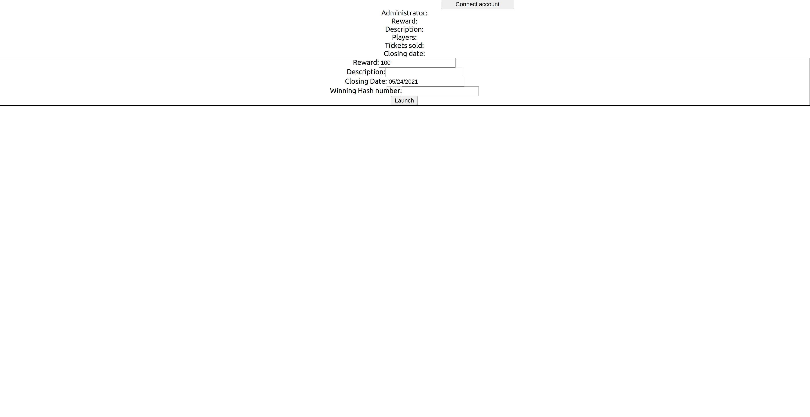

Let's connect our wallet by clicking on "Connect account". A Temple pop-up appears and displays the available accounts:
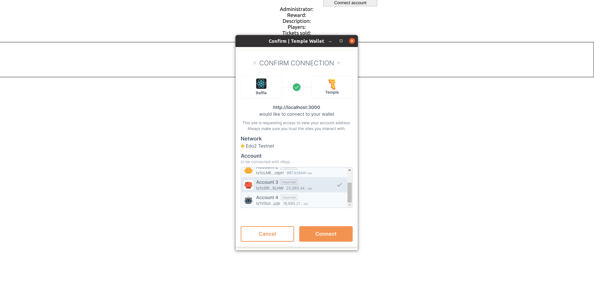

The account information are loaded and displayed:
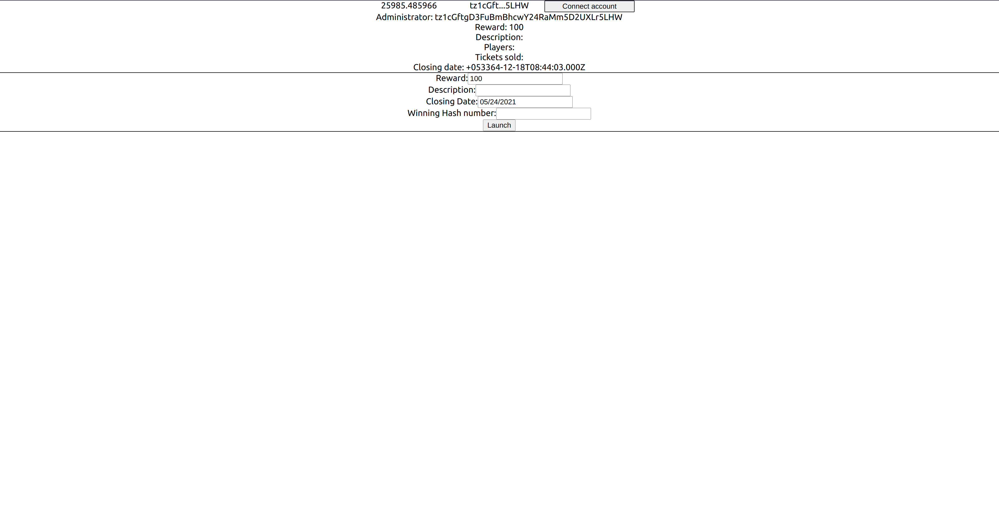

Let's create a new raffle: the closing date will be the same day, and there will be no winner. Let's click on launch. A pop-up appears, summing up the contract call:
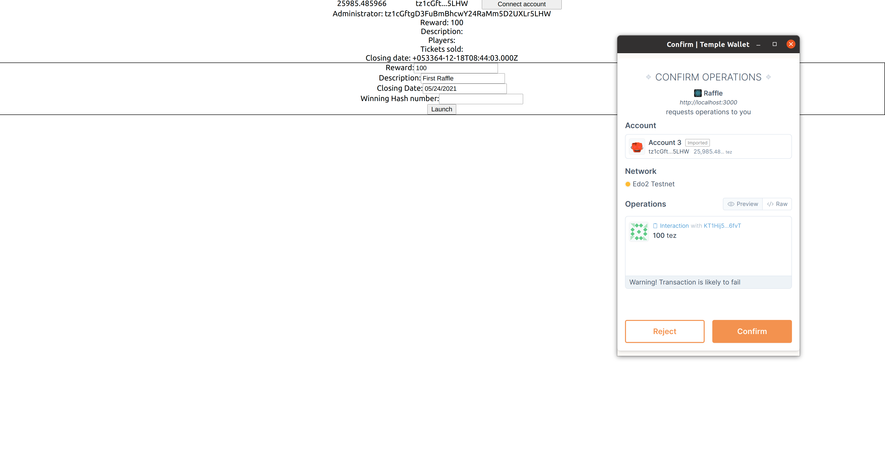

The detailed transaction information can be found under the "Raw" section
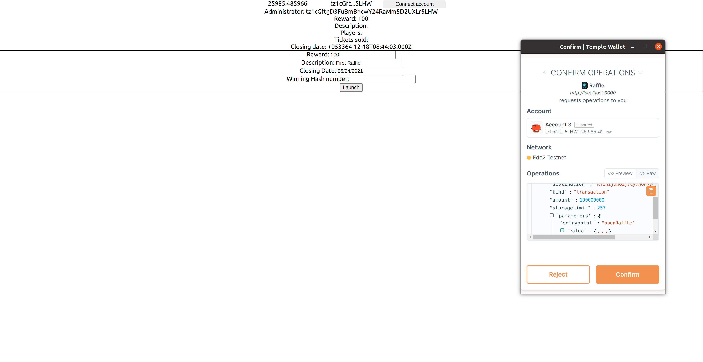
There is a warning message: "Warning! Transaction is likely to fail". The Temple Wallet before sending the transaction can check if the Michelson code execution will succeed. In this case, the closing date is too early. Let's try to send the transaction. If we check in the console, an exception is raised.
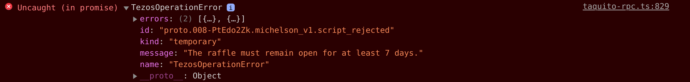

The cause of the failure is indeed the closing date. Let's try again: the reward will be 200 tz, and the end of the raffle will be a mont later:

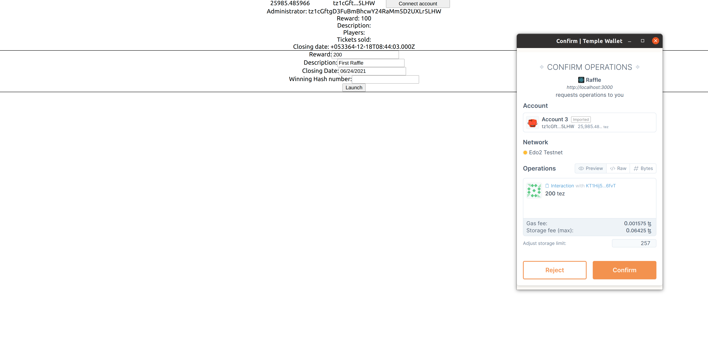

The warning is gone. Instead, the fees are displayed. The transaction seems valid: let's send it. After a while, the UI is re-rendered:

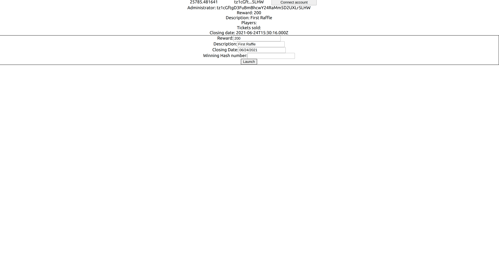

A raffle just opened. 200 tz (the reward) have been substracted from our account balance and the raffle information have been updated.

We can try to launch a new raffle, but the transaction will fail since there is already an ongoing raffle. This is detected by the Temple Wallet.

# Buying tickets

## Implementation
Let's add the feature of buying a ticket to our application. There is no information to provide: the only thing to do is to call the entrypoint.

Just like for the opening of a raffle, we will add a button component, that make that contract call when it is clicked.
We will need to interact with a contract on a tezos network, so we will use the `useTezos` hook and the `RAFFLE_ADDRESS` variable into an effect.

The logic of calling the `buyTicket` entrypoint will be written into a React callback. The ticket costs one XTZ.

Note that `buyTicket` expects `unit`. It does not mean that he should not be passed any argument when call: it expect a `"unit"` string

Finally, this callback will be connected to button.

``` typescript jsx
function BuyTicketButton() {
  const tezos = useTezos();
  const [contract, setContract] = useState(undefined);
  React.useEffect(() => {
    (async () => {
      if (tezos) {
        const ctr = await (tezos as any).wallet.at(RAFFLE_ADDRESS);
        setContract(ctr);
      }
    })();
  }, [tezos]);

  const launchRaffleCallback = React.useCallback(
    () => {
      return (contract as any).methods
        .buyTicket("unit")
        .send({ amount: 1 });
    },
    [contract]
  );
  return <button onClick={() => {
    launchRaffleCallback()
  }}>Buy</button>
}
```

## End-to-end testing

``` typescript jsx
import React, { useState } from 'react';
import { DAppProvider, useAccountPkh, useConnect, useOnBlock, useReady, useTezos, useWallet } from './dapp/dapp'
import './App.css';
import { APP_NAME, NETWORK, RAFFLE_ADDRESS } from './dapp/defaults';
import { BigMapAbstraction } from "@taquito/taquito";
import DatePicker from "react-datepicker";
import "react-datepicker/dist/react-datepicker.css";
import web3 from "web3";

type RaffleStorage = {
  admin: string;
  close_date: string;
  description: string;
  jackpot: number;
  players: [string];
  raffle_is_open: boolean;
  sold_tickets: BigMapAbstraction;
  winning_ticket_number_hash: string;
};


const Page = (props: { children: string | number | boolean | {} | React.ReactElement<any, string | React.JSXElementConstructor<any>> | React.ReactNodeArray | React.ReactPortal | null | undefined; }) => {
  return <div className="App"> {props.children} </div>
}


function ConnectionSection() {
  const connect = useConnect()
  const accountPkh = useAccountPkh()
  const tezos = useTezos()
  const [balance, setBalance] = React.useState(null)
  const handleConnect = React.useCallback(async () => {
    try {
      await connect(NETWORK, { forcePermission: true })
    } catch (err) {
      console.error(err.message)
    }
  }, [connect])


  const accountPkhPreview = React.useMemo(() => {
    console.log("usememo")
    if (!accountPkh) return undefined
    else {
      const accPkh = (accountPkh as unknown) as string
      const ln = accPkh.length
      return `${accPkh.slice(0, 7)}...${accPkh.slice(ln - 4, ln)}`
    }
  }, [accountPkh])

  const loadBalance = React.useCallback(async () => {
    console.log(loadBalance)
    if (tezos) {
      const tezosOk = tezos as any
      const bal = await tezosOk.tz.getBalance(accountPkh)
      setBalance(tezosOk.format('mutez', 'tz', bal).toString())
    }
  }, [tezos, accountPkh, setBalance])

  React.useEffect(() => {
    loadBalance()
  }, [loadBalance])

  useOnBlock(tezos, loadBalance)

  return <div>
    <div style={{ display: "grid", gridTemplateColumns: '1fr 1fr 1fr', margin: '0 auto', width: "500px" }}>
      <div>{balance}</div>
      <div>{accountPkhPreview}</div>
      <button onClick={handleConnect}>Connect account</button>
    </div>
  </div>

}

function RaffleInformation() {
  const wallet = useWallet();
  const ready = useReady();
  const tezos = useTezos();

  const [contract, setContract] = useState();
  const [storage, setStorage] = useState<RaffleStorage>();
  const [tickets, setTickets] = useState<string[]>([]);

  React.useEffect(() => {
    (async () => {
      if (tezos) {
        const ctr = await (tezos as any).wallet.at(RAFFLE_ADDRESS);
        debugger
        setContract(ctr);
      }
    })();
  }, [tezos]);

  const loadStorage = React.useCallback(async () => {
    if (contract) {
      const str = await (contract as any).storage();
      const ticket_ids = Array.from(Array(str.players.length).keys())
      const tckts = await str.sold_tickets.getMultipleValues(ticket_ids)
      setStorage(str)
      setTickets([...tckts.valueMap])
    }
  }, [contract]);

  React.useEffect(() => {
    loadStorage();
  }, [loadStorage]);

  useOnBlock(tezos, loadStorage)

  return (
    <div>
      <div>
        Administrator: {!!storage ? storage.admin.toString() : ""}
      </div>
      <div>
        Reward: {!!storage ? storage.jackpot.toString() : ""}
      </div>
      <div>
        Description: {!!storage ? storage.description.toString() : ""}
      </div>
      <div>
        Players:
        <div>
          {!!storage ? storage.players.map((value, index) => {
            return <li key={index}>{value}</li>
          }) : ""}
        </div>
      </div>
      <div>
        Tickets sold:
        <div>
          {tickets.map((value, index) => {
            return <li key={index}>{value[0]} : {value[1]}</li>
          })}
        </div>
      </div>

      <div>
        Closing date: {!!storage ? storage.close_date.toString() : ""}
      </div>
    </div>

  );
};

type launchRaffleButtonProps = { raffleReward: number; raffleDescription: string; raffleClosingDate: Date; raffleWinningHashNumber: string };

function LaunchRaffleButton({ raffleReward, raffleDescription, raffleClosingDate, raffleWinningHashNumber }: launchRaffleButtonProps) {
  const tezos = useTezos();
  const [contract, setContract] = useState(undefined);

  React.useEffect(() => {
    (async () => {
      if (tezos) {
        const ctr = await (tezos as any).wallet.at(RAFFLE_ADDRESS);
        setContract(ctr);
      }
    })();
  }, [tezos]);

  type launchRaffleParameters = { reward: number; description: string; closingDate: Date; winningTicketHash: string };

  const launchRaffleCallback = React.useCallback(
    ({ reward, description, closingDate, winningTicketHash }: launchRaffleParameters) => {
      return (contract as any).methods
        .openRaffle(reward, closingDate, description, web3.utils.asciiToHex(winningTicketHash).slice(2))
        .send({ amount: reward });
    },
    [contract]
  );
  return <button onClick={() => {
    launchRaffleCallback({
      reward: raffleReward,
      description: raffleDescription,
      closingDate: raffleClosingDate,
      winningTicketHash: raffleWinningHashNumber
    })
  }}>Launch</button>
}

function LaunchRaffleSection() {
  const [description, setDescription] = useState("");
  const [reward, setReward] = useState("100");
  const [closingDate, setClosingDate] = useState(new Date());
  const [winningTicketHash, setwinningTicketHash] = useState("");

  const setNewDate = (date: any) => {
    if (!!date) {
      setClosingDate(date)
    }
  }

  return <div style={{ border: "1px solid black" }}>
    <form>
      <label>
        Reward:
  <input type="text" name="reward" value={reward}
          onChange={(e) => setReward(e.target.value)} />
      </label>
      <br />
      <label>
        Description:
  <input type="text" name="description" value={description}
          onChange={(e) => setDescription(e.target.value)} />
      </label>
      <br />
      <label>
        Closing Date:
    <DatePicker selected={closingDate} onChange={date => setNewDate(date)}></DatePicker>
      </label>
      <br />
      <label>
        Winning Hash number:
    <input type="text" name="winningTicketHash" value={winningTicketHash}
          onChange={(e) => setwinningTicketHash(e.target.value)} />
      </label>
    </form>
    <LaunchRaffleButton raffleReward={parseInt(reward)} raffleDescription={description} raffleClosingDate={closingDate} raffleWinningHashNumber={winningTicketHash} ></LaunchRaffleButton>
  </div>

}

function BuyTicketButton() {
  const tezos = useTezos();
  const [contract, setContract] = useState(undefined);
  React.useEffect(() => {
    (async () => {
      if (tezos) {
        const ctr = await (tezos as any).wallet.at(RAFFLE_ADDRESS);
        setContract(ctr);
      }
    })();
  }, [tezos]);

  const launchRaffleCallback = React.useCallback(
    () => {
      return (contract as any).methods
        .buyTicket("unit")
        .send({ amount: 1 });
    },
    [contract]
  );
  return <button onClick={() => {
    launchRaffleCallback()
  }}>Buy</button>
}

function App() {
  return (
    <DAppProvider appName={APP_NAME}>
      <React.Suspense fallback={null}>
        <Page>
          <ConnectionSection></ConnectionSection>
          <RaffleInformation></RaffleInformation>
          <LaunchRaffleSection></LaunchRaffleSection>
          <BuyTicketButton></BuyTicketButton>
        </Page>
      </React.Suspense>
    </DAppProvider>
  );
}

export default App;
```

Let's test it. The button to buy ticket has been added: it can be clicked. A Temple wallet pop-up appears, summing up the contract call.

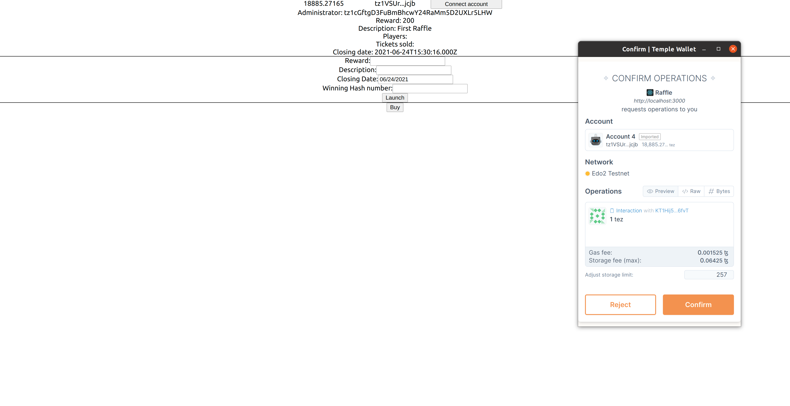

After a while, the UI is re-rendered: the bought ticket is displayed.
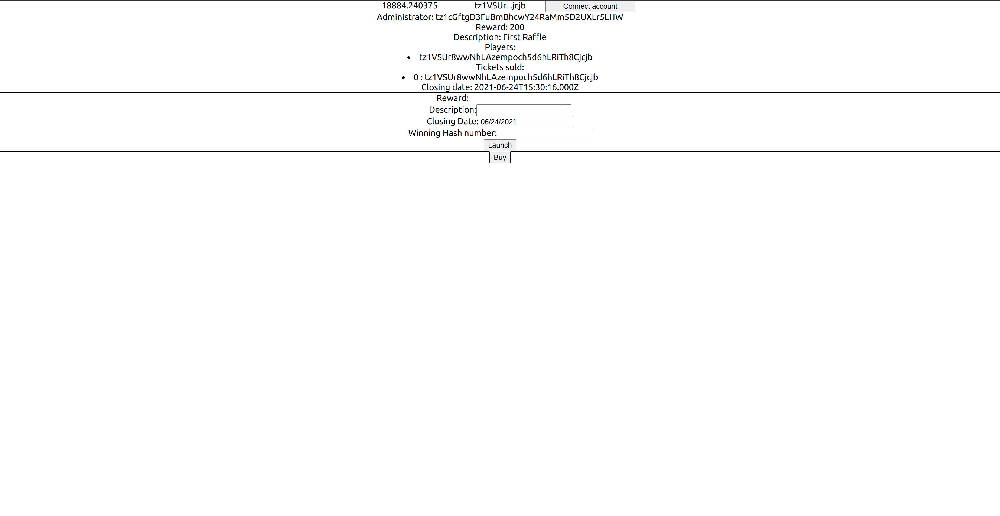


# Conclusion