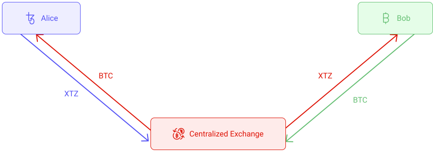

## Swap scenarios
Let's consider the following scenario: Alice has 100 XTZ and wants to exchange them for 0.1 BTC from Bob. How does she do it? There are multiple ways:

### Using a centralized exchange
One way is to use a centralized exchange like Binance. This means that you must trust them to store your tokens and process the transaction correctly and securely. But this way relies on a single point of failure that could, potentially, fail at any time. [Binance was hacked in 2019, and 7,000 bitcoins were stolen.](https://www.binance.com/en/blog/336904059293999104/Security-Incident-Recap) In addition, exchanges usually take a fee for the service they offer. Does a better solution exist? Could we use a DEX instead?

<small className="figure">FIGURE 1: Illustration of non-atomic swap on a centralized exchange</small>

### Using a DEX
Using a DEX is a great solution for making trustless token swaps. However, they only work within the same blockchain network. For example, _Dexter_ and _Quipuswap_ only work on Tezos and only with FA1.2 or FA2 tokens. So that wouldn't work if you want to exchange XTZ against BTC! One way would be to use wrapped assets as seen in the [previous chapter](defi/wrapped-assets) and exchange wrapped XTZ (wXTZ) against wrapped BTC (tzBTC) on a Tezos DEX. However, this increases the difficulty of the process, as you must wrap and unwrap the tokens. Additionally, you have to trust that the smart contract that allows you to unwrap your tzBTC for actual BTC is secured. So, does a fully trustless solution exist?

<small className="figure">FIGURE 2: Illustration of non-atomic swap on a decentralized exchange</small>

### Cross chain swaps
A _cross-chain swap_ (also referred to as an _Atomic Swap_) refers to the exchanging of two different cryptocurrencies, on two different blockchains in a peer-to-peer fashion, i.e., without using a third party. This is possible thanks to a code locking mechanisms known as **Hash Time Locked Contracts (HTLCs)** codable into blockchain transactions. For this, Alice and Bob have to proceed as follows :

- Alice must deposit her XTZ into an HTLC smart contract which acts like a safe and locks the funds. When this safe is created, Alice also generates a key to access it.

- Alice shares a cryptographic hash of this key with Bob. Note that Bob can't access the XTZ yet because he only has the key's hash and not the key itself.

- Bob uses the hash provided by Alice to create another HTLC smart contract, in which he deposits his BTC ([Bitcoin is indeed capable of running basic smart contracts](/blockchain-basics/smart-contracts) such as HTLC). 

- To claim the BTC, Alice is required to use that same key, and by doing so, she reveals it to Bob (thanks to a particular function called _hashlock_ from HTLC). 

- This means that as soon as Alice claims the BTC, Bob can claim the XTZ and the swap is complete.

The term **atomic** relates to the fact that these transactions either happen entirely or not at all. If any of the parties give up or fails to do what they are supposed to, the contract is cancelled, and the funds are automatically returned to their owners.

<small className="figure">FIGURE 3: Illustration of an atomic swap.</small>

Alice's HTLC will time-out and refund the funds to Alice automatically if Bob never sends the funds. 

<small className="figure">FIGURE 4: Illustration of a failed atomic swap (Bob did not send the funds).</small>

## Hash Time Lock Contracts
_Hash Timelock Contracts_ (HTLC) are one of the critical components that makes atomic swaps possible. As the name suggests, they are based on two essential functions: 

- a hashlock, which prevents funds from being spent unless a piece of data is revealed (Alice's key in the previous example).
  
- a timelock, which ensures the contract can only be executed within a predefined timeframe. 

Consequently, the need for trust between the individuals is removed as the use of HTLCs creates a specific set of rules that prevent the atomic swaps from only executing partially.

To learn more about HTLCs, you can read [this article](https://medium.com/blockchainio/what-are-atomic-swaps-bc1d034634c9).

## Cross-chain swaps on Tezos
- [StakerBridge](https://medium.com/stakerdao/stakerbridge-eth-tez-is-live-1841cb75557d) by [StakerDAO](https://www.stakerdao.com/) is an open-source, trustless method of bi-directional transfer of tokens between Ethereum and Tezos.
  
- [TEZEX](https://tezex.io/) is currently in development and will enable cross-chain swaps between Ethereum and Tezos.
  
## References

[1] https://medium.com/tezosexchange/the-changemakers-of-tezex-bridge-fd73bb1d8da2

[2] https://liquality.io/blog/atomic-swaps-explained/

[3] https://academy.binance.com/en/articles/atomic-swaps-explained
