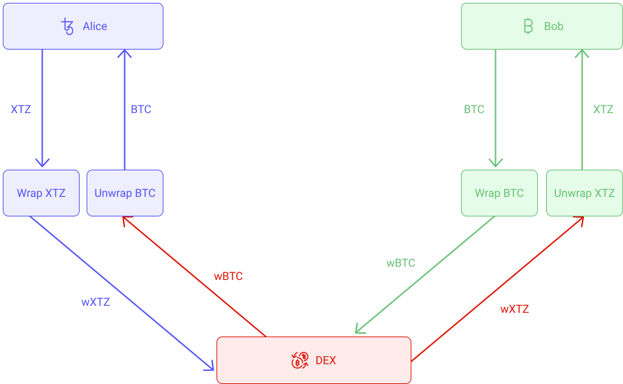
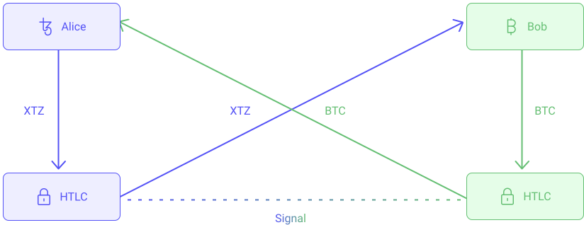
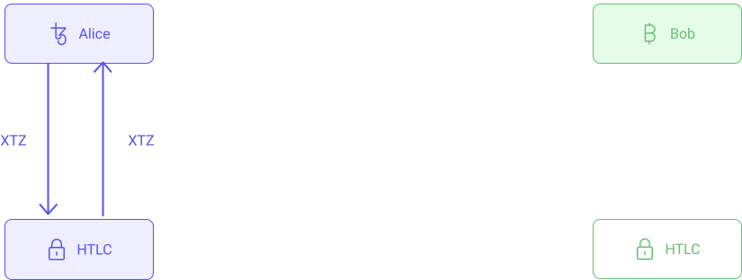

Let's consider the following scenario: Alice has 100 XTZ and want to exchange them for 0.1 BTC from Bob. How to proceed? There are multiple ways :

- One way in to use a centralized exchange like Binance. This means that you have trust them to securely store your tokens and process the transaction correctly. This is a single point of failure that could potentially fail at any time. [Binance was hacked in 2019 and 7,000 bitcoins were stolen.](https://www.binance.com/en/blog/336904059293999104/Security-Incident-Recap) In addition, exchanges take a fee for the service they offer. Isn't there a better solution? Could we use a DEX instead?

<small className="figure">FIGURE 1: Illustration of non-atomic swap on a centralized exchange</small>

- DEXs are a step closer to trustless exchanges but they are still a single point of failure. Are the smart contracts secured? Can you trust their implementation? [In 2018, decentralized exchange Bancor was hacked and suffered a loss of $13.5M in assets before freezing funds.](https://www.zdnet.com/article/another-hack-rocks-cryptocurrency-trading-bancor-loses-23-5-million/) Additionally, DEXs only work within the same blockchain. Dexter and Quipuswap only work on Tezos with FA1.2 or FA2 tokens. So how to exchange XTZ against BTC? One way is to use wrapped assets as seen in the previous chapter and actually exchange wrapped XTZ (wXTZ) against Wrapped BTC (tzBTC) on a DEX. However you also have to trust the entity that allows you to unwrap your tzBTC for actual BTC. Is there really a fully trustless solution?

<small className="figure">FIGURE 2: Illustration of non-atomic swap on a decentralized exchange</small>

- A _cross-chain swap_ (also referred as _Atomic Swap_) refers to the action of exchanging two different cryptocurrencies in a peer-to-peer fashion with no third party. This is possible thanks to the ability to code rules in blockchain transactions. Alice and Bob can exchange their coins with one another without the help of a third-party using **Hash Time Locked Contracts (HTLCs)** that can interact and inform one another’s actions to achieve atomicity. Alice send her XTZ to her HTLC which lock the funds. Bob sends his BTC to his HTLC which also lock the funds. When both HTLC have received the funds, they send a signal to each other which releases the funds. Alice receives the BTC and Bob receives the XTZ at the same time, thus the atomic aspect of the operation. 

<small className="figure">FIGURE 3: Illustration of an atomic swap.</small>

If Bob never sends the funds, Alice's HTLC will time out and refund the funds to Alice automatically. 

<small className="figure">FIGURE 4: Illustration of a failed atomic swap (Bob did not send the funds).</small>

As its name denotes, HTLC is a time-bound smart contract between parties that involves the generation of a cryptographic hash function, which can be verified between them. To learn more about HTLCs, you can read [this article](https://medium.com/blockchainio/what-are-atomic-swaps-bc1d034634c9).

## Cross-chain swaps on Tezos
Today, [TEZEX](https://tezex.io/) is currently in development and will enable cross-chain swaps. At first, TEZEX Bridge will enable swaps to/from the Ethereum blockchain (ERC-20 tokens), to the Tezos blockchain (FA-1.2, FA-2.0).

## References

[1] https://medium.com/tezosexchange/the-changemakers-of-tezex-bridge-fd73bb1d8da2

[2] https://liquality.io/blog/atomic-swaps-explained/