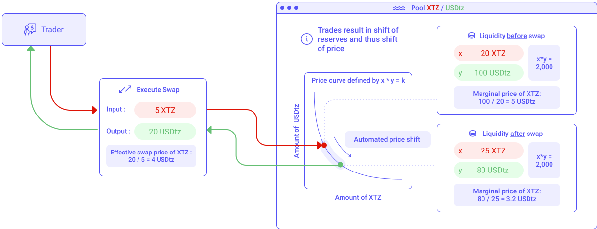

An exchange is a marketplace where coins and tokens are traded. The core function of an exchange is to ensure fair and orderly trading and the efficient dissemination of price information for any pair trading on that exchange. Exchanges give companies, traders, and crypto-enthusiasts a platform from which to sell and buy crypto-currencies publicly.

## Centralized Exchanges and Order Book
Before the _DeFi_ movement, the order book model was the usual way of making exchanges. All centralized exchanges like _Coinbase_ and _Binance_ are still currently based on this model. This is also the way traditional stock exchanges such as _NYSE_ or _Nasdaq_ work.

Simply put, traders set buy and sell orders for an asset, and the order book orders them by their prices. You can therefore trade any asset as long as there is a supply and a demand for it. 

The order book model is putting buyers and sellers in contact. Buyers try to buy the asset for the lowest possible price, whereas sellers try to sell the asset for the highest possible price.

For a trade to happen, both buyers and sellers have to converge on a price. This can happen by either a buyer bidding higher or a seller lowering their price.

For instance: _Alice has a sell order at $5.0_, and _Bob has a buy order at $4.6_. Their orders don't meet. We call the mid-market price the average point between buyers and sellers, here at $4.8 (see Fig. 1). For a trade to happen, Alice has to lower its offer to $4.6, or Bob has to increase his demand to $5.0. Another solution is to wait for another trader to bid or sell at these prices. Exchanges typically have thousands of orders in and out of their order every second, making the mid-market price move constantly.

Note that order books have existed for centuries in paper form. They are now fully automated software.

<small className="figure">FIGURE 1: Illustration of an Order Book. Buyers and sellers are meeting at the $4.80 price point.</small>

But what happens if the gap between sellers and buyers is too large and none of them want to compromise? Or what if there are not enough coins on sale to meet the demand? This is where _market makers_ come into play.

Market makers provide liquidity to the exchange by always being willing to buy or sell at the mid-market price minus a _spread_. A spread is a slight difference they take between their buying and selling offers. In our example, the mid-market price is at $4.80; a market maker would typically buy at $4.79 and sell at $4.81, making profits from the $0.02 spread.

Note that market makers need a lot of liquidity on both sides of the market to be effective. In our example, a market maker would need a lot of _XTZ_ and a lot of _USDtz_ to keep the market liquid even when demand is high on one side. Market makers essentially act as wholesalers to satisfy the market.

Spread is kept low by setting the market makers in competition with each other. Market makers also earn commissions from the exchange for providing liquidity.

## Decentralized Exchanges
### Attempts at replicating the order book model
Following the hacks of multiple centralized exchanges [[1]](/defi/dexs#references), investors started to look for alternatives. The blockchain is built around the concept of decentralization, so shouldn't exchanges be decentralized as well? 

At first, developers tried to reproduce the order book model into smart contracts [[2]](/defi/dexs#references), but this proved to be very inefficient. Indeed, this model relies heavily on market makers, and they have to constantly adjust their buy and sell prices to meet the market. Supply and demand constantly evolve on an exchange, making the mid-market price move. When that happens, market makers have to cancel their offers at the previous mid-market price and create new orders at the new mid-market price. This results in a vast number of orders and order cancellations being sent to the exchange.

Most blockchains such as Ethereum or Tezos, with their throughput of 10 transactions per second (respectively 40) and a 15 seconds block time (respectively 60) are not a viable option for an order book exchange. _Binance_, for instance, handles thousands of order book operations per second.

On top of that, every interaction with a smart contract costs a [gas fee](tezos-basics/smart-contracts), so market makers would go bankrupt just by updating their orders.

If exchanges were to thrive on the blockchain, there was a need for a new model.

### Creating a new model: Liquidity Pools and Automated Market Makers (AMM)
[Uniswap](https://uniswap.org/) was the first to propose a new exchange model based on `Liquidity Pools`. In essence, a liquidity pool holds 2 tokens. For instance, _XTZ/USDtz_ is a pool holding both _XTZ_ tokens and _USDtz_ tokens and enabling traders to swap (exchange) one for the other. Each pool represents additional pairs that can be traded, e.g., _tzBTC/XTZ_, _wXTZ/USDtz_, etc.

The most important property of a liquidity pool is to respect the notion of **constant product** ruled by the following equation:

$R_x * Ry = k$

where:
- $R_x$ is the reserve quantity of the $x$ token in the pool (e.g., _USDtz_)
- $R_y$ is the reserve quantity of the $y$ token in the pool (e.g., _XTZ_)
- $k$ is a constant

For instance, if a pool hold 20 _XTZ_ and 100 _USDtz_, its constant product is $k=2,000$. If someone wants to swap some _XTZ_ against some _USDtz_, he would have to provide tokens in a manner such that $k$ remains constant. For instance, Fig. 2 illustrates a swap where a trader provides 5 _XTZ_ to the pool. For $k$ to stay constant at 2000 considering the addition of 5 XTZ, the pool needs only to keep $2000 / ( 20 + 5 ) = 80$ _USDtz_ in reserve, meaning the trader will receive 20 _USDtz_.

The trader just got 20 _USDtz_ for its 5 _XTZ_, meaning an **effective swap price** of 4 _USDtz_ per _XTZ_.

The effective swap price is not to be mistaken with the **marginal price**, i.e., the price for an infinitesimal small trade that doesn't effectively change the amount of tokens in the pool. The following equation defines the marginal price:

$p = R_x / R_y$

where:
- $p$ is the marginal price of asset $y$ in the $x$ currency
- $R_x$ is the reserve quantity of the $x$ token in the pool (e.g., _USDtz_)
- $R_y$ is the reserve quantity of the $y$ token in the pool (e.g., _XTZ_)
  
For instance, for a pool with 20 _XTZ_ and 100 _USDtz_, the marginal price of _XTZ_ would be $100 / 20 = 5$ _USDtz_.

The difference between the effective swap price and the marginal price is referred to as _slippage_, i.e., the tendency of prices to move against a trader's actions as the trader absorbs liquidity — the larger the trade compared to the pool size, the greater the slippage.

<small className="figure">FIGURE 2: Illustration of a token Swap. The trader first sends his input tokens, then the pool computes the effective swap price by maintaining a constant product, and finally sends the output of tokens.</small>

From this, you can deduct two things :

1. You can never empty all the liquidity from a pool. As you withdraw more and more tokens from one side of the pool, the effective swap price shift toward one side of the curve in an asymptotically manner toward infinity.

2. The more liquidity a pool has, the closest the marginal price will be from the effective swap price (i.e., the lowest the slippage). Imagine a pool with 1,000,000 _USDtz_ and 200,000 _XTZ_, and thus constant $k$ equal to 200,000,000,000. The marginal price of _XTZ_ is $1000000 / 200000 = 5$ _USDtz_. If a trader inputs 5 _XTZ_, the pool needs to only keep $200000000000 / ( 200000 + 5 ) = 999975.00063$ _USDtz_ in reserve, meaning the trader will receive 24.99937 _USDtz_. The effective swap price is 4.99987 _USDtz_ and, therefore, very close to the 5 _USDtz_ marginal price. The slippage is very low.

Like centralized exchanges, liquidity providers (LP) play an essential role by providing liquidities to pools to stabilize the price. 

This is why liquidity pools are also known as _Automated Market Maker_ (AMM) because the price is automatically set based on the number of tokens currently available in the pool (and not by some arbitrary order book that represents potential order and not actual liquidity).

<small className="figure">FIGURE 3: Marginal price vs. effective swap price of two pools of different sizes.</small>

From now on, let's consider only pools with enough liquidities so that the effective swap price is almost the same as the marginal price, and only refer to it as _the price_.

## Arbitrage
Arbitrage happens when the price offered by the pool diverges from the price shown for the same pair on other platforms. In our example, the price of _XTZ_ is 5 _USDtz_. Now suppose that _XTZ_ is being traded everywhere else at 10 _USDtz_. Arbitrageurs will, therefore, immediately buy _XTZ_ from the pool at 5 _USDtz_ and resell it on other platforms at 10 _USDtz_, making profits in the process. This process will keep going until the reserves in our pool shift sufficiently to align with the rest of the market at 5 _USDtz_ per _XTZ_.

## LP tokens
When liquidity is supplied to a pool, the liquidity provider (or _LP_ for short) receives unique tokens called LP tokens in proportion to how much liquidity they provided to the pool. When a swap occurs in the pool, a 0.3% fee is proportionally distributed amongst all the LP token holders. If a liquidity provider wants to get his underlying liquidity back and any accrued fees, he must burn his LP tokens.

<small className="figure">FIGURE 4: How liquidity providers are rewarded</small>

## Different types of AMM
Contrary to popular belief, [Uniswap](https://uniswap.org) did not invent the AMM. The concept has actually been studied extensively in academic literature for over a decade [[5]](/defi/dexs#references), the majority of which were primarily designed for information aggregation and implemented in markets where payoffs depend on some future state of the world (e.g., prediction markets).

The most popular AMM is the [Logarithmic Market Scoring Rule](http://mason.gmu.edu/~rhanson/mktscore.pdf), developed in 2002 and used for most prediction markets. 

While it is true that Uniswap is an AMM, we could refer to it with more specificity as a _constant function market makers_ or _CFMMs_. CFMMs are the first class of AMMs to be applied explicitly to real-world financial markets. There are multiple types of CFMMs:

### Constant Product Market Makers
This type is the one used by Uniswap and studied so far in this chapter. A constant product function forms a curve with the desirable property of always having liquidity as prices approach infinity on both sides of the spectrum.

It is represented by $R_x * R_y = k$ for two assets, or more generally in tri-assets (or more) pools by:

$\prod_{i=1}^n R_i = k$

### Constant Sum Market Makers

A constant sum market maker is a relatively straightforward implementation of a constant function market maker, satisfying the equation $R_x + R_y = k$	 for 2 assets, or more generally in tri-assets (or more) pools by:

$\sum_{i=1}^{n} R_i = k$	

While this function produces "zero slippage", it does not provide infinite liquidity and thus is likely unfit as a standalone implementation for a decentralized exchange use case. In practice, what would happen is that any arbitrageur would always drain one of the reserves if the reference relative price of the reserve tokens is not one.

### Others
There are also _Constant Mean Market Makers_ with weighted reserves, _Hybrid CFMMs_, and so on, each trying to find specific and innovative use-cases.

## The risks of liquidity pools
Although DEXs are decentralized and trustless, keep in mind that there are always risks with smart contracts. There have been countless cases of malicious code or fatal errors in smart contracts. [In 2018, decentralized exchange Bancor was hacked and suffered a loss of $13.5M in assets before freezing funds.](https://www.zdnet.com/article/another-hack-rocks-cryptocurrency-trading-bancor-loses-23-5-million/) 

When you deposit funds into a liquidity pool, they are in the smart contract, so while there are technically no middlemen holding your funds, the contract itself can be thought of as the custodian of those funds. If there is a bug or some exploit through a flash loan, for example, your funds could be lost forever.

Also, be wary of projects where the developers have permission to change the rules governing the pool. Sometimes, developers can have an admin key or some other privileged access within the smart contract code. This can enable them to potentially do something malicious, like taking control of the funds in the pool.

If you want to provide liquidity to an AMM, make sure to become familiar with the notion of _impermanent loss_. In short, it's a loss in dollar value when providing liquidity to an AMM rather than keeping the tokens themselves as they are in your wallet (a.k.a. _HODLing_) during bull markets. [More on this here.](https://academy.binance.com/en/articles/impermanent-loss-explained)

## Conclusion
The concepts behind liquidity pools and automated market-making are pretty simple yet extremely powerful. There is no longer a need for centralized order books. The only obstacle to the development of liquidity pools remains some high gas fees and execution time. Still, as gas fees are reduced and transactions made faster with each amendment of Tezos, liquidity pools should soon become the primary way of trading on Tezos.

## Liquidity pools on Tezos
- [Dexter](https://dexter.exchange/)
- [Quipuswap](https://quipuswap.com/)

## References
[1] https://selfkey.org/list-of-cryptocurrency-exchange-hacks/

[2] https://thecontrol.co/a-comparison-of-decentralized-exchange-designs-1deef249f56a

[3] https://finematics.com/liquidity-pools-explained/

[4] http://fiquant.mas.ecp.fr/wp-content/uploads/2015/10/Limit-Order-Book-modelling.pdf

[5] http://reports-archive.adm.cs.cmu.edu/anon/2012/CMU-CS-12-123.pdf