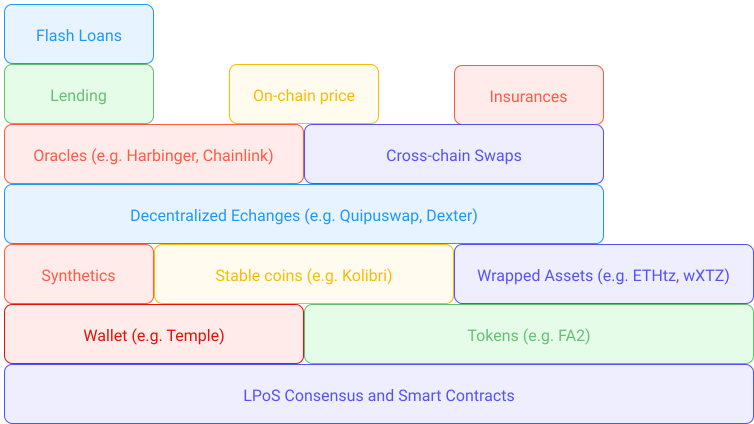

## What is _DeFi_ ?
_DeFi_ is an acronym of **De**centralized and **Fi**nance :

* The word _Finance_ refers to all the traditional financial tools and services that exist since antiquity, such as buying or selling currencies, transferring, borrowing, lending money, trading, betting, insuring, etc. Nothing new.

* The word _Decentralized_ refers to the structure of blockchain and how each protocol is running on a multitude of servers (or nodes) all over the world, guaranteeing peer-to-peer, quick, synchronized, uncensorable, immutable and non-retractable transactions. Moreover, these transactions are visible, transparent and auditable by anyone. 

These two mixed together to allow for the re-creation of financial services previously only available through banks, centralized exchanges, insurance companies, etc...
Although it started as a decentralized reproduction of the existing centralized financial models (i.e. smart contracts reproduced the order book model), it soon started to create new opportunities, that were only available through the decentralized nature of the blockchain (i.e. smart contracts creating _Automated Maket Maker_) and thus impossible to reproduce in traditional finance.

The objective of DeFi is to create added financial value accessible to everyone, decentralized, instantaneous, transparent and to cut out the middlemen, in order to execute transactions, create and manage savings, trade, and obtain returns on financial assets with no need for a central authority.

DeFi tools and services are often compared to `Money LEGOs` [[1]](/defi/introduction#references). Instead of creating an isolated software from the ground up like banks do, DeFi tools and services usually take advantage of the whole ecosystem in place, and integrate themself within them just like _LEGO_ blocks would with each other. For instance, decentralized exchanges (_DEXs_ for short) rely on tokens, stable coins and oracles, which themselves rely on smart contracts and the existing blockchain consensus. Additionally, we can find DeFi apps on top of DEXs e.g. for swapping, yield farming, lending, insurances, etc..
Just like _LEGO_ blocks, DeFi applications can layer on top of each other and build the foundation needed to create a completely decentralized financial layer — cutting out the middle man (banks, insurance companies, etc.) to reduce the costs and make the service more inclusive.

<small className="figure">FIGURE 1: Illustration of DeFi as <i>Money LEGOs</i>.</small>

## DeFi on Tezos

In this module we are going to learn more about the main areas where DeFi has been revolutionising finance [[2]](/defi/introduction#references) and what solutions have been or are currently being developed on Tezos. Mainly:

[Token Standards](/defi/token-standards): Token standards refer to the subsidiary of smart contract standards. Today, `ERC-20` is one of the most popular token standards and based on the Ethereum network. Within Tezos, the latest token standard is `FA2` and as this standard supports a wide range of token types: fungible, non-fungible, non-transferable, as well as multi-asset contracts. 

[Decentralized Exchanges](/defi/dexs): This type of exchange refers to one which enables the trading of various digital assets in a peer-to-peer form. This form bypasses the need for an intermediary or a centralized, single party. Today, you can trade tez and related FA2 supported assets on [Dexter](https://dexter.exchange/) and [Quipuswap](https://quipuswap.com/). 

[Wrapped Assets](/defi/wrapped-assets): A wrapped asset is one that allows to bridges an asset from a different native public blockchain network to the one in which it is wrapping itself into. Wrapped assets not only improve the functionality and usability of the asset to which it is wrapped to, but also opens up a wide array of higher-level financial services that hadn't been available previously. On Tezos, we’ve seen the addition of Wrapped ETH ([ETHtz](https://ethtz.io/)), Wrapped Tezos ([wXTZ](https://medium.com/stakerdao/the-wrapped-tezos-wxtz-beta-guide-6917fa70116e)), and coming in the near future, the addition of over 20 ERC-20 assets from Bender Labs. 

[Cross-Chain Swaps](/defi/cross-chain-swaps): A cross-chain swap (Atomic Swap) refers to the action of exchanging two different cryptocurrencies through a peer-to-peer form. This process enables two parties to exchange between each other trustless and w/o third-party moderation. Today, [TEZEX](https://tezex.io/) is currently in development and will enable cross-chain swaps.

[On-Chain Price Oracles](/defi/oracles): Oracles refer to the off-chain data sources that provide an answer to specific questions/information that cannot be directly obtained on-chain. Through the usage of oracles, information such as price and much more, can be obtained and trusted - through the amalgamation of multiple price feeds (oracles). On Tezos, [Harbinger oracles](https://medium.com/@Blockscale/introducing-harbinger-a-self-sustaining-price-oracle-for-tezos-7cab5c9971d) provide this service as well as Kaiko. A [Chainlink integration](https://www.coindesk.com/tezos-blockchain-chainlink-oracle-services) is expected in the near future by the SmartPy team. 

[Stablecoins](/defi/stablecoins): Stablecoins refers to assets that are typically backed by a reserve asset and offer price stability against an underwise volatile native asset. These are usually aligned with fiat currencies such as the US Dollars in order to provide a _safe haven_ against the volatility of markets. Today, Tezos offers the [Kolibri (kUSD)](https://kolibri.finance/) stablecoin (currently only on the testnet) and the [Stably (USDS)](https://www.stably.io/) which is available on the mainnet and is fully backed by fiat reserves and regulated by _Prime Trust_, a Nevada-chartered trust company that also acts as the regulated administrator of USDS. 

[Synthetics](/defi/synthetics): Synthetics are contracts between two parties that both bet on an opposite outcome for the value of an asset and then split the difference in profit/loss. The actual asset is not purchased in this contract. _SEXP_ is a synthetics exchange on Tezos, to be launching soon.

[Lending and flash loans](/defi/lending): Crypto assets sitting in a wallet don’t acquire interest. The underlying value may increase or decrease, but it is not earning anything from holding that particular cryptocurrency. This is where DeFi loans come in. DeFi allows you to lend crypto to someone else and to earn interest on your loan. Projects for lending on Tezos are currently in development including [Tezos Finance (aka "Tezfin")](https://tezos.finance/)

## References

[1] https://medium.com/coinmonks/the-building-blocks-of-decentralized-exchanges-on-defi-explained-5cd6756bd3e9

[2] https://wiki.tezosagora.org/learn/uses-of-tezos/defi

[3] https://www.latribune.fr/opinions/tribunes/qu-est-ce-que-la-defi-cette-finance-decentralisee-prete-a-changer-les-regles-du-jeu-858938.html
