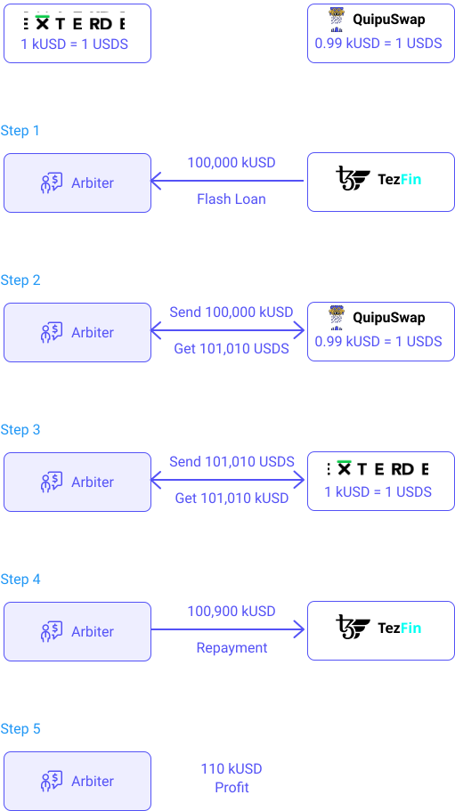

You have likely in your life had to borrow some money, e.g. for a student loan, a car loan or a mortgage. Lending and borrowing are essential services in any financial system. Traditionally, lenders such as banks provide you with a loan in exchange for a fee, in the form of interest rates. Repaying said loan is enforced by legal contracts with the bank.

Similar situations can be found on the blockchain as well. A borrower needs some money immediately available for some operation and a lender may agree to provide such a loan in exchange for a fee. 

DeFi lending allows users to become lenders or borrowers in a completely decentralized and permissionless way while maintaining full custody over their coins. 

Users, who want to become lenders, supply their tokens to a particular money market and start receiving interest on their tokens according to the current supply APY (Annual Percentage Yield). 

But how do you enforce the repayment of a loan on the blockchain? 

Each loan on the blockchain needs to be collateralized with another token. Even worse, as tokens are very volatile, blockchain loans are actually overcollateralized (often at 133%). For instance, if you want to borrow $1m in kUSD, you need to provide $1.33m in USDS as collateral. 

You may then wonder, why would anyone take a loan if they need to provide even more as collateral?

There are multiple reasons:
- They may not want to sell their original tokens. In the example above, they may not want to sell their USDS tokens (but notice that if the loan is not repaid, their USDS will be automatically liquidated to repay the loan).
//TODO: give an example of why
- Avoiding or delaying paying capital gain taxes on their tokens.
- Using borrowed funds to increase their leverage in a certain position. 
//TODO: explain

If a user decides to borrow funds, the value of the borrowed amount must always stay lower than the value of their collateral. As long as this condition holds,there is no limit on how long a user can borrow funds for.

If the value of the collateral falls below the required collateral level, the user then has his collateral liquidated in order for the protocol to repay the borrowed amount.

The interest that lenders receive and the interest that borrowers have to pay are determined by the ratio between supplied and borrowed tokens in a particular market. 

The interest that is paid by borrowers is the interest earned by lenders, so the borrow APY is higher than the supply APY in a particular market.
//TODO: I don't understand. More generally, the three paragraphs about how interests are calculated are not clear at all. It needs more explanation, maybe an example.

The interest APYs are calculated per Tezos block. Calculating APYs per block means that DeFi lending provides variable interest rates that can change quite dramatically depending on the lending and borrowing demand for particular tokens. 
//TODO: no idea why doing it per block is the reason for the dramatic changes

If a user decides to repay the borrowed amount and unlock their collateral, they also have to repay the accrued interest on their borrowed assets. The amount of accrued interest is determined by the borrowed APY and it is increased automatically with each Tezos block. 
//TODO: it makes it seem like there is some operation done at each block. I doubt that this is the case.

### Lending on Tezos
[Tezos Finance (aka "Tezfin")](https://tezos.finance/) is currently in development and will soon enable lending and borrowing of fungible Tezos crypto-assets, including tez (XTZ) and Tezos-based tokens built with the FA token standards.

Tokens supplied by lenders to the smart contract become available for other users to borrow. In exchange for the supplied tokens, the smart contract issues other tokens that represent the supplied tokens plus interest. These tokens are called _fTokens_ in _TezFin_ and they can be redeemed for the underlying tokens. 

## Flash loans
Flash loans have been popularized in 2020 and are very useful as they allow one to **borrow tokens without any collateral**. What's the catch?

**A flash loan has to be borrowed and repaid within the same blockchain transaction.** 

To understand this concept, let's recall how transactions work on Tezos.

### Transactions
A transaction represents a set of operations that must be executed in an atomic way, i.e. either all the steps are executed or the transaction is rolled back and none of the steps take place.
//TODO: this is confusing, as a transaction is also a type of operation, on Tezos.

Every operation on Tezos e.g. sending XTZ, sending FA2 tokens and interacting with smart contracts are executed within a transaction scope. 

Transactions are grouped together and included in a Tezos block. Each transaction can be observed on a block explorer such as [tzstats](https://tzstats.com/).

One Tezos transaction can consist of multiple operations organized in consecutive steps, e.g. you could supply XTZ and borrow kUSD on _TezFin_, swap half of your borrowed kUSD for USDS on _Dexter_ and provide liquidity to kUSD/USDS pool on _Quipuswap_, all in one single Tezos transaction. Now if any of these steps results in an error, the whole transaction will be rolled back and none of the steps will take place. Note that you will still pay gas fees, even for failed contract executions.  

The number of steps in a single transaction is only bounded by the gas cost, so although, in theory, you could create a valid transaction with thousands of steps, realistically it’d be rejected because of the maximum gas cost limit per block. 

Because the loan has to be repaid within one transaction, there is no risk of borrowers not repaying their borrowed amount. The only risk is the always present smart contract and platform risk.
//TODO: explain what this is

<small className="figure">FIGURE 1: Operation flow of a flash loan in case of successful repayment (green arrows) or failed repayment (red arrows)</small>

There are 3 most common use cases for flash loans. 

### Arbitrage
Arbitrage is the simultaneous purchase and sale of the same asset in different exchanges in order to profit from tiny differences in the asset's listed price. It exploits short-lived variations in the price of identical or similar financial instruments in different markets or in different forms.

Flash loans are particularly interesting for arbiters to increase profits. FIGURE 2 presents an arbitrage opportunity. Let's suppose that the price of USDS is currently 1 kUSD on _Dexter_ but 0.99 kUSD on _Quipuswap_. An arbiter would exploit the difference as follows:

- Step 1: Borrow 100,000 kUSD from TezFin
- Step 2: Exchange 100,000 kUSD against 101,010 USDS on _Quipuswap_
- Step 3: Exchange 101,010 USDS against 101,010 kUSD on _Dexter_
- Step 4: Repay the 100,000 kUSD on TezFin (plus usually a 0.09% fee making the total repayment at 100,900 kUSD)
- Step 5: Keep the remaining 110 kUSD in profits!

All these operations are included in one transaction. They either all succeed or they all fail.

<small className="figure">FIGURE 2: A typical arbitrage operation involving a flash loan.</small>

This looks pretty easy but keep in mind that arbiters still need to:
- pay network fees, which can be quite high in such complex transaction.
- take price slippage into account. (As seen in the [DEX chapter](/defi/dexs), depending on the size of your order and the liquidity present in the liquidity pool, price can change a lot)
//TODO: not clear what the issue is
- face fierce competition. Arbitrage is a well-known practice and many traders are doing it. On top of that, bots that monitor the mempool can pick up your profitable arbitrage opportunity and send the same transaction with a higher gas fee, profiting them instead of you, basically stealing your arbitrage opportunity.

### Collateral Swaps
Another application of flash loans is for collateral swaps. Let’s say you have borrowed kUSD from TezFin with XTZ as collateral. You can swap your collateral from XTZ to, for example, tzBTC in the following way:

- Step 1: Take a flash loan in kUSD to cover the amount of kUSD that was borrowed
- Step 2: Repay your TezFin loan with borrowed kUSD 
- Step 3: Withdraw your XTZ 
- Step 4: Swap your XTZ for tzBTC on Uniswap 
- Step 5: Supply tzBTC as collateral on TezFin 
- Step 6: Borrow kUSD against your tzBTC collateral 
- Step 7: Repay flash loan with borrowed kUSD + fee 
- Step 8: Congrats, you just swapped your collateral from XTZ to tzBTC and paid 0.09% of the borrowed amount for this. 

### Self-liquidation.
Finally, flash loans can also be used for self-liquidation. Let's say that you have a loan in kUSD on TezFin with XTZ as collateral. The XTZ price keeps going down and you’re approaching the liquidation level. You also don’t have or don’t want to deposit more XTZ to decrease your liquidation level and you also don’t have the kUSD required to repay the loan. Now, instead of allowing the contract to liquidate your collateral and charge you the liquidation fee, you can take the following steps:

- Step 1: Take a flash loan for the amount of kUSD that you owe
- Step 2: Repay your kUSD loan and withdraw your XTZ
- Step 3: Swap enough XTZ to kUSD in order to repay the flash loan + fees 
- Step 4: Keep the rest of your XTZ 

### Conclusion
Flash loans are useful building blocks in DeFi as they can be used for things like arbitrage, swapping collateral and self-liquidation. Of course, the concept of flash loans is quite new and there are use cases still to be discovered in the future. 

### Flash loans on Tezos
Flash loans are not yet available on Tezos but works are in progress.

## References

[1] https://tezos.finance/

[2] https://medium.com/tezosfinance/tezos-finance-on-chain-lending-f59987fbb3de

[3] https://finematics.com/lending-and-borrowing-in-defi-explained/
