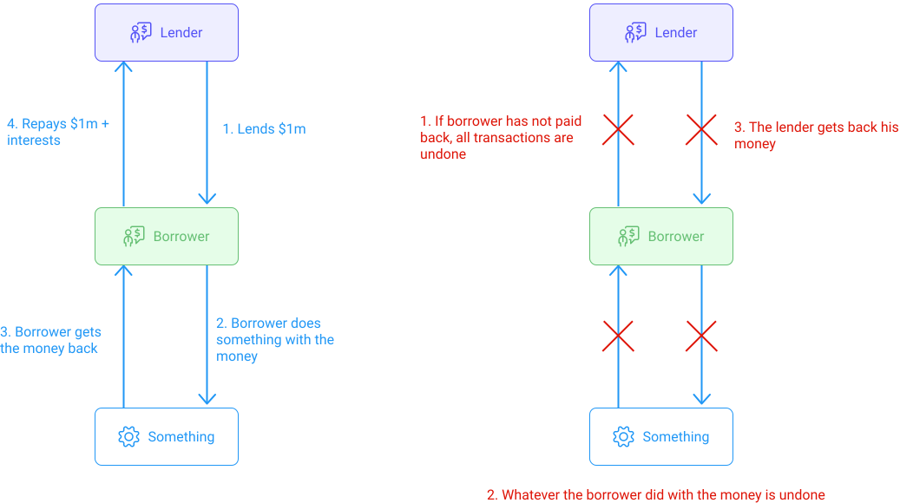

You have likely in your life had to borrow some money, e.g., for a student loan, a car loan, or a mortgage. Lending and borrowing are essential services in any financial system. Traditionally, lenders such as banks provide you with a loan in exchange for a fee in the form of interest rates. Repaying the said loan is enforced by legal contracts with the bank.

Similar situations can be found on the blockchain as well. A borrower needs some money immediately available for some operation, and a lender may agree to provide such a loan in exchange for a fee. 

## DeFi loans
### Definition
DeFi lending allows users to become lenders or borrowers in a completely decentralized and permissionless way while maintaining full custody over their coins. 

Users, who want to become lenders, supply their tokens to a particular money market and start receiving interest on their tokens according to the current supply **APY** (Annual Percentage Yield). 

But how do you enforce the repayment of a loan on the blockchain? 

Each loan on the blockchain needs to be collateralized with another token. Even worse, as tokens are very volatile, blockchain loans are over-collateralized (often at 133%). For instance, if you want to borrow $1m in USDS, you need to provide $1.33m in XTZ as collateral. 

You may then wonder, why would anyone take a loan if they need to provide even more as collateral?

There are multiple reasons:
- They may not want to sell their original tokens.
- They may want to avoid or delay paying capital gain taxes on their tokens.
- They may want to use the borrowed funds to increase their leverage in a certain position. 

### Example
For instance, Alice has 133 USDS and believes the price of XTZ will go down. How can she benefit from it? Alice takes a loan of 20 XTZ using here 133 USDS (considering $5 per XTZ plus 33% for over-collaterization). She immediately sells the 20 XTZ for 100 USDS. She now has 233 USDS (133 initially plus 100 from the sale) and owes a debt of 20 XTZ. Consider that XTZ goes down to $2. Alice buys 20 XTZ for 40 USDS, repays the 20 XTZ to the lender, and gets her 133 USDS collateral back. Alice now have $233 - 40 = 193$ USDS. She has made a $60 benefit. This whole operation is called a _short position_.

### Liquidation
As long as the value of the collateral is superior or equal to 133% of the borrowed funds, there is no limit on how long a user can keep the borrowed funds for.

However, if the value of the collateral falls below 133%, the user then has his collateral liquidated for the protocol to repay the borrowed amount.

### Interests
Borrowers pay lenders interests on their loans, plus a platform fee. The interest rate is determined by supply and demand. For instance, if many lenders are offering loans for XTZ and demand is low, interest rates are lowered to attract more demand. However, if there are few lenders but demand is high, interests are increased (lenders obviously want to earn as much money as possible). For instance, if traders believe the price of XTZ will go down, a lot of them might want to open _short positions_ as seen in the example above, and therefore increase the demand for loans.

Interests paid on loans are based on their APY. Lenders usually offer two kinds of APY :
- A variable APY, which is updated at every block depending on offer and demand.
- A much higher but stable APY that will not change during the whole period of your loan.

Variable rates may sometimes be low and attractive, but keep in mind that they can sharply move at any time. As seen above, if XRP crashes, demand for loans increases, and variable APYs can skyrocket.

For instance, if you borrow $100 for a year at a stable APY of 10%, you would pay $10 interest. Now consider borrowing at 5% APY, but after 6 months, the APY jumps to 30% for the rest of the year. You would have to pay $2.5 interest for the first 6 months and $15 for the last 6 months.

Note that interests are computed at each block, increasing your debt a little every time. If APY jumps sharply, your debt might surpass the 133% collateral limit. You must close your loan or add more collateral, or your loan will be liquidated. This is how you can get liquidated based only on accrued interests even if the tokens borrowed and used as collateral didn't change in price (typically borrowing stablecoins with stablecoins).

### Lending on Tezos
[Tezos Finance (aka "Tezfin")](https://tezos.finance/) is currently in development and will soon enable lending and borrowing of fungible Tezos crypto-assets including XTZ and Tezos-based tokens built with the FA token standards.

## Flash loans
Flash loans have been popularized in 2020 and are very useful as they allow one to **borrow tokens without any collateral**. What's the catch?

**A flash loan has to be borrowed and repaid within the same blockchain transaction.** 

To understand this concept, let's recall how transactions work on Tezos.

### Transactions
A transaction represents a set of steps that must be executed in an atomic way, i.e., either all the steps are executed, or the transaction is rolled back, and none of the steps take place.

Sending XTZ, sending FA2 tokens, and interacting with smart contracts can be steps executed within the scope of one transaction. 

Transactions are grouped and included in a Tezos block. Each transaction can be observed on a block explorer such as [tzstats](https://tzstats.com/).

On Tezos, transactions can consist of multiple consecutive steps, e.g., you could supply XTZ and borrow kUSD on _TezFin_, swap half of your borrowed kUSD for USDS on _Dexter_ and provide liquidity to the kUSD/USDS pool on _Quipuswap_ - all in one single Tezos transaction. If any of these steps result in an error, the whole transaction would be rolled back, and none of the steps would occur. Note that you would still pay gas fees. Even failed contract executions consume gas.  

The gas cost only bounds the number of steps in a single transaction. So although you could, in theory, create a valid transaction with thousands of steps, it'd be rejected because of the maximum gas cost limit per block. 

Because the loan has to be repaid within one transaction, there is no risk of borrowers not repaying their borrowed amount.

<small className="figure">FIGURE 1: Operation flow of a flash loan in case of successful repayment (green arrows) or failed repayment (red arrows)</small>

## Use cases
There are three most common use cases for flash loans:

### Arbitrage
Arbitrage is the simultaneous purchase and sale of the same asset in different exchanges to profit from tiny differences in the asset's listed price. It exploits short-lived variations in the price of identical or similar financial instruments in other markets and various forms.

Flash loans are particularly interesting for arbitrageurs to increase profits. FIGURE 2 presents an arbitrage opportunity. Let's suppose that the price of USDS is currently 1 kUSD on _Dexter_ but 0.99 kUSD on _Quipuswap_. An arbitrageur would exploit the difference as follows:

- Step 1: Borrow 100,000 kUSD from TezFin
- Step 2: Exchange 100,000 kUSD against 101,010 USDS on _Quipuswap_
- Step 3: Exchange 101,010 USDS against 101,010 kUSD on _Dexter_
- Step 4: Repay the 100,000 kUSD on TezFin (plus usually a 0.09% fee making the total repayment at 100,900 kUSD)
- Step 5: Keep the remaining 110 kUSD in profits!

All these steps are included in one transaction. They either all succeed, or they all fail.

<small className="figure">FIGURE 2: A typical arbitrage operation involving a flash loan.</small>

This process looks pretty easy, but keep in mind that arbitrageurs still need to:
- pay network fees, which can be pretty high in such complex transactions.
- take price slippage into account. (As seen in the [DEX chapter](/defi/dexs), depending on the size of your order, _marginal price_ and _effective swap price_ can be quite different, leading to possible unprofitable outcomes).
- face fierce competition. Arbitrage is a well-known practice, and many traders are doing it. On top of that, bots that monitor the _mempool_ [[4]](/defi/lending#references) can pick up your profitable arbitrage opportunity and send the same transaction with a higher gas fee, which would be inserted in a block sooner, basically stealing your arbitrage opportunity.

### Collateral Swaps
Another application of flash loans is for collateral swaps. Let's say you have borrowed kUSD from TezFin with XTZ as collateral. You can swap your collateral from XTZ to, for example, tzBTC in the following way:

- Step 1: Take a flash loan in kUSD to cover the amount of kUSD that was borrowed
- Step 2: Repay your TezFin loan with borrowed kUSD 
- Step 3: Withdraw your XTZ 
- Step 4: Swap your XTZ for tzBTC on Uniswap 
- Step 5: Supply tzBTC as collateral on TezFin 
- Step 6: Borrow kUSD against your tzBTC collateral 
- Step 7: Repay flash loan with borrowed kUSD + fee 
- Step 8: Congrats, you just swapped your collateral from XTZ to tzBTC and paid 0.09% of the borrowed amount for this. 

### Self-liquidation.
Finally, flash loans can also be used for self-liquidation. Let's say that you have a loan in kUSD on TezFin with XTZ as collateral. The XTZ price keeps going down, and you're approaching the liquidation level. You also don't have or don't want to deposit more XTZ to decrease your liquidation level and you also don't have the kUSD required to repay the loan. Now, instead of allowing the contract to liquidate your collateral and charge you the liquidation fee, you can take the following steps:

- Step 1: Take a flash loan for the amount of kUSD that you owe
- Step 2: Repay your kUSD loan and withdraw your XTZ
- Step 3: Swap enough XTZ to kUSD to repay the flash loan + fees 
- Step 4: Keep the rest of your XTZ 

### Conclusion
Flash loans are helpful building blocks in DeFi as they can be used for things like arbitrage, swapping collateral, and self-liquidation. Of course, the concept of flash loans is relatively new, and there are use cases still to be discovered in the future. 

### Flash loans on Tezos
Flash loans are not yet available on Tezos, but works are in progress.

## References

[1] https://tezos.finance/

[2] https://medium.com/tezosfinance/tezos-finance-on-chain-lending-f59987fbb3de

[3] https://finematics.com/lending-and-borrowing-in-defi-explained/

[4] A pool (set) of operations maintained by a node and not yet included in a block.

