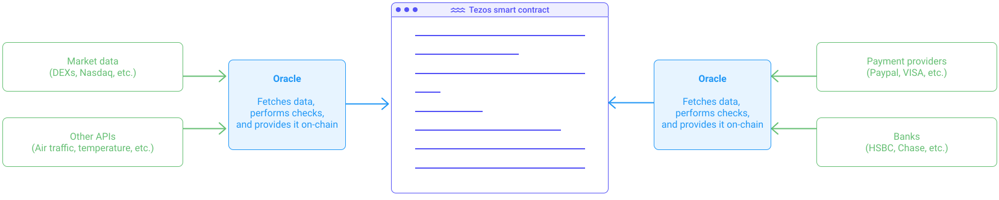
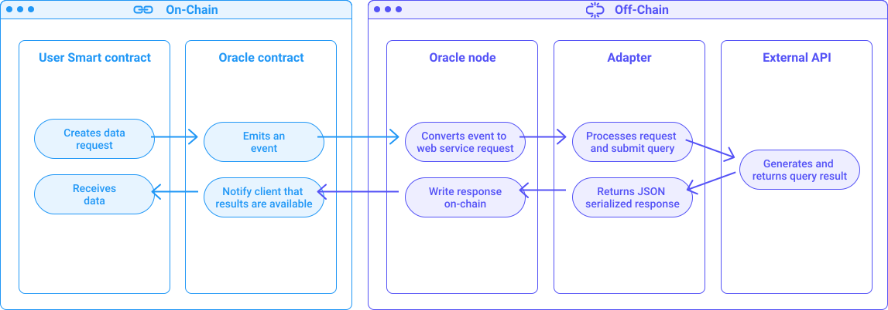
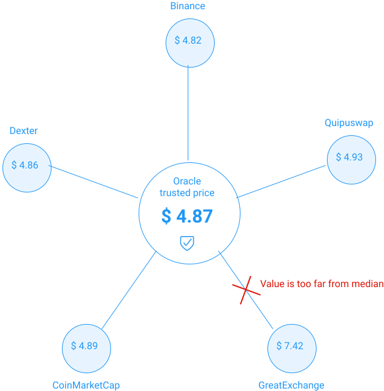

## Definition
With the rise of DeFi apps, the need to get trusted price data has grown substantially. The only issue is that a Tezos smart contract cannot receive any data from outside the blockchain by default. **Oracles**, therefore, offer a way to obtain data from off-chain sources and make it available on-chain. 

<small className="figure">FIGURE 1: Illustration of an oracle providing online data to a smart contract.</small>

## How it works
An oracle is made of multiple pieces of software, both on-chain, and off-chain.

<small className="figure">FIGURE 2: Data flow of an oracle request. In blue are on-chain entities and in purple are off-chain entities.</small>

When in need of some off-chain data, your smart contract will call the  **oracle smart contract** with an API URL to be fetched. The oracle smart contract will emit a **event** that can be detected by an off-chain architecture connected to a blockchain node. Typically an **oracle node** will pick up such event and process it to create a **web service request**. For simple HTTP API requests, the oracle node can fetch the data itself. For more complex tasks or requests, an _adapter_ might be needed. An adapter is simply some software running on a server capable of executing complex tasks. Oracle nodes have a set of pre-determined available operations, e.g., fetch an API, parse a string, generate a random number, etc. Anything out of these simple operations will require a developer to code an adapter tailored to the specific needs. In this case, the adapter will fetch the external API, make operations on it, and then send back the data in serialized format (typically in JSON) to the oracle node. As the oracle node is connected to a blockchain node, it can send data to the oracle smart contract. The user smart contract can then retrieve the data from the oracle smart contract.

Fig. 2 represents the complete data flow. To learn more, you can [check out this white paper](https://arxiv.org/pdf/2004.07140.pdf). Note that this is one way to implement oracles, there are multiple other ways with different features [[5]](/defi/oracles#references).

## Aggregators
Oracles can aggregate data from multiple sources to guarantee the quality of the data. For instance, consider a decentralized application (Dapp) that needs the exchange rate of XTZ/BTC to perform some trading operation. The smart contract has to contact an oracle that can provide such information to get that exchange rate. The oracle can, for instance, fetch the exchange rate from _Binance_ and offer it as is to the smart contract. However, what happens if _Binance_ gets hacked? The Dapp would be compromised as well. An oracle can therefore fetch the price from multiple sources. e.g., _Binance_, _CoinMarketCap_, _Dexter_ and _Quipuswap_, then compute the median and exclude outliers (prices that are too far from the others are likely from a compromised source). The chances that all four sources are compromised at the same time are improbable. The price provided to the Dapp is therefore very trustworthy and can be used for financially critical operations. Notice also that price feeds can be signed in order to guarantee the source of the data.

<small className="figure">FIGURE 3: Illustration of an oracle filtering outliers.</small>

Note that Oracles are not limited to fetching price data. Any online API can be called on by an Oracle, e.g., payment data (Paypal, VISA), bank data, air traffic schedules, IoT data, weather forecasts, etc. Some applications even provide on-chain insurances based entirely on real-world data fetched by oracles.

## Oracles on Tezos
On Tezos, [Harbinger oracles](https://github.com/tacoinfra/harbinger) provide this service as well as [Kaiko](https://www.kaiko.com/). A [Chainlink integration](https://www.coindesk.com/tezos-blockchain-chainlink-oracle-services) is expected soon by the _SmartPy_ team. 

## References

[1] https://github.com/tacoinfra/harbinger

[2] https://medium.com/@Blockscale/introducing-harbinger-a-self-sustaining-price-oracle-for-tezos-7cab5c9971d

[3] https://www.kaiko.com/

[4] https://arxiv.org/pdf/2004.07140.pdf

[5] https://medium.com/fabric-ventures/decentralised-oracles-a-comprehensive-overview-d3168b9a8841