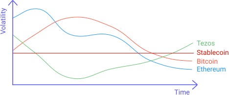
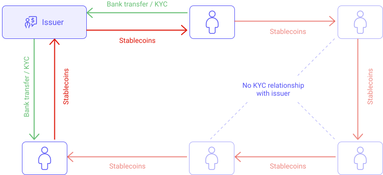
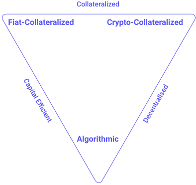

A **stablecoin** is a cryptocurrency whose price is fixed to another asset. Most stablecoins are pegged (fixed) to fiat currencies (currencies issued by a central bank) like the US Dollar. 

<small className="figure">FIGURE 1: Illustration of a stablecoin volatility compared to his pegged asset (e.g. USD).</small>

Stablecoins have gained traction as they attempt to offer the best of both worlds: the instant processing, security and privacy of cryptocurrencies, and the 'volatile free' stable valuations of fiat currencies.

## Stablecoins on Tezos

Today, Tezos offers the [Kolibri (kUSD)](https://kolibri.finance/) stablecoin (currently only on the testnet) and the [Stably (USDS)](https://www.stably.io/) which is available on the mainnet and is fully backed by fiat reserves and regulated by _Prime Trust_, a Nevada-chartered trust company that also acts as the regulated administrator of USDS. 

## How it works?

Stablecoins achieve their price stability via **collateralization** (backing) or through **algorithmic mechanisms** of buying and selling the reference asset or its derivatives. There are 3 types of stablecoins:

### Fiat-Collateralized Stablecoins
Fiat-collateralized stablecoins are backed by centralized entities that guarantee an exchange rate at the same price as the asset (minus potential fees). They mint new stablecoins when they receive fiat and burn stablecoins when they giving back fiats. In the case of Kolibri and Stably, they guarantee that you can always exchange 1 kUSD (respectively 1 USDS) against 1 USD, and the other way around. These entities are regularly audited to guarantee that they always have enough reserves to meet the demand. However, these entities are single points of failures and they are not decentralised.

Note that to exchange with these entities, you will have to pass a KYC (Know-your-customer) as illustrated in FIGURE 2.

<small className="figure">FIGURE 2: Exchanges with an issuer are secured by a KYC. Exchanges between users have no KYC..</small>

### Crypto-Collateralized Stablecoins
Crypto-collateralized stablecoins are backed by other cryptocurrencies. The stablecoins are minted or burned by automated smart contracts, making them fully decentralised. However, since the reserve cryptocurrency may also be prone to high volatility, such stablecoins are "over-collateralized", meaning a much larger number of cryptocurrency tokens is maintained as reserve, compared to the provided stablecoins. These are not capital efficient.

There are currently no Crypto-Collateralized Stablecoins in operation on Tezos but some are in development.

### Non-Collateralized (algorithmic) Stablecoins
Non-collateralized stablecoins don’t use any reserve but rely on an algorithm that will automatically burn tokens when supply is high to decrease the price, or mint new tokens when supply is low to increase the price, much like central banks are doing to maintain valuations of a fiat currency. It can be achieved by implementing a smart contract on a decentralized platform that can run in an autonomous manner.

There are currently no Algorithmic Stablecoins on Tezos.

<small className="figure">FIGURE 3: Recapitulation of the 3 types of stablecoins.</small>

## References

[1] https://www.investopedia.com/terms/s/stablecoin.asp

[2] https://kolibri.finance/

[3] https://www.stably.io/
