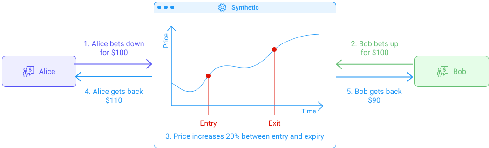

Synthetics are contracts between two parties that both bet on the opposite outcome of the value of an asset and then split the difference in profit/loss. The actual asset is not purchased in this contract. Both parties simply bet on the value appreciating or depreciating.

Example: Alice and Bob both send $100 in value to a contract, making the total value of the contract $200. Alice and Bob decide that the contract represents a BTC/USD value. Alice bets that the BTC price will go up, and Bob bets that the BTC price will go down. They agree on an expiry date for this bet. Since this is a synthetic contract, no BTC is actually bought. All they do is take the current USD price of BTC as a starting point, place their bets and wait until the expiry date.

If the value of BTC goes up 20% in the set period of the bet, Alice's $100 should now be worth $120. As agreed on, Alice and Bob split the difference. Alice gets $100 + ($20/2) = $110 and Bob gets $100 - ($20/2) = $90. (If the value of BTC goes up more than 100%, Alice gets $200 and Bon $0.)

Simple as that. **This is how you speculate on the price of BTC without buying any BTC.**

Conversely, if the value of BTC goes down 20% in the set period of the bet, Alice's $100 should now be worth $80. As agreed on, Alice and Bob split the difference. Alice gets $100 - ($20/2) = $90 and Bob gets $100 + ($20/2) = $110.

As you don't actually purchase the asset, synthetics are particularly interesting for assets that have very low liquidity, are hard to transact, or are simply not available to trade.

<small className="figure">FIGURE 1: Illustration of the synthethic contract between Alice and Bob</small>

## Synthetics & Blockchain
Synthetics have existed way before their use in blockchain, but it is unlikely you have heard of them before. Why? Because without blockchain, synthetics are "paper bets" only enforceable by legal contracts that are difficult and expensive to set up. That's why only banks and big investment firms were able to use synthetics so far. Now that the outcomes of the bets can be settled and enforced automatically through smart contracts, anyone can easily get access to synthetic investments.

Of course, it would be pretty tricky for you to find another person willing to open a synthetic option with you on your own, which is why you still need an exchange to put you in contact with other traders and to provide an easy-to-use interface. However, remember that synthetics are peer-to-peer, so the exchange should not have any access to your tokens.

## Synthetics Vs. Wrapped Asset
_Synthetics_ are not to be confused with _Wrapped Assets_. As seen in the [previous chapter](/defi/wrapped-assets), a wrapped asset represents the actual asset and can be exchanged 1:1 against that asset. A synthetic represents your share of a bet against the other players. Anything can be bet upon, as long as you have an oracle that updates its price in the synthetic smart contract. We could imagine synthetics been used on stocks like Apple, Tesla, etc.

## Risks
As for any trading, synthetics are risky in their nature. You can lose your investment if the asset you bet on goes the opposite way of your bet.

Note that to settle the bet, synthetics contracts use [orcales](/defi/orcales) to fetch the underlying asset's price. There have been [countless oracle incidents](https://blog.synthetix.io/response-to-oracle-incident/) where the asset price in the smart contract loses its peg to the actual asset.

## Synthetics on Tezos
[_SEXP_](https://www.publish0x.com/publish0x-posts/sexp-a-tezos-based-synthetic-exchange-xmkjjzq) is a synthetics exchange on Tezos currently in development. _SEXP_ will use Harbinger oracles and use Tezos staking rewards to provide an entirely free service. The token standard will be [FA2](/defi/token-standards), and the web app will work with all wallets that support [Beacon](https://www.walletbeacon.io/).

## References

[1] https://www.publish0x.com/publish0x-posts/sexp-a-tezos-based-synthetic-exchange-xmkjjzq
