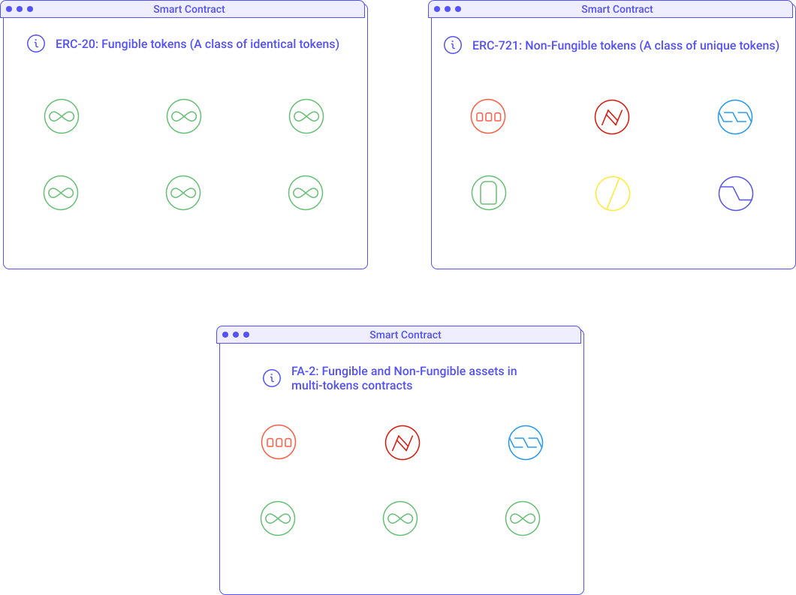

import NotificationBar from '../../src/components/docs/NotificationBar';

`Tokens` are the basis of _Decentralized Finance_, just like _Fiat currencies_ (e.g. USD, EUR) are the basis of traditional finance. They represents a way to exchange value. However contrary to traditional finance, tokens can represent much more than a simple currency. Tokens can represent any type of virtual or physical asset or value. For instance, real-estate which has so far always been a illiquid market can now be tokenized and traded on exchanges. Tokens can also enclose collectibles or luxury items such as art. They can enclose traditional finance products like equity, stocks, bonds, etc. In this chapter, we will see the implementation of tokens in Tezos and how they are the future of finance.

<NotificationBar>
  
"Everything will be tokenized and connected by a blockchain one day."
   Fred Ehrsam (Co-founder of Coinbase)

</NotificationBar>

## Tokens on Tezos

Today, [ERC-20](https://ethereum.org/en/developers/docs/standards/tokens/) on Ethereum is the most popular token standards. ERC-20 is an interface to build _Fungible Tokens_, i.e. a class of identical tokens. For instance, two XTZ tokens are identical. Two cans of the same soda brand could also be considered fungible items. One is exactly the same as the other.

However, a concert ticket at the front row is obviously not equivalent to a concert ticket at the last row. Theses tickets are part of the same class (concert tickets) but they are not interchangeable: They are non-fungible. Two pieces of art are also non-fungible. The ownership of these such asset can be enclosed in a _Non-Fungible Token_ (or _NFT_ for short) and bought, sold, exchanged like any other token. NFTs are particularly interesting for collectibles as their scarcity can be provably demonstrated on the blockchain. Owners can prove that they have the only copy that exists in the world.

NFTs have additionally been used to represent the right to own, use, and exchange digital art collectibles, multimedia, in-game assets, permissions, insurance, and much more [[1]](/defi/token-standards#references). [ERC-721](https://ethereum.org/en/developers/docs/standards/tokens/) is the most popular NFT token standard on Ethereum.

Within Tezos, the latest token standard is `FA2` (standing for Financial Application 2) and this standard supports a wide range of token types: fungible, non-fungible, non-transferable, as well as multi-asset contracts. This standard is the successor to FA1.2 that only supports fungible tokens but is still widely used in the Tezos DeFi ecosystem.

<small className="figure">FIGURE 1: Illustration of the FA2 token standard.</small>

Many considerations weigh on the implementer of a token contract. Tokens might be fungible or non-fungible. A variety of transfer permission policies can be used to define how many tokens can be transferred, who can perform a transfer, and who can receive tokens. A token contract can be designed to support a single token type (e.g. ERC-20 or ERC-721) or multiple token types (e.g. ERC-1155) to optimize batch transfers and atomic swaps of the tokens.

The FA2 standard aims to provide significant expressivity to contract developers to create new types of tokens while maintaining a common interface standard for wallet integrators and external developers.

A particular FA2 implementation may support either a single token type per contract or multiple tokens per contract, including hybrid implementations where multiple token kinds (fungible, non-fungible, non-transferable etc) can coexist (e.g. in a fractionalized NFT contract) [[2]](/defi/token-standards#references).

To learn more on how to implement FA2 tokens, please refer to the [official documentation](https://gitlab.com/tzip/tzip/-/blob/master/proposals/tzip-12/tzip-12.md).

## Non-Fungible Tokens on Tezos

### Examples [[3]](/defi/token-standards#references)

- **Digital Art and Multimedia:** The value of a piece of art is derived from its uniqueness and provenance - knowing that it came from a particular creator and that there is a single edition. NFTs provide a means to link digital art to a token, trace the provenance back to the art's creator, and even an easy means to buy and sell the art. NFTs are flexible enough to represent digital art, music, and even video, all of which are tied to the token via metadata.

- **Collectibles and Gaming:** NFTs present a unique opportunity for digital collectibles such as memorabilia and trading cards because they provide provable scarcity. For example, an NFT representing a digital twin of an article of sports memorabilia is accurate in that there is only one of that object with the correct lineage and provenance available. Additionally, collectibles such as in-game items for video games are also great examples of use-cases for NFTs, as the items can be ported across games and traded instantly in secondary marketplaces outside of one single game.

- **Tickets:** Since tickets to events are typically unique objects with individual serial numbers, they can be represented digitally as NFTs. Representing tickets as NFTs also prevents counterfeiting, as each NFT is a unique digital object that can't be copied due to an immutable record of provenance. Additionally, representing tickets as NFTs creates transparent aftermarkets which can curb scalping for exorbitant prices.

### Standards and Resources

- **[FA2](https://gitlab.com/tzip/tzip/-/blob/master/proposals/tzip-12/tzip-12.md)** - a standard for a unified token contract interface, supporting a wide range of token types and implementations.
- **[tzNFT](https://github.com/tqtezos/nft-tutorial)** - a tutorial showing users how to originate and interact with the FA2 NFT contract implementation.
- **[TZIP-021](https://gitlab.com/tzip/tzip/-/blob/tzip-21-spec/proposals/tzip-21/tzip-21.md)** - an emerging contract multimedia metadata standard.

## Tools and Applications

- **[Kalamint](https://kalamint.io/)** - A community owned NFT marketplace on Tezos.
- **[OpenMinter](https://github.com/tqtezos/minter)** - A reusable dApp that allows anyone to create and collect NFTs on Tezos.

## Tokenization

Asset tokenization refers to the collective term of converting both physical and non-physical assets into digital ones. [[4]](/defi/token-standards#references)

Physical and real-world assets like real estate or luxury items such as art, collectibles or more can be tokenized onto a blockchain. These real-world assets can stem from real-estate, equity, stocks, bonds, and more.

These types of assets pose numerous benefits as per their utility token counterparts. The benefits associated thereof are a reduction in transaction costs, enabling of cross-border settlement, automation, and allowance of the enforcement and restrictions within the underlying technology dissuading the need for legal systems.

Security tokens (see STO’s) allow stranded assets to be liquified and traded in real-time. Real estate is an asset notoriously difficult to extract capital from; you essentially have to either sell the asset or get a bank loan against it. If you securitize such a stranded asset, you can immediately trade it (make the capital flow out of and into it).
Real-time pricing of stranded assets is notoriously difficult to gauge because it’s not like a skyscraper gets bought and sold several times a day so that you can see how much your skyscraper in the neighborhood is worth. So, knowing the true price of stranded assets is difficult. By tokenizing, you sort out the real price.

### Standards and Resources

- FA2: A standard for a unified token contract interface, supporting a wide range of token types and implementations.
- [NyX Standard](https://gitlab.com/equisafe/nyx): A set of digital contracts standards, designed for issuers and buyers of financial instruments, to be used on the Tezos blockchain.

### Benefits of Tokenization on Tezos

**Institutional-grade smart contracts** — Tezos utilizes formal verification, a process that proves the mathematical correctness of the code. The Tezos blockchain allows for the facilitation of formally-verified smart contracts. Essentially, prior to sending $1 billion over the blockchain, one can run a formal test to simulate the transaction and ensure it will execute smoothly. The kind of smart contract language Tezos has built allows one the discipline to mathematically prove a contract (off-chain, during its development) before putting it on-chain. So, formal verification is a practice one does. Other chains, like Cardano, will similarly allow formal verification. So why does Tezos makes such a big deal out of it? Because Tezos aims to be a high-security, high-value chain and wants to make rigor and safety key practices. In other words, formal verification within Tezos strides to be cultural.

**Secure custody** — Within the Tezos client software, it includes a formally-verified multi-signature contract. This allows for cold-storage deployment and management of smart contracts for the highest level of security. This, when aiming to be a highly complex, high-value blockchain, is crucial in storing and deploying large amounts of capital over the blockchain.

**Upgradeability** — Tezos features a formal mechanism by which network participants are able to upgrade the protocol through a formal amendment process. Essentially, any of the newest features/tech that emerges can be ported onto the Tezos protocol via on-chain governance. This feature will allow Tezos to last much longer and be able to evolve and continuously adapt to changing times.

## References

[1] https://finematics.com/what-are-nfts-and-how-can-they-be-used-in-defi/

[2] https://gitlab.com/tzip/tzip/-/blob/master/proposals/tzip-12/tzip-12.md

[3] https://wiki.tezosagora.org/learn/uses-of-tezos/nft

[4] https://wiki.tezosagora.org/learn/uses-of-tezos/tokenization
