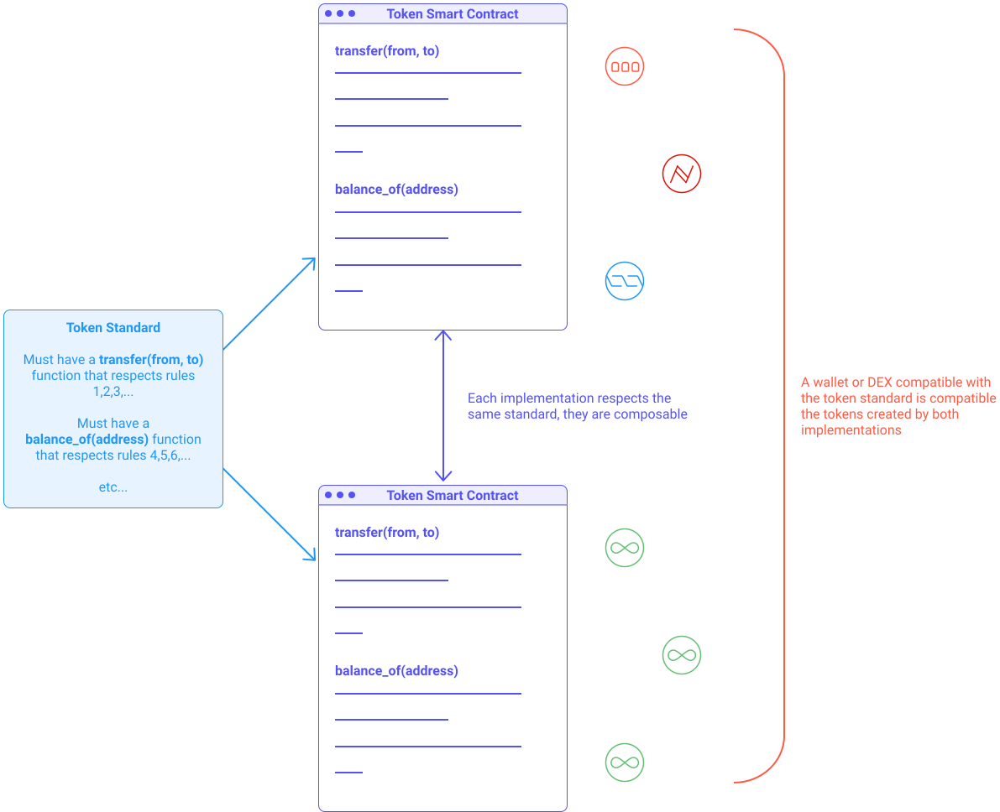

import NotificationBar from '../../src/components/docs/NotificationBar';

In the Blockchain ecosystem, any digitally transferable asset between two people is called a **token**. Tokens can be native to a blockchain, e.g., BTC is the native token of Bitcoin or tokens can also be created and hosted on an existing blockchain via a smart contract. Some tokens, called [stablecoins](/defi/stablecoins), follow the price of fiat currencies (e.g., USD, EUR). Others, called _NFT_, can represent collectables or art pieces. Finally, tokens can represent rights of ownership of real-world estates or companies (i.e., [stock tokens](https://www.binance.com/en/stock-token)). In this chapter, we will see the main types of token and the token standards on Tezos.

<NotificationBar>
  
"Everything will be tokenized and connected by a blockchain one day."
   Fred Ehrsam (Co-founder of Coinbase)

</NotificationBar>

## Token standard
A token standard is an interface, and a set of rules, that a smart contract must respect to be compatible with the common standards. Typically, token standards define how tokens can be transferred and keep a consistent record of those transfers among tokens in the Tezos network.

Multiple implementations of a standard can co-exist, but they must all respect the interface and rules of the standard. Standards ensure that smart contracts remain compatible, so for instance, when a new project issues a token, it remains compatible with the existing decentralized exchanges, wallets, etc.

<small className="figure">FIGURE 1: Illustration of 2 implementations of the same token standard</small>

## Fungible & Non-Fungible Tokens
The most basic token is the _Fungible Token_, i.e., a class of identical, interchangeable tokens. For instance, two _XTZ_ tokens are identical and interchangeable, just like a US dollar is identical and interchangeable with another US dollar. Both are exactly the same as the other.

However, a token can represent much more than a fungible asset. For instance, a concert ticket in the front row is obviously not equivalent to a concert ticket in the last row. These tickets are part of the same class (i.e., concert tickets), but they are not interchangeable: they are non-fungible. Two pieces of art are also non-fungible. The ownership of these assets can be coded with a _Non-Fungible Token_ (or _NFT_ for short) and then bought, sold, exchanged, etc., just like any other token. NFTs are particularly interesting as collectables as their scarcity can be demonstrated and proven by the blockchain (i.e., an owner can prove that he has the only copy in the whole world.)

## Token standards on Tezos
On Tezos, the latest token standard is [FA2](https://gitlab.com/tzip/tzip/-/blob/master/proposals/tzip-12/tzip-12.md) (standing for _Financial Application 2_). It supports a wide range of token types: 
- fungible (equivalent to [ERC-20](https://ethereum.org/en/developers/docs/standards/tokens/) on Ethereum),
- non-fungible (equivalent to [ERC-721](https://ethereum.org/en/developers/docs/standards/tokens/) on Ethereum),
- non-transferable (equivalent to [ERC-1238](https://ethereum.org/en/developers/docs/standards/tokens/) on Ethereum),
- as well as multi-asset contracts (equivalent to [ERC-1151](https://ethereum.org/en/developers/docs/standards/tokens/) on Ethereum).

As you can see, FA2 is a very powerful standard that allows for many forms of tokens. It aims to provide significant expressivity to contract developers, allowing them to create new types of tokens while maintaining a common interface standard for wallet integrators and external developers. A variety of transfer permission policies can also be defined, such as how most tokens can be transferred, who can perform a transfer, and who can receive tokens. A token contract can be designed to support a single token type or multiple token types to optimize batch transfers and atomic swaps. A particular FA2 implementation may include hybrid implementations where multiple token kinds (fungible, non-fungible, non-transferable etc) can coexist (e.g. in a fractionalized NFT contract) [[2]](/defi/token-standards#references).

Note that FA2 is the successor to [FA1.2](https://assets.tqtezos.com/docs/token-contracts/fa12/1-fa12-intro/) that only supports fungible tokens, it is still widely used in the Tezos ecosystem. 

<small className="figure">FIGURE 2: Illustration of the multi-purposes aspect of the _FA2_ token standard.</small>

To learn more on how to implement FA2 tokens, please refer to the [official documentation](https://gitlab.com/tzip/tzip/-/blob/master/proposals/tzip-12/tzip-12.md).

## Regulations
If you plan to create a token, make sure to check the regulations in your country. There are rules to respect depending on the type of token you are creating, its representation, and the taxes to be paid. [Here is an example of regulations in Europe.](http://thinkblocktank.org/wp-content/uploads/2019/08/thinkBLOCKtank-Token-Regulation-Paper-v1.0-Part-C.pdf)

## Risks
Always be cautious as anyone can create tokens on Tezos. Before purchasing a token, make sure to question its value. Is the smart contract of the token open-source? Has it been audited? Is there a hard cap? Indeed, any rule regarding creating tokens or their transfer can be coded into the smart contract. For instance, uncapped tokens could be infinitely minted by their author, rendering their value null.

<NotificationBar>
  
Keep in mind that holding a token in your wallet doesn't, in itself, guarantee that your token is safe. Indeed, holding a token means that the token's smart contract holds a record that associates your public address with a balance. If the smart contract is malicious or has bugs, that record could be altered, erased, or frozen, making your tokens unusable even if they are in your wallet.

</NotificationBar> 

## Resources on Tezos
- **[FA2](https://gitlab.com/tzip/tzip/-/blob/master/proposals/tzip-12/tzip-12.md)**: The latest token standard as explained above.
- **[tzNFT](https://github.com/tqtezos/nft-tutorial)**: A tutorial showing users how to originate and interact with the FA2 NFT contract implementation.
- **[TZIP-21](https://gitlab.com/tzip/tzip/-/blob/master/proposals/tzip-21/tzip-21.md)**: an emerging contract multimedia metadata standard.
- **[Kalamint](https://kalamint.io/)**: A community owned NFT marketplace on Tezos.
- **[OpenMinter](https://github.com/tqtezos/minter)**: A reusable Dapp that allows anyone to create and collect NFTs on Tezos.
**[NyX Standard](https://gitlab.com/equisafe/nyx)**: A set of digital contracts standards, designed for issuers and buyers of financial instruments to be used on the Tezos blockchain.

## To go further
Check out the article on [NFTs on Tezos Agora](https://wiki.tezosagora.org/learn/uses-of-tezos/nft) and about [Tokenization](https://wiki.tezosagora.org/learn/uses-of-tezos/tokenization) to learn more.

## References

[1] https://finematics.com/what-are-nfts-and-how-can-they-be-used-in-defi/

[2] https://gitlab.com/tzip/tzip/-/blob/master/proposals/tzip-12/tzip-12.md

[3] https://wiki.tezosagora.org/learn/uses-of-tezos/nft

[4] https://wiki.tezosagora.org/learn/uses-of-tezos/tokenization

[5] https://www.binance.com/en/stock-token
