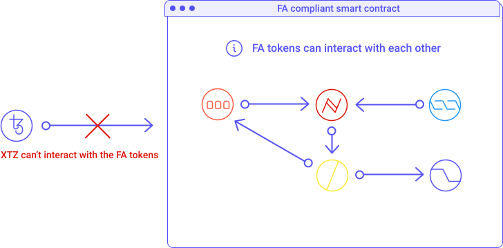
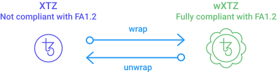
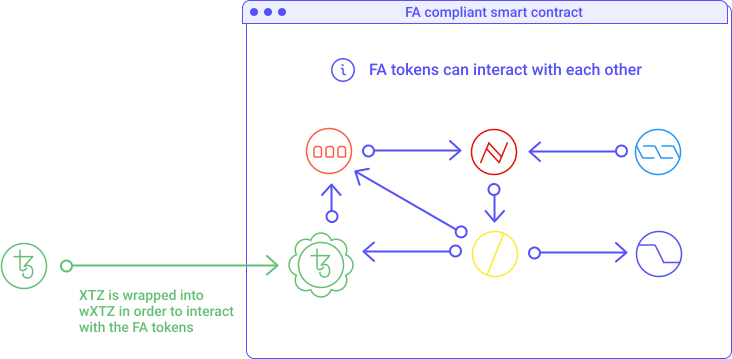

## Wrapped XTZ
Let's consider the following facts:

- XTZ is the native currency built on the Tezos blockchain.

- When a dApp (decentralized application) is built from the Tezos Blockchain, it usually either implements its form of token or needs to work with existing tokens, both being based on [FA standards](/defi/token-standards). 

- The _FA1.2_ and _FA2_ standards define how tokens are transferred and how to keep a consistent record of those transfers among tokens in the Tezos network. FA standards were developed after the release of XTZ.

Now here is the issue: **XTZ doesn't conform to its own FA standards**. 

Indeed, XTZ is the proto-token of the Tezos Blockchain, i.e., it was built before the FA standards existed. This makes XTZ not compliant with the FA standards used by most Dapps, e.g., DEXs, NFT marketplaces, etc. 

<small className="figure">FIGURE 1: XTZ can't interact with FA tokens</small>

One solution consists of _wrapping_ XTZ into an FA-compliant token called _wXTZ_. Wrapping XTZ allows you to trade directly with alt tokens. You need wXTZ to be able to trade XTZ for other FA tokens on decentralized platforms like _Dexter_ and _Quipuswap_. Because decentralized platforms running on Tezos use smart contracts to facilitate trades directly between users, every user needs to have the same standardized format for every token they trade. This ensures tokens don't get lost.

<small className="figure">FIGURE 2: Wrapping XTZ and unwrapping wXTZ</small>

When you "wrap" XTZ, you aren't really wrapping so much as trading XTZ for an equal token called wXTZ via a smart contract. If you want to get plain XTZ back you need to "unwrap" it, i.e., trade it back for XTZ.

In practice, when wrapping, your XTZ are stored in a smart contract, and an equal amount of wXTZ is minted by the contracts and transferred to you. When unwrapping, your wXTZ are burned (a.k.a. destroyed), and some XTZ are released and sent back to you.  

<small className="figure">FIGURE 3: wXTZ can interact with other FA tokens</small>

## Properties of wXTZ
wXTZ has been developed by [Stove Labs](https://github.com/stove-labs) with the following properties [[1]](/defi/wrapped-assets#references):

- **Liquid**: wXTZ are liquid and may be used as a standard developer building block (FA1.2) for Tezos DeFi and to participate in DeFi systems on Tezos.

- **Collaterized**: Each wXTZ token is collateralized with 1 Tez (XTZ).

- **Rewards**: Locked XTZ generates staking rewards from the baker of users' choice.

- **Secure**: The suite of wXTZ contracts is audited by [Trail of Bits](https://www.trailofbits.com/) and managed by [StakerDAO](https://www.stakerdao.com/).

- **Fees**: Interacting with wXTZ has no fee by [StakerDAO](https://www.stakerdao.com/) during the launch phase (contracts interaction requires only the standard network fees on the Tezos network). Changes to the fee structure will be managed by the _StakerDAO_ governance process.

- **Non-custodial**: XTZ locked in that smart contract to mint wXTZ are only redeemable by the user himself. No one can move or touch these tokens until the user burns its wXTZ and gets his XTZ back.

Please refer to their [medium article](https://medium.com/stakerdao/the-wrapped-tezos-wxtz-beta-guide-6917fa70116e) to learn more about wXTZ and get started.

## Other wrapped assets
wXTZ is not the only wrapped asset on Tezos. One may want to interact with Ethereum or Bitcoin from a Tezos Smart contract. A wrapped asset can bridge an asset from a different native public blockchain network to the one in which it is wrapping itself. 

[StableTech](https://stable.tech/) has created [Wrapped ETH (ETHtz)](https://decrypt.co/51860/wrapped-eth-comes-to-tezos-as-it-takes-on-ethereum-defi-market) which is an FA1.2 token with a price pegged to ETH. ETHtz can be used on Tezos for exchanges or DeFi service while taking advantage of Tezos's much lower fees than Ethereum.

[Wrapped Bitcoin (tzBTC)](https://tzbtc.io/) is another wrapped asset on Tezos pegged to BTC. tzBTC is also implemented using the FA1.2 asset standard on Tezos.

[Bender Labs](https://www.benderlabs.io/wrap) will soon offer to wrap ERC-20 and ERC-721 tokens from Ethereum to Tezos. This work by locking the token in a smart contract an Ethereum then minting corresponding tokens on a smart contract on Tezos. Both contracts can communique with each other using an [oracle](/defi/oracles) bridge. When the token is burned on Tezos, the oracle informs the smart contract on Ethereum to release the corresponding tokens.

This way, one can use the consensus mechanism and specific infrastructure of Tezos to use assets or information stored with both Tezos and Ethereum.

## Conclusion
Wrapped assets not only improve the functionality and usability of the asset it wraps, it also opens up a wide array of higher-level financial services that wouldn't be available otherwise. 

On Tezos, we've seen the addition of [Wrapped XTZ (wXTZ)](https://medium.com/stakerdao/the-wrapped-tezos-wxtz-beta-guide-6917fa70116e), [Wrapped Bitcoin (tzBTC)](https://tzbtc.io/), [Wrapped ETH (ETHtz)](https://decrypt.co/51860/wrapped-eth-comes-to-tezos-as-it-takes-on-ethereum-defi-market) and the addition of ERC-20 and ERC-721 assets from [Bender Labs](http://www.benderlabs.io/) coming in the [near future](https://cryptoslate.com/20-ethereum-erc-20-tokens-will-be-coming-to-tezos-xtz-defi-in-q1-2021/).

## References 

[1] https://medium.com/stakerdao/the-wrapped-tezos-wxtz-beta-guide-6917fa70116e

[2] https://decrypt.co/51860/wrapped-eth-comes-to-tezos-as-it-takes-on-ethereum-defi-market

[3] https://cryptoslate.com/20-ethereum-erc-20-tokens-will-be-coming-to-tezos-xtz-defi-in-q1-2021/

[4] https://tzbtc.io/
