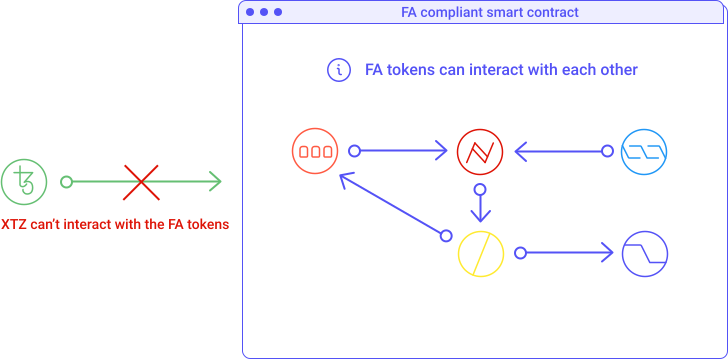

## Wrapped XTZ
Let's consider the following facts:

- XTZ is the native currency built on the Tezos blockchain.

- When a dApp (decentralized application) is built from the Tezos Blockchain it usually implements its own form of token based on the FA standards. 

- FA1.2 and FA2 are standards developed after the release of XTZ that defines how tokens are transferred and how to keep a consistent record of those transfers among tokens in the Tezos Network.

So here is the issue: **XTZ doesn't conform to its own FA standards**. Indeed, XTZ was the proto-token of the Tezos Blockchain, which means it was built before the FA standards existed. This makes XTZ not compliant with the FA standards used by most Dapps, e.g. DEXs. 

<small className="figure">FIGURE 1: XTZ can't interact with FA tokens</small>

Wrapping XTZ allows you to trade directly with alt tokens. The reason you need wXTZ is to be able to trade XTZ for other FA tokens on decentralized platforms like Dexter and Quipuswap. Because decentralized platforms running on Tezos use smart contracts to facilitate trades directly between users, every user needs to have the same standardized format for every token they trade. This ensures tokens don’t get lost in translation.

<small className="figure">FIGURE 2: Wrapping XTZ and unwrapping wXTZ</small>

When you "wrap" XTZ, you aren't really wrapping so much as trading via a smart contract for an equal token called wXTZ. If you want to get plain XTZ back you need to "unwrap" it. AKA trade it back for plain XTZ.

In practice when wrapping, your XTZ are stored in a smart contract and an equal amount of wXTZ is mined by the contracts and transferred to you. When unwrapping, your wXTZ are burned and some XTZ are released and sent back to you.  

<small className="figure">FIGURE 3: wXTZ can interact with other FA tokens</small>

## Properties of wXTZ
wXTZ has been developed by [Stove Labs](https://github.com/stove-labs) with the following properties [[1]](/defi/wrapped-assets#references):

- **Liquid**: wXTZ are liquid and may be used as a standard developer building block (FA1.2) for Tezos DeFi and to participate in DeFi systems on Tezos.

- **Collaterized**: Each wXTZ token is collateralized with 1 Tez (XTZ).

- **Rewards**: Locked XTZ generates staking rewards from the baker of users’ choice.

- **Secure**: The suite of wXTZ contracts is audited by _Trail of Bits_ and managed by _StakerDAO_.

- **Fees**: Interacting with wXTZ has no fees by _StakerDAO_ during the launch phase (contracts interaction requires only the standard network fees on the Tezos network). Changes to the fee structure will be managed by the _StakerDAO_ governance process.

- **Non-custodial**: XTZ used to collateralize wXTZ is managed by the user’s private keys. Only the user has access to their XTZ vault.

To learn more about wXTZ and get started, please refer to their [medium article](https://medium.com/stakerdao/the-wrapped-tezos-wxtz-beta-guide-6917fa70116e).

## Other wrapped assets
wXTZ is not the only wrapped asset on Tezos. One may want to interact with Ethereum or Bitcoin from a Tezos Smart contract. A wrapped asset can indeed bridge an asset from a different native public blockchain network to the one in which it is wrapping itself to. 

[StableTech](https://stable.tech/) has created [Wrapped ETH (ETHtz)](https://decrypt.co/51860/wrapped-eth-comes-to-tezos-as-it-takes-on-ethereum-defi-market) which is an FA1.2 token with a price pegged to ETH. ETHtz can be used on Tezos for exchanges or DeFi service while taking advantages of Tezos's much lower fees than Ethereum.

[Wrapped Bitcoin (tzBTC)](https://tzbtc.io/) is another wrapped asset on Tezos pegged to BTC. tzBTC is also implemented using the FA1.2 asset standard on Tezos.

## Conclusion
Wrapped assets not only improve the functionality and usability of the asset to which it is wrapped to, but also opens up a wide array of higher-level financial services that wouldn't be available previously. 

On Tezos, we’ve seen the addition of [Wrapped XTZ (wXTZ)](https://medium.com/stakerdao/the-wrapped-tezos-wxtz-beta-guide-6917fa70116e), [Wrapped Bitcoin (tzBTC)](https://tzbtc.io/), [Wrapped ETH (ETHtz)](https://decrypt.co/51860/wrapped-eth-comes-to-tezos-as-it-takes-on-ethereum-defi-market) and the addition of over 20 ERC-20 assets from [Bender Labs](http://www.benderlabs.io/) coming in the [near future](https://cryptoslate.com/20-ethereum-erc-20-tokens-will-be-coming-to-tezos-xtz-defi-in-q1-2021/).

## References 

[1] https://medium.com/stakerdao/the-wrapped-tezos-wxtz-beta-guide-6917fa70116e

[2] https://decrypt.co/51860/wrapped-eth-comes-to-tezos-as-it-takes-on-ethereum-defi-market

[3] https://cryptoslate.com/20-ethereum-erc-20-tokens-will-be-coming-to-tezos-xtz-defi-in-q1-2021/

[4] https://tzbtc.io/
