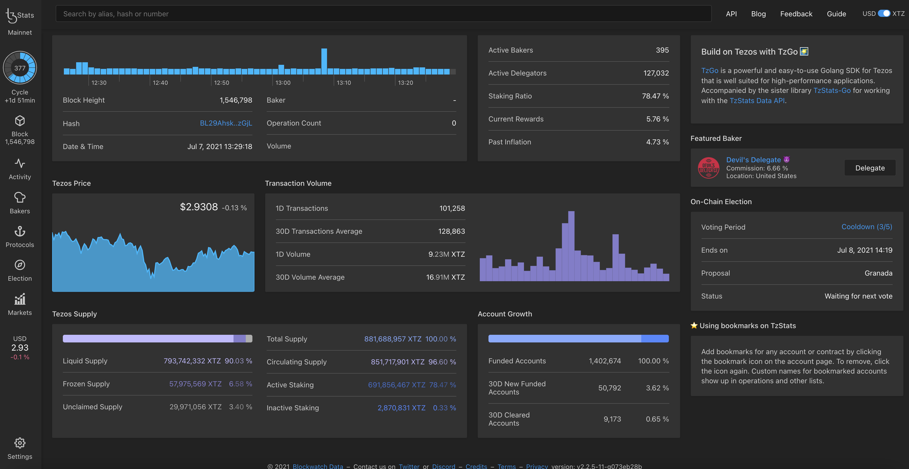

The purpose of this chapter is to list the main explorers of the Tezos blockchain with their pros and cons.

## Blockwatch TzIndex / TzStats

TzStats was the first Tezos Analytics Explorer, 
extending the functionality of traditional block explorers with comprehensive data analytics.   
It is the now the most complete and intuitive Tezos blockchain explorer.

<small className="figure">FIGURE 1: TzStats Explorer</small>

- Source code : [Github](https://github.com/blockwatch-cc/tzindex)
- Explorer website : [TzStats.com](https://tzstats.com/)

**Pros**
- speed
- stand-alone, no database needed
- Michelson decoding and full Bigmap support
- time-series and table APIs

**Cons**
- no mempool support
- no full-text search

> **The mempool** is made of all transactions which have been submitted for inclusion in the chain but not included in a block yet by bakers.

## Nomadic Labs Indexer

Nomadic Labs Indexer is the first indexer made by the Tezos team in July 2019.

<small className="figure">FIGURE 1: GitLab Nomadic Labs Indexer</small>

- Source code : [Gitlab](https://gitlab.com/nomadic-labs/tezos-indexer)

**Pros**
- made by the Tezos core team
- same data structures as Tezos node

**Cons**
- ETL only, no API server
- requires a Postgres database
- no smart contract support

> **Postgre server impacts speed performance**.
> The trade off of Postgres server is that for each index 
> you have you will insert data at a slower pace. 
> Essentially when you insert your data with an index 
> it must write data to two places as well as maintain the sort on the index as you insert data

## Cryptonomic Conseil

Arronax is Cyrptonomic Conseil's block explorer and was released in beta in April 2020.

<small className="figure">FIGURE 1: Arronax Explorer</small>

- Source code : [Github](https://github.com/Cryptonomic/Conseil)
- Explorer website : [Arronax.io](https://arronax.io/)

**Pros**
- indexer and API server
- full-text search in contracts & storage and smart filter

**Cons**
- requires a Postgres database
- limited statistics and timeseries data

## Baking Bad TzKT Indexer

Baking Bad is a software development company and active Tezos tools contributor.  
Their block explorer **TzKT** was released in December 2021.

<small className="figure">FIGURE 1: TzKT Explorer</small>

- Source code : [Github](https://github.com/baking-bad/tzkt)
- Explorer website : [TzKT.io](https://tzkt.io/)

**Pros**
- split design: ETL, API
- mempool support

**Cons**
- requires a Postgres database
- requires Microsoft Toolchain
- no smart contract support (yet)
- no time-series data
