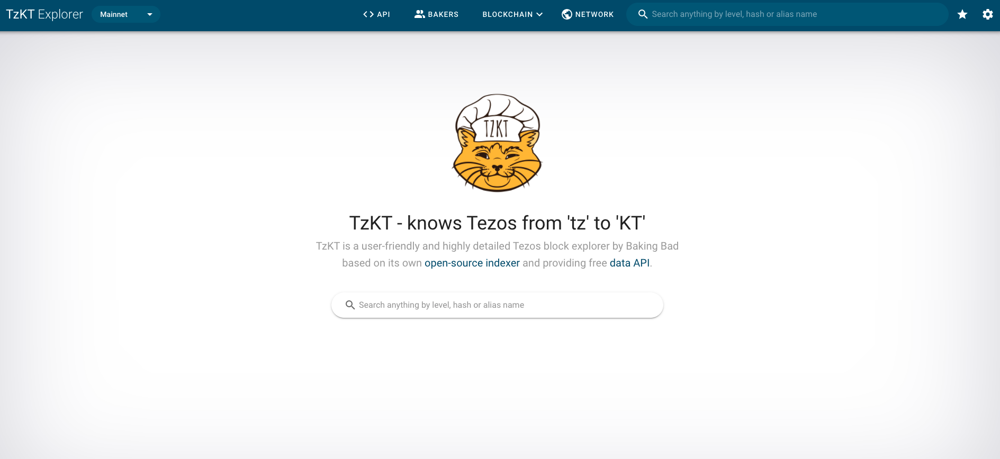

The purpose of this chapter is to list the main explorers of the Tezos blockchain and presents the pros and cons of some.

## Tezos Blockchain Explorers

- [TzStats](https://tzstats.com/)
- [tezblock](https://tezblock.io/)
- [Arronax](https://arronax.io/)
- [TzKT](https://tzkt.io/)
- [TezTracker](https://teztracker.everstake.one/mainnet)
- [TezEdge - Tezos Node Explorer](https://tezedge.com/#/network)
- [Tezos Notifier Bot (Telegram)](https://t.me/TezosNotifierBot)
- [Better Call Dev - Smart Contract Explorer](https://better-call.dev/)
- [SmartPy Contract Explorer](https://www.smartpy.io/dev/explorer)
- [Misualizer - Smart Contract Explorer](https://misualizer.tezbridge.com/)
- [Tezos Hubble Explorer](https://hubble.figment.network/tezos)
- [Baking Bad - Delegation Explorer](https://baking-bad.org/)
- [Mininax](https://mininax.io/mainnet)
- [Blockchair](https://blockchair.com/tezos)

## Indexers potential features

- **Full-text search** in smart contract storage. For example, you can retrieve a smart contract by specifying a part of the michelson code of the storage.
- **Michelson decoding**: The Michelson code is interpreted to be presented in a more readable way.
- **Bigmap support** Allows you to access and observe the content of Big Maps in the storage of smart contracts.
- **Mempool access**: some explorers provide access to the content of the mempool. The mempool is made of all transactions that have been submitted for inclusion in the chain but have not yet been included in a block by a baker.
- **Available Server APIs**
  - **Explorer API** for accessing individual objects of the explorer user interface via API calls.
  - **Time-series APIs** only contain numeric data types and are indexed by one date field. Through API calls, users can retrieve the entire time-series as well as a slice of it. It is great for aggregate counters and statistics over specific fields.
  - **Tables API** can include various unsorted data types (strings, numbers, dates, etc.) and can be filtered by different fields.

## Blockwatch TzIndex / TzStats

TzStats was the first Tezos Analytics Explorer,
extending the functionality of traditional block explorers with comprehensive data analytics.

<small className="figure">FIGURE 1: TzStats Explorer</small>

- Source code : [Github](https://github.com/blockwatch-cc/tzindex)
- Explorer website : [TzStats.com](https://tzstats.com/)

**Pros**

- stand-alone, no database installation needed
- Michelson decoding and full Bigmap support
- time-series and table APIs

**Cons**

- no mempool access
- no full-text search

## Baking Bad TzKT Indexer

Baking Bad is a software development company and active Tezos tools contributor.  
Their block explorer **TzKT** was released in December 2021.

<small className="figure">FIGURE 1: TzKT Explorer</small>

- Source code : [Github](https://github.com/baking-bad/tzkt)
- Explorer website : [TzKT.io](https://tzkt.io/)

**Pros**

- API server
- mempool access

**Cons**

- requires Microsoft Toolchain
- no time-series data

> The Baking Bad team has developed another tool, [Better Call Dev](https://better-call.dev/), which allows the exploration of smart contracts.

## Nomadic Labs Indexer

Nomadic Labs Indexer is the first indexer made by the Tezos team in July 2019.

<small className="figure">FIGURE 1: GitLab Nomadic Labs Indexer</small>

- Source code : [Gitlab](https://gitlab.com/nomadic-labs/tezos-indexer)

**Pros**

- made by the Tezos core team
- same data structures as a Tezos node

**Cons**

- ETL only, no API server, no User Interface (command lines only)
- no smart contract support

## Arronax

Arronax is Cyrptonomic Conseil's block explorer and was released in beta in April 2020.

<small className="figure">FIGURE 1: Arronax Explorer</small>

- Source code : [Github](https://github.com/Cryptonomic/Conseil)
- Explorer website : [Arronax.io](https://arronax.io/)

**Pros**

- API server
- full-text search in contracts & storage and smart filter

**Cons**

- limited statistics and timeseries data