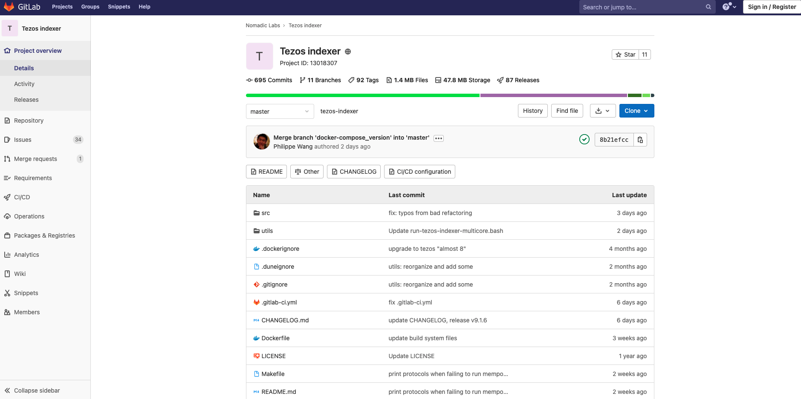
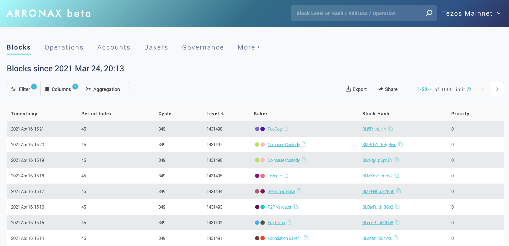
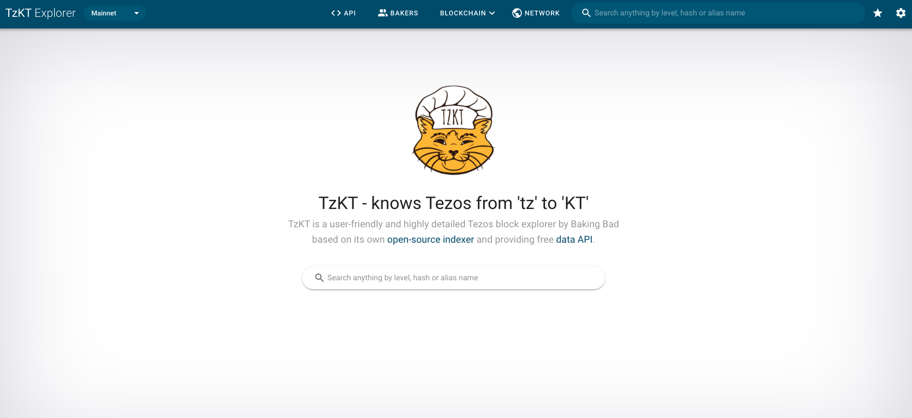

## Nomadic Labs Indexer

<small className="figure">FIGURE 1: GitLab Nomadic Labs Indexer</small>

- Source code : [Gitlab](https://gitlab.com/nomadic-labs/tezos-indexer)

**Avantages**
- made by Tezos core team
- same data structures as Tezos node

**DrawBack**
- ETL only, no API server
- requires Postgres server
- limited data, no contracts

## Cryptonomic Conseil

<small className="figure">FIGURE 1: Arronax Explorer</small>

- Source code : [Github](https://github.com/Cryptonomic/Conseil)
- Explorer website : [Arronax](https://arronax.io/)

**Avantages**
- indexer and API server
full-text search in contracts & storage

**DrawBack**
- requires Postgres server
- verbose query language
- limited statistics and timeseries data

## Baking Bad TzKT Indexer

<small className="figure">FIGURE 1: TzKT Explorer</small>

- Source code : [Github](https://github.com/baking-bad/tzkt)
- Explorer website : [TzKT](https://tzkt.io/)

**Avantages**
- split design: ETL, API
- mempool support

**DrawBack**
- requires Postgres server
- requires Microsoft toolchain
- no smart contract support (yet)
- no time-series data

## Blockwatch TzIndex

<small className="figure">FIGURE 1: TzStats Explorer</small>

- Source code : [Github](https://github.com/blockwatch-cc/tzindex)
- Explorer website : [TzStats](https://tzstats.com/)

**Avantages**
- speed
- stand-alone, no database server
- Michelson decoding and full Bigmap support
- time-series and table APIs

**DrawBack**
- no mempool support
- no full-text search
