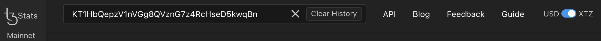
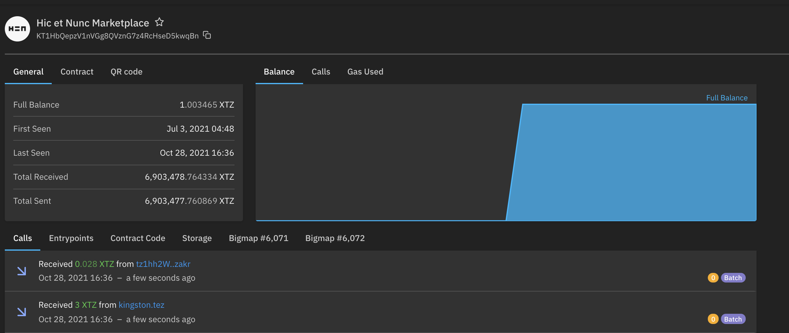
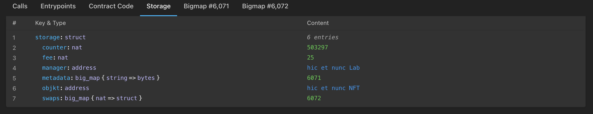

In the previous chapter, we saw that there is different block indexers for different uses in block explorers for the Tezos Blockchain. In this chapter we will focus on [TzStats](https://tzstats.com/) which is the most popular and complete Tezos explorer.


<small className="figure">FIGURE 1: TzStats Main Dashboard</small>

[TzStats](https://tzstats.com/) is developed by _Blockwatch Data Inc._ It is a block explorer for public and private Tezos networks and is based on the [TzIndex indexer](https://github.com/blockwatch-cc/tzindex). 

Each Tezos network has its own _TzStats_ version:
- **Mainnet** : [tzstats.com](https://tzstats.com)
- **Mainnet Staging**: [staging.tzstats.com](https://staging.tzstats.com)
- **Delphinet** : [delphi.tzstats.com](https://delphi.tzstats.com)
- **Edonet** : [edo.tzstats.com](https://edo.tzstats.com)

// TODO: What is mainnet staging used for?

## TzStats' main features
TzStats is a very intuitive platform but has a complete guide available [here](https://tzstats.com/docs/guide).

Here are _TzStats_' main features:

- [Main Dashboard](https://tzstats.com/): This page provides a quick view of all the main activity on the Tezos network, e.g. staking activity, gas price, XTZ supply, transaction volume, etc.

- [Network Activity](https://tzstats.com/activity): This page provides a world map with the location where new blocks are being baked. There is also the list of _whales_ (i.e list of high-value transfers >= $100,000).

- [Bakers](https://tzstats.com/bakers): This page provides the total amount of Tezos bakers. Several lists are also available to gain an overview of the Tezos baker landscape. You can choose between the tabs Public, Top 20, Gainers, Losers, Newcomers etc.
  
- [Block](https://tzstats.com/1435766): This page provides general information about a specific block number along with technical details such as gas used, block health, etc.
  // TODO: What is block health?

- [Cycle](https://tzstats.com/cycle/350): This page provides general information about a specific cycle number.
// TODO: What is a cycle?

- [Markets](https://tzstats.com/markets): This page provides an overview of the current market activity, e.g. list of exchanges, 1 day volume, overall market capitalization, etc.

- [Protocols](https://tzstats.com/protocols): This page shows the past and current protocol used by Tezos and the overall age of the Tezos blockchain. Refer to chapter on the [history of amendements](/tezos-basics/history-of-amendements) to understand each protocol.

- [Voting](https://tzstats.com/election/head): This page shows the past and current elections and indicates when it ends. Refer to chapter on the [governance on chain](/tezos-basics/governance-on-chain) to understand voting.

// TODO: Some screenshots of each page would be nice, maybe with added caption of each area. 

// TODO: I would separate TzStats' main features and Checkout your smart contract on TzStats in two different chapters.

## Checkout your smart contract on TzStats
As a developer, you will often want to check the state of your deployed smart contracts. Using a blockchain explorer is a fast and easy way to do so. In this section, we'll deploy a smart contract and check it out on _TzStats_.

### Step 1: Deploy your smart contract deployment
We are going to re-use the [raffle smart contract from the LIGO module](/ligo/contracts-ligo) and deploy it on a testnet.

The complete source code of the raffle contract can be found [here](https://github.com/bepi-octo/raffle-smart-contract.git).

// TODO: Move code to OpenTezos repo. I suggest creating a new folder in root called 'examples' then 'raffle-smart-contract' and put everything there.

It contains two smart contracts and their associated migrations:
1. a raffle smart contract, using a _big map_
2. a raffle smart contract, using a _map_

The current testnet at the time of writing is _Edonet_. The account used for deployment is defined in the _truffle_ config (refer to the [How to build a Dapp module](/dapp) for more info).

To setup the project, run the following commands:

```shell
$ git clone https://github.com/bepi-octo/raffle-smart-contract.git
$ cd
$ npm install -g truffle@tezos
$ npm install 
```

To deploy/migrate the smart contracts, run the following command:

```shell
$ truffle migrate --network edonet
```

The contracts are now deployed.

Note that the migration files also include calling a few entrypoints after deployment in order to automatically open a raffle and buy a ticket.

The contract addresses can be found in the command logs, or in `build/contracts/bigRaffle.json}` (respectively _littleRaffle.json_) in the `address` field under `network`.

// TODO: Add screenshot of command log showing the contract address.

### Step 2: Find your smart contract on _TzStats_
Once you have the address of your smart contract, go to the _TzStats_ website associated with the network you deployed your contract on. In our case it is the [Edo TzStats](https://edo.tzstats.com).

Copy/paste your address in the search bar:



TzStats then shows a page with information related to your smart contract, e.g. the balance of the contract, the amounts sent and received, the creator address, etc.



Below the general information, you have a list of tabs allowing you to see: 
- the calls 
- the entry points
- the contract code
- the storage
- the different _big maps_ of your smart contract (if there are any)

#### Calls
// TODO: Explain the calls tab

#### Entrypoints
Here you have a list of all your entrypoints and their parameters. Furthermore you can see how many calls each entrypoint has received.


#### Calls
// TODO: Explain the contract code tab

#### Storage
Here you have access to the content of your storage with the type of each variables and their current value. Notice that the content excludes big maps as they have specific tabs for them.



#### Big map
// TODO: Explain the Big map tab with an example

### (Optional) Step 3: Get data via API Call

All this information above can also be retrieved by API call. For more information go [here](https://tzstats.com/docs/api#tezos-api).

// TODO: Show an example with CURL (or other)

// TODO: Chapter conclusion?

## References
// TODO: references?


