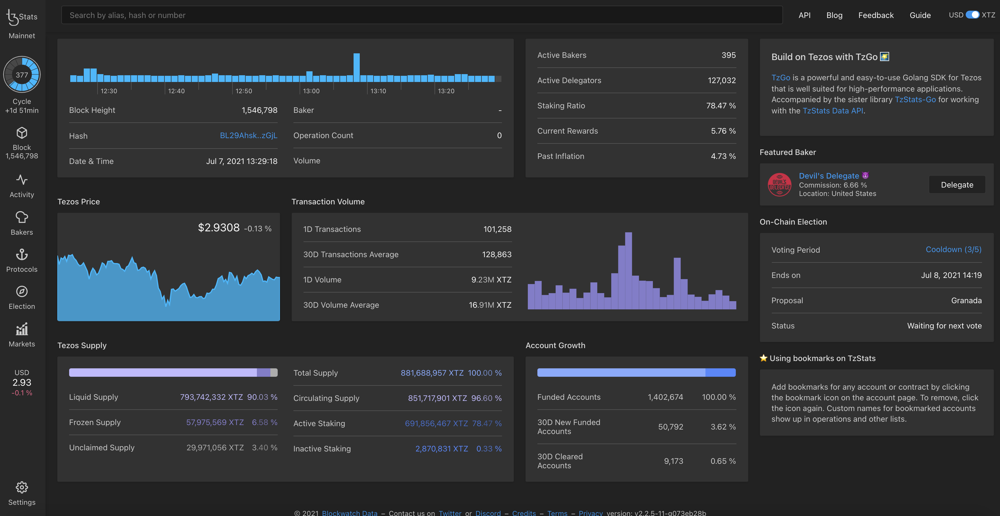
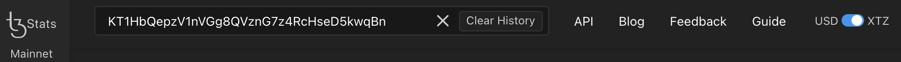
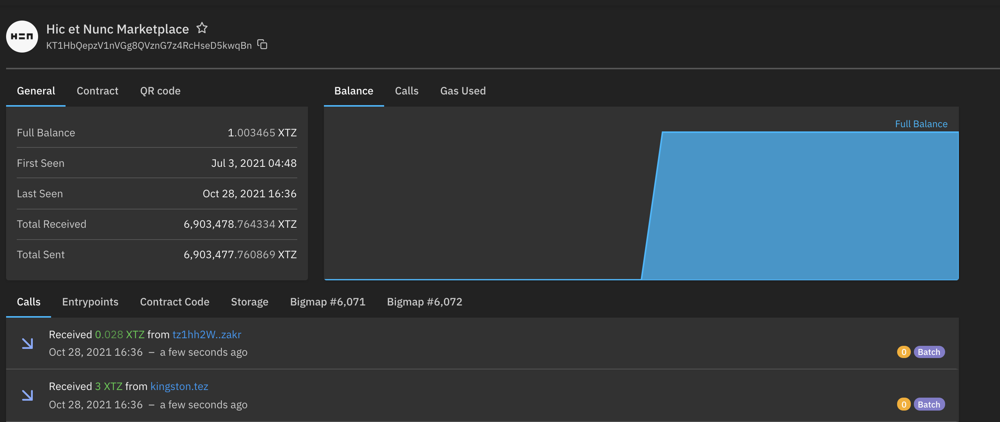
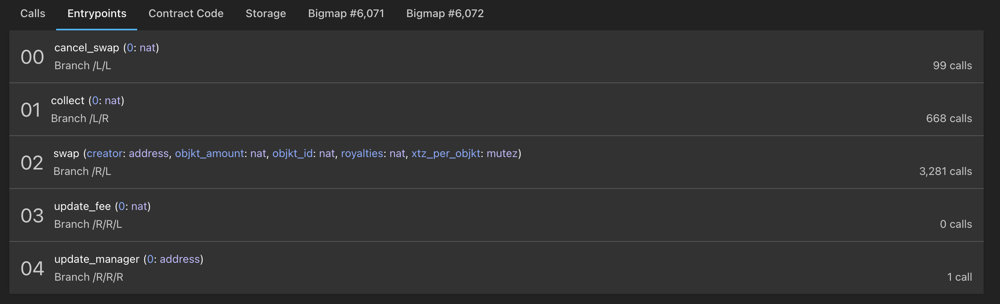
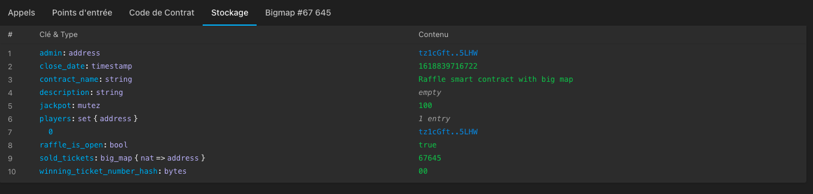

In the previous chapter, we have seen the existence of different block indexer 
for the use of different block explorer for the Tezos Blockchain. 
In this chapter we will focus on the use of [TzStats](https://tzstats.com/) 
which is one of the most powerful and complete Tezos explorer.


<small className="figure">FIGURE 1: TzStats Main Dashboard</small>

[TzStats](https://tzstats.com/) is a block explorer for public and private Tezos blockchain networks 
based on the TzIndex backend available [here](https://github.com/blockwatch-cc/tzindex). 
Supported by Blockwatch Data.

Tzstats describing the activity of a Tezos network, 
each Tezos Network has its own TzStats which are listed below:
- **Mainnet** : https://tzstats.com
- **Mainnet Staging**: https://staging.tzstats.com
- **Delphinet** : https://delphi.tzstats.com
- **Edonet** : https://edo.tzstats.com

## TzStats features

TzStats is a very intuitive platform.
If you have any doubts about its use,
I invite you to consult their guide [here](https://tzstats.com/docs/guide).

Here is a list of TzStats features:

- [Main Dashboard](https://tzstats.com/) 
  page provides an at-a-glance view of activity on 
  and related to the Tezos blockchain. 
  Like Staking activity, Tezos price, Tezos supply, transaction volume etc.
- [Network Activity](https://tzstats.com/activity) 
  page provides for example a world map with the location where new blocks are baked. 
  Or there is also the list of whales i.e list of high-value transfers (>= $100,000).
- [Bakers](https://tzstats.com/bakers) 
  page provides the total amount of Tezsos bakers.
  Several lists are also available to gain an overview of the Tezos baker landscape. 
  You can choose between the tabs Public, Top 20, Gainers, Losers, Newcomers etc.
- [Block](https://tzstats.com/1435766) 
  page provides general information about the current block's number, 
  but also technical details, block health etc.
- [Cycle](https://tzstats.com/cycle/350) 
  page displays the currently active cycle by default.
- [Markets](https://tzstats.com/markets) 
  page provides an overview of market activity of the current day. 
  On top, it shows the date, 1 day volume, and overall market capitalization.
- [Protocols](https://tzstats.com/protocols) 
  page shows the current protocol by default. 
  On top, you can see its name, e.g. v006 Carthage, and the overall age of the Tezos blockchain.
- [Voting](https://tzstats.com/election/head) 
  page shows the currently open election and indicates when it ends. 
  On top, there is a timeline of the currently active election progress.

## Observe your Smart Contract on TzStats

### Prerequisites: smart contract deployment

Tzstat will be used to monitor data from a smart contract.
The Raffle smart contract, developed in the LIGO module, will be deployed on edonet.

A github repository is available here:
[https://github.com/bepi-octo/raffle-smart-contract.git](https://github.com/bepi-octo/raffle-smart-contract.git)

It contains two smart contracts, and their associated migration:
1. a raffle smart contract, using a big map
2. a raffle smart contract, using a map

The edonet network, and the used account are already defined, as described in the Dapp module.
These commands set up the project:
```shell
$ git clone https://github.com/bepi-octo/raffle-smart-contract.git
$ cd
$ npm install -g truffle@tezos
$ npm install 
```

The contracts can be migrated:

```shell
$ truffle migrate --network edonet
```

The contracts are now deployed onto the edonet network:
1. a raffle contract using a map
2. a raffle using a big map

A raffle is opened (given the storage definition), 
and the account used for the migration has bought a ticket.

The contract addresses can be found in the command logs, 
or in the build/contracts/{bigRaffle.json, littleRaffle.json} in the `address` field under `network`.

### Your smart contract on tzStats

Once you have the address of your smart contract, 
go to the tzStats website associated with the network on which you have deployed your contract.
In our case it is the [Edonet Network](https://edo.tzstats.com).

Paste your address in the search bar.



You arrive on the following page where you have access 
to the different information related to your smart contract. 
Like the balance of the account, the amounts sent and received, 
the creator address of the smart contract, etc.



Below of the page you have a list of tabs allowing you to see: 
- the calls 
- the entry points
- the contract code
- the storage
- And the different bigMaps of your smart Contract (if there are any)

#### Entrypoints

Here you have a list of all your entrypoints and their parameters. 
Furthermore you can see how many calls each entrypoint has received.



#### Storage

Here you have access to the type of your storage and its content.
You will notice that the content of a bigmap is an exception, 
since a specific tab is assigned to it.




### API Call

The same information can be retrieved by API call.  
For more information go [here](https://tzstats.com/docs/api#tezos-api).


