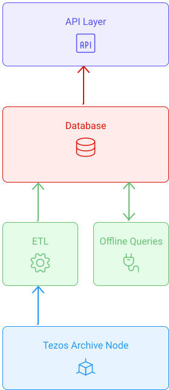

This chapter aims to describe the functioning of a typical indexer and its components.
We will then take the example of **BlockWatch Indexer** used for the **TzStats explorer**.

## Typical Blockchain Explorer Backends

Indexers are node operators.
The **ETL** extract, transform and load data
into the **SQL database** by mapping the data into a pre-defined schema of tables with referential integrity
in order to provide indexing and query processing services via an **API**.

> **Indexing** is a data structure technique to efficiently retrieve records from the database based on some attributes on which the indexing has been done.

- A **Tezos Node** is the heart of the blockchain. It manages the protocol. Here the Archive node is responsible for fetching all the data from the network that will be used and made available by the indexer/explorer.
- **ETL** stands for _extract, transform, and load_. The process of ETL plays a key role in data integration strategies.
- **API** is the acronym for _Application Programming Interface_,
  which is a software intermediary that allows two applications to talk to each other.

 

<small align="center" className="figure">FIGURE 1: Typical Blockchain Explorer Backends</small>

 

## Focus on BlockWatch Indexer (TzIndex)

The Blockwatch Indexer [TzIndex](https://github.com/blockwatch-cc/tzindex) is used for the [TzStats explorer](https://tzstats.com/).

The **Blockwatch indexer** use a high-performance columnar database that allows for extremely fast analytical queries.

> **Columnar database** is a column-oriented storage for database.
> It is optimized for fast retrieval of data columns,
> for example for analytical applications.
> It significantly reduces the overall disk I/O requirements
> and limits the amount of data you need to load from the disk.

It's a custom-made database for blockchain analytics. Avoiding the storage bottleneck allows for more complex data processing.

> **Storage bottleneck** is a situation where the flow of data gets impaired
> or stopped completely due to bad performance or lack of resources.

State updates happen at each block, which means all the balance updates are always verified,
and the indexer will follow chain reorganizations in real-time.

<small className="figure">FIGURE 2: Blockwatch Indexer</small>

## To go further

To learn more on the subject, please refer to the official [TzStats blog post](https://tzstats.com/blog/next-gen-blockchain-indexing-for-tezos/) and this [video](https://www.youtube.com/watch?v=2I9mmA0GzMk) that illustrates the inner workings of an indexer.

## References

[1] https://tzstats.com/blog/next-gen-blockchain-indexing-for-tezos/

[2] https://www.youtube.com/watch?v=2I9mmA0GzMk
