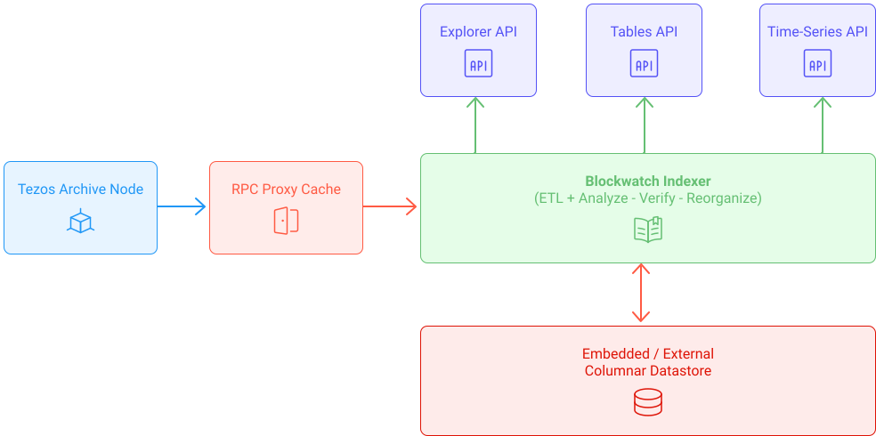

## Traditional Blockchain Explorer Backends

Indexers are node operators. They extract, transform and load data (**ETL job**) into the **SQL database**
in order to provide indexing and query processing services via the **API**.

 

<small align = "center" className="figure">FIGURE 1: Traditional Blockchain Explorer Backends</small>

 

It turns out that this one-way data extraction model has a couple of problems:
- Expensive States Queries
- One-way-data flow
- Slow Queries
- Inefficient Storage Layout
- Limited Throughput

## Focus on BlockWatch Indexer (TzIndex)

The Blockwatch indexer [Tzindex](https://github.com/blockwatch-cc/tzindex) is used for the [TzStats explorer](https://tzstats.com/).

The **Blockwatch indexer** replaces the slow
and expensive SQL datastore with a high-performance columnar data store
that allows for extremely fast analytical queries.
It's a custom-made database for blockchain analytics.
Avoiding the storage bottleneck allows for more complex data processing.
State updates happen at each block,
which means all balance updates are always verified,
and the indexer will follow chain reorganizations in real-time.

<small className="figure">FIGURE 2: Blockwatch Indexer</small>

## Find out more

To learn more about the subject, 
I invite you to read this [blog post](https://tzstats.com/blog/next-gen-blockchain-indexing-for-tezos/) 
and watch this [video](https://www.youtube.com/watch?v=2I9mmA0GzMk) that explains the new generation of indexer.

