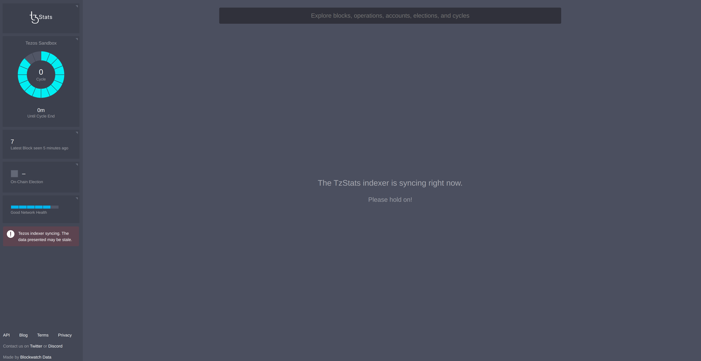
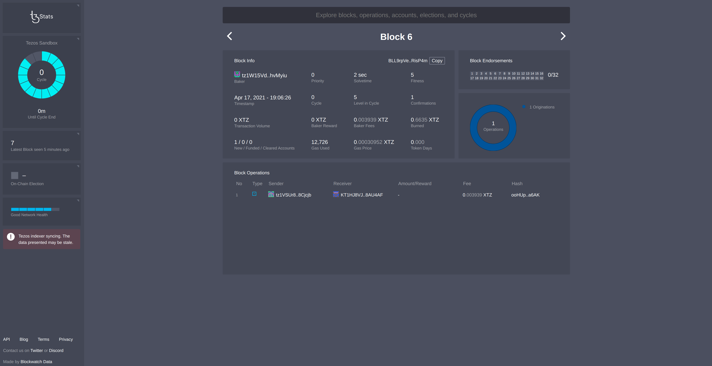
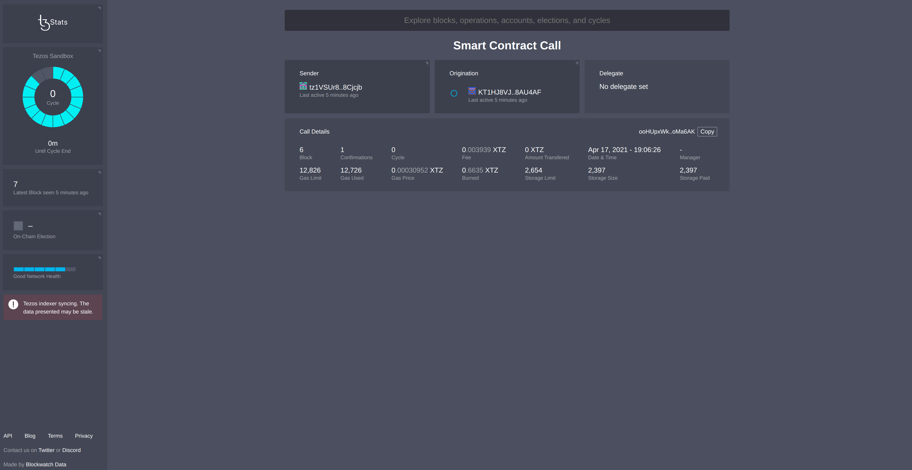
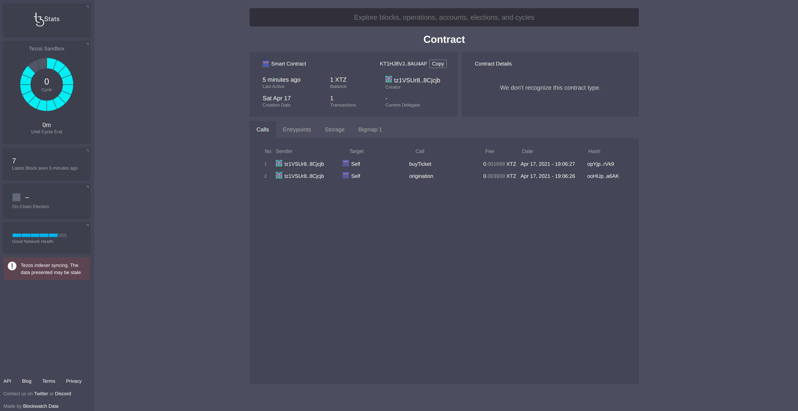
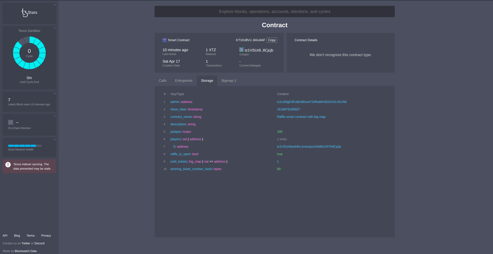
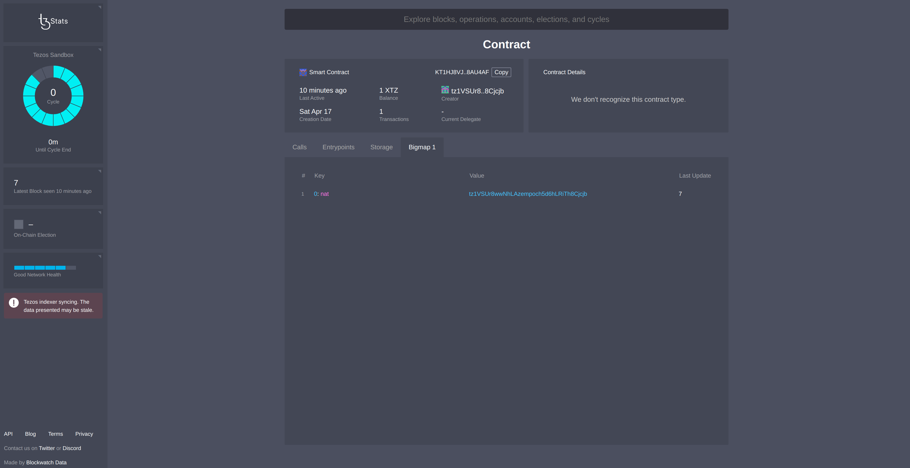
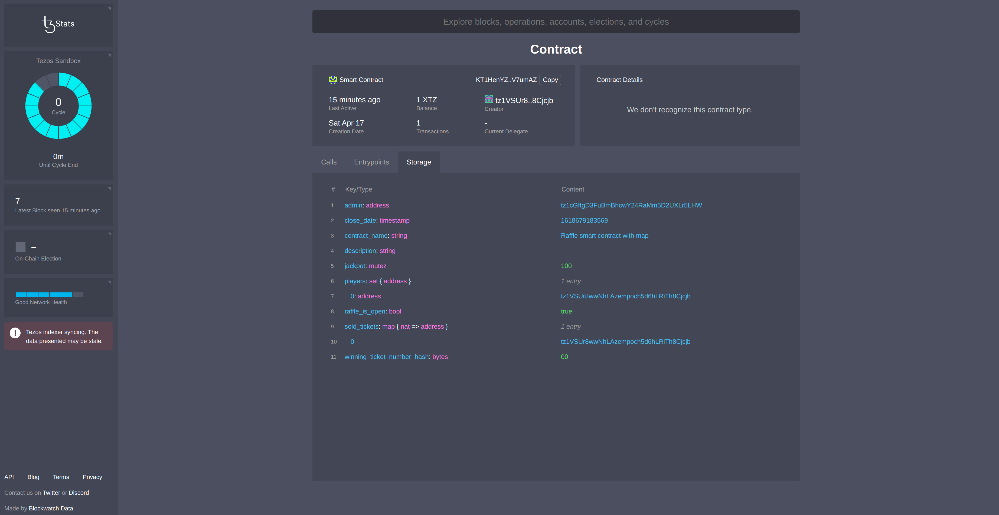
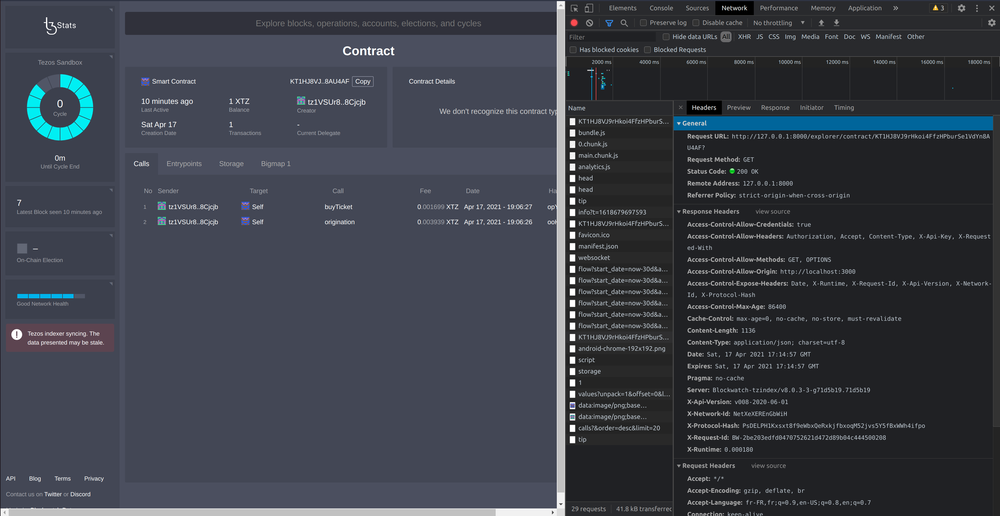

import NotificationBar from '../../src/components/docs/NotificationBar';

The tools presented in this module so far are fully public: everyone can use them. However, they are meant
for public networks, and the user is dependent on the infrastructure and configuration of these services. Some
organizations are more interested in deploying their private Tezos network, either for private testing before going
public or for entirely private use. Refer to the [Private blockchain module](/private) for more info. Therefore, it is
possible to use an indexer on private networks.

Fortunately, many public developments on Tezos are open-source and can easily be adapted for a private network, i.e. an indexer can be deployed and configured to watch a private network.

In this chapter, we will see how the source code of _TzIndex_ and _TzStats_ can be used to make a private indexer,
either for use on a private network or a public network.

This chapter is divided into three parts:

- how to quickly set up a private network.
- how to install and configure these tools
- how to use them

# Prerequisites

We will simulate a private network that will be indexed by _TzIndex_. Therefore, this private network should hold the basic expected elements on any network:
- a few funded accounts
- a smart contract
- some operations

Let's start by setting up a private network. The process is quite difficult as it requires starting and configuring
Tezos nodes (please refer to the [Private Blockchain module](/private) for more info). Instead, let's choose an easier
way by only simulating a private network using _Ganache_, a node module used for tests and simulations of Tezos and
Ethereum blockchains. _Ganache_ launches the [Flextesa docker image](https://assets.tqtezos.com/docs/setup/2-sandbox/), which runs Tezos nodes, bakers and endorsers in a sandbox environment.
It also provides ten funded accounts from the start.

Let's use the _Raffle_ smart contract from the [LIGO module](/ligo/contracts-ligo) and migrate it onto our private
network using the _Truffle_ configuration from the [Build a Dapp module](/dapp).

## Installing the prerequisites

The complete source code of the raffle contract can be
found [here](https://github.com/bepi-octo/raffle-smart-contract.git).

It contains a ganache configuration (with predefined accounts), three smart contracts and their associated migrations:

1. the first contract holds a big map and does not do anything. This dummy contract is used to bypass a _TzStats_ bug
   regarding big maps: the first big map (whose index is 0) is not fetched by the frontend.
2. a raffle contract using a map
3. a raffle using a big map

The second and third smart contracts will highlight the difference between the way maps and big maps are handled by indexers.

```shell
$ cd examples/explorer
$ npm install -g truffle@tezos
$ npm install 
```

_TzIndex_ is written in _Go_, a statically typed compiled programming language developed by _Google_. Install it using
the instructions at [golang.org/doc/install](https://golang.org/doc/install).

The next action is to install the docker images of _TzIndex_. Install _Docker_ using the instructions
at [docs.docker.com/get-docker/](https://docs.docker.com/get-docker/).

## Launching Ganache

In `package.json`, one script is defined:

```json
  "scripts": {
"start-sandbox": "ganache-cli --flavor tezos --seed alice"
}
```

<NotificationBar>
  <p>The npm repository of ganache can be found <a href="https://www.npmjs.com/package/ganache-cli/v/6.4.2">here</a> :
There are several versions of `ganache-cli`. 
Only the versions suffixed by `-tezos` support the Tezos blockchain (you can find them under the versions tab). 
The specific version used in the project can be found in the `devDependencies` section in `package.json`.
When this article was written, the version was <a href="https://www.npmjs.com/package/ganache-cli/v/6.12.1-tezos.0">6.12.1-tezos.0</a>
  </p>
</NotificationBar>


This script starts a simulated private Tezos blockchain with _ganache_:

```shell
$ npm run start-sandbox
Ganache CLI v6.12.1-tezos.0 (ganache-core: 2.13.2-tezos.2)

Available Accounts
==================
alice 100 TEZ
  pk: edpkvGfYw3LyB1UcCahKQk4rF2tvbMUk8GFiTuMjL75uGXrpvKXhjn
  pkh: tz1VSUr8wwNhLAzempoch5d6hLRiTh8Cjcjb
bob 100 TEZ
  pk: edpkurPsQ8eUApnLUJ9ZPDvu98E8VNj4KtJa1aZr16Cr5ow5VHKnz4
  pkh: tz1aSkwEot3L2kmUvcoxzjMomb9mvBNuzFK6
eve 100 TEZ
  pk: edpku9qEgcyfNNDK6EpMvu5SqXDqWRLuxdMxdyH12ivTUuB1KXfGP4
  pkh: tz1MnmtP4uAcgMpeZN6JtyziXeFqqwQG6yn6
mallory 100 TEZ
  pk: edpkujwsG5JMrWVXQwmRMBoR9yJkokRbn6wy3monpQKBpnZTs1ogRR
  pkh: tz1R2oNqANNy2vZhnZBJc8iMEqW79t85Fv7L
trent 100 TEZ
  pk: edpkukjpYWLPEavoTXid8KqfYAY4J1rqtbWHWrzp22FgdRQqzaRkDD
  pkh: tz1TfRXkAxbQ2BFqKV2dF4kE17yZ5BmJqSAP
marketa 100 TEZ
  pk: edpktiaGKkt8Yu6m4Gse2GhMdJCVdCtcrjtqATn3y3sf7xTBDj5g2a
  pkh: tz1fhigafd7PQAh3JBvq7efZ9g6cgBkaimJX
eulalie 100 TEZ
  pk: edpkvCvic2obeedM7oMJaeyapEafg4dSdYuWvkZigKbcvc64q6ZKM7
  pkh: tz1fEqJ6rD3mfQjVat7G6XJP522V6V8wWTP2
stella 100 TEZ
  pk: edpkvRuciP6vZeoXn1KJtBuEEtaD2SpHW59wbbCGt1SEDBL94W7AUE
  pkh: tz1i3eqdPNs9zjpavVBFcF8JarJUgEErfsUK
carline 100 TEZ
  pk: edpktxefxf3dtJEQLVb72MjV8yMiLh6DfCgNJQUV81rnsYJoZhbnK8
  pkh: tz1PQP815EzZRktgLaEhtDCR22kiRrcQEurw
tabbie 100 TEZ
  pk: edpkvXobE6tQLdsm3kPu3MYT2z2XrgVchfkK2WPB9tniNXdWSRyud3
  pkh: tz1WP3xUvTP6vUWLRnexxnjNTYDiZ7QzVdxo

<...>
```

Notice all the funded accounts created by _Ganache_.

## Migrating the _Raffle_ contracts

The contracts can be migrated onto the private network. More details can be found about the _Truffle_ tool in
the [Build a Dapp module](/dapp).

First, the private network has to be defined in the _truffle-config.js_ file. A `development` subsection should be found
under the `networks` section:

```json
    development: {
host: "http://localhost",
port: 8732,
network_id: "*",
secretKey: alice.sk,
type: "tezos"
}
```

It defines a localhost network, matching the ganache private network.

We're going to use the accounts from the `scripts/sandbox/account.js` file. Our three contracts can now be migrated with this command:

```shell
$ truffle migrate --network development
```

Three contracts are now deployed onto our private network:

The migration files also include some operations to open a raffle and buy a ticket automatically once the contracts are
deployed.

<NotificationBar>
  <p>The same smart contract is deployed twice: one with _maps_ and the other with _big maps_. Later on, these two smart contracts will be used to highlight the difference between the processing of _maps_ and _big maps_ by _TzStats_.
  </p>
</NotificationBar>

# Setting up a private indexer (_TzIndex_)

_TzIndex_ is an open-source indexer: it can freely be used and modified. The source code is available
at [github.com/blockwatch-cc/tzindex](https://github.com/blockwatch-cc/tzindex)

To start the application, proceed as follows:

```shell
$ git clone https://github.com/blockwatch-cc/tzindex
$ cd tzindex
$ make build
$ ls tzindex
```

The last command should output "tzindex" (to check if a tzindex has indeed been built)
A _TzIndex_ binary is created in the same directory. The indexer can now watch the private network with this command:

```shell
$ ./tzindex run --rpcurl 127.0.0.1:8732 --notls --enable-cors
```

Note the following options:

- _--rpcurl_: url of the ganache private network rpc node
- _--notls_: option to use _http_ instead of _https_
- _--enable-cors_: _TzIndex_ API will be queried by _Tzstat_ (exposed on a different port): CORS need to be enabled

_TzIndex_ now exposes its API on http://localhost:8000.

A `db/` folder is created when launching _TzIndex_ for the first time: it contains all the data indexed about the
private network.

<NotificationBar>
  <p>When restarting ganache, a blank new network is created. The `db/` folder, containing the old data has to be removed in order to make _TzIndex_ index the new network.
  </p>
</NotificationBar>

# Setting up a private explorer (_TzStats_)

_TzStats_ is the open-source frontend made to display the data from _TzIndex_. The source code is available
at [github.com/blockwatch-cc/tzstats](https://github.com/blockwatch-cc/tzstats)

_TzStats_ can interact with _TzIndex_ by setting the *TZSTATS_API_URL* variable to the url of the _TzIndex_ API.

The application can be launched with:

```shell
$ git clone https://github.com/blockwatch-cc/tzstats
$ cd tzstats
$ echo 'TZSTATS_API_URL=http://localhost:8000' > development.env
$ npm install
$ yarn start
```

<NotificationBar>
  <p>An error might occur during the npm install:
  ```shell
  /bin/sh: 1: sass: not found
  ```
  
  If so, modify the `sass` field under `scripts` in the `package.json` file as follows:
  ```json
  "sass": "npx sass src/styles/scss/index.scss:src/styles/css/index.css"
  ```
  Then run `npm install` again.
  </p>
</NotificationBar>

_TzStats_ will now launch in your web browser.

# Interacting with the private explorer

At this point, the working context is:

- a simulated private network running through Ganache
- three migrated contracts
- two contract calls
- _TzIndex_ indexing the private network
- _TzStats_ connected to _TzIndex_, and running

This means that there has already been some activity that we can watch on our network.

## Watching activity on _TzStats_

_TzStats_ is running at http://localhost:3000:



Notice that the frontend is different from its public version on [TzStats.com](https://tzstats.com/) but the inner
workings are the same.

On top, the search bar allows you to search for transactions, blocks, addresses, etc. The left panel contains various information displayed, such as the number of baked blocks.

Click on it to get more info on that block:


Many block details are displayed; most of them can be clicked on for even more info. The block above only contains one
operation, which is a call to our smart contracts. Click the hash to open the operation page:



The sender does match Alice's `pkh` from _scripts/sandbox/account.js_. `pkh` means public key hash: it is an address on a Tezos network.
Notice the contract address matches the returned address from the migration output logs.

Click on the address to inspect the smart contract:


You can see the history of calls, the entrypoints, the storage, etc. Notice the two calls made by _Truffle_: the
origination of the contract and the purchase of a ticket.

The storage page displays the storage definition, the type of each field and their associated current value. Note that
one participant is registered in the raffle and the contract holds one XTZ (from selling one ticket).


### About big maps

Note that the *sold_tickets* _big map_ should hold an `address` as value, but it displays `1` in the storage. Indeed,
since _big maps_ are meant to hold unbounded lists of data, they cannot be loaded directly into the storage (out of
performance concerns). Each _big map_ is indexed and the number `1` being displayed is the index number of the _big map_
. Its data can actually be accessed by clicking on the `Bigmap 1` section.



Regular _maps_ are meant to be used with limited data size as the data is directly retrieved from the storage section.
You can see an example of such a _map_ in the second migrated smart contract (baked in the fourth block):



The _TzStats_ interface is user-friendly and every piece of information can easily be read by clicking on each
element. Remember that all this information is coming from the data retrieved by the indexer: _TzStats_ just displays
them.

## Watching activity from _TzIndex_

The same pieces of information can be retrieved without the frontend by just using the _TzIndex_ API. For each page
opened on _TzStats_, an API call is made to _TzIndex_. Each API call can be seen in the network explorer by pressing F12
in the network section.



The _request URL_ shows the called API endpoints:

```shell
$ GET http://127.0.0.1:8000/explorer/contract/KT1HJ8VJ9rHkoi4FfzHPburSe1VdYn8AU4AF?
{
  "address": "KT1HJ8VJ9rHkoi4FfzHPburSe1VdYn8AU4AF",
  "manager": "tz1VSUr8wwNhLAzempoch5d6hLRiTh8Cjcjb",
  "delegate": "",
  "height": 6,
  "fee": 0.003939,
  "gas_limit": 12826,
  "gas_used": 12726,
  "gas_price": 0.30952,
  "storage_limit": 2654,
  "storage_size": 2397,
  "storage_paid": 2397,
  "is_funded": true,
  "is_vesting": false,
  "is_spendable": false,
  "is_delegatable": false,
  "is_delegated": false,
  "first_in": 7,
  "first_out": 0,
  "last_in": 7,
  "last_out": 0,
  "first_seen": 6,
  "last_seen": 7,
  "delegated_since": 0,
  "first_in_time": "2021-04-17T17:06:27Z",
  "first_out_time": "0001-01-01T00:00:00Z",
  "last_in_time": "2021-04-17T17:06:27Z",
  "last_out_time": "0001-01-01T00:00:00Z",
  "first_seen_time": "2021-04-17T17:06:26Z",
  "last_seen_time": "2021-04-17T17:06:27Z",
  "delegated_since_time": "0001-01-01T00:00:00Z",
  "n_ops": 1,
  "n_ops_failed": 0,
  "n_tx": 1,
  "n_delegation": 0,
  "n_origination": 0,
  "token_gen_min": 1,
  "token_gen_max": 1,
  "bigmap_ids": [
    1
  ],
  "op_l": 3,
  "op_p": 0,
  "op_i": 0,
  "iface_hash": "d30a2146",
  "call_stats": [
    1,
    0,
    0
  ]
}


```

A lot of information is displayed, such as the contract's address, but some data is also missing, like the storage.
Another API call has to be made for that:

```shell
$ GET http://127.0.0.1:8000/explorer/contract/KT1HJ8VJ9rHkoi4FfzHPburSe1VdYn8AU4AF/storage?
{
  "meta": {
    "contract": "KT1HJ8VJ9rHkoi4FfzHPburSe1VdYn8AU4AF",
    "time": "2021-04-17T17:06:27Z",
    "height": 7,
    "block": "BLwCojKb2fv7Ph88kxMoYXeTRYdtavvzCNh3ZzsJNpfFgqq5ey8"
  },
  "value": {
    "admin": "tz1cGftgD3FuBmBhcwY24RaMm5D2UXLr5LHW",
    "close_date": "1618679185827",
    "contract_name": "Raffle smart contract with big map",
    "description": "",
    "jackpot": "100",
    "players": [
      "tz1VSUr8wwNhLAzempoch5d6hLRiTh8Cjcjb"
    ],
    "raffle_is_open": "true",
    "sold_tickets": "1",
    "winning_ticket_number_hash": "00"
  }
}

```

All the available endpoints can be found here: [tzstats.com/docs/api#explorer-endpoints](https://tzstats.com/docs/api#explorer-endpoints)

# Setting up a private indexer for a public network

If you don't want your infrastructure to rely on third-party public indexers to monitor public networks, you can also use a local indexer. It just has to monitor a node: either a local node, or a public node (listed at [tezostaquito.io/docs/rpc_nodes](https://tezostaquito.io/docs/rpc_nodes/)).

```shell
$ ./tzindex run --rpcurl <node_url> --notls --enable-cors
```

There are three operation modes, which retrieve more or less data:

- _Full regular_: all indexes are built (default mode)
- _Light light-weight_: consensus and governance indexes are not built (use _--light_ in the CLI)
- _Validate_: state validation mode for checking accounts and balances at each block/cycle (use _--validate_ in the CLI)

Note that whichever mode your choose, indexing a public network will take a significant amount of time due to the size of data to be
fetched. 

According to the _Tzstats_ team, it is possible to index 13 000 blocks per minute from a local node connected to the mainnet ([Cost and benefice section from this tzstats post](https://tzstats.com/blog/next-gen-blockchain-indexing-for-tezos/)). When indexing the mainnet from a public node (_Smartpy_ node on our case), we could index about 10 blocks per seconde. 

The mainnet was about 1 400 000 blocks, so to index the mainnet, it should take:
- about an hour and fifty minutes from a local node
- about a day and a half from a public node. 

Of course, these figures depend on your network connectivity and hardware.

# Conclusion

Running a private network does not condemn its user to be blind to whatever is happening on their network: private
indexers and explorers can be set up to index and monitor a private network.

Public networks (mainnet, testnets) are indexed by public tools ([https://tzstats.com/] for instance). However, some use cases may required not to rely on third party services: private indexers and explorers can be used to that purpose.

Finally, indexers, since they expose a complete API, can be used to replace libraries (such as [Taquito](https://tezostaquito.io/)) or
wallets. Decentralised apps can take advantage of these API calls to fetch data from a Tezos network, especially when it comes down to big maps.

## References

[1] https://assets.tqtezos.com/docs/setup/2-sandbox/

[2] https://tzstats.com/docs/api#explorer-endpoints

[3] https://golang.org/doc/install

[4] https://docs.docker.com/get-docker/

[5] https://tezostaquito.io/docs/rpc_nodes/

[6] https://tezostaquito.io/

[7] https://tzstats.com/

[8] https://tzstats.com/blog/next-gen-blockchain-indexing-for-tezos/

