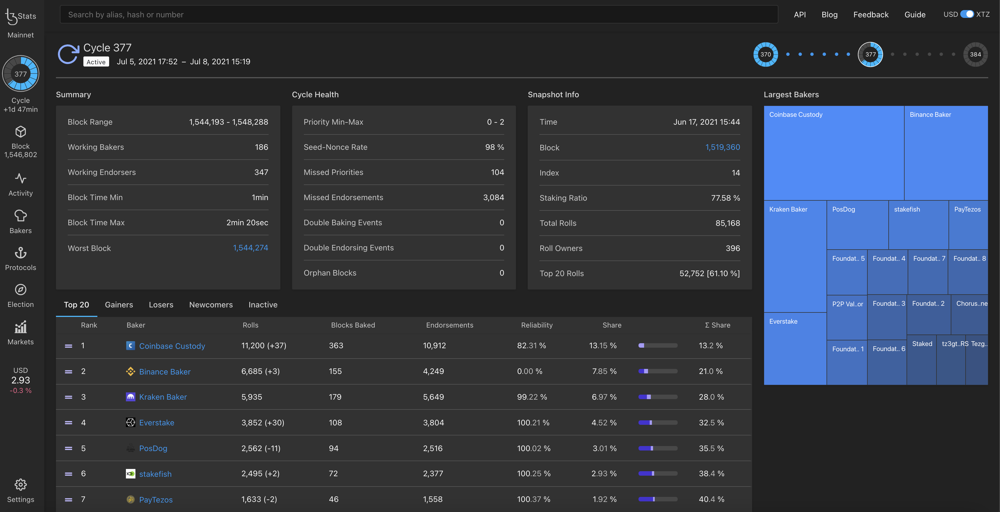
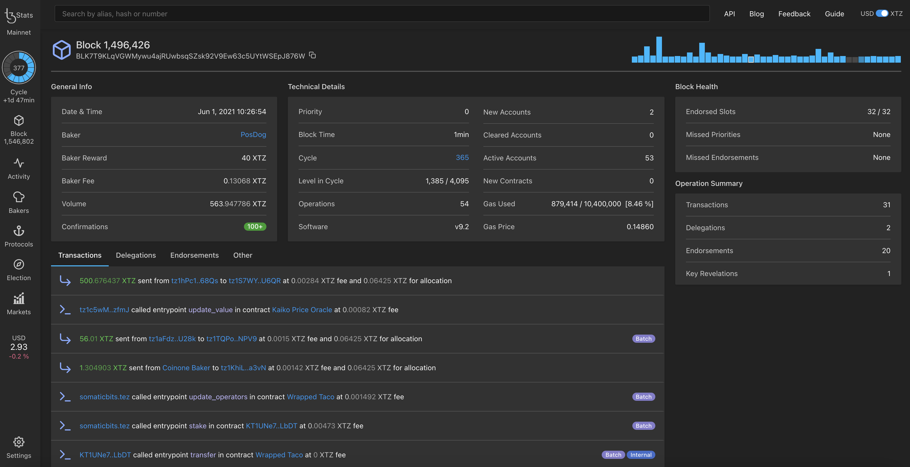
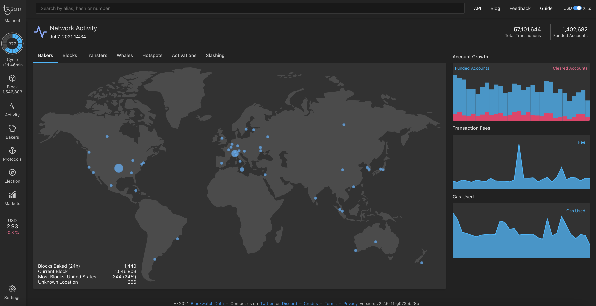
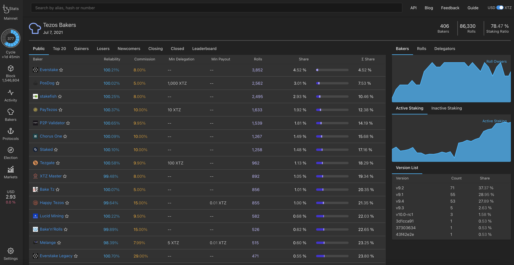
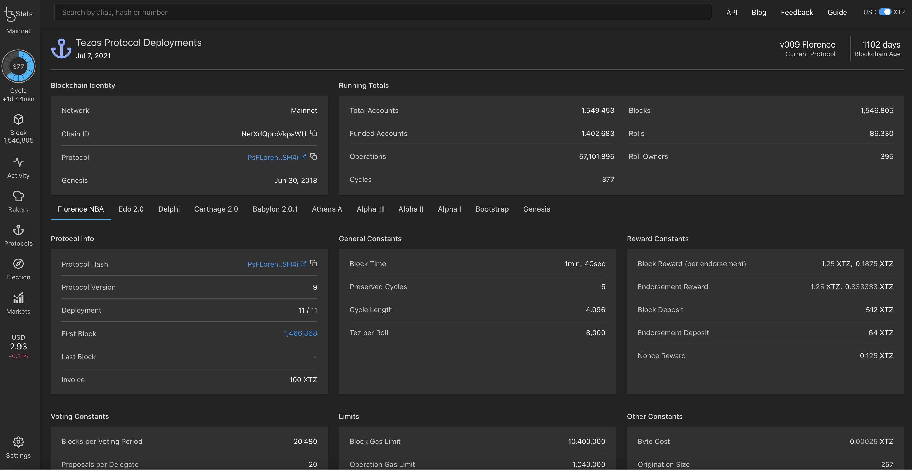
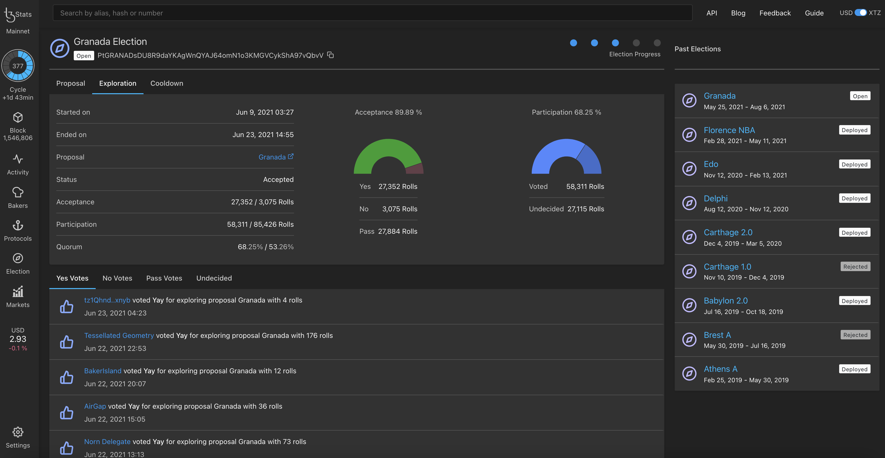
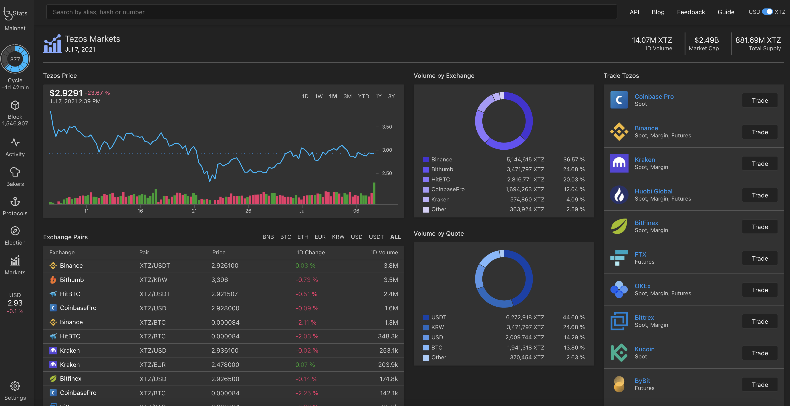

In this chapter, we will use the [TzStats](https://tzstats.com/) explorer to illustrate the different features of an explorer, but similar features are usually available on others.

<small className="figure">TzStats Main Dashboard</small>

[TzStats](https://tzstats.com/) is developed by _Blockwatch Data Inc._ It is a block explorer for public and private Tezos networks and, it is based on the [TzIndex indexer](https://github.com/blockwatch-cc/tzindex).

Each Tezos network has its own _TzStats_ version:

- **Mainnet** : [tzstats.com](https://tzstats.com)
- **Delphinet** : [delphi.tzstats.com](https://delphi.tzstats.com)
- **Edonet** : [edo.tzstats.com](https://edo.tzstats.com)

## TzStats' main features

TzStats has a complete guide available [here](https://tzstats.com/docs/guide).

- [Main Dashboard](https://tzstats.com/): This page provides a quick view of all the main activity on the Tezos network, e.g. staking activity, gas price, XTZ supply, transaction volume, etc.
  
  <small className="figure">TzStats Main Dashboard</small>

- [Cycle](https://tzstats.com/cycle/350): This page provides general information about a specific cycle number. A cycle is a way of measuring time. Every cycle is equal to 4096 blocks.
  
  <small className="figure">TzStats Cycle Page</small>
- [Block](https://tzstats.com/1435766): This page provides general information about a specific block number along with its technical details such as gas used, block health (Endorsed Slots, Missed Priorities and Missed Endorsements), etc.
  
  <small className="figure">TzStats Block Page</small>
- [Network Activity](https://tzstats.com/activity): This page provides a world map with the location of where new blocks are being baked. There is also the list of _whales_ (i.e list of high-value transfers >= $100,000).
  
  <small className="figure">TzStats Activity Page</small>

- [Bakers](https://tzstats.com/bakers): This page provides the total amount of Tezos bakers. Several lists are also available to gain an overview of the Tezos baker landscape. You can choose between the tabs Public, Top 20, Gainers, Losers, Newcomers, etc.
  
  <small className="figure">TzStats Bakers Page</small>
- [Protocols](https://tzstats.com/protocols): This page shows the past and current protocol used by Tezos and the overall age of the Tezos blockchain. Refer to the chapter on the [history of amendments](/tezos-basics/history-of-amendements) to understand each protocol.
  
  <small className="figure">TzStats Protocols Page</small>

- [Voting](https://tzstats.com/election/head): This page shows the past and current elections and indicates when it ends. Refer to chapter on the [governance on chain](/tezos-basics/governance-on-chain) to understand voting.
  
  <small className="figure">TzStats Voting Page</small>
- [Markets](https://tzstats.com/markets): This page provides an overview of the current market activity, e.g. list of exchanges, 1 day's volume, overall market capitalization, etc.
  
  <small className="figure">TzStats Markets Page</small>

Here the main features have been presented and, in the next chapter, we will see how to check out your smart contract.

## References

[1] https://tzstats.com

[2] https://tzstats.com/docs/guide
