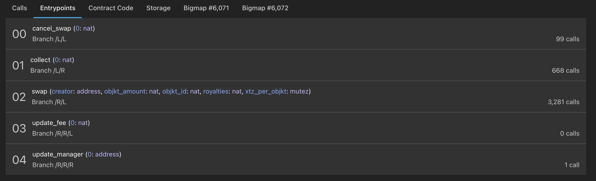

As a developer, you will often want to check the state of your deployed smart contracts. Using a blockchain explorer is a fast and easy way to do so. In this section, we will find a smart contract and check it out on _TzStats_.

## Find your smart contract on _TzStats_

Once you have the address of your smart contract, go to the _TzStats_ website associated with the network you deployed your contract on.

Remember, the following TzStats website link are the following:
- **Mainnet**: [tzstats.com](https://tzstats.com)
- **Delphinet**: [delphi.tzstats.com](https://delphi.tzstats.com)
- **Edonet**: [edo.tzstats.com](https://edo.tzstats.com)
- **Florencenet**: [florence.tzstats.com](https://florence.tzstats.com)

Copy/paste your address in the search bar:


TzStats then shows a page with information related to your smart contract, e.g. the balance of the contract, the amounts sent and received, the creator address, etc.


Below the general information, you have a list of tabs allowing you to see:

- the calls
- the entry points
- the contract code
- the storage
- the different _big maps_ of your smart contract (if there are any)

For the following examples, we will check out the smart contract, deployed on the Mainnet, whose address is the following:

```
KT1HbQepzV1nVGg8QVznG7z4RcHseD5kwqBn
```

Available at this [link](https://tzstats.com/KT1HbQepzV1nVGg8QVznG7z4RcHseD5kwqBn).

### Calls

Here you have the history of all transactions related to your smart contract.

It appears:
- The transactions with the amount and the address of the sender.
- The calls made to the entrypoints with the name of the entrypoint in question.
- On the right the status of the block with the number of confirmation received.


### Entrypoints

Here you have a list of all your entrypoints and their parameters. Furthermore, you can see how many calls each entrypoint has received.



### Contract Code

Here you have the michelson code of your smart contract.


### Storage

Here you have access to the content of your storage with the type of each variable and its current value. Notice that the content excludes big maps as they are specific tabs for them.


### Big map

Here you have the content of your bigmap.


## API Calls

The same pieces of information can be retrieved by API calls, without using the frontend.
A full documentation is available [here](https://tzstats.com/docs/api#tezos-api).

The following API endpoints are the following:
- Mainnet: https://api.tzstats.com
- Mainnet Staging: https://api.staging.tzstats.com
- Edonet: https://api.edo.tzstats.com
- Florencenet: https://api.florence.tzstats.com

First, let's get the contract information.
The "explorer" endpoints will be used (full reference [here](https://tzstats.com/docs/api#explorer-endpoints)).

In this example, one of the contracts has been deployed on the Mainnet to `KT1HbQepzV1nVGg8QVznG7z4RcHseD5kwqBn`.

Let's retrieve the contract details:

```shell
$ curl https://api.tzstats.com/explorer/contract/KT1HbQepzV1nVGg8QVznG7z4RcHseD5kwqBn 
{
   "address":"KT1HbQepzV1nVGg8QVznG7z4RcHseD5kwqBn",
   "creator":"tz1Y1j7FK1X9Rrv2VdPz5bXoU7SszF8W1RnK",
   "delegate":"",
   "storage_size":466932,
   "storage_paid":466932,
   "first_seen":1540787,
   "last_seen":1546844,
   "first_seen_time":"2021-07-03T02:48:58Z",
   "last_seen_time":"2021-07-07T13:15:58Z",
   "n_ops":11789,
   "n_ops_failed":1610,
   "bigmaps":{
      "metadata":6071,
      "swaps":6072
   },
   "iface_hash":"a357937c",
   "code_hash":"c1c14f18",
   "call_stats":{
      "cancel_swap":102,
      "collect":685,
      "swap":3366,
      "update_fee":0,
      "update_manager":1
   },
   "features":[
      "transfer_tokens"
   ],
   "interfaces":[
      
   ]
}
```
 

The pieces of information do match those from the web interface: *address*, *creator*, *first_seen_time*, *last_seen_time*...

The call to the entrypoints "swap" can be seen in the `call_stats` field: 3366 calls have indeed been made to this entrypoint.

More details can be fetched about those calls:

```shell
$ curl https://api.tzstats.com/explorer/contract/KT1HbQepzV1nVGg8QVznG7z4RcHseD5kwqBn/calls
[
   {
      "row_id":58248380,
      "hash":"opCH4VjdvjSeicS3A7MeDVSjwGwz16DcE6WbkKzUxc6SQj8bhtU",
      "type":"origination",
      "block":"BMCS5sba3xLXkhpze68LQdLz7VRGD6edjMTH14eLr31DppAqF1x",
      "time":"2021-07-03T02:48:58Z",
      "height":1540787,
      "cycle":376,
      "counter":11788639,
      "op_l":3,
      "op_p":4,
      "op_c":0,
      "op_i":0,
      "status":"applied",
      "is_success":true,
      "is_contract":true,
      "gas_limit":19759,
      "gas_used":19759,
      "gas_price":0.30705,
      "storage_limit":4107,
      "storage_size":3850,
      "storage_paid":3850,
      "volume":0,
      "fee":0.006067,
      "burned":1.02675,
      "has_data":true,
      "days_destroyed":0,
      "big_map_diff":[
         {
            "action":"alloc",
            "bigmap_id":6072,
            "key_type":{
               "name":"@key",
               "type":"nat"
            },
            "value_type":{
               "name":"@value",
               "type":"struct",
               "args":[
                  {
                     "name":"creator",
                     "type":"address"
                  },
                  {
                     "name":"issuer",
                     "type":"address"
                  },
                  {
                     "name":"objkt_amount",
                     "type":"nat"
                  },
                  {
                     "name":"objkt_id",
                     "type":"nat"
                  },
                  {
                     "name":"royalties",
                     "type":"nat"
                  },
                  {
                     "name":"xtz_per_objkt",
                     "type":"mutez"
                  }
               ]
            }
         },
         {
            "action":"alloc",
            "bigmap_id":6071,
            "key_type":{
               "name":"@key",
               "type":"string"
            },
            "value_type":{
               "name":"@value",
               "type":"bytes"
            }
         },
         {
            "key":"",
            "key_hash":"expru5X1yxJG6ezR2uHMotwMLNmSzQyh5t1vUnhjx4cS6Pv9qE1Sdo",
            "value":"697066733a2f2f516d57514e41314138634b5a506f61615a4d757153754c75643747515453786262774358685a373644674571484d",
            "action":"update",
            "bigmap_id":6071
         }
      ],
      "sender":"tz1Y1j7FK1X9Rrv2VdPz5bXoU7SszF8W1RnK",
      "receiver":"KT1HbQepzV1nVGg8QVznG7z4RcHseD5kwqBn",
      "confirmations":6060
   }
], ...
```

It details the inputs used for this entrypoint, the storage after the call, the differences in the big map that have changed after the call...

The current storage can be fetched, with this endpoint:

```shell
$ curl https://api.tzstats.com/explorer/contract/KT1HbQepzV1nVGg8QVznG7z4RcHseD5kwqBn/storage
{
   "value":{
      "counter":"503452",
      "fee":"25",
      "manager":"tz1UBZUkXpKGhYsP5KtzDNqLLchwF4uHrGjw",
      "metadata":"6071",
      "objkt":"KT1RJ6PbjHpwc3M5rw5s2Nbmefwbuwbdxton",
      "swaps":"6072"
   },
   "bigmaps":{
      "metadata":6071,
      "swaps":6072
   }
}
```

The storage returned by the API does match the one displayed in the web interface.
The `swaps` big map holds a big map id, instead of the values.  
Indeed, a big map is meant to hold unbounded data size: thus, fetching the storage could quickly become expensive, if the big maps hold a lot of values.

The values of a big map have to be retrieved from a separate endpoint, thanks to its id (`6072` in this case):

```shell
$ curl https://api.tzstats.com/explorer/bigmap/6072/values
[
   {
      "key":"500002",
      "key_hash":"exprv549ywRqB3FLVdfWLJi9Wjm44ZZ3u9mfshFsqJZdZ99LBFD8Uk",
      "value":{
         "creator":"tz1TgKL5LsLvNjowkJTb5Td4rf2ZHbeYsaCb",
         "issuer":"tz1TgKL5LsLvNjowkJTb5Td4rf2ZHbeYsaCb",
         "objkt_amount":"5",
         "objkt_id":"158296",
         "royalties":"200",
         "xtz_per_objkt":"10000000"
      }
   },
   {
      "key":"500003",
      "key_hash":"expruG8eSPZ8anqDi2ZPzhSdLz3go8G6oTKkD57BmnqzZEr1KzXY8n",
      "value":{
         "creator":"tz1UBT8wECSsb4Cfr2Y6i3GSJUoSfoWcB7Qg",
         "issuer":"tz1UBT8wECSsb4Cfr2Y6i3GSJUoSfoWcB7Qg",
         "objkt_amount":"10",
         "objkt_id":"154305",
         "royalties":"100",
         "xtz_per_objkt":"6660000"
      }
   }, ...
]
```

All of the pieces of information displayed in the web interface can be retrieved from the API.
All these API calls can of course be made by any libraries, and thus can be automated in any program.

# Conclusion

tzstats.com is extremely useful to monitor what is going-on on the mainnet and public testnets.
All the pieces of information regarding the cycles, the blocks, the transactions, the smarts contracts... can quickly be found,
thanks to a user-friendly interface.

In addition, _TzStats_ provides a complete and free REST API (for non-commercial use), without any authentication or enforcement of rate limits (as long as it remains reasonable). See the introduction of the [Tzstats API](https://tzstats.com/docs/api#tezos-api).

Those calls can be performed by any library: the pieces of information retrieved about a public Tezos network can be used in another monitoring tool, or even in Dapps.

Indeed, API calls can be used within Dapps to retrieve those kinds of information. For instance, _taquito_ (a typescript library to interact with a tezos node) is not able to retrieve the keys of a big map with a simple call. A call to the _TzStats_ API solves this issue.

Those tools are also available for private networks.
This will be detailed in the next chapter, where a private _TzStats_ is set up to monitor a private network.

## References

[1] https://tzstats.com/

[2] https://tzstats.com/KT1HbQepzV1nVGg8QVznG7z4RcHseD5kwqBn

[3] https://tzstats.com/docs/api#tezos-api

[4] https://tzstats.com/docs/api#explorer-endpoints
