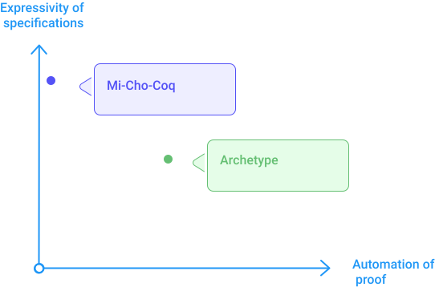

Formal verification is a complex task but made possible and easier on Tezos smart contracts with proof assistant tools (such as _Coq_) and Michelson conception choices. 

### All about trust

The main trait of the blockchain is that it ensures the execution of transactions without a trusted third-party. The deployment of smart contracts re-introduces a trusted party (the one who wrote the smart contracts). Tests can be done but nothing ensures the completeness (all situations of execution) of these tests. 

A bug in a smart contract would destroy the trust.

The formal verification consists of proving mathematically that a smart contract possesses properties described in its formal specification.
The mathematical proof is formal so its correctness can be verified automatically.

The trust is based on the **existence of a proof** for a smart contract and the **understanding of the formal specifications** of the smart contracts. The formal specification of a smart contract describes without ambiguity the properties of the program.

### What is the formal verification on Tezos smart contract

The formal verification on Tezos smart contracts consist on:
- describing formal specifications of the expected behavior of the smart contract
- translating the smart contract, its formal specifications and specification of the language itself into a proof assistant language.
- writing a proof. In the proof assistant, one can manually (or assisted by solvers tools) produce a formal proof that the smart contract comply to the given specifications.
- publishing this proof in order to allow anyone to verify automatically that the smart contract comply to its specifications.

### Formal verification made possible

Formal verification is a complex task but made possible on Tezos smart contracts with Michelson conception choices.

Indeed the Michelson language has been designed in order to take the formal verification into account. It is done by: 
- introducing typing system on a stack-based language for facilitating formal verification.
- preventing JUMP instructions which make the formal verification more complex
- prevent floating-point number (because of overflow and rounding)
- less execution error with explicit failure (e.g. division by 0)

### Formal verification benefits

There is a real benefit to be able to prove the behavior of a smart contract, (i.e. to verify that a smart contract complies to some specifications). 

Generally speaking, smart contracts have specific characteristics making them more bound to be verified than other common programs:
- Due to the blockchain context, a smart contract is not intended to be modified (hard to modify once deployed), and thus can be proven once and for all.
- particularly relevant when financial transfers are at stake (bug causing the loss of a token).
- Proofs can be verified automatically without a trusted third-party. The proof process is aligned with the decentralization concept.
- smart contracts are short , thus it is not too hard to write a proof 
- smart contracts are executed in a well-defined context (protocol Tezos) which relatively separated, thus facilitating the formal verification.

> This compliance can be verified by anyone for a given smart contract and proof.

### Which tools

Many proof assistants can be used to translate a smart contract into a formal definition and formalize its specifications and its compliance to these specifications.

- Nomadic Labs provides Mi-Cho-Coq, a library for the _Coq_ proof assistant. 

- Archetype language integrates directly information concerning formal verification (based on Why3, may automatically produce the proof). specifications are written in the smart contract.

- K-Michelson is based on K-framework which is a generic tool for specifications and proofs languages.

#### Mi-Cho-Coq

Allow to directly verify smart contracts (Michelson scripts) in _Coq_

- it can verify smart contracts written in high-level languages (LIGO, SmartPy, Archetype) since ultimately they are compiled to Michelson.
- manual low-level approach (proof is manually written and Coq helps to build this proof).

Mi-Cho-Coq limitations are:
- data serialization/deserialization is not supported yet
- cryptographic functions are considered as a black box and used as such.
- gas model is not taken into account.

Mi-Cho-Coq official repository is available at https://gitlab.com/nomadic-labs/mi-cho-coq

#### Archetype

Archetype official documentation is available at https://docs.archetype-lang.org/

#### K-Michelson

K-Michelson official documentation is available at https://runtimeverification.github.io/michelson-semantics/

#### Juvix

Juvix official documentation is available at https://juvix.org/docs/proof-system

#### Lorentz (Haskell)

Lorentz official documentation is available at https://serokell.io/blog/lorentz

### Modeling specifications

All these proof assistants provides tools for formal verification but also provides a way to express the semantic of a program (e.i. formal semantic). They share the same purpose which is to define what a program is meant to do and to verify that the program does comply to these intentions (called **specifications**).

#### Expressivity vs automation

Proof assistants have chosen different ways to model specifications. For example, Mi-Cho-Coq is a Coq library allowing to verify at Michelson level, and specifications are designed in Coq as logical objects (with all the **expressivity** power of the Gallina language).

Whereas Archetype design specifications by adding annotations directly inside the smart contract (written in a high-level language). Using annotations for expressing specifications, has the benefit to allow the **automatic generation of the proof**. This automatic proof cannot be done in all cases (it depends on the complexity) but is It introduces an inconvenience which is to limit the expressivity of these specifications to the annotation grammar. 

<small className="figure">FIGURE 1: Comparison of proof assistants approaches.</small>

Due to these different approaches and their implementations, the time of verification may vary. Automated generated proofs take more time to verify correctness (i.e. time spent for running the proof). Obviously, automation reduces drastically the time spent on writing the proof ! 

####  Verification level

It's worth to mention that these proof assistants have different approaches concerning the level at which the verification is applied.

The Mi-Cho-Coq approach is to apply formal verification on the low-level language (Michelson) and provides trust on the smart contract. 

Another approach is to apply formal verification on a high-level language and provides trust in the high-level language compiler (which produces Michelson). (e.g. Archetype).

#### Specification based on resources

By default, specifications are expressed on impacts of execution of a smart contract (i.e. on modifications of the smart contract storage).

Some proof assistants also express specifications based on resources (such as the storage size, or the gaz consumption). The size of storage could be bounded, and thus specifications could reason on these boundaries.
The gaz consumption (equivalent to the execution time) could also be a criterion useful for specifying the intention of the smart contract.

#### Verification applied on interactions of multiple contracts

As a stand-alone, Mi-Cho-Coq approach provides a solid (full-expressivity) manner for expressing specifications and for verifying a proof but does not provide a way to verify interactions between multiple smart contracts.

The _Concert_ library for Coq provides a way to model each smart contract as a Coq function and allows to reason on these functions (which can call each other). _Concert_ is a generic tool and not a tezos-specific library such as Mi-Cho-Coq.

#### Examples of famous proven smart contracts

There smart contracts that have already been proven such as Dexter thus providing trust on the _Dexter_ decentralized exchange platform.

Liquidity Baking smart contracts have also been proven.