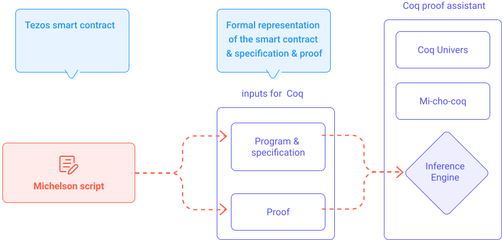

The Tezos blockchain has several advantages over its concurrents. One of them is the **formal verification of smart contract**. This module shows a brief overview of how Tezos smart contracts can be formally verified. 

We will first define in the [Generalities](/formal-verification/general) section what is the formal verification of a Tezos smart contract, and its benefits and how proof assistants (and tools) can make this task possible.

An explained [example](/formal-verification/modeling-theorem) (_Vote_ smart contract) will be used to illustrate the formal specification of a Tezos smart contract, and its proof.

The schema below describes the process for performing formal verification on Tezos smart contract.

<small className="figure">FIGURE 5: Overview of the formal verification process on smart contract.</small>
 
For mathematicians and very curious developers, an extra [theoretical](/formal-verification/gadt-coq) section will introduce some basic concepts of the _Type theory_ such as _GADT_ which allows inductive types on the _Calculus of Inductive Construction_ (CiC). The proof assistant _Coq_, which is based on the CiC, can be used for proving theorems. 

This extra [theoretical](/formal-verification/gadt-coq) section will also introduce _Coq_ and the _Mi-Cho-Coq_ library (used by _Coq_) to formalize a smart contract as a logical object (theorem). This theorem is formalized in _Gallina_ (Term) language, which follows the CiC principles. The script for proving the theorem is written in _Gallina_ (Vernacular), which provides _tactics_ and will be executed by the inference engine (Coq).

