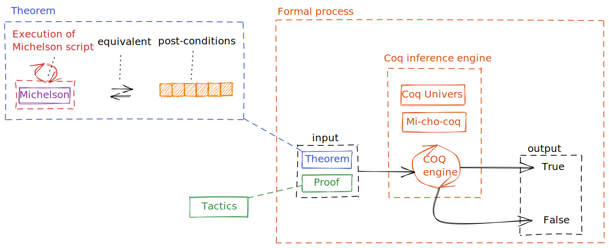

The Tezos blockchain brings several improvements including the formal verification of smart contract.This section describes the overview of how Tezos smart contract can be formally verified.

### Overview

The Tezos blockchain implements smart contracts using the Michelson language (see module _Michelson_ or official documentation [9]). Michelson is a low-level stack-based turing-complete language which have been proven; the proof of Michelson language is compiled in a library called **Mi-cho-coq** (check the official documentation [2]). 

Based on the Curry-Howard isomorphism ([5],[6],[7]) which ensures the correspondence between a program and a theorem, Mi-cho-coq can be used in a proof assistant called **Coq** to translate a Michelson script into a theorem (i.e. into its logical equivalent form). The official documentation of Coq can be found here [1], but we recommend easy access documentation such as this introduction to Coq [3].

> The Coq proof assistant is built upon the paradigm of **calculus of constructions** (as described by Thierry Coquand [16]). The _Gallina_ language [4] (the language allowing to interact with the Coq engine) provides a syntax (Terms) for describing formal objects (like a theorem) and also provides a set of instructions (Vernacular syntax) called _tactics_ for writing the proof of the theorem.

The formal verification of a Michelson smart contract is done by providing a proof for this theorem. *Coq* (the proof assistant) will perform the verification of a given proof (and its related theorem) based on the *Mi-cho-coq* (Michelson proof).

The proof consists of a sequence of _tactics_ which will be interpreted by the Coq engine. Theses instructions manipulate formal expressions (following logical laws (_Coq_ universe) and _Mi-cho-coq_ definitions) in order to formally assert truth of a given theorem (based on given assumptions).

Before going deeper, let's sum up in the schema below representing the workflow of formal verification of Tezos smart contracts.

