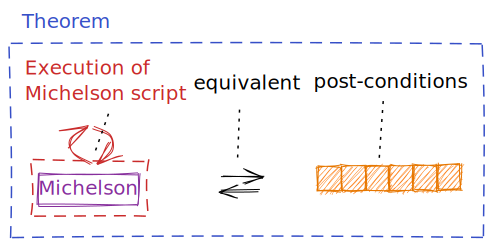
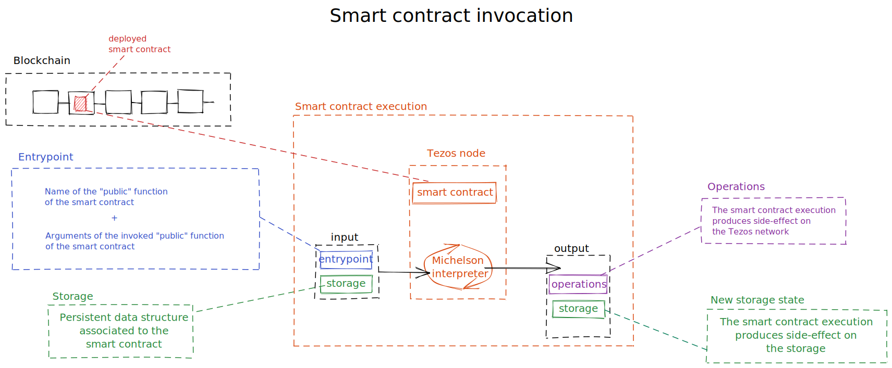

The Tezos blockchain brings several improvements including the formal verification of smart contract.This section describes the overview of how Tezos smart contract can be formally verified.

### Overview

The Tezos blockchain implements smart contracts using the Michelson language (see module _Michelson_). Michelson is a low-level stack-based turing-complete language which have been proven; the proof of Michelson language is compiled in a library called *Mi-cho-coq*. 

Based on the Curry-Howard isomorphism which ensures the correspondence between a program and a theorem, Mi-cho-coq can be used in a proof assistant called *Coq* to translate a Michelson script into a theorem (i.e. into its logical equivalent form). 

The formal verification of a smart contract is done by providing a proof for this theorem. *Coq* (the proof assistant) will perform the verification of a given proof (and its related theorem) based on the *Mi-cho-coq* (Michelson proof).

The proof consists of instructions in _Coq_ language (called Galina). Theses instructions called _tactics_ manipulate formal expressions (following logical laws (_Coq_ univers) and _Mi-cho-coq_) and logical implications in order to formally assert truth of a given theorem.

Before going deeper, let's sum up in the schema below representing the workflow of formal verification of Tezos smart contracts.


### Theorem

This ecosystem combines an assistant of proof (*Coq*) and the proof of the Michelson language (*Mi-cho-coq*) to formally verify the correctness of a theorem and its proof.

The theorem is based on 
- a Michelson script representing what the smart contract does.
- post-conditions representing the rules of the smart contract in a formal form.

Formal verification of a Tezos smart contract consists of verifying formally that **the execution of the Michelson script satisfies specific post-conditions**.



In the next sub-sections we will detail how to formulate formally the execution of a Michelson script and how to define post-conditions.
The proof is a sequence of Coq tactics. Will see that part in the end of this chapter.

#### Transaction execution (recall) WIP

As a recall, a Tezos smart contract consists on a Michelson script (//TODO see chapter Michelson). 

A smart contract invocation requires the smart contract that is invoked, the entrypoint that is called (and its related arguments), the actual storage state.

If all these elements are provided the execution of the code of the smart contract is triggered which will result in side-effects on the storage and optionally on the Tezos network.


<small className="figure">FIGURE 3: Execution of an entrypoint of a smart contract triggering its code and thus side-effect on storage and Tezos network.</small>

The entrypoint information is used to identify which portion of the code will be executed.
The entrypoint arguments and the storage are used as the context of execution (i.e the execution stack is initialized with arguments and storage). 
The execution of the code produces a new storage state and operations.
The operations produced by this invocation are some new invocations of other smart contracts.

> Since the proof of smart contract interactions is not doable currently (//TODO "anglais pas top a reformuler" but a collaboration between Nomadic and Archetype has been started to  make this kind of proof possible), we will consider that there are no operations produced. 

#### Formally modeling the execution of a tezos smart contract

Now let's se how do we formulate formally **the execution of the Michelson script**. 

As we have seen the **the execution of the Michelson script** produces a new storage (we consider there are no operation produced). 
So, formally speaking:
```
EXECUTION(CODE,arguments,storage) produces a new storage 
```

The execution of code is done by evaluating a sequence of Michelson instruction for a given initial stack (an `eval` function is provided by _Coq_). The execution of code also requires a context and a quantity of gas to be able to execute each instruction (requirement defined by Mi-cho-coq). So the execution of code can be formalized as:

```
eval env CODE fuel (arguments,storage) = return (newstorage)
```

where:
- `fuel` represents the quantity of gas.
- `env` represents a context of evaluation for the Coq engine.
- `eval` effectively executes each instruction sequencially on the provided initial stack.
- `arguments` and `storage` are passed as parameters.
- `newstorage` represents the resulting storage after the execution.

So the theorem could be formalized as:

```
eval env CODE fuel (arguments, storage) = return (newstorage) <=> post-conditions
```
where `<=>` represents an equivalence


Now let's see how to define post-conditions

#### Post-conditions

Post-conditions are logical assertions which model the intention of the smart contract. 

The work is to identify rules (or constraints) that ensure the correctness of the execution (i.e. ensure that the storage cannot end up in an invalid state).

In fact, post conditions are most of the time multiple assertions combined with a logical _AND_ operator ( `^` in Coq).

```
post-conditions <=> A ^ B ^ C ^ D
```

Since post-conditions is a generic concept formalizing smart contract intention as logical assertions, we will use an example in order to illustrate this.

#### Exemple Vote


### Proof WIP


