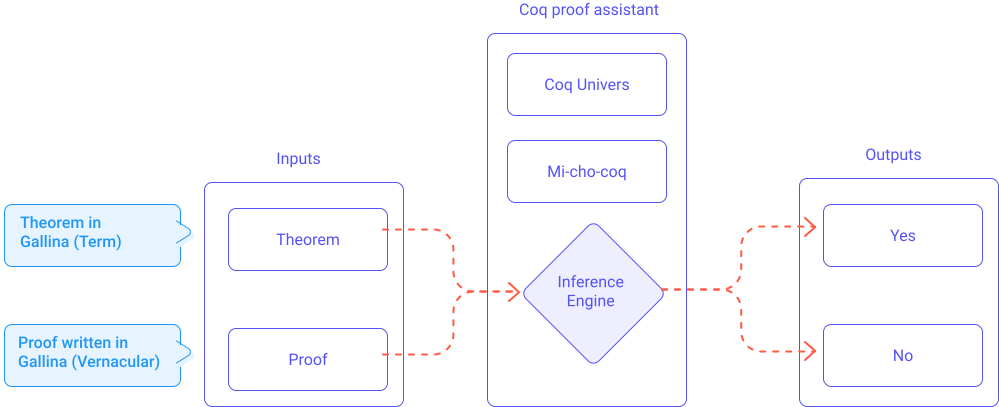
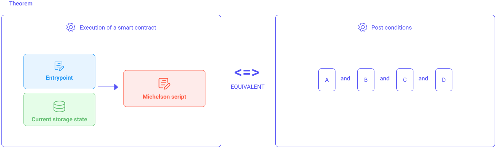
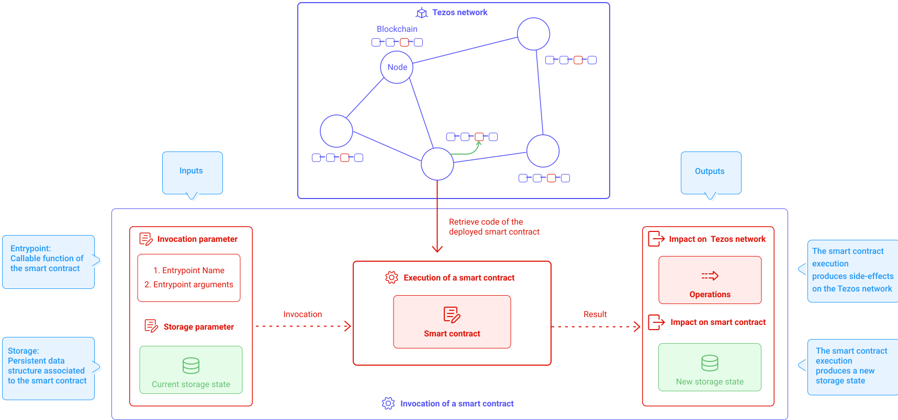
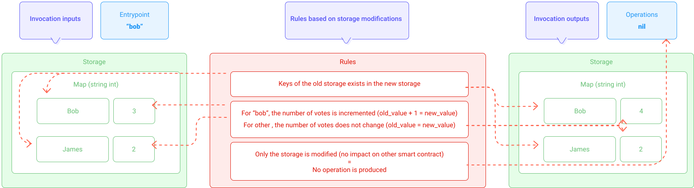
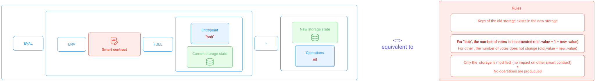
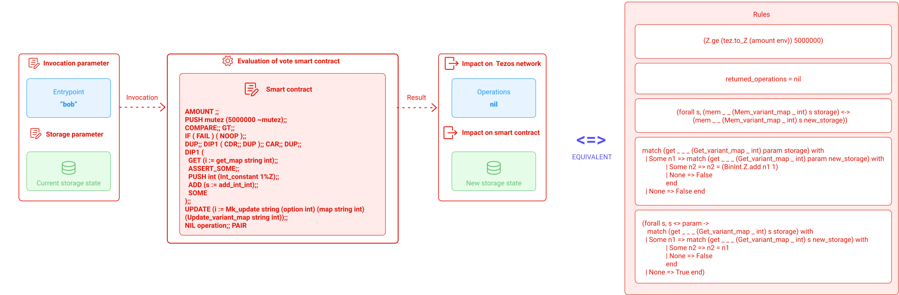

This section describes how to make the bridge between the Tezos world (and the Michelson language) with the  formal world of Coq. This will be concretized by modeling a theorem representing the smart contract and its intention.

This section will be illustrated with a simple example with the _Vote_ smart contract.

### Overview

The Tezos blockchain implements smart contracts using the Michelson language (see module _Michelson_ or official documentation [9]). Michelson is a low-level stack-based Turing-complete language which have been proven; the proof of Michelson language is compiled in a library called **Mi-Cho-Coq** (check the official documentation [2]). 

Based on the Curry-Howard isomorphism ([5],[6],[7]) which ensures the correspondence between a program and a theorem, Mi-Cho-Coq can be used in a proof assistant called **Coq** to translate a Michelson script into a theorem (i.e. into its logical equivalent form). The official documentation of Coq can be found here [1], but we recommend easy access documentation such as this introduction to Coq [3].

> The Coq proof assistant is built upon the paradigm of **calculus of constructions** (as described by Thierry Coquand [16]). The _Gallina_ language [4] (the language allowing to interact with the Coq engine) provides a syntax (Terms) for describing formal objects (like a theorem) and also provides a set of instructions (Vernacular syntax) called _tactics_ for writing the proof of the theorem.

The formal verification of a Michelson smart contract is done by providing the proof for this theorem. *Coq* (the proof assistant) will perform the verification of a given proof (and its related theorem) based on the *Mi-Cho-Coq* (Michelson proof).

The proof consists of a sequence of _tactics_ which will be interpreted by the Coq engine. These instructions manipulate formal expressions (following logical laws (_Coq_ universe) and _Mi-Cho-Coq_ definitions) in order to formally assert the truth of a given theorem (based on given assumptions).


Before going deeper, let's sum up in the schema below representing the workflow of formal verification of Tezos smart contracts.



<small className="figure">FIGURE 1: Proof process.</small>

### Modeling a smart contract as a theorem

This ecosystem combines an assistant of proof (*Coq*) and the proof of the Michelson language (*Mi-Cho-Coq*) to formally verify the correctness of a theorem and its proof.

The theorem is based on 
- a Michelson script representing what the smart contract does.
- post-conditions representing the rules of the smart contract in a formal form.

Formal verification of a Tezos smart contract consists of verifying formally that **the execution of the Michelson script satisfies specific post-conditions**.


<small className="figure">FIGURE 2: Naive description of the theorem.</small>

In the next sub-sections we will detail how to formulate formally the execution of a Michelson script and how to define post-conditions.
The proof is a sequence of Coq tactics (see the Vernacular part of the Gallina language). We will see that part in the end of this chapter.

#### Smart contract invocation (recall)

As a recall, a Tezos smart contract consists on a Michelson script (more documentation is available in chapter Michelson or the official documentation [9]). 

A smart contract invocation requires the smart contract that is invoked, the entrypoint that is called (and its related arguments), the actual storage state.

If all these elements are provided the execution of the code of the smart contract is triggered which will result in side-effects on the storage and optionally on the Tezos network.



<small className="figure">FIGURE 3: Execution of an entrypoint of a smart contract triggering its code and thus side-effect on storage and Tezos network.</small>

The entrypoint information is used to identify which portion of the code will be executed.
The entrypoint arguments and the storage are used as the context of execution (i.e the execution stack is initialized with arguments and storage). 
The execution of the code produces a new storage state and operations.
The operations produced by this invocation are some new invocations of other smart contracts.

#### Formally modeling the execution of a Tezos smart contract

Now let's see how do we formulate formally **the execution of the Michelson script**. 

As we have seen the **the execution of the Michelson script** produces a new storage state (we consider there are no operations produced). 
So, formally speaking:
```
EXECUTION(CODE,arguments,storage) produces a new storage 
```

The execution of code is done by evaluating a sequence of Michelson instruction for a given initial stack (an `eval` function is provided by _Coq_). The execution of code also requires a context and a quantity of gas to be able to execute each instruction (requirement defined by Mi-Cho-Coq). So the execution of code can be formalized as:

```
eval env CODE fuel (arguments,storage) = return (newstorage)
```

where:
- `fuel` represents the quantity of gas (see [section](/formal-verification/gadt-coq#Semantics)).
- `env` represents a context of evaluation for the Coq engine.
- `eval` represents an evaluator which effectively executes each instruction sequentially on the provided initial stack.
- `arguments` represents the parameter (entrypoint) and its related arguments.
- `storage` represents the storage state before the execution.
- `newstorage` represents the resulting storage after the execution.

So the theorem could be formalized as:

```
eval env CODE fuel (arguments, storage) = return (newstorage) <=> post-conditions
```
where `<=>` represents an equivalence


Now let's see how to define post-conditions

#### Post-conditions

Post-conditions are logical assertions which model the intention of the smart contract. In other words, post-conditions are logical expressions defining constraints to verify on storage data.

The work is to identify rules (or constraints) that ensure the correctness of the execution (i.e. ensure that the storage cannot end up in an invalid state).

In fact, post-conditions are most of the time multiple assertions combined with a logical _AND_ operator ( `^` in Coq).

```
post-conditions <=> A ^ B ^ C ^ D
```

Since post-conditions is a generic concept formalizing smart contract intention as logical assertions, we will use an example in order to illustrate post-conditions modeling.

#### Example Vote

Let's consider a very simple _Vote_ smart contract that handles a voting process. The _Vote_ smart contract allows anyone to vote for a candidate (we consider that candidates are registered and their number of votes is initialized to zero).

When someone invokes the smart contract, one must indicate the candidate. If the candidate is registered then its corresponding number of votes is incremented.

> The _Vote_ smart contract will only modify its storage and thus will have no impact on the rest of the network (i.e. the execution of the smart contract will not produce operations). 

Here is the code of the smart contract:
```
{
    parameter (string %vote);
    storage (map string int);
    code {
        AMOUNT;
        PUSH mutez 5000000;
        COMPARE; GT;
        IF { FAIL } { NOOP };
        DUP; DIP { CDR; DUP }; CAR; DUP;
        DIP {
            GET; ASSERT_SOME;
            PUSH int 1; ADD; SOME
        };
        UPDATE;
        NIL operation; PAIR
    }
}
```

Notice that candidates are identified by a `string` value (entrypoint argument) and the storage is a `map string int`.

Notice that amount of XTZ transferred must be lower than 5000000 otherwise the execution fails.

Notice that candidate must be registered otherwise the execution fails.

To conclude this very simple script is equivalent to this pseudo-code:
```
candidate is string
storageMap is map(key=string, value=int)

....
function code(amount, candidate, storageMap) : storageMap {
    if (amount > 5000000)
        fail()
    else if (candidate not in storageMap)
        fail()
    else 
        storageMap[candidate] += 1;
    return storageMap;
}
```
where _amount_ and _candidate_ are given as arguments.

##### Parameter definition

The parameter type and storage type can be defined in Coq as two distinct definitions:

```
Definition parameter_ty : type := string.
Definition storage_ty := map string int.
```

The parameter type (`parameter_ty`) can be wrap into a `SelfType` definition as follow:

```
Module ST : (SelfType with Definition self_type := parameter_ty).
  Definition self_type := parameter_ty.
End ST.
```

It will be used when defining the smart contract.


##### Annotated script

The Tezos smart contract is a Michelson script but it cannot be taken as input by the Coq engine as it is.

Mi-Cho-Coq (which is the Coq specification of the Michelson language) provides the correspondence between a Michelson instruction and an equivalent logical proposition.

The _Vote_ smart contract can be formalized in a formal definition in Coq (Terms). 

```
Definition vote : full_contract _ ST.self_type storage_ty :=
(
    AMOUNT ;;
    PUSH mutez (5000000 ~mutez);;
    COMPARE;; GT;;
    IF ( FAIL ) ( NOOP );;
    DUP;; DIP1 ( CDR;; DUP );; CAR;; DUP;;
    DIP1 (
      GET (i := get_map string int);; ASSERT_SOME;;
      PUSH int (Int_constant 1%Z);; ADD (s := add_int_int);; SOME
    );;
    UPDATE (i := Mk_update string (option int) (map string int) (Update_variant_map string int));;
    NIL operation;; PAIR 
).
```

This `vote` definition will be used to formalize the theorem.

Notice that the `vote` definition takes the parameter and storage types (`parameter_ty`, `storage_ty`) as arguments.

Notice that `GET`, `UPDATE`, `ADD` and `PUSH` instructions are annotated:
- `ADD (s := add_int_int)` indicates it is an addition between two integers.
- `GET (i := get_map string int)` indicates it accesses elements into a `map string int`. 
- `UPDATE (i := Mk_update string (option int) (map string int) (Update_variant_map string int))` indicates it updates (`Mk_update`) a `map` with a `string` as key and an `option int` as value.

##### Post-conditions

As said previously, post-conditions are logical expressions defining constraints to verify on the storage data.

In our example _Vote_ smart contract, the storage is a map containing the number of votes per candidate.

Let's see how we can define logical assertions on the storage data.

First, let's define some rules governing the voting process:
- "When someone votes for a candidate, its number of votes has been increments by 1".
- "When someone votes for a candidate, the number of votes of other candidates does not change".
- "When someone votes it does not change the list of candidates".
- "If the voting process is successful then it means that the candidate is registered".
- "Invoking this smart contract does not impact the rest of the Tezos network, only the related storage".


Now, these rules can be translated into formal propositions. These propositions depend on the given parameter, the current storage state and the new storage state (and the produced operations).




<small className="figure">FIGURE 4: Post conditions of _Vote_ smart contract.</small>


The rule "Keys of the old storage exists in the new storage" can be written in Coq (Gallina - Terms) with the following:
```
(forall s, (mem _ _ (Mem_variant_map _ int) s storage) <->
        (mem _ _ (Mem_variant_map _ int) s new_storage))
```
This expression verifies that all keys of the old storage are defined in the new storage.

The rule "For Bob, number of votes is incremented" can be formulated as: "For each element of the mapping whose key is equal to the given parameter, the new value must be equal to the old value plus one". It can be written in Coq (Gallina - Terms) with the following:

```
match (get _ _ _ (Get_variant_map _ int) param storage) with
  | Some n1 => match (get _ _ _ (Get_variant_map _ int) param new_storage) with
              | Some n2 => n2 = (BinInt.Z.add n1 1)
              | None => False
              end
  | None => False end
```

The rule "For others, number of votes do not change" can be formulated as: "For each element of the mapping different from the given parameter, ensure that the old value is equal to the new value". It can be written in Coq (Gallina - Terms) with the following:

```
(forall s, s <> param ->
   match (get _ _ _ (Get_variant_map _ int) s storage) with
  | Some n1 => match (get _ _ _ (Get_variant_map _ int) s new_storage) with
              | Some n2 => n2 = n1
              | None => False
              end
  | None => True end)
```

The rule "Only the storage is modified" can be expressed by verifying that no operations have been produced. It can be written in Coq (Gallina - Terms) with the following:

```
returned_operations = nil
```

As seen previously, the smart contract can be executed only if the amount of XTZ transferred is lower than 5000000 otherwise the execution fails. This constraint can be written in Coq (Gallina - Terms) with the following:

```
(Z.ge (tez.to_Z (amount env)) 5000000)
```


To sum up, our post-conditions are a combination of all these logical rules merged into a single object which depends on the given old storage state and parameter, and the resulting new storage state (and the returned operations).

 This object `vote_spec` represents the post-conditions of the voting process. 

```
Definition vote_spec
           (storage: data storage_ty)
           (param : data parameter_ty)
           (new_storage : data storage_ty)
           (returned_operations : data (list operation)) :=
  (* Preconditions *)
  (Z.ge (tez.to_Z (amount env)) 5000000) /\
  mem _ _ (Mem_variant_map _ int) param storage /\
  (* Postconditions *)
  (forall s, (mem _ _ (Mem_variant_map _ int) s storage) <->
        (mem _ _ (Mem_variant_map _ int) s new_storage)) /\
  returned_operations = nil /\
  match (get _ _ _ (Get_variant_map _ int) param storage) with
  | Some n1 => match (get _ _ _ (Get_variant_map _ int) param new_storage) with
              | Some n2 => n2 = (BinInt.Z.add n1 1)
              | None => False
              end
  | None => False end /\
  (forall s, s <> param ->
   match (get _ _ _ (Get_variant_map _ int) s storage) with
  | Some n1 => match (get _ _ _ (Get_variant_map _ int) s new_storage) with
              | Some n2 => n2 = n1
              | None => False
              end
  | None => True end).
  
```

Notice that the `vote_spec` definition above express logical assertions depending on:
- the initial storage state (`storage`)
- the returned storage state (`new_storage`)
- the parameter (`param`)
- the returned operations (`returned_operations`)

To conclude the post-conditions of the _Vote_ smart contract are defined by the `vote_spec` definition and can be used to formalize the theorem.


##### Theorem definition

As said previously, the formal verification of a Tezos smart contract consists of verifying formally that **the execution of the Michelson script satisfies specific post-conditions**.

Also, as said previously, the theorem can be formalized as :

```
eval env CODE fuel (arguments, storage) = return (newstorage) <=> post-conditions
```

Here is a schema describing graphically the theorem formalization:


<small className="figure">FIGURE 5: Description of the theorem.</small>

Now that we have defined the post-conditions to verify we can define the theorem in Gallina (Terms) syntax.

```
Theorem vote_correct
      (storage : data storage_ty)
      (param : data parameter_ty)
      (new_storage : data storage_ty)
      (returned_operations : data (list operation))
      (fuel : Datatypes.nat) :
  fuel >= 42 ->
  eval env vote fuel ((param, storage), tt) = Return ((returned_operations, new_storage), tt)
  <-> vote_spec storage param new_storage returned_operations.
```

Notice that the `vote` object represents our smart contract (in a formal representation).

Notice that the `vote_spec` object represents the post-conditions to verify (in a formal representation).

We can represent this equivalence between the execution of the code and the verification of post-conditions by the following diagram.


<small className="figure">FIGURE 6: Detailed description of the theorem.</small>

Notice that the `vote_spec` definition is used as post condition and requires 4 arguments (`storage`, `param`, `new_storage`, `returned_operations`). 

### Proof

Now that the intent of our smart contract has been modeled into post-conditions and that our smart contract has been translated into a theorem (which combines evaluation of a sequence of Michelson instruction and those logical post-conditions), we need to prove this theorem is true.

The demonstration or proof of the theorem can be expressed with a sequence of Coq tactics.

Since the theorem is a complex logical proposition, it is suggested to decompose it into simpler propositions easily provable. This decomposition is done by separating into smaller independent propositions or applying reductions (see reductions in Gallina [4]).  

The following proof script relies on:
- tactics (commands of the Vernacular of Gallina) 
- induced types (Mi-Cho-Coq)
- proven theorem of Mi-Cho-Coq dealing with Tezos smart contract properties (e.g. gas)
- the Coq universe which defines sets of numbers and related theorem. For example, natural integers are defined upon the Peano arithmetic.


Here is the proof of the Vote smart contract.

```
Proof.
  intro Hfuel. unfold ">=" in Hfuel.
  unfold eval.
  rewrite return_precond.
  rewrite eval_precond_correct.
  do 15 (more_fuel; simpl).
  rewrite if_false_not.
  apply and_both_0.
  - change (tez.compare (5000000 ~Mutez) (amount env)) with
        (5000000 ?= (tez.to_Z (amount env)))%Z.
    rewrite Z.compare_antisym.
    unfold ">="%Z.
    destruct (tez.to_Z (amount env) ?= 5000000)%Z; simpl; intuition discriminate.
  - (* Enough tez sent to contract *)
    destruct (map.get str Z string_compare param storage) eqn:mapget.
    + (* Key is in the map *)
      more_fuel; simpl.
      split; intros.
      * (* ->  *)
        simpl in *.
        repeat split; inversion H.
        -- apply map.map_getmem with z; assumption.
        -- intro Hstor.
           apply map.map_updatemem.
           assumption.
        -- intro Hnstor.
           destruct (string_compare s param) eqn:strcomp.
           rewrite string_compare_Eq_correct in strcomp; subst.
           apply map.map_getmem with z. assumption.
           eapply map.map_updatemem_rev with (k':= param).
           rewrite <- (compare_diff string). left. eassumption. eassumption.
           eapply map.map_updatemem_rev with (k':= param).
           rewrite <- (compare_diff string). right. eassumption. eassumption.
        -- reflexivity.
        -- rewrite mapget.
           rewrite map.map_updateeq.
           destruct z; try destruct p; reflexivity.
        -- intros s Hneq.
           destruct (map.get str Z string_compare s storage) eqn:mapget2.
           rewrite map.map_updateneq.
           rewrite mapget2. reflexivity. intro contra. subst; contradiction.
           constructor.
      * (* <- *)
        repeat simpl.
        destruct H as [H1 [H2 [H3 [H4 H5]]]].
        repeat f_equal.
        -- symmetry. assumption.
        -- symmetry.
           rewrite map.map_updateSome_spec.
           split.
           ++ unfold get, semantics.get in H5; simpl in H5.
              simpl in *.
              destruct (map.get str Z string_compare param storage); destruct (map.get str Z string_compare param new_storage); subst;
                try inversion H4.
              inversion mapget; subst. rewrite BinInt.Z.add_comm. reflexivity.
           ++ simpl in *.
              clear H4.
              intros s Hdiff. specialize (H5 s).
              assert (s <> param) as Hdiff2 by (intro contra; rewrite contra in Hdiff; contradiction);
                apply H5 in Hdiff2.
              unfold get, semantics.get in Hdiff2. simpl in Hdiff2.
              destruct (map.get str Z string_compare s storage) eqn:get1;
                destruct (map.get str Z string_compare s new_storage) eqn:get2; subst;
                  try reflexivity.
              inversion Hdiff2.
              exfalso. clear H5.
              apply map.map_getmem in get2.
              rewrite <- H2 in get2. apply map.map_memget in get2. destruct get2 as [v get2].
              rewrite get2 in get1. discriminate get1.
  + (* Key is not in the map *)
    more_fuel; simpl.
               split; intros.
      * (* -> *)
        inversion H.
      * (* <- *)
        destruct H as [H1 [H2 [H3 [H4 H5]]]].
        apply map.map_memget in H1. destruct H1 as [v H1].
        simpl in H1. rewrite H1 in mapget. discriminate mapget.
Qed.
```

This section is not intended to be a Coq tutorial so we will not deep dive into this script. If you want to look into proof implementation in Coq we recommend these simple tutorials [3], [14] as a start and the Coq'Art book [15] for a more complete overview. 


