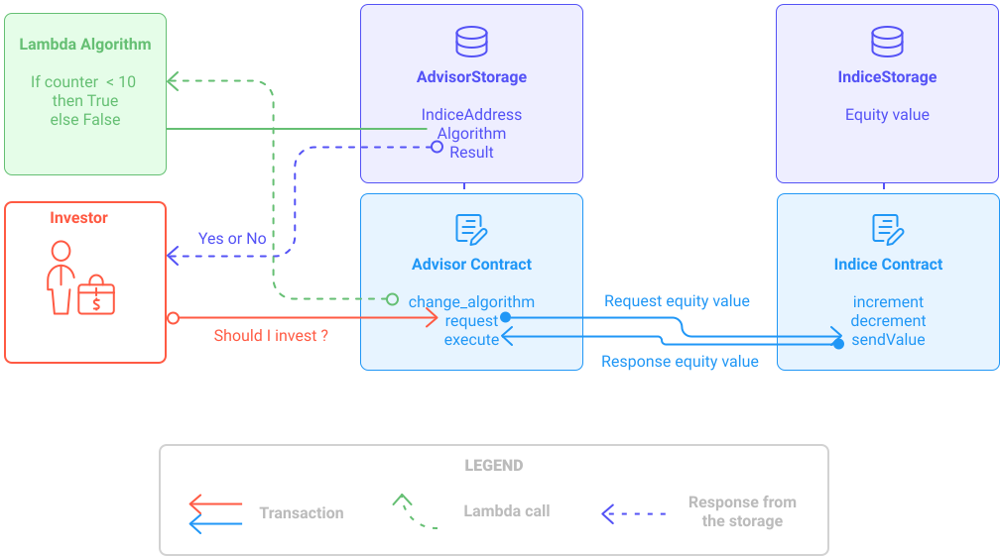

## Function

The example below comes from [Tezos Academy](https://tezosacademy.io/pascal/chapter-functions) 
and refers to the modification of a spaceship id.

So the following function takes a string `my_ship` as input, and 
modifies the third character to 1 and assigns the result to a constant `modified_ship`.

```js
type ship_code is string
var my_ship : ship_code := "020433"
function modify_ship_code (const my_ship : ship_code) : ship_code is
  block {
    const modified_ship = String.sub(0n, 2n, my_ship) ^ "1" ^ String.sub(3n, 3n, my_ship)
  } with modified_ship
```

You can call the function `modify_ship_code` defined above using the LIGO compiler like this:

```shell
ligo run-function function_example.ligo modify_ship_code '020433'
# Outputs: '021433'
```

## Record

The structured type `record` is used here to define the coordinates of a planet in the solar system.

```js
type coordinates is
    record [
        x : int;
        y : int;
        z : int
    ]

var earth_coordinates : coordinates :=
    record [
        x = 2;
        y = 7;
        z = 1
    ]

patch earth_coordinates with record [z = 5]
```

>A `patch with` instruction takes a `record` data structure to be updated, 
> and (a record with) a subset of fields to update, 
> then modifies the record data structure accordingly to the new specified subset of fields.


## Main function

In LIGO, the design aim is to have one main function called main, 
that dispatches the control flow according to its parameter. 
The functions used for those actions are called entrypoints.

In the example below:
- The functions `set_ship_code` and `go_to` are the entrypoints.
- `Set_ship_code` and `Go_to` are the associated actions.

```js
type parameter is
  Set_ship_code of string
| Go_to of string

type storage is record [
  ship_code : string;
  destination : string
]

type return is list (operation) * storage

function set_ship_code (const input_string : string; const store : storage) : return is
  ((nil : list (operation)), store with record [ship_code = input_string])

function go_to (const input_string : string; const store : storage) : return is
  ((nil : list (operation)), store with record [destination = input_string])

function main (const action : parameter; const store : storage): return is
  case action of
    Set_ship_code (input_string) -> set_ship_code (input_string, store)
  | Go_to (input_string) -> go_to (input_string, store)
  end
```

## Option

The example below comes from [Tezos Academy](https://tezosacademy.io/pascal/chapter-option) 
and deals with the modification of the weapon power of a spaceship to illustrate the use of option types.

In the code below , we can notice that the _weapons_ variable is defined as a mapping between the name of each weapon and its corresponding input of power.
We want to increase the power of the Main Laser but mapping returns optional results as they might not be found in the mapping. 
So we define the constant `main_laser_power` as an optional `int` from selecting "Main Laser" from the weapons mapping.

Then we write a pattern matching the `main_laser_power`.
- If it exists, it increases the power of the "Main Laser" by 1 (use i as temporary matching variable).  
- If it does not exist in the mapping, it the fails with "Weapon not found".

```js
type weapon_power is map (string, int)

function main (const p : unit; const store : unit) : (list(operation) * unit) is
  block {
    const weapons : weapon_power =
        map [
            "Main Laser" -> 5;
            "Right Laser" -> 2;
            "Left Laser" -> 3;
        ];

    const main_laser_power : option(int) = weapons["Main Laser"];
    case main_laser_power of
      Some(i) -> weapons["Main Laser"] := i + 1
    | None -> failwith("Weapon not found")
    end

  } with ((nil: list(operation)), unit)
```

# Full example - FundAdvisor

This example is meant to illustrate the communication between contracts (with get_entrypoint_opt LIGO function) 
and lambda pattern which allows you to modify a contract already deployed. 
It deals with implementing, deploying and interacting with Tezos smart contracts.

## The Fund and its advisor

The `indice` contract represents a fund value, 
and the `advisor` contract gives an advice on investing in this fund.

### Transaction workflow

The `advisor` contract can be invoked to request the fund value to the `indice` contract (via a transaction). 
The `indice` contract receives the request (transaction) 
and will sends back the requested value. 
When the `advisor` contract receives the fund value, it can apply the "algorithm" to check that it is worth investing !

<br/>


<small className="figure">FIGURE 1: FundAdvisor</small>

The resulting advice is stored in the storage (in result field).

### Lambda pattern

The real business logic of the `advisor` smart contract lies in the lambda function, which is defined in the storage. 
The storage is certified to be modified so as for the business logic (lambda).

So an entrypoint with `ChangeAlgorithm` is provided to modify the algorithm that computes the worth of investment.

> **Lambda pattern**   
> Changing the behaviour of a smart contract can be done by customizing its implementation through the lambda functions. 
> The idea is to implement the smart contract logic in a lambda function that can be modified after the contract is deployed.  
> Find out more about lambda [here](https://tezosacademy.io/pascal/chapter-lambda).

## Requirement

1. Having a LIGO Compiler, and a code editor installed. 
   If not, go [here](https://opentezos.com/ligo/installation).
2. Having a sandboxed mode ready.

## Sandboxed mode

This part will explain to you how to run a ‘localhost-only’ instance of a Tezos network.

### Run a sandboxed node

For instance, if you want to run a local network with two nodes, in the first terminal, 
the following command will initialize a node listening for peers on port 19731 and 
listening for RPC on port 18731.

```shell
./src/bin_node/tezos-sandboxed-node.sh 1 --connections 1
```

To launch the second node, run the following command in another terminal, 
and it will listen on port 19739 and 18739:

```shell
./src/bin_node/tezos-sandboxed-node.sh 9 --connections 1
```

### Use the sandboxed client

Once your node is running, open a new terminal 
and initialize the “sandboxed” client data in a temporary directory:

```shell
eval `./src/bin_client/tezos-init-sandboxed-client.sh 1`
```

### Activate a protocol

```shell
tezos-activate-alpha
```

> Find out more about sandboxed mode [here](https://tezos.gitlab.io/user/sandbox.html)

## First contract - Indice

The indice contract represents a fund value.

### Defining storage and entrypoints

Let's create an `indice_types.ligo` file to put all the needed type definitions.

- `indiceStorage` is an integer type that can have the value of an equity.
- `indiceEntrypoints` determine how the contract will be invoked:
  - By increasing the contract storage value using `Increment of int`.
  - By decreasing it with `Decrement of int`.
  - By sending the value to another contract that has called it, using `SendValue of unit`.
- `indiceFullReturn`that determines the return type of the main function.

```js
// indice_types.ligo

type indiceStorage is int

type indiceEntrypoints is Increment of int | Decrement of int | SendValue of unit

type indiceFullReturn is list(operation) * indiceStorage
```

> Note that the `sendValue` entrypoint does not take any parameter.

### Defining the main function

Now let's move to another file `indice.ligo` 
that will include the previous file `indice_types.ligo` 
and create the main function `indiceMain`
with writing `#include "indice_types.ligo"` at the beginning of the script.

```js
// indice.ligo
`#include "indice_types.ligo"`

function indiceMain(const ep : indiceEntrypoints; const store : indiceStorage) : indiceFullReturn is
block { skip } with ((nil: list(operation)), store )
```

Let's keep the block empty for now and see if it compiles correctly.

```shell
ligo compile-contract indice.ligo indiceMain
```

This should return:

```js
{ parameter or (or (int %decrement) (int %increment) (unit %sendValue)) ;
  storage int ;
  code { CDR ; NIL operation ; PAIR } }
```

Now let's implement the three entrypoints:

```js
// indice.ligo
`#include "indice_types.ligo"`

function indiceMain(const ep : indiceEntrypoints; const store : indiceStorage) : indiceFullReturn is
block { 
    const ret : indiceFullReturn = case ep of 
    | Increment(p) -> increment(p, store)
    | Decrement(p) -> decrement(p, store)
    | SendValue(p) -> sendValue(p, store)
    end;
    
 } with ret
```

### Defining the entrypoints

#### Increment

`increment` function takes two parameters:
- `param` of type `int` which is the value that will be added to the storage.
- `s` the initial value of the storage.

This function's return type is `indiceFullReturn` and returns:
- an empty list of operations.
- a modified storage with a new value of `s + param`.

```js
//indice.ligo

function increment(const param : int; const s : indiceStorage) : indiceFullReturn is 
block { skip } with ((nil: list(operation)), s + param)
```

#### Decrement

The `decrement` function takes two parameters:
- `param` of type `int` which is the value that will be removed from the storage.
- `s` the initial value of the storage.

This function's return type is `indiceFullReturn` and returns:
- an empty list of operations.
- a modified storage with a new value of `s - param`.

```js
//indice.ligo

function decrement(const param : int; const s : indiceStorage) : indiceFullReturn is 
block { skip } with ((nil: list(operation)), s - param)
```

#### SendValue

`sendValue` function takes two parameters:
- `param` of type `unit` which means it takes no parameter.
- `s` the initial value of the storage.

This function return type is `indiceFullReturn` and it returns:
- a list of operation containing a transaction.
- the initial storage that is not modified.

The predefined function `Tezos.get_entrypoint_opt` can be used 
to retrieve the definition of a single entry point.  
`%receiveValue` is the label of the entrypoint that will be defined in the advisor contract.

When the function `get_entrypoint_opt` does not find any contract 
at a given `address`, or if the contract doesn't match the type, then `None` is returned.

> Note that the `Tezos.get_entrypoint_opt` function is a two-way communication solution. 
> between contract that are already deployed.
> Find out more on `Tezos.get_entrypoint_opt` [here](https://tezosacademy.io/pascal/chapter-polymorphism).

```js
//indice.ligo

function sendValue(const param : unit; const s : indiceStorage) : indiceFullReturn is 
block { 
    const c_opt : option(contract(int)) = Tezos.get_entrypoint_opt("%receiveValue", Tezos.sender);
    const receiver : contract(int) = case c_opt of
    | Some(c) -> c
    | None -> (failwith("sender cannot receive indice value") : contract(int))
    end;
    const op : operation = Tezos.transaction(s, 0mutez, receiver);
    const txs : list(operation) = list [ op; ];
 } with (txs, s)
```

Let's compile again the main function to be sure we made no mistakes.

```shell
ligo compile-contract indice.ligo indiceMain
```

## Second contract - Advisor

Remember that the `advisor` contract can be invoked to request the fund value to the `indice` contract (via a transaction). 
The `indice` contract receives the request (transaction) and will sends back the requested value. 
When the `advisor` contract receives the fund value, it can apply the "algorithm" to check that it is worth investing !

### Defining storage and entrypoints

In a new file called `advisor_types.ligo` we define:

- `advisorStorage` which is a record type containing three fields:
    - `indiceAddress` of type `address` to communicate with the indice contract.
    - `algorithm` which takes an `int` as parameter and returns a `bool`, 
      depending on the business logic.
    - `result` which is `True` if the investor should invest and `False` otherwise.
- `advisorEntrypoints` that determines how the contract will be invoked:
    - By receiving an integer value from another contract's storage with `ReceiveValue of int`.
    - By requesting this value with `sendValue of unit`. 
    - By modifying the algorithm that computes the worth of investment with `ChangeAlgorithm of advisorAlgo`.
- `advisorFullReturn`that determines the return type of the main function.

```js
//advisor_types.ligo
type advisorAlgo is int -> bool

type advisorStorage is record [
    indiceAddress : address;
    algorithm : advisorAlgo;
    result : bool;
]

type advisorEntrypoints is ReceiveValue of int | RequestValue of unit | ChangeAlgorithm of advisorAlgo

type advisorFullReturn is list(operation) * advisorStorage
```
### Defining the main function

Like before, let's create another file `advisor.ligo`
that will include the previous file `advisor_types.ligo`
and create the main function `advisorMain`.

```js
//advisor.ligo
#include "advisor_types.ligo"

function advisorMain(const ep : advisorEntrypoints; const store : advisorStorage) : advisorFullReturn is
block { 
    const ret : advisorFullReturn = case ep of 
    | ReceiveValue(p) -> execute(p, store)
    | RequestValue(p) -> request(p, store)
    | ChangeAlgorithm(p) -> change(p, store)
    end;
 } with ret
```

### Defining the entrypoints

#### ReceiveValue

Symmetrically to the `SendValue` function defined for the indice contract, 
we define here, the `RequestValue` function, so that the two-way communication can be complete.

`request` function takes two parameters:
- `param` of type `unit` which means it takes no parameter.
- `s` the initial value of the storage.

This function return type is `advisorFullReturn` and returns:
- a list of operation containing a transaction.
- the initial storage that is not modified.

```js
//advisor.ligo

function request(const p : unit; const s : advisorStorage) : advisorFullReturn is
block { 
    const c_opt : option(contract(unit)) = Tezos.get_entrypoint_opt("%sendValue", s.indiceAddress);
    const receiver : contract(unit) = case c_opt of
    | Some(c) -> c
    | None -> (failwith("indice cannot send its value") : contract(unit))
    end;
    const op : operation = Tezos.transaction(unit, 0mutez, receiver);
    const txs : list(operation) = list [ op; ];
 } with (txs, s)
```

#### RequestValue

`execute` function takes two parameters:
- `indiceVal` of type `int` which is the value that will be passed in the algorithm.
- `s` the initial value of the storage.

This function's return type is `advisorFullReturn` and returns:
- an empty list of operations
- a modified storage with a new value for `s.result`
  that will be the boolean return of the algorithm.

```js
//advisor.ligo

function execute(const indiceVal : int; const s : advisorStorage) : advisorFullReturn is
block { 
    s.result := s.algorithm(indiceVal)
 } with ((nil : list(operation)), s)
```

#### ChangeAlgorithm

`change` function takes two parameters:
- `p` of type `advisorAlgo` which is the algorithm function corresponding to the wanted business logic.
- `s` the initial value of the storage.

This function's return type is `advisorFullReturn` and returns:
- an empty list of operations
- a modified storage with a new value for `s.algorithm `.

```js
//advisor.ligo

function change(const p : advisorAlgo; const s : advisorStorage) : advisorFullReturn is
block { 
    s.algorithm := p;
 } with ((nil : list(operation)), s)
```

Let's compile the main function.

```shell
ligo compile-contract advisor.ligo advisorMain
```

## Dry-run, compilation and deployment

### Indice contract

```js
//indice.ligo
#include "indice_types.ligo"

function increment(const param : int; const s : indiceStorage) : indiceFullReturn is 
block { skip } with ((nil: list(operation)), s + param)

function decrement(const param : int; const s : indiceStorage) : indiceFullReturn is 
block { skip } with ((nil: list(operation)), s - param)

function sendValue(const param : unit; const s : indiceStorage) : indiceFullReturn is 
block { 
    const c_opt : option(contract(int)) = Tezos.get_entrypoint_opt("%receiveValue", Tezos.sender);
    const receiver : contract(int) = case c_opt of
    | Some(c) -> c
    | None -> (failwith("sender cannot receive indice value") : contract(int))
    end;
    const op : operation = Tezos.transaction(s, 0mutez, receiver);
    const txs : list(operation) = list [ op; ];
 } with (txs, s)

function indiceMain(const ep : indiceEntrypoints; const store : indiceStorage) : indiceFullReturn is
block { 
    const ret : indiceFullReturn = case ep of 
    | Increment(p) -> increment(p, store)
    | Decrement(p) -> decrement(p, store)
    | SendValue(p) -> sendValue(p, store)
    end;
    
 } with ret
```

#### Simulation

Let's simulate the indice contract with the increment action using `5` as parameter and an initial storage of `0`.

```shell
ligo dry-run indice.ligo indiceMain 'Increment(5)' '0'
```

This should return:

```js
( LIST_EMPTY(), 5 )
```

As expected there is an empty list of operation, and the storage has been incremented by 5.

To be sure let's modify the initial value of the storage to `4`.

```shell
ligo dry-run indice.ligo indiceMain 'Increment(5)' '4'
```

This should return:

```js
( LIST_EMPTY(), 9 )
```

Let's simulate another entrypoint, `sendValue`:

```shell
ligo dry-run indice.ligo indiceMain 'SendValue(unit)' '3'
```

This command should return:

```js
failwith("sender cannot receive indice value")
```

Indeed, because the contract is not deployed yet. 
This is the limite in terms of simulation.

#### Compilation

Now, let's prepare the parameters and the storage.

```shell
ligo compile-storage indice.ligo indiceMain '0'
#output: 0
```

```shell
ligo compile-parameter indice.ligo indiceMain 'Increment(5)'
#output: (Left (Right 5))
```

```shell
ligo compile-parameter indice.ligo indiceMain 'Decrement(5)'
#output: (Left (Left 5))
```

```shell
ligo compile-parameter indice.ligo indiceMain 'SendValue(unit)'
#output: (Right Unit)
```

> **Reminder:** `0`, `(Left (Right 5))`, `(Left (Left 5))`, `(Right Unit)` are Michelson expressions that 
> can be used as parameter in `tezos-client` command lines.

Once everything's looks ok, we can compile the main function and save the output in a `indice.tz` file.

```shell
ligo compile-contract indice.ligo indiceMain > indice.tz
```

This should return:

```js
{ parameter (or (or (int %decrement) (int %increment)) (unit %sendValue)) ;
  storage int ;
  code { DUP ;
         CDR ;
         SWAP ;
         CAR ;
         IF_LEFT
           { IF_LEFT
               { SWAP ; SUB ; NIL operation ; PAIR }
               { ADD ; NIL operation ; PAIR } }
           { DROP ;
             SENDER ;
             CONTRACT %receiveValue int ;
             IF_NONE { PUSH string "sender cannot receive indice value" ; FAILWITH } {} ;
             PUSH mutez 0 ;
             DIG 2 ;
             DUP ;
             DUG 3 ;
             TRANSFER_TOKENS ;
             SWAP ;
             NIL operation ;
             DIG 2 ;
             CONS ;
             PAIR } } }
```

#### Deployment

To display the list of deployed contracts, run the following command:

```shell
tezos-client list known contracts
```

This should return something like this:

```
activator: tz1TGu6TN5GSez2ndXXeDX6LgUDvLzPLqgYV
bootstrap5: tz1ddb9NMYHZi5UzPdzTZMYQQZoMub195zgv
bootstrap3: tz1b7tUupMgCNw2cCLpKTkSD1NZzB5TkP2sv
bootstrap2: tz1faswCTDciRzE4oJ9jn2Vm2dvjeyA9fUzU
bootstrap1: tz1KqTpEZ7Yob7QbPE4Hy4Wo8fHG8LhKxZSx
```

Note that in the sandboxed mode there are already users that are created, that we can reuse later.

It's time to deploy the indice smart contract.

```shell
tezos-client originate contract indice transferring 1 from bootstrap1  running 'indice.tz' --init '0' --dry-run
```

You should have an error message telling you to specify the gaz fee with `--burn-cap`

Try again and if everything works properly run the same command without the `--dry-run` part.

```shell
tezos-client originate contract indice transferring 1 from bootstrap1  running 'indice.tz' --init '0' --burn-cap 0.12525
```

The transaction is now launched, and you should have the following response:

```
Node is boostrapped.
Estimated gas 2306,275 units (will add 100 + 88 for safety)
Estimated storage: 501 bytes added (will add 20 for safety)
Operation successfully injected in the node.
Operation hash is 'opR766cSqn37L8qCjgcEqu4tfGeukCKBezpHjjicAYB4NYf6g2b'
Waiting for the operation to be included...
```

Let's open another terminal in order to bake this transaction using the following command line:

```shell
tezos-client bake for bootstrap1
```

> **Tezos baking** is the process of signing and appending a block of transactions to the Tezos blockchain.

Now, run the command below and see your indice contract on the list !

```shell
tezos-client list known contracts
```

```
indice: KT1D99kSAsGuLNmT1CAZWx51vgvJpzSQuoZn
activator: tz1TGu6TN5GSez2ndXXeDX6LgUDvLzPLqgYV
bootstrap5: tz1ddb9NMYHZi5UzPdzTZMYQQZoMub195zgv
bootstrap3: tz1b7tUupMgCNw2cCLpKTkSD1NZzB5TkP2sv
bootstrap2: tz1faswCTDciRzE4oJ9jn2Vm2dvjeyA9fUzU
bootstrap1: tz1KqTpEZ7Yob7QbPE4Hy4Wo8fHG8LhKxZSx
```

Write down your indice contract address somewhere because you will need it to initialize your advisor contract.

### Advisor contract

```js
//advisor.ligo
#include "advisor_types.ligo"

function request(const p : unit; const s : advisorStorage) : advisorFullReturn is
block { 
    const c_opt : option(contract(unit)) = Tezos.get_entrypoint_opt("%sendValue", s.indiceAddress);
    const receiver : contract(unit) = case c_opt of
    | Some(c) -> c
    | None -> (failwith("indice cannot send its value") : contract(unit))
    end;
    const op : operation = Tezos.transaction(unit, 0mutez, receiver);
    const txs : list(operation) = list [ op; ];
 } with (txs, s)

function execute(const indiceVal : int; const s : advisorStorage) : advisorFullReturn is
block { 
    s.result := s.algorithm(indiceVal)
 } with ((nil : list(operation)), s)


function change(const p : advisorAlgo; const s : advisorStorage) : advisorFullReturn is
block { 
    s.algorithm := p;
 } with ((nil : list(operation)), s)

function advisorMain(const ep : advisorEntrypoints; const store : advisorStorage) : advisorFullReturn is
block { 
    const ret : advisorFullReturn = case ep of 
    | ReceiveValue(p) -> execute(p, store)
    | RequestValue(p) -> request(p, store)
    | ChangeAlgorithm(p) -> change(p, store)
    end;
 } with ret
```

#### Simulation

Let's simulate the advisor contract with an initial storage of:  
`record[indiceAddress=("KT1D99kSAsGuLNmT1CAZWx51vgvJpzSQuoZn" : address); algorithm=(function(const i : int) is False); result=False]`.

Note that we choose a simple algorithm function that is `function(const i : int) is False` therefore the saved result is `False` too.

Let's simulate with `ReceiveValue(5)` as an action.

```shell
ligo dry-run advisor.ligo advisorMain 'ReceiveValue(5)' 'record[indiceAddress=("KT1D99kSAsGuLNmT1CAZWx51vgvJpzSQuoZn" : address); algorithm=(function(const i : int) is False); result=False];'
```

Let's simulate with `RequestValue(unit)` as an action.

```shell
ligo dry-run advisor.ligo advisorMain 'RequestValue(unit)' 'record[indiceAddress=("KT1D99kSAsGuLNmT1CAZWx51vgvJpzSQuoZn" : address); algorithm=(function(const i : int) is False); result=False]'
```

Let's simulate with `ChangeAlgorithm(function(const i : int) is if i < 10 then True else False)` as action.

```shell
ligo dry-run advisor.ligo advisorMain 'ReceiveValue(5)' 'record[indiceAddress=("KT1D99kSAsGuLNmT1CAZWx51vgvJpzSQuoZn" : address); algorithm=(function(const i : int) is False); result=False]'
```

#### Compilation

Now, let's prepare the parameters and the storage.

```shell
ligo compile-parameter advisor.ligo advisorMain 'ReceiveValue(5)'
#output: (Left (Right 5))
```

```shell
ligo compile-parameter advisor.ligo advisorMain 'RequestValue(unit)'
#output: (Right Unit)
```

Let's say we want to change the algorithm to a more interesting one but still using a simple business logic : 
*if the indice of a stock (indice storage) is under 20, one should invest*.

```shell
ligo compile-parameter advisor.ligo advisorMain 'ChangeAlgorithm(function(const i : int) is if i < 20 then True else False)'
#output: (Left (Left { PUSH int 20 ; SWAP ; COMPARE ; LT ; IF { PUSH bool True ] [ PUSH bool False } }))
```

Let's compile the storage with a similar business logic as an initial state.

```shell
ligo compile-storage advisor.ligo advisorMain 'record[indiceAddress=("KT1D99kSAsGuLNmT1CAZWx51vgvJpzSQuoZn" : address); algorithm=(function(const i : int) is if i < 10 then True else False); result=False]'
```

This command should return:

```js
(Pair (Pair { PUSH int 10 ;
              SWAP ;
              COMPARE ;
              LT ;
              IF { PUSH bool True ] [ PUSH bool False } }
            "KT1D99kSAsGuLNmT1CAZWx51vgvJpzSQuoZn")
      False) 
```

Once everything's looks ok, we can compile the main and save the output in a `advisor.tz` file.

```shell
ligo compile-contract advisor.ligo indiceMain > advisor.tz
```

This should return:

```js
{ parameter
    (or (or (lambda %changeAlgorithm int bool) (int %receiveValue)) (unit %requestValue)) ;
  storage
    (pair (pair (lambda %algorithm int bool) (address %indiceAddress)) (bool %result)) ;
  code { DUP ;
         CDR ;
         SWAP ;
         CAR ;
         IF_LEFT
           { IF_LEFT
               { SWAP ;
                 DUP ;
                 DUG 2 ;
                 CDR ;
                 DIG 2 ;
                 CAR ;
                 CDR ;
                 DIG 2 ;
                 PAIR ;
                 PAIR ;
                 NIL operation ;
                 PAIR }
               { SWAP ;
                 DUP ;
                 DUG 2 ;
                 CAR ;
                 CAR ;
                 SWAP ;
                 EXEC ;
                 SWAP ;
                 CAR ;
                 PAIR ;
                 NIL operation ;
                 PAIR } }
           { DROP ;
             DUP ;
             CAR ;
             CDR ;
             CONTRACT %sendValue unit ;
             IF_NONE { PUSH string "indice cannot send its value" ; FAILWITH } {} ;
             PUSH mutez 0 ;
             UNIT ;
             TRANSFER_TOKENS ;
             SWAP ;
             NIL operation ;
             DIG 2 ;
             CONS ;
             PAIR } } }
```

#### Deployment

In the same way as the indice contract, let's run the following command in a `--dry-run` mode.  
In the `--init` section we put the michelson result of the `compile-storage` that we just ran above.

```shell
tezos-client originate contract advisor transferring 1 from bootstrap1  running 'advisor.tz' --init '(Pair (Pair { PUSH int 10 ; SWAP ; COMPARE ; LT ; IF { PUSH bool True } { PUSH bool False } } "KT1D99kSAsGuLNmT1CAZWx51vgvJpzSQuoZn") False)' --dry-run
```

You should have an error message telling you to specify the gaz fee with `--burn-cap`

Try again and if everything works properly run the same command without the `--dry-run` part.

```shell
tezos-client originate contract advisor transferring 1 from bootstrap1  running 'advisor.tz' --init '(Pair (Pair { PUSH int 10 ; SWAP ; COMPARE ; LT ; IF { PUSH bool True } { PUSH bool False } } "KT1D99kSAsGuLNmT1CAZWx51vgvJpzSQuoZn") False)' --burn-cap 0.16825
```

The transaction is now launched, and you should have the following response:

```
Node is boostrapped.
Estimated gas 3144,273 units (will add 100 + 112 for safety)
Estimated storage: 673 bytes added (will add 20 for safety)
Operation successfully injected in the node.
Operation hash is 'opR766cSqn37L8qCjgcEqu4tfGeukCKBezpHjjicAYB4NYf6g2b'
Waiting for the operation to be included...
```

Let's open another initialized terminal in order to bake this transaction using the following command line:

```shell
tezos-client bake for bootstrap1
```

Now, run the command below and see your advisor contract on the list !

```shell
tezos-client list known contracts
```

```
advisor: KT1FzbmriX7zNuKh6wTiRQidk9eyb7zFsk6c
indice: KT1D99kSAsGuLNmT1CAZWx51vgvJpzSQuoZn
activator: tz1TGu6TN5GSez2ndXXeDX6LgUDvLzPLqgYV
bootstrap5: tz1ddb9NMYHZi5UzPdzTZMYQQZoMub195zgv
bootstrap3: tz1b7tUupMgCNw2cCLpKTkSD1NZzB5TkP2sv
bootstrap2: tz1faswCTDciRzE4oJ9jn2Vm2dvjeyA9fUzU
bootstrap1: tz1KqTpEZ7Yob7QbPE4Hy4Wo8fHG8LhKxZSx
```

### Use

Now that the two contracts are deployed we are able to use them.

You can run the following command to access the storage of the indicated contract.

```shell
tezos-client get contract storage for advisor
```

This should return the same result as the `compile-storage` command because no transaction has been made yet.

```js
(Pair (Pair { PUSH int 10 ;
              SWAP ;
              COMPARE ;
              LT ;
              IF { PUSH bool True ] [ PUSH bool False } }
            "KT1D99kSAsGuLNmT1CAZWx51vgvJpzSQuoZn")
      False) 
```

Let's check for the indice contract as well.

```shell
tezos-client get contract storage for indice
//output: 0
```

Now, let's do a transaction!

Imagine the user **bootstrap3** wants to use the advisor smart contract to know if he should invest.

For that, he must make a transaction using the action `RequestValue(Unit)` for which the michelson expression is `(Right Unit)`.

```shell
tezos-client transfer 0 from bootstrap3 to advisor --arg '(Right Unit)'
```

Then in another terminal let's bake for **bootstrap3**,

```shell
tezos-client bake for bootstrap3
```

Now let's check if it's worth the investment by looking at the storage

```shell
tezos-client get contract storage for advisor
```

```js
(Pair (Pair { PUSH int 10 ;
              SWAP ;
              COMPARE ;
              LT ;
              IF { PUSH bool True ] [ PUSH bool False } }
            "KT1D99kSAsGuLNmT1CAZWx51vgvJpzSQuoZn")
      True) 
```

The result pass from `False` to `True` in the result field, if it is worth the investment.

However, this is the case because the initial value of the indice storage is `0` 
and our algorithm will returns true if this value is under `10`.

Now it is your turn to play with these two smart contracts by, for example, incrementing the indice storage or changing the advisor algorithm.

> Remember if you are not sure what you are doing add `--dry-run` at the end of the command line to see if everything is ok.

To go further you can find the code with video explanations on this [Github](https://github.com/frankhillard/ligo_tutorial_fundadvisor).
