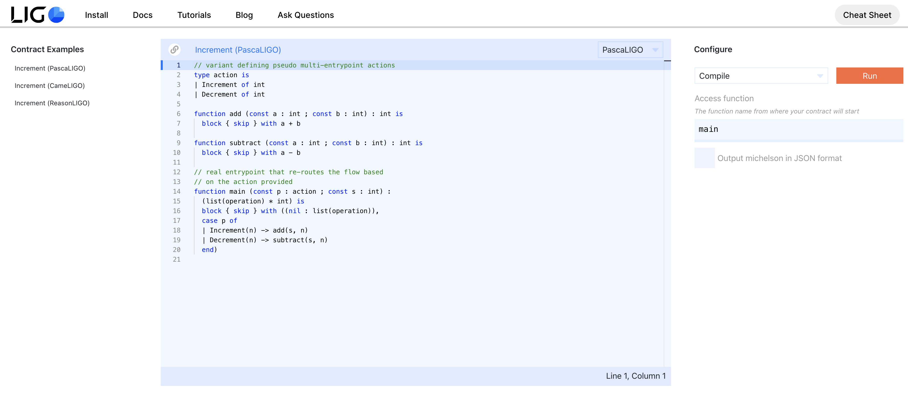
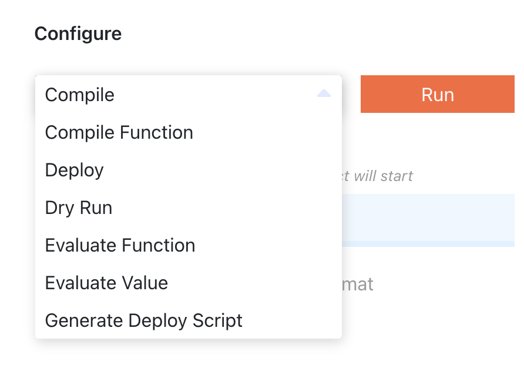

There are currently four ways to get started with LIGO. You can choose to use a Docker image, a static Linux binary, or install packages for your Debian Linux distribution, or you can try directly on the [online editor](https://ide.ligolang.org/).

## Dockerized installation (recommended)
If you've [installed 🐳 Docker](https://docs.docker.com/install/), you are able to run the latest LIGO release 0.11.0:

Linux or OSX:
> `docker run --rm -v "$PWD":"$PWD" -w "$PWD" ligolang/ligo:0.11.0`

Windows:
> `docker run --rm -v "%CD%":/cd -w /cd ligolang/ligo:0.11.0`

Or if you want the development version, replace the version above with `next`.

Or run one of the older versions found at [DockerHub](https://hub.docker.com/r/ligolang/ligo/tags).

## Static Linux binary

The `ligo` executable is statically linked. It should run on most modern Linux distributions.

To use it, get it [here](https://ligolang.org/bin/linux/ligo), make it executable, and you're done!

```zsh
wget https://ligolang.org/bin/linux/ligo
chmod +x ./ligo
```

Optionally, you can put it somewhere in your `PATH` for easy access:

```zsh
sudo cp ./ligo /usr/local/bin
```

## Debian Linux package installation

A `.deb` package containing the static `ligo` executable is also available.
You can download [this package](https://ligolang.org/deb/ligo.deb) or go [here](https://gitlab.com/ligolang/ligo/-/releases), and then install it using:

```zsh
sudo apt install ./ligo.deb
```

## Online Editor

You can choose your preferred syntax and write your LIGO instructions directly in the online text editor.

It is available at [ligolang.org](https://ligolang.org/) in the [Try Online](https://ide.ligolang.org/) tab.


<small className="figure">FIGURE 1: Try Online</small>

You can then execute your code by choosing from the following features:
- Compile
- Compile Function
- Deploy
- Dry Run
- Evaluate Function
- Evaluate Value
- Generate Deploy Script


<small className="figure">FIGURE 2: Online Editor Compilation </small>

# Editor Support
Painters need a brush and a canvas. Developers need a good IDE experience. LIGO currently offers support for [VSCode](https://code.visualstudio.com), including syntax highlighting and on-the-fly compilation error reporting.

Available extensions:
- **[Syntax highlighting for PascaLIGO](https://marketplace.visualstudio.com/items?itemName=LigoLang.pascaligo-vscode)**
- **[On-the-fly compilation error reporting](https://marketplace.visualstudio.com/items?itemName=Ligo.ligo-tools)**

# References

[1] https://ligolang.org/docs/intro/installation

[2] https://ide.ligolang.org/
