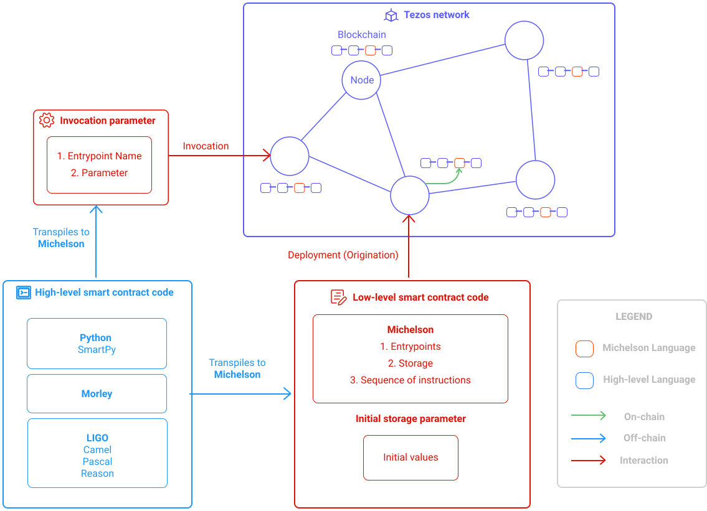

import Tabs from '@theme/Tabs';
import TabItem from '@theme/TabItem';

Tezos smart contracts are written in [Michelson](https://opentezos.com/michelson), which is a stack-based language.
It is the lowest level of a Tezos smart contract: what will be deployed on a Tezos network, is Michelson code.
However, if reading or writing Michelson code is still easy for small smart contracts, 
it can become very tedious for more complex smart contracts:
- there are no variables nor functions
- no syntactic sugar
- the Michelson code cannot be broken down into several files
- stack-based languages are not commonly used when it comes to web development.

LIGO solves these issues. 
It is a high-level language for smart contracts development.
Smart contracts are developed in Ligo, then transpiled into a single Michelson code file. 
This Michelson file is the smart contract that will be deployed on a tezos network.

<br/>


<small className="figure">FIGURE 1: Ligo contextualisation </small>

<br/>

As said above, LIGO is a programming language for writing **[Tezos](https://tezos.com/) smart contracts**.
The diagram helps to contextualize the role of LIGO in the Tezos ecosystem.

LIGO is active in the left part as a development tool allowing
for the production of smart contracts (scripts in Michelson),
which can be deployed on the blockchain.
Tezos nodes broadcast information through the Tezos network 
in order to maintain an immutable common ledger (blockchain) # I would remove this sentence


LIGO currently offers three flavoured syntaxes:

- **PascaLIGO**, a syntax inspired by Pascal which provides an imperative developer experience.

- **CameLIGO**, an [OCaml](https://ocaml.org/) inspired syntax that allows you to write in a functional style.

- **ReasonLIGO**, a [ReasonML](https://reasonml.github.io/) inspired syntax that builds on the strong points of OCaml. 
  It aims to be familiar to those coming from JavaScript.

Here is an example of a Counter contract that handles a single integer's "counter" value 

as storage and allows users to increment decrement or reset this counter.

<Tabs
  defaultValue="pascaligo"
  values={[
  { label: 'PascaLIGO', value: 'pascaligo', },
  { label: 'CameLIGO', value: 'cameligo', },
  { label: 'ReasonLIGO', value: 'reasonligo', },
  ]
}>

<TabItem value="pascaligo">

```js
type storage is int

type parameter is
  Increment of int
| Decrement of int
| Reset

type return is list (operation) * storage

function main (const action : parameter; const store : storage) : return is
 ((nil : list (operation)),
  case action of
    Increment (n) -> store + n
  | Decrement (n) -> store - n
  | Reset         -> 0
 end)
```

</TabItem>
<TabItem value="cameligo">

```js
type storage = int

type parameter =
  Increment of int
| Decrement of int
| Reset

type return = operation list * storage

let main (action, store : parameter * storage) : return =
  ([] : operation list),
  (match action with
     Increment n -> store + n
   | Decrement n -> store - n
   | Reset       -> 0)
```

</TabItem>
<TabItem value="reasonligo">

```js
type storage = int;

type parameter =
  Increment (int)
| Decrement (int)
| Reset;

type return = (list (operation), storage);

let main = ((action, store): (parameter, storage)) : return => {
  (([] : list (operation)),
  (switch (action) {
   | Increment (n) => store + n
   | Decrement (n) => store - n
   | Reset         => 0}));
};
```

</TabItem>
</Tabs>

This LIGO contract accepts the following LIGO expressions:
`Increment(n)`, `Decrement(n)` and `Reset`. Those serve as
`entrypoint` identification.

<br/>

The goal of this module is to allow a developer to install the LIGO transpiler on his operating system
and give him the essential skills to write and deploy his first smart contract
onto the Tezos blockchain.
PascaLigo will be used throughout this module.

It will include the bases of the LIGO language,
inspired by the [official documentation](https://ligolang.org/docs/language-basics/types),
as well as detailed smart contract examples.
You will also be offered an exam to check your understanding.

