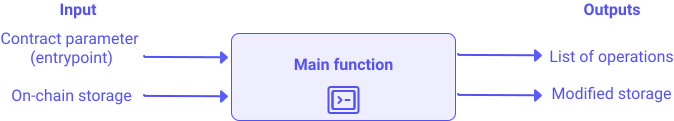

In this chapter, all the following examples will use the PascaLigo syntax.

# Types

LIGO is a strongly and statically typed language. This means that the compiler can checks how your contract processes data, 
ensuring that each function's expectations are met. 
If it passes the test, your contract will not fail during run-time due to some inconsistent assumptions in your data. 
This is called type checking.

LIGO types are built on top of the Michelson's type system.

## Built-in types

LIGO comes with all basic types built-in like _string_, _int_ or _tez_ (for account balance or monetary transactions). 
You can find all the built-in types on the [LIGO gitlab](https://gitlab.com/ligolang/ligo/-/tree/dev#L35).

## Type aliases

Type aliasing consists of renaming a given type when the context calls for a more precise name. 
This increases the readability and maintainability of your smart contracts. 
For example, we can choose to alias a _string_ type as an animal breed; this will allow us to communicate our intent with added clarity.

```js
type breed is string
const dog_breed : breed = "Saluki"
```

## Simple types (Map example)

The keyword `type` also allows to manipulate complex data structures by defining new types. New _type_ definitions are composed of primitive types (e.g. `string`, `int`) and composite types (e.g. `map`, `list`, `option`).

For example, the following snippet of code defines a new type `account_balances` which is a `map` (collection containing key-value pairs) where the _key_ is typed `address` and the _value_ typed `tez`.

```js
// The type account_balances denotes maps from addresses to tez

type account_balances is map (address, tez)

const ledger : account_balances =
  map [("tz1KqTpEZ7Yob7QbPE4Hy4Wo8fHG8LhKxZSx" : address) -> 10mutez]
```
We will look more deeply into the `map` construct in the following chapters.

## Structured types (Record example)

Often contracts require complex data structures, 
which in turn require the use of well-typed storage or functions to work with. 
LIGO offers a simple way to compose simple types into structured types.

The first of those structured types is the record, 
which aggregates types as fields and indexes them with a field name. 
In the example below, you can see the definition of data types 
for a ledger that keeps the balance and the number of previous transactions for a given account.

```js
type account is record [
  balance : tez;
  transactions : nat
]

const my_account : account = record [
    balance = 10mutez;
    transactions = 5n
  ]
```

We will look more deeply into the `record` construct in the following chapters.

# Constants & Variables

## Constants

Constants are immutable by design, which means their values cannot be reassigned. 
Put in another way, they can be assigned once, at their declaration. 
When defining a constant you need to provide a name, type and a value:

```js
const age : int = 25
```

## Variables

Variables, unlike constants, are mutable. 
They cannot be declared in a global scope, but they can be declared and used within functions, 
or as function parameters.

```js
var c: int := 2 + 3
c := c - 3
```

⚠️ Notice the assignment operator **:=** for `var`, instead of **=** for `const`.

# Maths, Numbers & Tez

LIGO offers four built-in numerical types:

- `int` are integers, such as `10`, `-6` and `0`.
- `nat` are natural numbers (integral numbers greater than or equal to zero). 
  They are followed by the suffix **n** such as `3n`, `12n` and `0n` for the natural zero.
- `tez` are units of measure of Tezos tokens. They can be decimals and are followed by **tez** or **tz** such as `3tz` or `12.4tez`. 
  You can also type units of millionths of tez, using the suffix **mutez** after a natural literal, such as `1000mutez` or `0mutez`.
- `bytes` are sequence of bytes, such as `0x12e4`.

⚠️ Notice there are no floating point types in LIGO as they are not determinist in hardware modules.

> Pro tip: you can use underscores for readability when defining large
> numbers:
>```js
>const sum : tez = 100_000mutez
>```

## Addition

Addition in LIGO is accomplished by means of the `+` infix
operator. Some type constraints apply, for example, you cannot add a
value of type `tez` to a value of type `nat`.

```js
// int + int yields int
const a : int = 5 + 10

// nat + int yields int
const b : int = 5n + 10

// tez + tez yields tez
const c : tez = 5mutez + 0.000_010tez

//tez + int or tez + nat is invalid
// const d : tez = 5mutez + 10n

// two nats yield a nat
const e : nat = 5n + 10n

// nat + int yields an int: invalid
// const f : nat = 5n + 10;

const g : int = 1_000_000
```

## Subtraction

Subtraction looks as follows.

⚠️ Even when subtracting two `nat` values, the result is an `int` value.

```js
const a : int = 5 - 10

// Subtraction of two nats yields an int
const b : int = 5n - 2n

// Therefore, the following is invalid
// const c : nat = 5n - 2n

const d : tez = 5mutez - 1mutez
```

## Multiplication

You can multiply values of the same type, such as:

```js
const a : int = 5 * 5
const b : nat = 5n * 5n

// You can also multiply `nat` and `tez`
const c : tez = 5n * 5mutez
```

## Division

In LIGO you can divide `int`, `nat`, and `tez`. Here is how:

⚠️ Remember that there are no floating point numbers in LIGO so dividing 9 by 2 will output 4 and not 4.5

Therefore, the division of two `tez` values results in a `nat` value.

The division of a `tez` value by a `nat` value results in a `tez` value.


```js
const a : int = 10 / 3
const b : nat = 10n / 3n
const c : nat = 10mutez / 3mutez
const d : tez = 10mutez / 2n
```

## Modulo

LIGO also allows you to compute the remainder of a Euclidean division. In LIGO, it is a natural number.

```js
const a : int = 120
const b : int = 9
const rem1 : nat = a mod b  // 3
```

## Casting

You can *cast* an `int` to a `nat` and vice versa. Here is how:

```js
const a : int = int (1n)
const b : nat = abs (1)
```

## Checking a nat

You can check if a value is a `nat` by using a predefined cast
function `is_nat` which accepts an `int` value and returns an optional `nat`: if the
result is not `None`, then the provided integer was indeed a natural
number.

```js
const is_a_nat : option (nat) = is_nat (1)
```

The `option` type expresses whether there is a value of some type or none. The `option` type will be explained later in this chapter.

# Strings

Strings are defined using the built-in `string` as follows:

```js
const a : string = "Hello Captain Rogers"
```

## Concatenating Strings

Strings can be concatenated using the `^` operator.

```js
const name : string = "Captain Rogers"
const greeting : string = "Hello"
const full_greeting : string = greeting ^ " " ^ name
```

## Slicing Strings

Strings can be sliced using a built-in function `String.sub` which takes three parameters:
- an **offset** describing the index of the first character that will be copied
- the **length** describing the number of characters that will be copied (starting from the given offset)
- the **string** being sliced

```js
const name  : string = "Captain Rogers"
const slice : string = String.sub (0n, 1n, name)
```

⚠️ Notice that the offset and length of the slice are natural numbers.

## Length of Strings

The length of a `string` value can be found using a built-in function `String.length` as follows:

```js
const name : string = "Captain Rogers"
const length : nat = String.length (name) // length = 14
```

# Functions

LIGO functions are the basic building block of contracts. 
Each entrypoint of a contract is a function 
and each smart contract must have at least one function named _main_ 
that dispatches the control flow to other functions.

When calling a function, 
LIGO makes a copy of the arguments but also the environment variables. 
Therefore, any modification to these will not be reflected outside the scope of the function 
and will be lost if not explicitly returned by the function.

There are 2 types of functions in PascaLIGO, Block Functions and Blockless Functions:

# Block functions

In PascaLIGO, blocks allow for the sequential composition of instructions into an isolated scope. 
Each block needs to include at least one instruction.

```js
block { 
    const b : int = 10
    a := a + b 
}
```

If we need a placeholder, we use the instruction `skip` which leaves
the state unchanged.  The rationale for `skip` instead of a truly
empty block is that it prevents you from writing an empty block by
mistake.

```js
block { skip }
```

Functions using PascaLIGO are defined with the following syntax:

```js
function <name> (<parameters>) : <return_type> is 
  block {
   <operations and instructions>
  } with <returned_value>
```

For instance :

```js
function add (const a : int; const b : int) : int is
  block {
    const sum : int = a + b
  } with sum
```

## Blockless functions

Functions that can contain all of their logic into a single expression can be defined without the need for a block. 
The add function above can be re-written as a blockless function:

```js
function add (const a: int; const b : int) : int is a + b
```

## Anonymous functions (a.k.a. lambdas)

It is possible to define functions without assigning them a name. 
They are useful when you want to pass them as arguments, 
or assign them to a key in a record or a map.

```js
function increment (const b : int) : int is
   (function (const a : int) : int is a + 1) (b)
const a : int = increment (1); // a = 2
```

If the example above seems contrived, here is a more common design pattern for lambdas: 
to be used as parameters to functions. 
Consider the use case of having a list of integers and mapping the increment function to all its elements.

```js
function incr_map (const l : list (int)) : list (int) is
  List.map (function (const i : int) : int is i + 1, l)
```

> For the input "list [1;2;3]" the output will be [2;3;4]

## Recursive function

LIGO functions are not recursive by default, 
the user needs to, indicate that the function is recursive.

At the moment, 
recursive functions are limited to one (possibly tupled) parameter 
and recursion is limited to tail recursion (i.e the recursive call should be the last expression of the function)

In PascaLigo recursive functions are defined using the `recursive` keyword.

```js
recursive function sum (const n : int; const acc: int) : int is
  if n<1 then acc else sum(n-1,acc+n)
```

# Booleans & Conditionals

## Booleans

The type of boolean value is `bool`. Here is how to define a boolean
value:

```js
const a : bool = True   // Also: true
const b : bool = False  // Also: false
```

| Operator | Example                                        |
| :------: | ---------------------------------------------- |
| **and**  | ```const logical_and: bool = True and True;``` |
|  **or**  | ```const logical_or: bool = False or True;```  |
| **not**  | ```const logical_not: bool = not False;```     |
|  **=**   | ```const eq: bool = 2 = 3;```                  |
| **=/=**  | ```const not_eq: bool = 2 =/= 3;```            |
|  **>**   | ```const gt: bool = 4 > 3;```                  |
|  **<**   | ```const lt: bool = 4 < 3;```                  |
|  **>=**  | ```const gte: bool = 4 >= 3;```                |
|  **<=**  | ```const lte: bool = 4 <= 3;```                |

## Comparing Values

Only values of the same type can be natively compared, 
i.e. int, nat, string, tez, timestamp, address, etc... 
However some values of the same type are not natively comparable, 
i.e. maps, sets or lists. 
You will have to write your own comparison functions for those values.

### Comparing Strings

```js
const a : string = "Captain Rogers"
const b : string = "Captain Rogers"
const c : bool = (a = b) // True
```

### Comparing numbers

```js
const a : int  = 5
const b : int  = 4
const c : bool = (a = b)
const d : bool = (a > b)
const e : bool = (a < b)
const f : bool = (a <= b)
const g : bool = (a >= b)
const h : bool = (a =/= b)
```

### Comparing tez

```js
const a : tez  = 5mutez
const b : tez  = 10mutez
const c : bool = (a = b) // False
```

> 💡 Comparing `tez` values is especially useful when dealing with an amount sent in a transaction.

## Conditionals

Conditional logic enables forking the control the flow depending on the state.

```js
function isSmall (const n : nat) : bool is
if n < 10n then true else false
```

⚠️ When the branches of the conditional are not a single expression, as above, we need a `block`:

```js
if x < y then
block {
x := x + 1;
y := y - 1
}
else skip;
```

# Loops

LIGO integrates 2 kinds of loops. General `while` iterations and bounded for `loops`.

## While Loops

While loops are defined as follows:

```js
while <condition> block {
    <operations>
}
```

For instance, here is how to compute the greatest common divisors of two natural numbers by means of Euclid's algorithm:

```js
function gcd (var x : nat; var y : nat) : nat is
  block {
    if x < y then {
      const z : nat = x;
      x := y; y := z
    }
    else skip;
    var r : nat := 0n;
    while y =/= 0n block {
      r := x mod y;
      x := y;
      y := r
    }
  } with x
```

⚠️ If the 'while' condition is never met, the block will repeatedly be evaluated until the contract run out of gas or fails.

> ℹ️ About gas: The smart contracts interpreter uses the concept of gas. 
> Each low-level instruction evaluation burns an amount of gas 
> which is crafted to be proportional to the actual execution time 
> and if an execution exceeds its allowed gas consumption, 
> it is stopped immediately and the effects of the execution are rolled back. 
> The transaction is still included in the block and the fees are taken, 
> to prevent the nodes from being spammed with failing transactions. 
> In Tezos, the economic protocol sets the gas limit per block and for each transaction, 
> and the emitter of the transaction also set an upper bound to the gas consumption for its transaction. 
> The economic protocol does not require the transaction fee to be proportional to the gas upper bound, 
> however the default strategy of the baking software (that forges blocks) 
> provided with Tezos current implementation does require it.

## For Loops

For-loops iterates, over bounded intervals and are defined as follows:

```js
for <variable assignment> to <upper bound> block {
    <operations>
}
```

For instance:

```js
var acc : int := 0;
for i := 1 to 10 block {
    acc := acc + i
}
```

## Iterations

For-loops can also iterate through the contents of a collection, that is, a list, a set or a map. 
This is done with:

```js
for <element var> in <collection type> <collection var> block {
    <operations>
}
```

Here is an example where the integers are summed up in a list.

```js
function sum_list (var l : list (int)) : int is block {
  var total : int := 0;
  for i in list l block {
    total := total + i
  }
} with total
```

Sets and maps follow the same logics:

- maps with `for key -> value in map m`
- sets with `for i in set s`

# Tuples, lists, sets

## Tuples
Tuples gather a given number of values in a specific order and those values, 
called components, 
can be retrieved by their index (position). 
Probably the most common tuple is the pair `(x,y)`.

### Defining Tuples

To define a tuple type, use the * operator:

```js
type full_name is (string * string)
const captain_full_name : full_name = ("Roger", "Johnson")
```

> Note that you are not force to give them names by type aliasing, 
> and can do this instead:
> ```js
> const captain_full_name : (string * string) = ("Roger", "Johnson")
> ```

### Accessing Components

You can access each component of a tuple by their position:

```js
const captain_first_name : string = captain_full_name.0
const captain_last_name : string = captain_full_name.1
```

⚠️ Tuple components are zero-indexed, that is, the first component has the index `0`.

### Update Components

You can modify a component of a tuple by assigning values as if it were a variable:

```js
captain_full_name.1 := "Carter"
```

## Lists

Lists are **linear collections of elements of the same type**. 
Linear means that, in order to reach an element in a list, 
we must visit all the elements before (sequential access). 
Elements can be repeated, as only their order in the collection matters. 
The first element is called the head, 
and the sub-list after the head is called the tail.

> 💡 Lists are needed when returning operations from a smart contract's main function.

### Defining Lists

To define an empty list and a list with values:

```js
const empty_list : list (int) = list [] // Or nil
const my_list : list (int) = list [1; 2; 2]
```

> You can also use `nil` instead of `list []`

### Adding to Lists

You can add elements to an existing list using the cons operator `#` or `cons(<value>, <list>)`:

```js
const larger_list : list (int) = 5 # my_list // [5; 1; 2; 2]
const larger_list_bis : list (int) = cons(5, my_list) // [5; 1; 2; 2]
```

### Accessing list element

You cannot access the element directly in list, 
but you can access the first element, 
the head or the rest of the list, the tail. 
The two function to access those are `List.head_opt` and `List.tail_opt`.

```js
const head : option (int) = List.head_opt (my_list) // 1
const tail : option (list(int)) = List.tail_opt (my_list) // [2;2]
```

## Sets

Sets are **unordered collections of values of the same type**, 
unlike lists, which are ordered collections. 
Like the mathematical sets and lists, 
sets can be empty and, if not, 
elements of the sets in LIGO are unique, 
whereas they can be repeated in a list.

### Defining Sets

```js
const empty_set : set (int) = set []
const my_set : set (int) = set [3; 2; 2; 1]   // resulting set is [3; 2; 1] 
```


### Sets tools
You can test membership with the `contains` operator:

```js
const contains_3 : bool = my_set contains 3
```

You can get the size of a set using the Set.size operator:

```js
const cardinal : nat = Set.size (my_set)
```

To update a set:

```js
const larger_set  : set (int) = Set.add (4, my_set)
const smaller_set : set (int) = Set.remove (3, my_set)
```

# Records & Maps

## Records

Records are a one-way data of different types that can be packed into a single type. 
A record is made of a set of fields, which are made of a field name and a field type.

### Defining records

To instantiate a record, you must first declare its type as follows:

```js
type user is
  record [
    id : nat;
    is_admin : bool;
    name : string
  ]
```

And here is how to define an associated record value:

```js
const rogers : user =
  record [
    id = 1n;
    is_admin = true;
    name = "Rogers"
  ]
```

### Accessing Record Fields

You can access the contents of a given field with the `.` infix operator.

```js
const rogers_admin : bool = roger.is_admin
```

### Updating a record

You can modify values in a record as follows:

```js
function change_name (const u : user) : user is
  block {
      const my_user : user = u with record [name = "Mark"]
  } with my_user
```

⚠️ Note that `user` value _u_ (given as argument) has not been changed by the function. 

You can use `patch` to modify the record:

```js
function change_name (const u : user) : user is
  block {
      patch u with record [name = "Mark"]
  } with u
```


## Maps

Maps are a data structure which associates a value to a key, thus creating a key-value binding. All keys have the same type and all values have the same type. 
An additional requirement is that the type of the keys must be comparable.

### Defining a Map

```js
type balances is map (string, nat)

const empty : balances = map []

const user_balances : balances =
    map [
        "tim" -> 5n;
        "mark" -> 0n
    ]
```

### Accessing Map Bindings

Use the postfix [] operator to read a value of the map:

```js
const my_balance : option (nat) = user_balances ["tim"]
```

### Updating a Map

You can add or modify a value using the usual assignment syntax `:=` :

```js
user_balances ["tim"] := 2n
user_balances ["New User"] := 24n
```

A key-value can be removed from the mapping as follows:

```js
remove "tim" from map user_balances
```

> Maps load their entries into the environment, 
> which is fine for small maps, 
> but for maps holding millions of entries, 
> the cost of loading such map would be too expensive. 
> For this we use `big_maps`. Their syntax is the same as those of regular maps.


# Unit, Variant & Option

## Unit Type

The `unit` type in Michelson or LIGO is a predefined type 
that contains only one value, that carries no information. 
It is used when no relevant information is required or produced. 
Here is how it used.

In PascaLIGO, the unique value of the `unit` type is `Unit`.

```js
const n : unit = Unit
```

## Variant type

A variant type is a user-defined or a built-in type (in case of options) that defines a type by cases, 
so the value of a variant type is either this, or that or... 
The simplest variant type is equivalent to the enumerated types found in Java, C++, JavaScript etc.

Here is how we define a bit as being either 1 or 0 (and nothing else):

```js
type bit is One | Zero
const closed_switch : bit = One
const open_switch : coin = Zero
```

## Pattern Matching

Pattern matching is similar to the switch construct in Javascript, 
and can be used to route the program's controled flow based on the value of a variant. 
Consider for example the definition of a power switch that turn on/off a light.

```js
type bit is One | Zero

function power_switch (const b : bit) : bit is
  case b of
    One -> Zero
  | Zero -> One
  end
```

## Option type

The `option` type is a predefined variant type that is used to express whether 
there is a value of some type or none. 
This is especially useful when calling a partial function, 
that is, a function that is not defined for some inputs. 
In that case, the value of the option type would be `None`, 
otherwise `Some (v)`, where `v` is some meaningful value of any type.

```js
function div (const a : nat; const b : nat) : option (nat) is
  if b = 0n then (None: option (nat)) else Some (a/b)
```

The keyword `Some` can be used in a pattern matching to retrieve the value behind the option variable.  
The keyword `None` can be used in a pattern matching to verify the option variable has no value.

Here is an example of pattern matching resolving an option type directly 
(useful when we just want to retrieve the value behind the optional) :

```js
const my_balance : expected_type = case user_balances[1n] of
  Some (val) -> val
| None -> (failwith ("Unknown user") : expected_type)
end
```

> Notice the cast of the `failwith` instruction into an expected_type.


# Timestamps, Addresses

## Timestamps

LIGO features timestamps are responsible for providing the current given timestamp for a contract.

```js
const today : timestamp = Tezos.now
const one_day : int = 86_400
const in_24_hrs : timestamp = today + one_day
const some_date : timestamp = ("2000-01-01T10:10:10Z" : timestamp)
const one_day_later : timestamp = some_date + one_day
```

## Addresses

You can define Tezos addresses by casting a string to an address type:

```js
const my_account : address = ("tz1KqTpEZ7Yob7QbPE4Hy4Wo8fHG8LhKxZSx" : address)
```

⚠️ You will not see a transpilation error if the address you enter is wrong, but the execution will fail.

# Main function and Entrypoints

## Main function

Smart contracts are small programs that are stored and executed on the blockchain. 
They allow people to cooperate and exchange tokens without requiring them to trust one another.

A LIGO contract is made of a series of constant and function declarations. 
Only functions with a special type can be called when the contract is activated: 
we call them **main functions**. A main function takes two parameters, 
the **contract parameter** and the **on-chain storage**, 
and returns a pair made of a **list of operations** and a **(new) storage**.

<br/>


<small className="figure">FIGURE 1: Main function</small>

<br/>

The type of the contract parameter and the storage are up to the contract designer, 
but the type for list operations is not.

The return type of a main function is as follows, 
assuming that the type `storage` has been defined elsewhere.

```js
type storage is ...  // Any name, any type
type return is list (operation) * storage
```

The contract storage can only be modified by activating a main function: 
given the state of the storage on-chain, 
a main function specifies how to create another state for it, 
depending on the contract's parameter.

Here is an example where the storage is a single natural number that is updated by the parameter.

```js
type parameter is nat
type storage is nat
type return is list (operation) * storage

function save (const action : parameter; const store : storage) : return is
  ((nil : list (operation)), store)
```

## Entrypoints

In LIGO, the design pattern has one main function called `main`, 
that dispatches the control flow according to its parameter. 
Those functions used for those actions are called entrypoints.

As an analogy, in the C programming language, 
the `main` function is the unique main function and any function called from it would be an entrypoint.

The parameter of the contract is then a variant type, 
and, depending on the constructors of that type, 
different functions in the contract are called. 
In other terms, the unique main function dispatches the control flow 
depending on a pattern matching on the contract parameter.

In the following example, 
the storage contains a counter of type `nat` and a name of type `string`. 
Depending on the parameter of the contract, either the counter or the name is updated.

```js
type parameter is
  Action_A of nat
| Action_B of string

type storage is record [
  counter : nat;
  name    : string
]

type return is list (operation) * storage

function entry_A (const n : nat; const store : storage) : return is
  ((nil : list (operation)), store with record [counter = n])

function entry_B (const s : string; const store : storage) : return is
  ((nil : list (operation)), store with record [name = s])

function main (const action : parameter; const store : storage): return is
  case action of
    Action_A (n) -> entry_A (n, store)
  | Action_B (s) -> entry_B (s, store)
  end
```

# Built-in

## A few Built-ins

A LIGO smart contract can query part of the state of the Tezos blockchain by means of built-in values.

- `Tezos.balance`: Get the balance for the contract.
- `Tezos.amount`: Get the amount of tez provided by the sender to complete this transaction.
- `Tezos.sender`: Get the address that initiated the current transaction.
- `Tezos.self_address`: Get the address of the currently running contract.
- `Tezos.source`: Get the originator (address) of the current transaction. 
  That is, if a chain of transactions led to the current execution get the address that began the chain. 
  Not to be confused with Tezos.sender, 
  which gives the address of the contract or user which directly caused the current transaction.
- `Tezos.chain_id`: Get the identifier of the chain to distinguish between main and test chains.

## Failwith

The keyword `failwith` throws an exception and stop the execution of the smart contract.

```js
failwith(<string_message>)
```

## Access Control

This example shows how Tezos.source can be used to deny access to an entrypoint.

```js
const owner : address = ("tz1KqTpEZ7Yob7QbPE4Hy4Wo8fHG8LhKxZSx": address);

function main (const action : parameter; const store : storage) : return is
    if Tezos.source =/= owner then (failwith ("Access denied.") : return)
else ((nil : list (operation)), store)
```

> **<string_message>** must be a `string value`

# Transactions and Interactions

## Transactions

You can transfer an amount of `tez` to an account, or to the function of another smart contract. 
For this, use :

```js
Tezos.transaction (<parameter>, <mutez>, <contract>);
```

where :

- **parameter** is the entrypoint of another contract, 
  or use `unit` if you are transferring to a wallet address,
- **mutez** is the amount to transfer,
- **contract** is the contract interface of the targeted contract. 
  It can be retrieved from the address of the other contract or the wallet.
  
Here is an example of how to send money to a wallet address.

```js
function purchase (const purchase_price : tez) : bool is
block {
    const ship_address : address = ("tz1TGu6TN5GSez2ndXXeDX6LgUDvLzPLqgYV" : address);
    const vendor_address : address = ("tz1KqTpEZ7Yob7QbPE4Hy4Wo8fHG8LhKxZSx" : address);

    if Tezos.source =/= ship_address then failwith ("Access denied");
    if Tezos.amount =/= purchase_price then failwith ("Incorrect amount");

    const vendor_contract : contract (unit) =
      case (Tezos.get_contract_opt (vendor_address) : option (contract (unit))) of
        Some (c) -> c
      | None -> (failwith ("Contract not found.") : contract (unit))
      end;
    Tezos.transaction (unit, purchase_price, vendor_contract)
} with True
```

## Interactions

It is also possible to use `Tezos.transaction` to call an entrypoint from another contract. 
In that case, we store the transaction in a type `operation` 
which is a predefined type representing a contract invocation.

```js
const <operation_name> : operation = Tezos.transaction (<parameter>, <mutez>, <contract>);
```
To get the contract we want to call and its entry points, we can use:

```js
Tezos.get_contract_opt(<address>)
```

The function take an address and return an **optional contract** (remember to use `option`). 
When no contract is found, or if the contract doesn't match the type, `None` is returned.

Here is an example of how to use it:

```js
type storage is unit

type parameter is
  Fire of int
| Stop

type return is list (operation) * storage

const right_laser_address : address = ("tz1fND4ejogxWN7HB5JKdz119A48Cp2eYKj9" : address)
const left_laser_address : address = ("tz1PVWEWDcuow9R6y5EFwcHbFNoZBZ9RjxaB" : address)

function orders (const param : unit; const store : storage): return is
  block {
    const right_laser : contract (parameter) =
      case (Tezos.get_contract_opt(right_laser_address) : option (contract (parameter))) of
        Some (contract) -> contract
      | None -> (failwith ("Contract not found.") : contract (parameter))
      end;
    const left_laser : contract (parameter) =
      case (Tezos.get_contract_opt(left_laser_address) : option (contract (parameter))) of
        Some (contract) -> contract
      | None -> (failwith ("Contract not found.") : contract (parameter))
      end;

    const operations : list (operation) = list [
        Tezos.transaction (Fire(5), 0tez, right_laser);
        Tezos.transaction (Stop, 0tez, right_laser);
        Tezos.transaction (Fire(5), 0tez, left_laser);
        Tezos.transaction (Stop, 0tez, left_laser);
    ]
  } with (operations, store)

type action is Order | Nothing

function main (const a : action; const s : storage) : return is
block { skip } with case a of
      Order  -> orders(unit, s)
    | Nothing -> ((nil: list(operation)), s)
end
```


