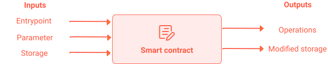

- LIGO is a programming language for writing **Tezos smart contracts**.
- LIGO **compiles** scripts written in a high-level language into a **Michelson script**.

- A smart contract is some code written in Michelson language (a low-level stack-based turing-complete language).
    - It defines all **entrypoints** (invokable functions) of the smart contract.
    - It defines the prototype of each entry point (e.g. specifies the parameters types of the entry point).
    - It defines the **storage** of the smart contract.

- **The storage** is an allocated memory space associated to a smart contract.
  The description of the storage is done by strongly-typing the data structure.

- **Entrypoints** of a smart contract describe how to mutate the storage.
  Executing an entry point takes some parameters and a state of the storage
  and returns a new state of storage and some operations.
  
 

<small className="figure">FIGURE 1 Smart Contract</small>

- LIGO functions are the basic building block of contracts.
  Each **entrypoint** of a contract is a **function**
  and each smart contract must have at least one **main function**
  that dispatches the control flow to other functions.

- The **option type** is a predefined variant type that is used to express whether there is a value, of some type, or none.
  This is especially useful when calling a partial function, that is, a function that is not defined for some inputs.

- The keyword `failwith(<string_message>)` throws an exception and stop the execution of the smart contract.

- You can transfer tez to an account, or to the function of another smart contract, with `Tezos.transaction (<parameter>, <mutez>, <contract>)`

## To go further

- You can go do the [Tezos Academy](https://tezosacademy.io/pascal/chapter-about)
  which is a fun interactive tutorial on the LIGO language.

- You can go to [Ligolang](https://ligolang.org/)
  and try your hand at their [IDE online](https://ide.ligolang.org/).

- You can check the smart contract
  example [FundAdvisor](https://github.com/frankhillard/ligo_tutorial_fundadvisor) with explanatory videos.
  
