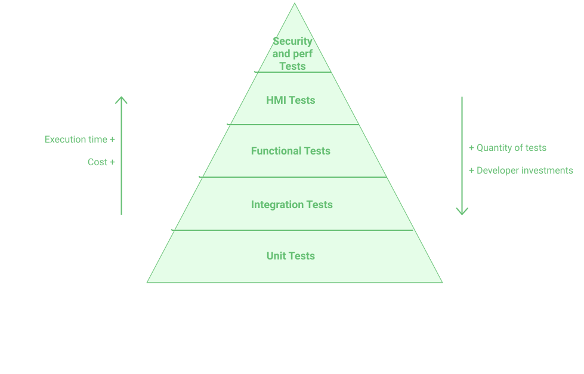

There are multiple frameworks for testing Michelson contracts:
- [PyTezos](https://pytezos.org/)
- [Cleveland](https://gitlab.com/morley-framework/morley/-/blob/9455cd384b2ab897fb7b31822abca3730a4ad08b/code/cleveland/testingEDSL.md)

Each language also comes with their own testing features. The one for LIGO is still experimental, in the dev branch, but will be available soon.

Another alternative is to use Tezos's binary `tezos-client` directly. There is also a new [mockup](https://tezos.gitlab.io/user/mockup.html) mode that no longer requires a Tezos node to run.

This chapter aims to introduce the concept of unit testing and, especially, how to deal with testing Tezos smart contract using the [PyTezos](https://pytezos.org/) python framework.

## Unit Testing

Just like any other programming language, writing LIGO code (to be compiled into Michelson) is not the only task of a developer;
writing the tests is as important as writing the code.

Writing a test may take extra time, but some great benefits usually reward this effort:
- a test helps to understand the code: a user or a new developer can easily understand the code behavior through testing. The test name should clearly describe what the code is checking, and the test itself shows how the code should be handled.
- checking the good behavior of the written code. It benefits both the developer and the user of a smart contract: both want to be sure the smart contract behaves as it should.
- It also makes the code robust for future modifications, i.e., code refactoring or new features. The tests make sure that the behavior has not changed, and if it did, it would clearly outline where.
- Tests can easily be automated: they can be included in a CI/CD, which will run them after any push.

>**CI/CD (Continuous Integration / Continuous Delivery)** is a method to frequently deliver apps to customers by introducing automation into the stages of app development. The main concepts attributed to CI/CD are continuous integration, continuous delivery, and continuous deployment.

There are different types of tests, as described below in the automated testing strategy.
<br/>


<small className="figure">FIGURE 1: Pyramide of Tests</small>

Unit tests are the base of the pyramid and therefore the most important part.

**Unit testing** is performed at a very fine granularity by fully verifying the behavior of a portion of code or by partially isolating it from its dependencies. It is therefore simple to write and maintain them. In contrast, an integration test aims to verify that several components work well together.

To go further, take a look at [Test-Driven Development (TDD)](https://en.wikipedia.org/wiki/Test-driven_development), which is a development method emphasizing the writing of automated tests as a tool to guide the implementation of features.

LIGO does not yet provide a testing framework but one is currently in development and should be available soon. PyTezos makes it possible to test contracts written in different languages.

This chapter details how to write Michelson code unit tests in Python.

Two modules are needed:
- the standard *unittest* module: used to write and run unit tests in Python
- the *PyTezos* module: used to call the entrypoints of a smart contract, without deploying the smart contract. This module is an interesting option because it is well-maintained and easy to use.
  
> **The execution time or CPU time** of a given task is defined as the time spent by the system executing that task.  
> **Cost** can be seen as the complexity and time required for the developer to write a test.

## PyTezos Installation

### Requirement

- Python 3
- Text editor
- Cryptographic dependencies, detailed here [link](https://pytezos.org/quick_start.html#requirements).

### Installation

#### Creation of a virtual environment

A virtual environment is a self-contained Python installation, separated from the global Python installation. It contains its own modules. Hence, it is most useful when a specific version of a module is needed, without affecting the other modules.

Run this command to create a virtual environment:
```shell
python3 -m venv /path/to/env
```

#### Activating the environment

```shell
source /path/to/env/bin/activate
```

#### Installation of the necessary python libraries

Installation of **PyTezos**:

```shell
(venv) pip install pytezos
```

Verification of the installation:

```shell
(venv) python -c "import pytezos"
```

If the command returns nothing, then the installation is successful.

You can find the official documentation here [https://pytezos.org/](https://pytezos.org/) and all the versions on the [project's Github](https://github.com/baking-bad/pytezos) in the [Releases part](https://github.com/baking-bad/pytezos/releases).

> The PyTezos version used for the following example is `pytezos==3.1.0`.  You can check the version of your package with the `pip freeze` command. You can install a specific version if needed with `pip install pytezos=={pytezos_version}`.

## Unittest (Python library)

*Unittest* is the standard unit testing framework for Python. Before writing a test for smart contracts with **PyTezos**, you need to know how to use the test library.

Let's see how **Unittest** works through a simple example.

Consider a python file `calculator.py` with two functions: `multiply` and `divide`

```python
#calculator.py

def multiply(x, y):
    return x * y


def divide(x, y):
    if y != 0:
        return x / y
```

To test these two functions, let's create a new test file beginning by **test_** : `test_calculator.py`.

In this file you will need to:
- import the unittest module
```python
import unittest
```  

- import the file with the functions you want to test: `import calculator`
```python
import unittest

import calculator
```  

- Create a test class that inherits from `unittest.TestCase`. You can name this class whatever you want but try to keep it descriptive.
```python
import unittest
from unittestExample import calculator

class TestCalculator(unittest.TestCase):
  pass #keyword which tells the class to do nothing
```  

- Write your tests. Keep in mind these few basic rules:
   - A test must check only one behavior at a time.
   - One test = one method.
   - No magic number: all the values used must be declared in variables, with explicit names.
   - There can be no useless variables to pass the test. If a variable can be removed without making the test fail, it must be removed.
   - The method name must be explicit. Anyone should understand what the test takes as input, what behavior is been checked and what result is expected.
   - A test can be divided into three parts (as implemented in the tests below):
      - _GIVEN_: input declarations, expected results
      - _WHEN_: the tested method is called with the declared inputs
      - _THEN_: assertions checks
  
With `unittest`, a test method must include `test_`, otherwise it will not be considered as a test.

```python
class TestCalculator(unittest.TestCase):

  def test_multiplying_10_and_5_should_return_(self):
    # GIVEN
    x = 10
    y = 5
    expected_multiplication_result = 50
    # WHEN
    result = calculator.multiply(x, y)

    # THEN
    self.assertEqual(result, expected_multiplication_result)

  def test_dividing_7_and_3_should_return_a_floating_number_2_33333333(self):
    # GIVEN
    x = 7
    y = 3
    expected_division_result = 2.3333333333333335

    # WHEN
    result = calculator.divide(x, y)

    # THEN
    self.assertEqual(result, expected_division_result)
```

> At the beginning of this chapter, several benefits of unit testing were raised. This simple test-suite gives a good example:
>  - Reading the name of the test must give a clear idea about its code implementation. For instance, the second test shows that it is not a Euclidean division that is been implemented
>  - The division method could be the Euclidean division. The test checks that it returns a float number and not an int. If another developer was to change it into an Euclidean division, the test would fail and instantly warn the developer of a breaking change.

> Note that class names are by convention in **CamelCase** and test method names are in **snake_case**.

You can run your tests in the command line as follows:
```shell
python -m unittest test_calculator
```

This should return:
```shell
..
----------------------------------------------------------------------
Ran 2 tests in 0.002s

OK
```

Note that the command has executed all the tests in the `test_calculator.py` file, but that it is only possible to execute some specific tests.

Indeed, the `unittest` module can be used from the command line to execute tests from modules, classes or even individual test methods:
```shell
python -m unittest test_calculator
python -m unittest test_calculator.TestCalculator
python -m unittest test_calculator.TestCalculator.test_sub
```

## Testing a compiled smart contract with PyTezos

`PyTezos` library is a *Python* toolset for the Tezos blockchain. It includes work with keys, signatures, contracts, operations, RPC query builder, and a high-level interface for smart contract interaction.

This module is very interesting for for unit-testing smart-contracts:
- It can directly test the Michelson code with a Python script without having to deploy it on a testnet.
- Since it does not have to wait for transactions confirmations, the tests are fast to run.
- It can simulate any execution context (sender, amount, storage, etc.)
- It gives total control over the storage: each test has its own initial storage, and the output storage can be checked.
- The tests are independent from one another. If the tests were run on a deployed smart contract, the initial storage of a test would be the output storage of the previous one.

In this section, we will test the entrypoints of a _Michelson_ script for a smart contract that is compiled but not deployed.

For this we will need:
- The **Unittest** library, which is the standard framework for writing tests in Python.
- Two very useful classes from **PyTezos**:
  - **ContractInterface** allowing to interface with the entrypoints of a contract and interact with them.
  - **MichelsonRuntimeError** allowing to handle errors raised during execution.

To write the tests we will use the following template:
```python
# TEMPLATE
from unittest import TestCase, skip
from pytezos import MichelsonRuntimeError, ContractInterface

path_to_michelson_contract = "/path/to/contract.tz"


class TestContract(TestCase):

  @classmethod
  def setUpClass(cls):
    cls.myContract = ContractInterface.create_from(path_to_michelson_contract)

  def test_description_1(self):
    pass

  def test_description_2(self):
    pass

  @skip("test 3 is not launched")
  def test_description_3(self):
    pass
```

**PyTezos** requires the path to a file containing the Michelson code in `path_to_michelson_contract`.

To compile LIGO code into Michelson:
```shell
ligo compile-contract file.ligo main > contract.tz
```

Remember to recompile after any modification of the contract.

### Equivalence between Michelson types and Python

**PyTezos** allows you to interpret _Michelson_ code, here are the equivalences:

| Michelson  |                     Python                     |
| :--------: | :--------------------------------------------: |
| List, Set  |                       []                       |
|  Big_map   |                       ()                       |
|   String   |                     String                     |
|   Number   |                    Integer                     |
| mutez, tez | Interpreted as an Integer using `.interpret()` |

For example if you want to check the content of a list in the storage you would write:

```python
self.assertEqual(my_list_from_the_storage, [expected_value1, expected_value2, ...])
```

The way to get `my_list_from_the_storage` is detailed below in the examples.

### Counter Contract Example

Here is an example of a _Counter_ contract that handles an integer of `counter` value, an administrator address as storage and allows the administrator **only** to increment or decrement this counter.

```js
type indiceStorage is record[
    counter : int;
    administrator : address;
]

type indiceEntrypoints is Increment of int | Decrement of int

type indiceFullReturn is list(operation) * indiceStorage

function increment(const param : int; const s : indiceStorage) : indiceFullReturn is
if Tezos.source =/= s.administrator then  (failwith("administrator not recognized") : indiceFullReturn)
    else ((nil : list (operation)), s with record [counter=s.counter + param])

function decrement(const param : int; const s : indiceStorage) : indiceFullReturn is
if Tezos.source =/= s.administrator then  (failwith("administrator not recognized") : indiceFullReturn)
    else ((nil : list (operation)), s with record [counter=s.counter - param])
    
function main(const ep : indiceEntrypoints; const store : indiceStorage) : indiceFullReturn is
block {
    const ret : indiceFullReturn = case ep of
    | Increment(p) -> increment(p, store)
    | Decrement(p) -> decrement(p, store)
    end;
} with ret
```

Let's compile this contract and save the result in a Michelson file `counter.tz`.
```shell
ligo compile-contract counter.ligo main > counter.tz
```

The output is:
```js
{ parameter (or (int %decrement) (int %increment)) ;
  storage (pair (address %administrator) (int %counter)) ;
  code { UNPAIR ;
         IF_LEFT
           { SWAP ;
             DUP ;
             DUG 2 ;
             CAR ;
             SOURCE ;
             COMPARE ;
             NEQ ;
             IF { DROP 2 ; PUSH string "administrator not recognized" ; FAILWITH }
                { SWAP ;
                  DUP ;
                  DUG 2 ;
                  CDR ;
                  SUB ;
                  SWAP ;
                  CAR ;
                  PAIR ;
                  NIL operation ;
                  PAIR } }
           { SWAP ;
             DUP ;
             DUG 2 ;
             CAR ;
             SOURCE ;
             COMPARE ;
             NEQ ;
             IF { DROP 2 ; PUSH string "administrator not recognized" ; FAILWITH }
                { SWAP ;
                  DUP ;
                  DUG 2 ;
                  CDR ;
                  ADD ;
                  SWAP ;
                  CAR ;
                  PAIR ;
                  NIL operation ;
                  PAIR } } } }
```

First, let's test the **increment** entrypoint if the user is the administrator.

>Note that only the administrator is allowed to modify the storage and if anyone else tries to do it then the contract will return an error.
>```js
>if Tezos.source =/= s.administrator then  (failwith("administrator not recognized") : indiceFullReturn)
>```

#### Test increment entrypoint

For instance, let's write a test that verifies that the storage is incremented by 5 when the administrator performs the `Increment(5)` action.

- For this test, a faucet address `tz1` has been assigned to the administrator, you can generate a faucet address [here](https://faucet.tzalpha.net/).
- In the `setUpClass` method we load the contract from the _Michelson_ source code, stored in the **counter.tz** file, with the `ContractInterface.from_file()` method.
- Note that the name of the test accurately describes the test's intention.

```python
from unittest import TestCase
from pytezos import MichelsonRuntimeError, ContractInterface

path_to_michelson_contract = "counter.tz"
administrator = "tz1L738ifd66ah69PrmKAZzckvvHnbcSeqjf"

class TestCounterContract(TestCase):

    @classmethod
    def setUpClass(cls):
        cls.counterContract = ContractInterface.from_file(path_to_michelson_contract)

    def test_storage_counter_is_incremented_by_5_if_the_source_is_the_administrator(self):
        # GIVEN
        storage = {"administrator": administrator, "counter": 0}
        value = 5

        # WHEN
        result = self.counterContract.increment(value).interpret(storage=storage, source=administrator)

        # THEN
        self.assertEqual(result.storage["counter"], 5)
```

**GIVEN** 
- That the storage has been initialized as a dictionary `{}` to respect the equivalence with the _Michelson_ format. 
- The incremented value is an `int`.

**WHEN**
- From our contract `self.counterContract` we can call an **entrypoint** and its **parameter** with `.increment(value)`.
- Then we can add a context with `.interpret()` to specify the storage and the source (the original address that is sending the transaction).

**THEN**  
Finally we can check that the storage counter has been incremented by 5 with `self.assertEqual(<actual_value>, <expected_value>)`.

Let's run the test:
```shell
python -m unittest test_counter.TestCounterContract.test_storage_counter_is_incremented_by_5_if_the_source_is_the_administrator
```

```shell
----------------------------------------------------------------------
Ran 1 test in 0.011s

OK
```

#### Test unauthorized user (MichelsonRuntimeError)

Now let's imagine that someone other than the administrator tries to modify the storage by incrementing or decrementing it.

Let's write a test to make sure that this user gets rejected.

First, let's add a new user **alice** at the beginning of the file with a different address from the **administrator**.

```python
administrator = "tz1L738ifd66ah69PrmKAZzckvvHnbcSeqjf"
alice = "tz1LFuHW4Z9zsCwg1cgGTKU12WZAs27ZD14v"
```

Then following the first test, let's write the new test:
```python
def test_should_failed_if_the_source_is_not_the_administrator(self):
    with self.assertRaises(MichelsonRuntimeError) as administrator_error:
        # GIVEN
        storage = {"administrator": administrator, "counter": 0}
        value = 5

        # WHEN
        self.counterContract.increment(value).interpret(storage=storage, source=alice)

    # THEN
    error_message = str(administrator_error.exception.args[-1].strip("\\").strip("'"))
    self.assertEqual("administrator not recognized", error_message)
```

- The line `with self.assertRaises(MichelsonRuntimeError) as administrator_error:` retrieves and stores the error in the `administrator_error` variable. 
- The administrator's address is still defined in the initial state of storage, but this time alice's address is specified in the context's source variable: `source=alice`.
- Finally, the string message from the error is stored in the variable `error_message` and is compared with the original message written in the `failwith()` of the LIGO code. 

```shell
python -m unittest test_counter.TestCounterContract.test_should_failed_if_the_source_is_not_the_administrator
```

```shell
----------------------------------------------------------------------
Ran 1 test in 0.011s

OK

```

Now it's your turn to write tests! Try to do the same thing with the entrypoint `decrement`. The goal of writing tests is to have optimal coverage of the whole code. This allows you to have a robust and high-quality code. Futur developers working on your code will thank you very much for that.

