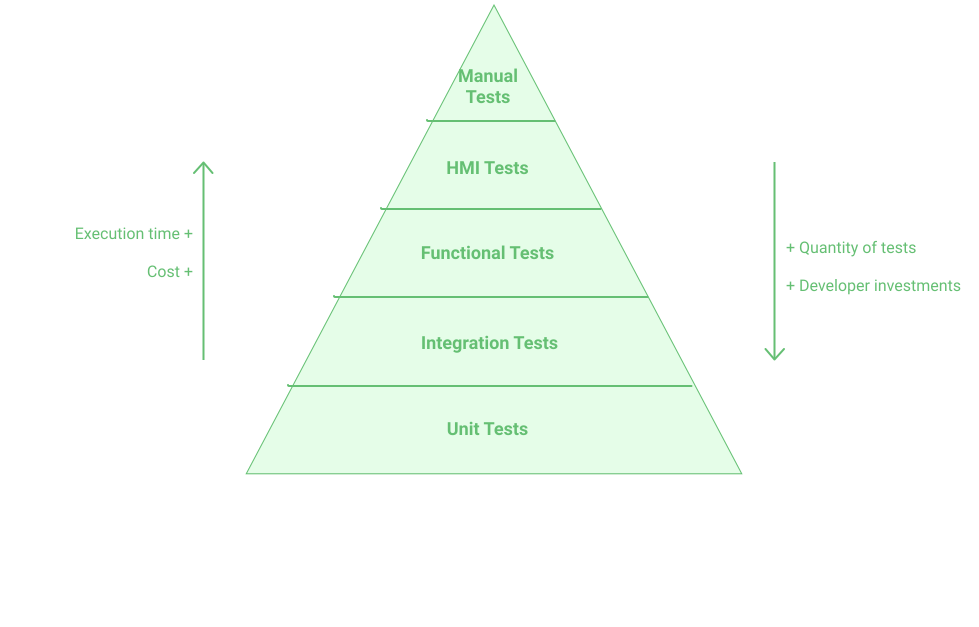

## Unit Testing

**Why write tests?**
- To check the correct operation of the code, 
  in our case for the developer and the user of the smart contract.
- It is also to make the code robust for future modifications, 
  i.e. a refactoring of the code or the addition of a breakable functionality 
  will be quickly detected.

There is an automated testing strategy, as described in the following figure.
<br/>


<small className="figure">FIGURE 1: Pyramide of Tests</small>

Unit tests represent the base of the pyramid and therefore the most important part.

**Unit testing** is performed at a very fine granularity 
by verifying the behavior of a portion of code totally 
or partially isolated from its dependencies.
It will then be simple to write and maintain.

While an integration test aims to verify that several components work well together: 
it checks the assembly.

To go further, take a look at **Test Driven Development (TDD)** 
which is a development method emphasizing 
the writing of automated tests as a tool to guide the implementation of features.


## PyTezos Installation

### Requirement

- Have python installed, and a text editor ready to use.
- Have a cryptographic library in your system. 
  If not, take a look on the requirement section on this [link](https://pytezos.org/quick_start.html#requirements).

### Installation

#### Creation of a virtual environment

```shell
$ python3 -m venv /path/to/env
```

#### Activating the environment

```shell
$ source /path/to/env/bin/activate
```

#### Installation of the necessary python libraries

Installation of wheel:

```shell
(venv) $ pip install wheel
```

Installation of pytezos:

```shell
(venv) $ pip install pytezos
```

Verification of the installation:

```shell
(venv) $ python -c "import pytezos"
```

If the command returns nothing then the installation is successful.

## Unittest (Python library)

Before writing tests for smart contracts with **PyTezos** 
you need to know how to use the **Unittest** test library.

Let's see how **Unittest** works through a simple example.

Consider a python file `calculator.py` with two functions: `add` and `sub`

```python
#calculator.py

def add(x, y):
    return x + y


def sub(x, y):
    return x - y
```

In order to test these two functions 
let's create a new test file beginning by **test_** : `test_calculator.py`.

In this file you will need to:
- `import unittest`.
- import the file you want with the functions you want to test, `import calculator`.
- Create a test class that inherits from `unittest.TestCase`.  
  You can name this class whatever you want but try to keep it descriptive.
- Write your tests by creating methods whose name must start with `test_` 
  otherwise it will not be recognized.

```python
#test_calculator.py

import unittest
import calculator


class TestCalculator(unittest.TestCase):

    def test_add(self):
        result = calculator.add(10, 5)
        self.assertEqual(result, 15)

    def test_sub(self):
        result = calculator.sub(10, 5)
        self.assertEqual(result, 5)
```

> Note that the names of the classes are by convention in **CamelCase** 
> and that the names of the tests methods are in **snake_case**

You can run your tests in command line as follows:

```shell
$ python -m unittest test_calculator
```

This should return:

```shell
..
----------------------------------------------------------------------
Ran 2 tests in 0.000s

OK
```

Note that the command has executed all the tests in our test file, 
but we can only execute certain tests.

Indeed, the unittest module can be used from the command line to execute tests from modules, 
classes or even individual test methods:

```shell
$ python -m unittest test_calculator
$ python -m unittest test_calculator.TestCalculator
$ python -m unittest test_calculator.TestCalculator.test_sub
```

## PyTezos

**PyTezos** library is a **Python** toolset for **Tezos** blockchain, 
including work with keys, signatures, contracts, operations, RPC query builder, 
and a high-level interface for smart contract interaction.

### Testing a smart contract

In this section we will to test entrypoints of a michelson script
from a smart contract which is compiled but not deployed.

For this we will need:

- The **Unittest** library which is the standard framework for writing tests in Python.
- Two very useful classes from **PyTezos**:
  - **ContractInterface**: allows interfacing with the entrypoints of a contract 
  and interact with them.
  - **MichelsonRuntimeError**: allows handling errors raised during execution.
- The **Decimal** library to manage the amounts in mutez, tez that are specific to the Tezos environment.


