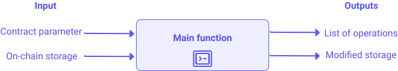

import NotificationBar from '../../src/components/docs/NotificationBar';


The language of smart contracts on Tezos is [Michelson](/michelson/introduction), a stack-based language. However, this kind of language is not commonly used by developers. Besides, the more a smart contract grows, the harder it becomes to keep the code readable and clean.
However, the Tezos ecosystem offers some high-level languages, which make smart contracts development as usual as any application development.
LIGO is one of these languages.

In this chapter, PascaLIGO will be taught, based on the development of a smart contract: the most important aspects of Ligo will be covered.
If you want to learn the comple LIGO syntax, you can take a look at:
1. [The official Ligolang documentation](https://ligolang.org/docs/intro/introduction): a complete reference maintained by the developers team.
2. [Tezos academy](https://tezosacademy.io/): courses with examples which cover all the LIGO syntax. The first twenty chapters will teach you the basic aspects of the syntax.

This chapter is driven by a smart contract development approach. Each part starts with an explanation of the LIGO syntax (called "LIGO prerequisite sections") that will be later used for the smart contract development.

The "LIGO prerequisite" parts can be skipped when you do not need no learn PascaLIGO syntax.

<NotificationBar>
  <p>
<b>DISCLAIMER: this smart contract is meant for educational purpose only, and is not suitable for any other use. OpenTezos cannot be held responsible for any other use.</b>
  </p>
</NotificationBar>

# Raffle smart contract
In this chapter, a simple [raffle](https://en.wikipedia.org/wiki/Raffle) example is considered. A raffle is a gambling game, where players buy tickets. The winning ticket is then drawn. In our case, a raffle will be development in a smart contract with those rules: 
- An address (called the administrator) wants to organize a raffle, whose reward is a tz amount.
- The administrator pays the reward to the winner with its own funds. 
- Anyone can participate in the raffle, with the same participation fee for everyone. However, each address can participate only once.
- Each ticket has the same probability of being picked.
- After a given time, defined at the beginning of the raffle, the administrator closes the raffle, and rewards the winner.


This raffle can be divided into three steps:
1. a raffle is opened, with a reward, for a given time
2. during the raffle time, anyone can buy a raffle ticket.
3. the raffle is closed, the winner is randomly selected and rewarded with the prize.

Only one raffle session can be ongoing.

> Some choices have been made for educational purposes.

<NotificationBar>
  <p>
<b>About the word "ticket" :</b>
ticket is a reserved word in Michelson and Ligo, introduced by the Edo protocol. 
In this chapter, the word "ticket" only refers to a raffle ticket. 
  </p>
</NotificationBar>

# Prerequisites for smart contracts development
When developing smart contracts, two tools are extremely useful:
1. a Ligo syntax support for your IDE
2. a Ligo compiler

These two tools will point out syntax errors and type errors. However, it is recommended to compile a ligo smart contract as often as possible. The compilation will detect errors that the IDE linter won't. Thus, errors will be found early and will more easily be addressed.

# Smart contract initialization
> LIGO concepts used in this part: everything that is required to create an empty smart contract.
> - Types, built-in types
> - Constants, Variables
> - Introduction to functions
> - main function
> - ligo compilation
 
A Michelson smart contract can be broken down into three parts:
1. **parameter**: possible invocations of the smart contract
2. a **storage**: persistent data structure, on-chain. 
   It can be read by everyone, but can only be changed by the contract itself.
3. **code**: a sequence of instructions to be executed when invoking a smart contract

These three pieces of information must also be defined in the Ligo code.

The first step is to create a .ligo file.
Let's create a file called raffle.ligo, which would compile a 'minimum' but viable contract.

<details>
  <summary>Click to expand!</summary>
  
  ## Heading
  1. A numbered
  2. list
     * With some
     * Sub bullets

## LIGO concepts used in this part

LIGO is strongly and statically typed. This means that the compiler checks how a contract processes data, ensuring that each function's expectations are met.
If it passes the test, the contract will not fail at run-time due to some inconsistent assumptions on data. This is called type checking.

LIGO types are built on top of Michelson's type system.

### Built-in types

LIGO comes with all basic primitive types built-in like `string` or `int` and with a contract-specific type `address` or `tez` for account balance or monetary transactions.
LIGO also introduces composite types like `option`, `list` or `map` allowing to create complex data structures.
You can find all built-in types on the [LIGO gitlab](https://gitlab.com/ligolang/ligo/-/tree/dev#L35).

Below is a table of the most used built-in types. Most of them will be used in the raffle smart contract:

| Type                           | Description                                                                           | Example                                                                                                                                                       |
| ------------------------------ | ------------------------------------------------------------------------------------- | ------------------------------------------------------------------------------------------------------------------------------------------------------------- |
| `unit`                         | carries no information                                                                | `Unit`                                                                                                                                                        |
| `option`                       | value of some type or none                                                            | `Some ("this string is defined")`, `(None: option string)`                                                                                                    |
| `string`                       | Sequence of character                                                                 | `"This is a string"`                                                                                                                                          |
| `address`                      | Address of an implicit account                                                        | `("tz1KqTpEZ7Yob7QbPE4Hy4Wo8fHG8LhKxZSx" : address)`                                                                                                          |
| `int`                          | Positive or negative integer                                                          | `-5`, `int (1n)`                                                                                                                                              |
| `nat`                          | Positive integer                                                                      | `0n`, `abs (1)`                                                                                                                                               |
| `tez`, `tz`, `mutez`           | Amount in tz or mutez                                                                 | `5mutez`, `10tez`                                                                                                                                             |
| `bool`                         | Boolean: true or false                                                                | `True`, `False`                                                                                                                                               |
| `timestamp`                    | Timestamp (bakers are responsible for providing the given current timestamp)          | `("2000-01-01T10:10:10Z" : timestamp)`, `Tezos.now`                                                                                                           |
| `bytes`                        | Sequence of bytes                                                                     | 0x12e4                                                                                                                                                        |
| `list (type)`                  | List definition. The same element can be found several times in a list                | `list [1; 2; 2]`, `nil`                                                                                                                                       |
| `set (type)`                   | Set definition. The same element cannot be found several times in a list              | `set []`, `set [3; 2; 2; 1]`                                                                                                                                  |
| `type1 * type2 ... * typeN`    | Tuple definition                                                                      | `("Alice", 5n, True)`                                                                                                                                         |
| `(keyType, valueType) map`     | Map an element of type keyType to an element of type valueType. Meant for finite maps | `Map.empty`, `Map.literal [(("tz1KqTpEZ7Yob7QbPE4Hy4Wo8fHG8LhKxZSx" : address), (1,2)); (("tz1gjaF81ZRRvdzjobyfVNsAeSC6PScjfQwN" : address), (0,3))]`         |
| `(keyType, valueType) big_map` | Map an element of type keyType to an element of type valueType. Meant for huge maps   | `Big_map.empty`, `Big_map.literal [(("tz1KqTpEZ7Yob7QbPE4Hy4Wo8fHG8LhKxZSx" : address), (1,2)); (("tz1gjaF81ZRRvdzjobyfVNsAeSC6PScjfQwN" : address), (0,3))]` |

### Type aliases

Type aliasing consists of renaming a given type when the context calls for a more precise name.
This increases readability and maintainability of your smart contracts.
For example, we can choose to alias a string type as an animal breed -
this will allow us to communicate our intent with added clarity.

```js
type breed is string
const dog_breed : breed = "Saluki"
```

The real value of type aliases lies in the alias for complex data structures, such as records (described below).
This way, these structures are more easily handled.

### Constants & Variables

#### Constants

Constants are by design immutable, which means they can only be assigned once, at their declaration.
A constant is defined by a name, type and a value:

```js
const age : int = 25
```

#### Variables

Variables, unlike constants, are mutable.
They cannot be declared in a global scope, but they can be declared and used within functions,
or as function parameters.

```js
var c: int := 2 + 3
c := c - 3
```

⚠️ The assignment operator is different: `:=` for var, instead of `=` for constants.


### Introduction to functions
As in any other language, functions can be defined in Ligo. There are several ways to define a function, but the header is always the same:
```js
function <functionName> (const param1 : <param2Type>, const param2 : <param2Type>...): <returnType> is
    <code>
```

Functions will be detailed below. At this point, since this main function does nothing, it will use a blockless function definition.

### Main function
A main function takes two parameters,
the **contract parameter** and the **on-chain storage**, and returns a pair made of a **list of operations** and a **(new) storage**.

<br/>


<small className="figure">FIGURE 1: Main function</small>

<br/>

The type of the contract parameter and the storage are up to the contract designer, but the type for the list operations is not.

The return type of main function is as follows, assuming that the `storage` type  has been defined elsewhere.

```js
type storage is ...  // Any name, any type
type return is list (operation) * storage
```

Lists and tuple will be detailed in the Collections part.

Only the smart contract itself can modify its storage:
given the state of the storage on-chain, a main function specifies how to create another state for it, depending on the contract's parameter.

Here is an example where the storage is a single natural number without any entrypoint.
```js
type parameter is unit
type storage is nat
type return is list (operation) * storage

function save (const action : parameter; const store : storage) : return is
((nil : list (operation)), store)
```


### Ligo compilation
The ligo code above should compile now, with this command:
```shell
$ ligo compile-contract <ligoFile> <mainFunction>
```
If the compilation is successful, the output will be the Michelson code.

It is recommended to run this command as often as possible, to check both code syntax and types.

</details>

## Storage definition

The first step is to define the storage.
Contract storage holds the contract data: it can be a single value or a complex structure.
The storage definition is a `type` instruction. First, the storage will be as simple as possible: empty

```js
type storage is unit
```

## Parameter definition
Smart contracts generally have one or several parameters, but it is not mandatory.
At this point, the parameter definition will be skipped. They will be defined later on, in this chapter.
To define a smart contract without any parameter:
```js
type raffleEntrypoints is unit
```


## Code definition

The last piece of information of the smart contract is the code definition. 
A smart contract can of course execute no instruction, but it must always return two things:
1. a list of operations
2. the storage

The ligo compiler expects a smart contract to have at least one function, which is the "main" function.
It does not have to be named that way. In this chapter, the "main" function will be named main:


```js
type storage is unit
type raffleEntrypoints is unit

function main (const action : raffleEntrypoints; const store : storage): list (operation) * storage is
    ((nil: list(operation)), store)
```

This main function returns a tuple of the two required elements.

The raffle smart contract can now be compiled:
```shell
$ ligo compile-contract raffle.ligo main
```

# Smart Contract development : launch raffle entrypoint
> LIGO concepts used in this part: you will learn how to define a more complex storage, 
> how to add an entrypoint, how to dispatch the control flow in the main function and
> perform checks and access control
> - Record
> - Tuples
> - functions
> - Entrypoint
> - variant
> - pattern matching
> - if condition
> - failwith
> - types: addresses, timestamp
> - Tezos Module
 

The LIGO code is compiling, but the Michelson code does nothing: 
there is no storage, no parameter, and the smart contract returns an empty list of operation and an empty storage.
As detailed in the [Raffle smart contract](#raffle-smart-contract) section, 
the smart contract should perform three actions:
1. launch a raffle
2. sell tickets (which that the caller can buy a ticket)
3. close the raffle, and reward the winner

Each one of these actions can be coded into an entrypoint.
## LIGO concepts used in this part

### Records
The record` type is a structure that holds several pieces of information: each piece is accessed thanks to a field name.

It is extremely useful for the storage definition and for any object that should hold different types of information.

#### Defining records

To instantiate a record, the `type` instruction is used:

```js
type user is
  record [
    id : nat;
    is_admin : bool;
    name : string
  ]
```

The name and type of fields are defined at the record definition. 
It cannot be changed afterwards: a new field cannot be added, nor the type changed

Here is how to define an associated record value:

```js
const rogers : user =
  record [
    id = 1n;
    is_admin = true;
    name = "Rogers"
  ]
```

#### Accessing Record Fields

Accessing the contents of a given field can be done with the `.` infix operator.

```js
const rogers_admin : bool = roger.is_admin
```

#### Updating a record

Modifying values in a `record` can be done with :

```js
const rogersNotAdmin : user = u with record [is_admin = False]
```

After this update, the pieces of information held by the _rogers_ record are:
- id: 1n
- is_admin: false
- name: "Rogers"

Modifying a `record` value can also be done with a `patch` instruction:

```js
function change_name (const u : user) : user is
  block {
      patch u with record [name = "Mark"]
  } with u
```

### Tuples

Tuples gather multiple fields into a single structure. 
Tuple definition combines multiple types into a single type. 
A tuple data structure is ordered which means we can access to each element of the tuple by its position.
Unlike `record` type, the tuple fields are unnamed.

A tuple example would be an `(x,y)` pair.

#### Defining Tuples

A tuple can be defined by using the * operator:

```js
type full_name is (string * string)
const captain_full_name : full_name = ("Roger", "Johnson")
```

> Tuple can be defined without type aliasing:
> ```js
> const captain_full_name : (string * string) = ("Roger", "Johnson")
> ```

#### Accessing Components

Each component of a tuple can be accessed by its position:

```js
const captain_first_name : string = captain_full_name.0
const captain_last_name : string = captain_full_name.1
```

⚠️ Tuple components are zero-indexed, that is, the first component has the index `0`.

#### Update Components

A tuple component can be modified, by assigning values as if it were a variable:

```js
captain_full_name.1 := "Carter"
```

### Functions in ligo

LIGO functions are the basic building block of contracts.
Each entrypoint of a contract executes a function
and each smart contract must have at least one **main** function 
that dispatches the control flow to other functions.

When calling a function,
LIGO makes a copy of the arguments but also of the environment variables.

Therefore, any modification to these will not be reflected outside the scope of the function
and will be lost if not explicitly returned by the function.

There are two syntaxes for functions in PascaLIGO, Block Functions and Blockless Functions:

#### Block functions

In PascaLIGO, blocks allow for the sequential composition of instructions into an isolated scope.
Each block needs to include at least one instruction.

```js
block { 
    const b : int = 10
    a := a + b 
}
```

If a placeholder is needed, the instruction `skip` leaves
the state unchanged.  The rationale for `skip` instead of a truly
empty block is that it prevents you from writing an empty block by
mistake.

```js
block { skip }
```

Functions in PascaLIGO are defined using the following syntax:

```js
function <name> (<parameters>) : <return_type> is 
  block {
   <operations and instructions>
  } with <returned_value>
```

For instance :

```js
function add (const a : int; const b : int) : int is
  block {
    const sum : int = a + b
  } with sum
```

#### Blockless functions

Functions containing all of their logic into a single expression can be defined without a block.
The add function above can be re-written as a blockless function:

```js
function add (const a: int; const b : int) : int is a + b
```

#### Anonymous functions (a.k.a. lambdas)

It is possible to define functions without assigning them a name.
They are useful when they are passed as arguments,
or assigned to a key in a record or a map.

```js
function increment (const b : int) : int is
   (function (const a : int) : int is a + 1) (b)
const a : int = increment (1); // a = 2
```

If the example above seems contrived, here is a more common design pattern for lambdas:
to be used as parameters to functions.
Consider the use case of having a list of integers and mapping the increment function to all its elements.

```js
function incr_map (const l : list (int)) : list (int) is
  List.map (function (const i : int) : int is i + 1, l)
```

> For the input "list [1;2;3]" the output will be [2;3;4]

#### Recursive function

LIGO functions are not recursive by default,
the user need to indicate that the function is recursive.

At the moment,
recursive function are limited to one (possibly tupled) parameter
and recursion is limited to tail recursion (i.e the recursive call should be the last expression of the function)

In PascaLIGO recursive functions are defined using the `recursive` keyword.

```js
recursive function sum (const n : int; const acc: int) : int is
  if n<1 then acc else sum(n-1,acc+n)
```


### Adding a new entrypoint with Ligo

In LIGO, the design pattern is to have one main function called `main`,
that dispatches the control flow according to its parameters.
Those functions called for those actions are called entrypoints.

As an analogy, in the C programming language,
the `main` function is the unique main function and any function called from it would be an entrypoint.

The parameter of the contract is then a variant type (described below),
and, depending on the constructors of that type,
different functions in the contract are called.
In other terms, the unique main function dispatches the control flow
depending on a pattern matching on the contract parameter.

#### Variant type

A variant type is a user-defined, or a built-in type (in case of options) that defines a type by cases. 
A number of cases is defined in the type definition. The value of a variable of this type must be included in these cases.
The simplest variant type is equivalent to the enumerated types found in Java, C++, JavaScript etc.

Here is how we define a bit as being either 1 or 0 (and nothing else):

```js
type bit is One | Zero
const closed_switch : bit = One
const open_switch : coin = Zero
```

#### Pattern Matching

Pattern matching is similar to the `switch` construct in Javascript,
and can be used to route the program's control flow based on the value of a variant.
Consider for example the definition of a power switch that turn on/off a light.

```js
type bit is One | Zero

function power_switch (const b : bit) : bit is
  case b of
    One -> Zero
  | Zero -> One
  end
```

### If condition

Conditional logic to _fork_ the control flow depending on the state.

```js
function isSmall (const n : nat) : bool is
if n < 10n then true else false
```

⚠️ When the branches of the conditional are not a single expression, as above, we need a `block`:

```js
if x < y then
    block {
        x := x + 1;
        y := y - 1
    }
else skip;
```

### Failwith

The keyword `failwith` throws an exception and stop the execution of the smart contract.

```js
failwith(<string_message>)
```


### Timestamp

LIGO features timestamps are responsible for providing the given current timestamp for the contract.

```js
const today : timestamp = Tezos.now
const one_day : int = 86_400
const in_24_hrs : timestamp = today + one_day
const some_date : timestamp = ("2000-01-01T10:10:10Z" : timestamp)
const one_day_later : timestamp = some_date + one_day
```

### Addresses

Addresses are very likely to be used in any smart contract.
You can define Tezos addresses by casting a `string` value to an `address` type:

```js
const my_account : address = ("tz1KqTpEZ7Yob7QbPE4Hy4Wo8fHG8LhKxZSx" : address)
```

⚠️ You will not see a compilation error if the address you enter is wrong, but the execution will fail.


### Tezos Module

The Tezos module is a set of LIGO instructions, that query the state of the Tezos blockchain.
It is useful when the smart contract needs to know who is calling an entrypoint, if enough funds have been transferred...

- `Tezos.balance`: Get the balance for the contract.
- `Tezos.amount`: Get the amount of tez provided by the sender to complete this transaction.
- `Tezos.sender`: Get the address that initiated the current transaction.
- `Tezos.self_address`: Get the address of the currently running contract.
- `Tezos.source`: Get the originator (address) of the current transaction.
  That is, if a chain of transactions led to an execution, you get the address that began the chain.
  Not to be confused with Tezos.sender,
  which gives the address of the contract or user which directly caused the current transaction.
- `Tezos.chain_id`: Get the identifier of the chain to distinguish between main and test chains.


## Modifying the storage

The first entrypoint of the Raffle smart contract illustrates the basics of PascaLIGO, covered above.

Before coding the logic of the first action (opening a raffle session), the storage has to be modified to hold such a raffle.
The contract needs an **administrator**: he will launch a raffle session, with a **description**.
When the raffle is **opened**, it should be clearly noted in the storage.
This raffle will need a **reward** and will be ongoing for a given **time**.

So, 5 pieces of information are needed:
- the raffle administrator
- a description about the raffle
- is the raffle opened?
- the reward in tz
- the raffle end date.

> What would the types for each piece of information ?

For each piece of information, the corresponding type is:
- raffle administrator: address
- raffle description: string
- raffle opened ? : boolean
- reward: tez
- raffle end date: timestamp

So far, the storage was empty, thanks to the `unit` type. 
The storage now needs to hold five pieces of information, of different types. 
Several values can be held in a `map`, but they must have the same type. Besides, `map` are not meant to keep the same number of elements.

The correct way to define a storage is to use the `record` type.

> Modify the storage smart contract to hold the 5 pieces of information, defined [at the beginning of this part](#modifying-the-storage)
```js
type storage is record [
    admin : address;
    close_date : timestamp;
    jackpot : tez;
    description : string;
    raffle_is_open : bool;
]
```

## Creating a raffle session: entrypoint definition

The contract storage can now hold a raffle session. 
The contract has to provide the users with a way of creating a raffle session.
To do that, it needs an entrypoint that perform such an action: 
this new entrypoint should be named "OpenRaffle" and would allow the administrator to open a raffle.

So far, there is no entrypoint into this smart contract:

```js
type raffleEntrypoints is unit
```

Adding the OpenRaffle entrypoint means to define the raffle entrypoint as a variant:

```js
type raffleEntrypoints is OpenRaffle of unit
```
raffleEntrypoints is now a variant: OpenRaffle (because of `of unit`) does not expect any argument.

In order to be exposed, OpenRaffle needs to be handled in a pattern matching, in the main function:
```js
function main (const action : raffleEntrypoints; const store : storage):  list (operation) * storage is
    case action of
        OpenRaffle -> ((nil: list(operation)), store)
    end;

```

> Notice that the contract **parameter** (_raffleEntrypoints_ variant) is requiring no parameter (`unit`).
> For now, this smart contract has only a single default entrypoint with no argument. 
> The _storage_ type is used as the second parameter of the _main_ function. 


The smart contract now looks like (and is compiling):
```js
type raffleEntrypoints is OpenRaffle of unit

type storage is record [
    admin : address;
    close_date : timestamp;
    jackpot : tez;
    description : string;
    raffle_is_open : bool;
    ]

type returnType is list (operation) * storage

function main (const action : raffleEntrypoints; const store : storage): returnType is
    case action of
        OpenRaffle -> ((nil: list(operation)), store)
    end;

```
Despite the definition of a more complex storage, the execution of the smart contract still does nothing. 
The smart contract should at least expect some parameters and update his storage (thanks to the logic implementation).


To open a raffle, several pieces of information have to be sent: 
the reward, the closing date, and a raffle description
Let's define a type for these parameters:

```js
type openRaffleParameter is tez * timestamp * option(string)
```

It is declared as a tuple:
- tez: amount of the reward
- timestamp: closing date
- option(string): an optional description

The OpenRaffle entrypoint must expect these parameters:

```js
type openRaffleParameter is tez * timestamp * option(string)
type raffleEntrypoints is OpenRaffle of openRaffleParameter
```

Finally, the parameters must be added in the control flow from the main function:

```js
type openRaffleParameter is tez * timestamp * option(string)
type raffleEntrypoints is OpenRaffle of openRaffleParameter

type storage is record [
    admin : address;
    close_date : timestamp;
    jackpot : tez;
    description : string;
    raffle_is_open : bool;
    ]

type returnType is list (operation) * storage

function main (const action : raffleEntrypoints; const store : storage): returnType is
    case action of
        OpenRaffle (param) -> ((nil: list(operation)), store)
    end;

```

It output a Michelson code, which does nothing, but there is slight change in the parameter section:
```
{ parameter (pair (pair mutez timestamp) (option string)) ;
  storage int ;
  code { CDR ; NIL operation ; PAIR } }
```

The openRaffleParameter are expected in the parameter section.


## Adding the OpenRaffle logic

The last step is to implement the logic of this entrypoint, in a function, which would update the storage.

Let's create an empty function. This function expects the three needed parameters,
and returns the standard list of operations and the updated store:
```js
function open_raffle (const jackpot_amount : tez; const close_date : timestamp; const description : option(string); const store : storage) : returnType is
    block { skip } with ((nil: list(operation)), store)
```

The first step is to check if the entrypoint is called by the administrator. If not, it should raise an exception.
The check is performed by an association of an `if` condition and a `failwith`.
The address calling the entrypoint should match the address in the storage. It is called access control:

```js
function open_raffle (const jackpot_amount : tez; const close_date : timestamp; const description : option(string); const store : storage) : returnType is
    block {
      if Tezos.source =/= store.admin then failwith("administrator not recognized")
      else {
        skip
      }
    } with ((nil: list(operation)), store)
```

A second check has to be performed: a raffle cannot be opened if the previous one is not yet closed.
A boolean gives this piece of information in the storage: raffle_is_open

```js
function open_raffle (const jackpot_amount : tez; const close_date : timestamp; const description : option(string); const store : storage) : returnType is
    block {
      if Tezos.source =/= store.admin then failwith("Administrator not recognized.")
      else {
        if not store.raffle_is_open then {
            skip
        } else {
          failwith("A raffle is already open.")
        }
      }
    } with ((nil: list(operation)), store)
```

A third check is performed about the reward: the funds sent must match the raffle reward.

```js
function open_raffle (const jackpot_amount : tez; const close_date : timestamp; const description : option (string); const store : storage) : returnType is
  block {
    if Tezos.source =/= store.admin
    then failwith ("Administrator not recognized.")
    else {
      if not store.raffle_is_open then {
        if Tezos.amount < jackpot_amount then failwith ("The administrator does not own enough tz.")
        else {
            skip
        }
      }
      else {
        failwith ("A raffle is already open.")
      }
    }
  } with ((nil : list (operation)), store)
```

One finale check is performed about the raffle closing date: the raffle should last at least a week.

```js
function open_raffle (const jackpot_amount : tez; const close_date : timestamp; const description : option (string); const store : storage) : returnType is
  block {
    if Tezos.source =/= store.admin
    then failwith ("Administrator not recognized.")
    else {
      if not store.raffle_is_open then {
        if Tezos.amount < jackpot_amount then failwith ("The administrator does not own enough tz.")
        else {
          const today : timestamp = Tezos.now;
          const seven_day : int = 7 * 86400;
          const in_7_day : timestamp = today + seven_day;
          const is_close_date_not_valid : bool = close_date < in_7_day;
          if is_close_date_not_valid then failwith("The raffle must remain open for at least 7 days.")
          else {
            skip
          }
        }
      }
      else {
        failwith ("A raffle is already open.")
      }
    }
  } with ((nil : list (operation)), store)
```

The logic is finally implemented. 
For this entrypoint, the only thing to do is to store the pieces of information of the raffle:
the reward, the closing date, the raffle description. 
In addition, the storage should indicate that there is an ongoing raffle.
The storage needs to be updated with these pieces of information. 

> Take a look at how the description is added to the storage (it is an `option`).


```js
function open_raffle (const jackpot_amount : tez; const close_date : timestamp; const description : option (string); const store : storage) : returnType is
  block {
    if Tezos.source =/= store.admin
    then failwith ("Administrator not recognized.")
    else {
      if not store.raffle_is_open then {
        if Tezos.amount < jackpot_amount then failwith ("The administrator does not own enough tz.")
        else {
          const today : timestamp = Tezos.now;
          const seven_day : int = 7 * 86400;
          const in_7_day : timestamp = today + seven_day;
          const is_close_date_not_valid : bool = close_date < in_7_day;
          if is_close_date_not_valid then failwith("The raffle must remain open for at least 7 days.")
          else {
            patch store with record [
            jackpot = jackpot_amount;
            close_date = close_date;
            raffle_is_open = True;
            ];

            case description of
              Some(d) -> patch store with record [description=d]
            | None -> {skip}
            end
          }
        }
      }
      else {
        failwith ("A raffle is already open.")
      }
    }
  } with ((nil : list (operation)), store)
```


> Keep in mind:
> - to check entrypoint inputs as much as possible
> - that comparisons and mathematical operations are carried out the same way for any type (int, tez, timestamp...)
> - the storage is used and updated in an entrypoint


# Smart Contract development : Buy ticket entrypoint
> LIGO concepts used in this part: you will learn how to use collections with this second entrypoint.
> It will also be the opportunity for you to use again functions and performs checks


The second entrypoint can be freely called by everyone who wants to buy a ticket.
In this use case, each address can only buy one ticket, which costs 1 tz.

Two additional pieces of information have to be kept:
1. who is taking part in the raffle
2. who is owning a ticket

The storage has to be modified. Collections are going to come in handy for the modification of the storage

## LIGO concepts used in this part: collections

### Lists

Lists are **linear collections of elements of the same type**.
Linear means that, in order to reach an element in a list,
all the elements before have to be browsed (sequential access).
Elements can be repeated, as only their order in the collection matters.
The first element is called the head,
and the sub-list after the head is called the tail.

> 💡 Lists are needed for example when returning operations from a smart contract's main function.

#### Defining Lists

To define an empty list, and a list with values:

```js
const empty_list : list (int) = list [] // Or nil
const my_list : list (int) = list [1; 2; 2]
```

> You can also use `nil` instead of `list []`

#### Adding to Lists

You can add elements to an existing list using the cons operator `#` or `cons(<value>, <list>)`:

```js
const larger_list : list (int) = 5 # my_list // [5; 1; 2; 2]
const larger_list_bis : list (int) = cons(5, my_list) // [5; 1; 2; 2]
```

#### Accessing list element

You cannot access element directly in list,
but you can access the first element,
the head or the rest of the list, the tail.
The two function to access those are `List.head_opt` and `List.tail_opt`.

```js
const head : option (int) = List.head_opt (my_list) // 1
const tail : option (list(int)) = List.tail_opt (my_list) // [2;2]
```

### Sets

Sets are **unordered collections of values of the same type**,
like lists are ordered collections.
Like the mathematical sets and lists,
sets can be empty and, if not,
elements of sets in LIGO are unique,
whereas they can be repeated in a list.

#### Defining Sets

```js
const empty_set : set (int) = set []
const my_set : set (int) = set [3; 2; 2; 1]
```

#### Sets tools
You can test membership with the contains operator:

```js
const contains_3 : bool = my_set contains 3
```

You can get the size of a set using the Set.size operator:

```js
const cardinal : nat = Set.size (my_set)
```

To update a set:

```js
const larger_set  : set (int) = Set.add (4, my_set)
const smaller_set : set (int) = Set.remove (3, my_set)
```


### Maps

Maps are a data structure which associates a value to a key, thus creating a key-value binding. All keys have the same type and all values have the same type. 
An additional requirement is that the type of the keys must be comparable.

#### Defining a Map

```js
type balances is map (string, nat)

const empty : balances = map []

const user_balances : balances =
    map [
        "tim" -> 5n;
        "mark" -> 0n
    ]
```

#### Accessing Map Bindings

Use the postfix [] operator to read a value of the map:

```js
const my_balance : option (nat) = user_balances ["tim"]
```

#### Updating a Map

You can add or modify a value using the usual assignment syntax `:=` :

```js
user_balances ["tim"] := 2n
user_balances ["New User"] := 24n
```

A key-value can be removed from the mapping as follows:

```js
remove "tim" from map user_balances
```

> Maps load their entries into the environment,
> which is fine for small maps,
> but for maps holding millions of entries,
> the cost of loading such map would be too expensive.
> For this we use `big_maps`. Their syntax is the same as for regular maps.


## Modifying the storage

Thanks to these collections, the second entrypoint of the Raffle smart contract can be implemented.
A list of participants must be kept, as well as the ticket/owner pair.

Two new pieces of information will be stored in the contract storage.

> What collection should be used for:
> 1. the participants (who can only buy one ticket)?
> 2. the tickets and their owner?

For the first point, two collections could be used: a list and a set. 
Since the participants can only buy one ticket, a set is the right choice (since each element cannot appear twice).

For the second point, each ticket should be mapped to its owner. The number of participants is not limited:
there might be millions of them. So, a big map seems the right choice.

The set of participants should a set of addresses, while the big map should map a ticket id (a nat) to an address.
The new storage is:
```js
type storage is record [
    admin : address;
    close_date : timestamp;
    jackpot : tez;
    description : string;
    raffle_is_open : bool;
    players : set (address);
    sold_tickets : big_map (nat, address);
  ]
```

## Adding the BuyTicket Entrypoint

The smart contract needs to expose another entrypoint. 
The method is the same that has been detailed for the first entrypoint:

1. Defining the type parameter. This type should be `unit`, since the buyer does not get to choose the ticket id:
```js
type buyTicketParameter is unit
```

2. Adding the entrypoint in the variant:
```js
type raffleEntrypoints is
OpenRaffle of openRaffleParameter
| BuyTicket of buyTicketParameter
```
3. Handling the new entrypoint in the control flow:
```js
function main (const action : raffleEntrypoints; const store : storage): returnType is
block {
    const return : returnType = case action of
    OpenRaffle (param) -> open_raffle (param.0, param.1, param.2, store)
    | BuyTicket (param) -> buy_ticket(param, store)
    end;
} with return
```

## Implementing the BuyTicket logic

The last step is to implement the logic of this entrypoint. 
Just as for the first entrypoint, this logic will be implemented in a function, buy_ticket:

```js
  function buy_ticket (const param: unit; const store : storage) : returnType is
    block { skip } with ((nil : list (operation)), store)
```

Two pieces of information have to be checked:
1. is the buyer sending enough funds?
2. has the buyer not already bought a ticket?

For the first point, this is the same check that is done for the first entrypoint.
Checking if an address is calling the entrypoint for the first time (= a buyer cannot buy more than one ticket) means
checking if the calling address is already in the players `set`.

```js
function buy_ticket (const param: unit; const store : storage) : returnType is
  block {
    if store.raffle_is_open then {
      const ticket_price : tez = 1tez;
      const current_player : address = Tezos.sender;
      if Tezos.amount = ticket_price then failwith("The sender does not own enough tz to buy a ticket.")
      else {
        if store.players contains current_player then failwith("Each player can participate only once.")
        else {
            skip
        }
      }
    } else {
      failwith("The raffle is closed.")
    }
  } with ((nil : list (operation)), store)
``` 

Once these two checks have been performed, the buyer can receive a ticket. To do that, the entrypoint needs to:
1. register the address as a participant: the address must be added into the players set from the storage.
2. create a ticket id. Since each participant can only buy ticket, the size of the players set give the new ticket id.
3. associate the ticket with its owner: the new ticket id will map to the buyer in the sold_tickets big_map.

These three steps use the methods described in the collections section.

```js
function buy_ticket (const param: unit; const store : storage) : returnType is
  block {
    if store.raffle_is_open then {
      const ticket_price : tez = 1tez;
      const current_player : address = Tezos.sender;
      if Tezos.amount = ticket_price then failwith("The sender does not own enough tz to buy a ticket.")
      else {
        if store.players contains current_player then failwith("Each player can participate only once.")
        else {
          const ticket_id : nat = Set.size(store.players);
          store.players := Set.add(current_player, store.players);
          store.sold_tickets[ticket_id] := current_player;
        }
      }
    } else {
      failwith("The raffle is closed.")
    }
  } with ((nil : list (operation)), store)
``` 

The contract now is:

```js
type openRaffleParameter is tez * timestamp * option(string)
type buyTicketParameter is unit

type raffleEntrypoints is
OpenRaffle of openRaffleParameter
| BuyTicket of buyTicketParameter

type storage is record [
    admin : address;
    close_date : timestamp;
    jackpot : tez;
    description : string;
    raffle_is_open : bool;
    players : set (address);
    sold_tickets : big_map (nat, address);
    ]

type returnType is list (operation) * storage

function open_raffle (const jackpot_amount : tez; const close_date : timestamp; const description : option (string); const store : storage) : returnType is
  block {
    if Tezos.source =/= store.admin
    then failwith ("Administrator not recognized.")
    else {
      if not store.raffle_is_open then {
        if Tezos.amount < jackpot_amount then failwith ("The administrator does not own enough tz.")
        else {
          const today : timestamp = Tezos.now;
          const seven_day : int = 7 * 86400;
          const in_7_day : timestamp = today + seven_day;
          const is_close_date_not_valid : bool = close_date < in_7_day;
          if is_close_date_not_valid then failwith("The raffle must remain open for at least 7 days.")
          else {
            patch store with record [
            jackpot = jackpot_amount;
            close_date = close_date;
            raffle_is_open = True;
            ];

            case description of
              Some(d) -> patch store with record [description=d]
            | None -> {skip}
            end
          }
        }
      }
      else {
        failwith ("A raffle is already open.")
      }
    }
  } with ((nil : list (operation)), store)

function buy_ticket (const param: unit; const store : storage) : returnType is
  block {
    if store.raffle_is_open then {
      const ticket_price : tez = 1tez;
      const current_player : address = Tezos.sender;
      if Tezos.amount = ticket_price then failwith("The sender does not own enough tz to buy a ticket.")
      else {
        if store.players contains current_player then failwith("Each player can participate only once.")
        else {
          const ticket_id : nat = Set.size(store.players);
          store.players := Set.add(current_player, store.players);
          store.sold_tickets[ticket_id] := current_player;
        }
      }
    } else {
      failwith("The raffle is closed.")
    }
  } with ((nil : list (operation)), store)

function main (const action : raffleEntrypoints; const store : storage): returnType is
block {
    const return : returnType = case action of
    OpenRaffle (param) -> open_raffle (param.0, param.1, param.2, store)
    | BuyTicket (param) -> buy_ticket(param, store)
    end;
} with return
```

# Smart Contract development: Close Raffle Entrypoint
> LIGO concepts used in this part: you will learn how to use transactions, be warned about some limitations of the language
> and manipulate a little more collections.
> In addition, this entrypoint sums up a lof of what has been done before:
> - transactions
> - randomness

The last step is to close the raffle, pick a winner and send him the reward.
This last entrypoint will show how to send a transaction from the contract and some collections manipulations

5 steps are required:
1. Check that the calling address is the administrator
2. Check that the closing date has been reached, and that the raffle is still open
3. Pick a winner
4. Send the reward to the winner
5. Reset the storage

New pieces of information won't be stored: the storage is not expected to be modified. 
However, the third step raises a problem: how should the winner be picked ?
1. the administrator chooses the winner when calling this entrypoint: 
   participants are likely not to buy a ticket since the administrator can choose himself as a winner
2. the winner is randomly chosen when calling this entrypoint
3. the winner is chosen at the beginning by the administrator, but this piece of information is only revealed at the end of the raffle.

## LIGO concepts used in this part: Transactions

You can transfer tez to an account, and invoke a function of another smart contract.
For this, use :

```js
Tezos.transaction (<parameter>, <mutez>, <contract>);
```

where :

- **parameter** is the entrypoint of another contract,
  or use `unit` if you are transferring to a wallet address,
- **mutez** is the amount to transfer,
- **contract** is the contract interface of the targeted contract.
  It can be retrieved (with `Tezos.get_contract_opt` built-in function) from the address of the other contract or the wallet.
  
Here is an example of retrieving the contract interface from the _winner_ `address`:
```js
const receiver : contract (unit) = 
    case (Tezos.get_contract_opt (winner) : option (contract (unit))) of
          Some (c) -> c
        | None -> (failwith ("winner contract not found.") : contract (unit))
        end;

const op : operation = Tezos.transaction(unit, store.jackpot, receiver);
```

Notice that the `Tezos.get_contract_opt` built-in function call returns a `option (contract (unit))`; thus allowing to verify that the _winner_ address is valid.


## About randomness in smart contracts
The second option is not easily implemented in smart contracts. In any classical programming language (Python, C, Java...),
a **random** function is directly usable from the standard API. With smart contracts, it is not possible.

Indeed, each smart contract execution has to be verified by any node in the network. 
However, how could this execution be verified if there is a random variable (that would change every time)?

It might seem to be a good idea to use blockchain events (transaction hash, block timestamp...) as source of randomness.
However, in the end, bakers which create blocks could use this to their advantage.

The only solution seems to use an external source of randomness or a secure cryptographic scheme. 
This topic goes well beyond this course. 
For educational purpose, we will at first hardcode a ticket id winner. 
Then, the smart contract will be refactored, using the Bytes and Crypto modules.

## Adding the CloseRaffle entrypoint

The smart contract needs to expose this last entrypoint.
The method is the same that has been detailed for the first and second entrypoint:

1. Defining the type parameter. This type should be unit, since the administrator just has to close the raffle without any other piece of information:
```js
type closeRaffleParameter is unit
```

2. Adding the entrypoint in the variant:
```js
type raffleEntrypoints is
OpenRaffle of openRaffleParameter
| BuyTicket of buyTicketParameter
| CloseRaffle of closeRaffleParameter
```
3. Handling the new entrypoint in the control flow:
```js
function main (const action : raffleEntrypoints; const store : storage): returnType is
block {
    const return : returnType = case action of
    OpenRaffle (param) -> open_raffle (param.0, param.1, param.2, store)
    | BuyTicket (param) -> buy_ticket(param, store)
    | CloseRaffle (param) -> close_raffle (param, store)
    end;
} with return
```

## Implementing the CloseRaffle logic
Let's create an empty function for this entrypoint:
```js
  function close_raffle (const param: unit; const store : storage) : returnType is
    block { const operations : list(operation) = nil; } with (operations, store)
```

There is a slight difference with this entrypoint function: it has to return an operation.
As a result, the list of operations won't be empty and will be filled with one operation from within the function block.


The usual checks have to be implemented:
1. only the administrator can close the raffle
2. the closing date must have been reached
3. the raffle must be open

The winner will be picked thanks to a hardcoded value. 
However, even if there are only two participants, the raffle must have a winner.
So, the number of participants must be known, so that the winning id does match an id ticket. For this, a modulo will be used:
`hardcoded_number mod number_of_participants`
Of course, LIGO offers all the arithmetic operations (addition, subtraction, multiplication, division, mod). It won't be detailed here, since it exactly the same as other languages.

```js
function close_raffle (const param : unit; const store : storage) : returnType is
  block {
    const operations : list(operation) = nil;
    if Tezos.source =/= store.admin then failwith("administrator not recognized.")
    else {
      if store.raffle_is_open then {
        if Tezos.now < store.close_date then failwith("The raffle must remain open for at least 7 days.")
        else{
          const number_of_players : nat = Set.size(store.players);
          const random_number : nat = 467n; // hardcoded number
          const winning_ticket_id : nat = random_number mod number_of_players; // modulo expression
        }
      } else {
        failwith("The raffle is closed.")
      }
    }
  } with (operations, store)
```

The winning ticket is now chosen. The next step is to find its owner from the `sold_tickets big_map`.
Since a key might not exist in a big map, fetching the value always return an option. 
This option is handled with a pattern matching as below:

```js
function close_raffle (const param : unit; const store : storage) : returnType is
  block {
    const operations : list(operation) = nil;
    if Tezos.source =/= store.admin then failwith("administrator not recognized.")
    else {
      if store.raffle_is_open then {
        if Tezos.now < store.close_date then failwith("The raffle must remain open for at least 7 days.")
        else{
          const number_of_players : nat = Set.size(store.players);
          const random_number : nat = 467n;
          const winning_ticket_id : nat = random_number mod number_of_players;

          const winner : address = 
          case (store.sold_tickets[winning_ticket_id]) of
            Some (a) -> a
          | None -> (failwith ("winner address not found") : address)
          end;
        }
      } else {
        failwith("The raffle is closed.")
      }
    }
  } with (operations, store)
```

The winner has been found and now has to be rewarded. 
First, we need to check that this address does exist, then create a transaction which will be added to the operations list:

```js
function close_raffle (const param : unit; const store : storage) : returnType is
  block {
    const operations : list(operation) = nil;
    if Tezos.source =/= store.admin then failwith("administrator not recognized.")
    else {
      if store.raffle_is_open then {
        if Tezos.now < store.close_date then failwith("The raffle must remain open for at least 7 days.")
        else{
          const number_of_players : nat = Set.size(store.players);
          const random_number : nat = 467n;
          const winning_ticket_id : nat = random_number mod number_of_players;

          const winner : address = 
          case (store.sold_tickets[winning_ticket_id]) of
            Some (a) -> a
          | None -> (failwith ("winner address not found") : address)
          end;

          const receiver : contract (unit) =
          case (Tezos.get_contract_opt (winner) : option (contract (unit))) of
            Some (c) -> c
          | None -> (failwith ("winner contract not found.") : contract (unit))
          end;

          const op : operation = Tezos.transaction(unit, store.jackpot, receiver);
          const operations : list(operation) = list [ op; ];
        }
      } else {
        failwith("The raffle is closed.")
      }
    }
  } with (operations, store)
```
The operations variable is not empty anymore: this entrypoint does return a transaction, that will be sent by the smart contract.

Finally, the storage need to be reset. All the fields will be filled with empty values:

```js
function close_raffle (const param : unit; const store : storage) : returnType is
  block {
    const operations : list(operation) = nil;
    if Tezos.source =/= store.admin then failwith("administrator not recognized.")
    else {
      if store.raffle_is_open then {
        if Tezos.now < store.close_date then failwith("The raffle must remain open for at least 7 days.")
        else{
          const number_of_players : nat = Set.size(store.players);
          const random_number : nat = 467n;
          const winning_ticket_id : nat = random_number mod number_of_players;

          const winner : address = 
          case (store.sold_tickets[winning_ticket_id]) of
            Some (a) -> a
          | None -> (failwith ("winner address not found") : address)
          end;

          const receiver : contract (unit) =
          case (Tezos.get_contract_opt (winner) : option (contract (unit))) of
            Some (c) -> c
          | None -> (failwith ("winner contract not found.") : contract (unit))
          end;

          const op : operation = Tezos.transaction(unit, store.jackpot, receiver);
          const operations : list(operation) = list [ op; ];
          
          patch store with record [
          jackpot = 0tez;
          close_date = (0 : timestamp);
          description = ("raffle is currently closed" : string);
          raffle_is_open = False;
          players = (set[] : set(address));
          sold_tickets = (big_map[] : big_map (nat, address));
          ];
        }
      } else {
        failwith("The raffle is closed.")
      }
    }
  } with (operations, store)
```

# Smart contract refactoring
Just as any other project, smart contracts will need refactoring during their development.
In this part, the way the winner is chosen will be refactored. 

Everyone, by reading the code, knows that the winning ticket is `407 mod Set.size(store.players)`.
By tampering with the number of bought tickets, it is easy for everyone to get the winning ticket. 
In this part, we will make it harder to guess the winning ticker number. 
However, **the method that will be used is not security compliant**. 
This refactoring is meant for educational purposes: to show some advanced features of LIGO. Do NOT use for any other usage.


This part is an opportunity to put the emphasis on two modules: `Bytes` and `Crypto`.

The `Bytes` module handles binary format for serialization: 
convert Michelson structures to a binary format (and the reverse), concatenate two bytes... 
You can find a full reference [here](https://ligolang.org/docs/reference/bytes-reference/)

The `Crypto` module performs a few basic operations: hashing and signature verification.
You can find a full reference [here](https://ligolang.org/docs/reference/crypto-reference).

## Winner selection scheme

1. The administrator will choose a large random number and keeps it to himself. 
2. He hashes it and sends the hash when calling the OpenRaffle entrypoint.
3. This hash is saved into the storage.
4. The administrator reveals his secret random large number when calling the CloseRaffle entrypoint.
5. The smart contract hashes this number and checks that it matches the storage hash.
If it does, it uses this number to pick the winner just as before.
   
As warned above, this method is still rife with loopholes: 
- the administrator knows the secret number and can tamper with the number of bought ticket in order to get the winning one
- everyone can try to bruteforce the hash in order to find what number yielded this hash. This method just makes it a little harder to guess the number.


## Refactoring the OpenRaffle entrypoint
The OpenRaffle entrypoint expects a new input: the number hash, that should be saved into the storage.
Both the storage and entrypoint have to be modified.
The method is very similar to what has been done before:


1. Refactoring the storage: it must store a hash. According to the LIGO documentation, a hash has a `bytes` type:
```js
type storage is record [
    admin : address;
    close_date : timestamp;
    jackpot : tez;
    description : string;
    players : set (address);
    sold_tickets : map (nat, address);
    raffle_is_open : bool;
    winning_ticket_number_hash : bytes;
]
```
2. Adding the new input in the openRaffleParameter. The bytes type is added in the tuple:
```js
type openRaffleParameter is tez * timestamp * option(string) * bytes
```

3. Updating the entrypoint function header:
```js
function open_raffle (const jackpot_amount : tez; const close_date : timestamp; const description : option (string); const winning_ticket_number_hash : bytes; const store : storage) : returnType is

```

4. Refactoring the entrypoint logic. For this change, the only thing to do is to save the hash into the storage:
```js
function open_raffle (const jackpot_amount : tez; const close_date : timestamp; const description : option (string); const winning_ticket_number_hash : bytes; const store : storage) : returnType is
  block {
    if Tezos.source =/= store.admin then failwith("Administrator not recognized.")
    else {
      if not store.raffle_is_open then {
        if Tezos.amount < jackpot_amount then failwith("The administrator does not own enough tz.")
        else{
        const today : timestamp = Tezos.now;
        const seven_day : int = 7 * 86400;
        const in_7_day : timestamp = today + seven_day;
        const is_close_date_not_valid : bool = close_date < in_7_day;
        if is_close_date_not_valid then failwith("The raffle must remain open for at least 7 days.")
        else {
          patch store with record [
          jackpot = jackpot_amount;
          close_date = close_date;
          raffle_is_open = True;
          winning_ticket_number_hash = winning_ticket_number_hash; // the hash is saved into the storage
          ];

          case description of
            Some(d) -> patch store with record [description=d]
          | None -> {skip}
          end
        }
      }
    } else {
        failwith("A raffle is already open.")
    }
  }
} with ((nil : list (operation)), store)
```

5. The new input has to be processed in the control flow:
```js
function main (const action : raffleEntrypoints; const store : storage): returnType is
block { 
    const return : returnType = case action of 
      OpenRaffle (param) -> open_raffle (param.0, param.1, param.2, param.3, store)
    | BuyTicket (param) -> buy_ticket(param, store)
    | CloseRaffle (param) -> close_raffle (param, store)
    end;
 } with return
```

The smart contract now compiles:
```shell
$ ligo compile-contract raffle.ligo main
```

## Refactoring the CloseRaffle entrypoint
The method is the same here. 
The step-by-step changes won't be detailed: try to do this refactoring on your own. 
The ligo documentation will tell you how to hash a number and compare it.

Once you're done with your smart contract refactoring, you can compare it with our suggested version:

```js
type openRaffleParameter is tez * timestamp * option(string) * bytes
type buyTicketParameter is unit
type closeRaffleParameter is nat

type raffleEntrypoints is
OpenRaffle of openRaffleParameter
| BuyTicket of buyTicketParameter
| CloseRaffle of closeRaffleParameter

type storage is record [
    admin : address;
    close_date : timestamp;
    jackpot : tez;
    description : string;
    players : set (address);
    sold_tickets : map (nat, address);
    raffle_is_open : bool;
    winning_ticket_number_hash : bytes;
  ]

type returnType is list (operation) * storage

function open_raffle (const jackpot_amount : tez; const close_date : timestamp; const description : option (string); const winning_ticket_number_hash : bytes; const store : storage) : returnType is
  block {
    if Tezos.source =/= store.admin
    then failwith ("Administrator not recognized.")
    else {
      if not store.raffle_is_open then {
        if Tezos.amount < jackpot_amount then failwith ("The administrator does not own enough tz.")
        else {
          const today : timestamp = Tezos.now;
          const seven_day : int = 7 * 86400;
          const in_7_day : timestamp = today + seven_day;
          const is_close_date_not_valid : bool = close_date < in_7_day;
          if is_close_date_not_valid then failwith("The raffle must remain open for at least 7 days.")
          else {
            patch store with record [
            jackpot = jackpot_amount;
            close_date = close_date;
            raffle_is_open = True;
            winning_ticket_number_hash = winning_ticket_number_hash; // the hash is saved into the storage
            ];

            case description of
              Some(d) -> patch store with record [description=d]
            | None -> {skip}
            end
          }
        }
      }
      else {
        failwith ("A raffle is already open.")
      }
    }
  } with ((nil : list (operation)), store)

function buy_ticket (const param: unit; const store : storage) : returnType is
  block {
    if store.raffle_is_open then {
      const ticket_price : tez = 1tez;
      const current_player : address = Tezos.sender;
      if Tezos.amount = ticket_price then failwith("The sender does not own enough tz to buy a ticket.")
      else {
        if store.players contains current_player then failwith("Each player can participate only once.")
        else {
          const ticket_id : nat = Set.size(store.players);
          store.players := Set.add(current_player, store.players);
          store.sold_tickets[ticket_id] := current_player;
        }
      }
    } else {
      failwith("The raffle is closed.")
    }
  } with ((nil : list (operation)), store)

function close_raffle (const winning_ticket_number : nat; const store : storage) : returnType is
  block {
    const operations : list(operation) = nil;
    if Tezos.source =/= store.admin then failwith("administrator not recognized.")
    else {
      if store.raffle_is_open then {
        if Tezos.now < store.close_date then failwith("The raffle must remain open for at least 7 days.")
        else{
          const winning_ticket_number_bytes : bytes = Bytes.pack(winning_ticket_number);
          const winning_ticket_number_hash : bytes = Crypto.sha256(winning_ticket_number_bytes);
          if winning_ticket_number_hash =/= store.winning_ticket_number_hash then failwith("the hash does not match the hash of the winning ticket.")
          else{
            const number_of_players : nat = Set.size(store.players);
            const winning_ticket_id : nat = winning_ticket_number mod number_of_players;

            const winner : address = 
            case (store.sold_tickets[winning_ticket_id]) of
                Some (a) -> a
            | None -> (failwith ("winner address not found") : address)
            end;

            const receiver : contract (unit) =
            case (Tezos.get_contract_opt (winner) : option (contract (unit))) of
                Some (c) -> c
            | None -> (failwith ("winner contract not found.") : contract (unit))
            end;

            const op : operation = Tezos.transaction(unit, store.jackpot, receiver);
            const operations : list(operation) = list [ op; ];

            patch store with record [
            jackpot = 0tez;
            close_date = (0 : timestamp);
            description = ("raffle is currently closed" : string);
            raffle_is_open = False;
            players = (set[] : set(address));
            sold_tickets = (map[] : map (nat, address));
            ];
          }
        }
      } else {
        failwith("The raffle is closed.")
      }
    }
  } with (operations, store)

function main (const action : raffleEntrypoints; const store : storage): returnType is
block {
    const return : returnType = case action of
    OpenRaffle (param) -> open_raffle (param.0, param.1, param.2, param.3, store)
    | BuyTicket (param) -> buy_ticket(param, store)
    | CloseRaffle (param) -> close_raffle (param, store)
    end;
} with return

```

**************************************************************

# Conclusion

Ligo is meant for smart contract development and always yields Michelson code.
The method for developing such smart contracts is pretty much always the same, 
and follows an order very close to the Michelson smart contract structure:

1. the **parameter** (or entrypoints): the entrypoints are defined into a variant, a type is defined for the input entrypoints, 
2. the **storage**: the storage is defined as a type. Usually, it is a record.
3. the **code**: the main function dispatches the actions with a pattern matching. The logic for each entrypoint is implemented in a function

There has to be a **main** function, which dispatches the actions of the smart contract.

LIGO syntax was designed to help developers to build smart contracts by providing them with a syntax familiar to them:
the main difference from other languages been the way the code is built, and a few technical limitations due to the particularities of blockchain (randomness for instance).

LIGO is only a part of the tools that make the smart contract development experience easier for developers.
Another part is unit testing, and it will be introduced later in this module.


`


