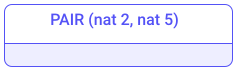

import ExamForm from '../../src/components/docs/ExamForm';
import ExamCheckbox from '../../src/components/docs/ExamCheckbox';

<ExamForm moduleName="Michelson">

### Question 1

Which notions are defined inside the smart contract?

<ExamCheckbox name="00" isCorrect="true">The type definition of the storage</ExamCheckbox>
<ExamCheckbox name="01" isCorrect="false">The balance of the contract</ExamCheckbox>
<ExamCheckbox name="02" isCorrect="false">The initial value of the storage</ExamCheckbox>
<ExamCheckbox name="03" isCorrect="false">The value of the entrypoint and its related parameters</ExamCheckbox>
<ExamCheckbox name="04" isCorrect="true">The type definition of the entrypoint</ExamCheckbox>
<ExamCheckbox name="05" isCorrect="false">The size of the storage</ExamCheckbox>
<ExamCheckbox name="06" isCorrect="true">The code of the smart contract</ExamCheckbox>
<ExamCheckbox name="07" isCorrect="false">The list of users allowed to call the smart contract</ExamCheckbox>

### Question 2

What is returned by the execution of a smart contract?

<ExamCheckbox name="10" isCorrect="false">The current storage state when invoking the smart contract</ExamCheckbox>
<ExamCheckbox name="11" isCorrect="true">The modified storage state after invoking the smart contract</ExamCheckbox>
<ExamCheckbox name="12" isCorrect="false">The entrypoint that has been called (and its related parameters)</ExamCheckbox>
<ExamCheckbox name="13" isCorrect="true">The list of emitted operations produced by the execution of the smart contract</ExamCheckbox>
<ExamCheckbox name="14" isCorrect="false">The balance of the contract</ExamCheckbox>
<ExamCheckbox name="15" isCorrect="false">The size of the storage</ExamCheckbox>
<ExamCheckbox name="16" isCorrect="false">The code of the smart contract</ExamCheckbox>
<ExamCheckbox name="17" isCorrect="false">The list of users allowed to call the smart contract</ExamCheckbox>

### Question 3

Consider the following Michelson smart contract:

```js
parameter nat;
storage nat;
code { DUP; CAR; DIP { CDR }; ADD; NIL operation; PAIR }
```

What is the stack at the beginning of the execution (considering parameter value is 2 and storage value is 5)?
 
Check the right answer.

<ExamCheckbox name="20" isCorrect="false">nat 2 , nat 5</ExamCheckbox>


<ExamCheckbox name="21" isCorrect="false">nat 5, nat 2</ExamCheckbox>


<ExamCheckbox name="22" isCorrect="true">(PAIR (nat 2) (nat 5))</ExamCheckbox>



<ExamCheckbox name="23" isCorrect="false">(PAIR (nat 5) (nat 2))</ExamCheckbox>


### Question 4

Consider the following Michelson smart contract.

```js
parameter nat;
storage nat;
code { DUP; CAR; DIP { CDR }; ADD; NIL operation; PAIR }
```

Considering that the parameter value is 1 and that the storage value is 1, what will be the output of the execution? 

<ExamCheckbox name="30" isCorrect="false">2</ExamCheckbox>
<ExamCheckbox name="31" isCorrect="false">[ PAIR (1 1) ]</ExamCheckbox>
<ExamCheckbox name="32" isCorrect="false">Pair (1 1)</ExamCheckbox>
<ExamCheckbox name="33" isCorrect="true">Pair ([], 2)</ExamCheckbox>
<ExamCheckbox name="34" isCorrect="false">Pair (2, [])</ExamCheckbox>

### Question 5

Consider the following Michelson smart contract:

```js
parameter (or (pair %assign address nat) (nat %global)) ;
storage (pair (big_map %owners address nat) (nat %value)) ;
code { DUP ;
       CDR ;
       SWAP ;
       CAR ;
       IF_LEFT
            { SWAP ;
              DUP ;
              CDR ;
              DUG 2 ;
              CAR ;
              SWAP ;
              UNPAIR ;
              DIP { SOME };
              UPDATE ;
              PAIR ;
              NIL operation ;
              PAIR
            }
            { SWAP ; CAR ; PAIR ; NIL operation ; PAIR } }
```

What are the possible invocations of this smart contract?

<ExamCheckbox name="40" isCorrect="false">`(Pair (Pair "tz1b7tUupMgCNw2cCLpKTkSD1NZzB5TkP2sv" 7) 23)`</ExamCheckbox>
<ExamCheckbox name="41" isCorrect="false">`Left 30`</ExamCheckbox>
<ExamCheckbox name="42" isCorrect="false">`Left "tz1b7tUupMgCNw2cCLpKTkSD1NZzB5TkP2sv" 7`</ExamCheckbox>
<ExamCheckbox name="43" isCorrect="true">`Right 45`</ExamCheckbox>
<ExamCheckbox name="44" isCorrect="false">`Right Right 12`</ExamCheckbox>
<ExamCheckbox name="45" isCorrect="false">`Left Left "tz1b7tUupMgCNw2cCLpKTkSD1NZzB5TkP2sv"`</ExamCheckbox>
<ExamCheckbox name="46" isCorrect="true">`Left (Pair "tz1b7tUupMgCNw2cCLpKTkSD1NZzB5TkP2sv" 7)` </ExamCheckbox>
<ExamCheckbox name="47" isCorrect="false">`Left (Pair "tz1b7tUupMgCNw2cCLpKTkSD1NZzB5TkP2sv" (Pair 7 23))`</ExamCheckbox>
<ExamCheckbox name="48" isCorrect="false">`Right (Pair "tz1b7tUupMgCNw2cCLpKTkSD1NZzB5TkP2sv" 23)`</ExamCheckbox>
<ExamCheckbox name="49" isCorrect="false">`(Pair (Left "tz1b7tUupMgCNw2cCLpKTkSD1NZzB5TkP2sv") (Right 23))`</ExamCheckbox>
<ExamCheckbox name="410" isCorrect="false">`Left (Pair (Left "tz1b7tUupMgCNw2cCLpKTkSD1NZzB5TkP2sv") (Right 23))`</ExamCheckbox>

### Question 6

Consider the following Michelson smart contract storage:

```js
storage (pair (pair  (set %participants nat) (pair (nat %age) (string %name))) (pair (big_map %owners address nat) (nat %value)));
```

Notice that the storage is composed of nested pairs.
Let's consider that the storage is the top element of the stack.
Which instruction can be used to retrieve the `big_map` part of the storage?

<ExamCheckbox name="50" isCorrect="false">CDR</ExamCheckbox>
<ExamCheckbox name="51" isCorrect="false">CAR</ExamCheckbox>
<ExamCheckbox name="52" isCorrect="true">CDAR</ExamCheckbox>
<ExamCheckbox name="53" isCorrect="false">CADR</ExamCheckbox>
<ExamCheckbox name="54" isCorrect="false">CAAR</ExamCheckbox>
<ExamCheckbox name="55" isCorrect="false">CADAR</ExamCheckbox>
<ExamCheckbox name="56" isCorrect="false">CADDR</ExamCheckbox>

### Question 7

Consider the following smart contract that allows to increment or decrement an integer counter:

```js
parameter (or (int %increment) (int %decrement)) ;
storage int ;
code {
       DUP ;
       CDR ;
       SWAP ;
       CAR ;
       XXXXX 
              { SWAP ; SUB }
              { ADD } ;
       NIL operation ;
       PAIR }
```

The XXXXX instruction must be replaced by a conditional instruction. Which instruction should be used?

<ExamCheckbox name="60" isCorrect="false">IF</ExamCheckbox>
<ExamCheckbox name="61" isCorrect="false">IF_SOME</ExamCheckbox>
<ExamCheckbox name="62" isCorrect="false">IF_NONE</ExamCheckbox>
<ExamCheckbox name="63" isCorrect="false">IF_CONS</ExamCheckbox>
<ExamCheckbox name="64" isCorrect="false">IFCMPEQ</ExamCheckbox>
<ExamCheckbox name="65" isCorrect="false">IF_LEFT</ExamCheckbox>
<ExamCheckbox name="66" isCorrect="true">IF_RIGHT</ExamCheckbox>

### Question 8

The following contract is incomplete:

```js
parameter (or (pair %assign string nat) (string %remove)) ;
storage (big_map string nat) ;
code { DUP ;
       CDR ;
       SWAP ;
       CAR ;
       IF_LEFT
          { UNPAIR ; DIP { SOME } }
          { XXXXXXX };
       UPDATE ;
       NIL operation ;
       PAIR
     }
```

Notice that the storage is a _big\_map_ and that the parameter allows two possible invocations: "assign" and "remove".

The "assign" entrypoint takes two arguments ( a "key" as a _string_ and a "value" as a _nat_) set in a _pair_. The goal of the "assign" entrypoint is to modify the storage (the _big\_map_) by assigning the given "value" to the given "key". 

The "remove" entrypoint takes a single argument (a "key" as a _string_). The goal of the "remove" entrypoint is to modify the storage by removing the given "key" from the _big\_map_. 

Complete the missing "XXXXXXX" sequence of instructions according to the previously-mentioned statements.

<ExamCheckbox name="70" isCorrect="false">UNPAIR ; SOME</ExamCheckbox>
<ExamCheckbox name="71" isCorrect="false">UNPAIR ; NONE</ExamCheckbox>
<ExamCheckbox name="72" isCorrect="false">UNPAIR ; DIP &lcub; SOME null &rcub;</ExamCheckbox>
<ExamCheckbox name="73" isCorrect="false">UNPAIR ; DIP &lcub; NONE &rcub;</ExamCheckbox>
<ExamCheckbox name="74" isCorrect="false">SWAP ; DIP &lcub; SOME &rcub;</ExamCheckbox>
<ExamCheckbox name="75" isCorrect="false">PAIR ; DIP &lcub; SOME &rcub;</ExamCheckbox>
<ExamCheckbox name="76" isCorrect="false">DIP &lcub; NONE &rcub;</ExamCheckbox>
<ExamCheckbox name="77" isCorrect="false">DIP &lcub; NONE null &rcub;</ExamCheckbox>
<ExamCheckbox name="78" isCorrect="true">DIP &lcub; NONE nat &rcub;</ExamCheckbox>
<ExamCheckbox name="79" isCorrect="false">DIP &lcub; NONE unit &rcub;</ExamCheckbox>
<ExamCheckbox name="710" isCorrect="false">DIP &lcub; SOME &rcub;</ExamCheckbox>
<ExamCheckbox name="711" isCorrect="false">DIP &lcub; SOME nat &rcub;</ExamCheckbox>
<ExamCheckbox name="712" isCorrect="false">DIP &lcub; SOME null &rcub;</ExamCheckbox>

### Question 9

Consider the following "QCM_9.tz" smart contract.

```js
parameter int ;
storage (pair (set int) bool) ;
code {
       DUP ; CDAR ; SWAP ; CAR ; DIP { DUP } ;
       MEM ;
       SWAP ;
       PAIR ;
       NIL operation ;
       PAIR }
```

We invoke this contract with the following command:

```js
tezos-client run script QCM_9.tz on storage 'Pair {1;2;3;4} True' and input '5'
```

Notice that this command defines the initial storage state as `Pair {1;2;3;4} True` and the parameter as `5`.

What is the resulting storage state?

<ExamCheckbox name="80" isCorrect="false">Pair &lcub;1;2;3;4;5&rcub; True</ExamCheckbox>
<ExamCheckbox name="81" isCorrect="false">Pair &lcub;5;1;2;3;4&rcub; True</ExamCheckbox>
<ExamCheckbox name="82" isCorrect="false">Pair &lcub;1;2;3;4;5&rcub; False</ExamCheckbox>
<ExamCheckbox name="83" isCorrect="false">Pair &lcub;5;1;2;3;4&rcub; False</ExamCheckbox>
<ExamCheckbox name="84" isCorrect="true">Pair &lcub;1;2;3;4&rcub; False</ExamCheckbox>
<ExamCheckbox name="85" isCorrect="false">Pair &lcub;1;2;3;4&rcub; True</ExamCheckbox>

### Question 10

Consider the following "QCM_10.tz" smart contract:

```js
parameter unit ;
storage (map string nat) ;
code {
       CDR ;
       MAP {  CDR ;
              DUP ;
              PUSH nat 2 ;
              SWAP ;
              EDIV ;
              IF_NONE
                     { FAIL }
                     { CDR ;
                       INT ;
                       IFEQ
                            {}
                            { PUSH nat 2; MUL}
                     }
           } ;
       NIL operation ;
       PAIR }
```

We invoke this contract with the following command:

```js
tezos-client run script QCM_10.tz on storage '{ Elt "alice" 1; Elt "bob" 2; Elt "carin" 3 }' and input 'Unit'
```

Notice that this command defines the initial storage state as `{ Elt "alice" 1; Elt "bob" 2; Elt "carin" 3 }` and the parameter as `Unit`.


What is the resulting storage state ?

<ExamCheckbox name="90" isCorrect="false">&lcub; Elt "alice" 1; Elt "bob" 2; Elt "carin" 3 &rcub;</ExamCheckbox>


<ExamCheckbox name="91" isCorrect="false">&lcub; Elt "alice" 1; Elt "bob" 4; Elt "carin" 3 &rcub;</ExamCheckbox>


<ExamCheckbox name="92" isCorrect="false">&lcub; Elt "alice" 1; Elt "bob" 4; Elt "carin" 6 &rcub;</ExamCheckbox>


<ExamCheckbox name="93" isCorrect="false">&lcub; Elt "alice" 1; Elt "bob" 2; Elt "carin" 6 &rcub;</ExamCheckbox>


<ExamCheckbox name="94" isCorrect="false">&lcub; Elt "alice" 2; Elt "bob" 2; Elt "carin" 3 &rcub;</ExamCheckbox>


<ExamCheckbox name="95" isCorrect="false">&lcub; Elt "alice" 2; Elt "bob" 4; Elt "carin" 3 &rcub;</ExamCheckbox>


<ExamCheckbox name="96" isCorrect="true">&lcub; Elt "alice" 2; Elt "bob" 2; Elt "carin" 6 &rcub;</ExamCheckbox>


<ExamCheckbox name="97" isCorrect="false">&lcub; Elt "alice" 2; Elt "bob" 4; Elt "carin" 6 &rcub;</ExamCheckbox>


</ExamForm>