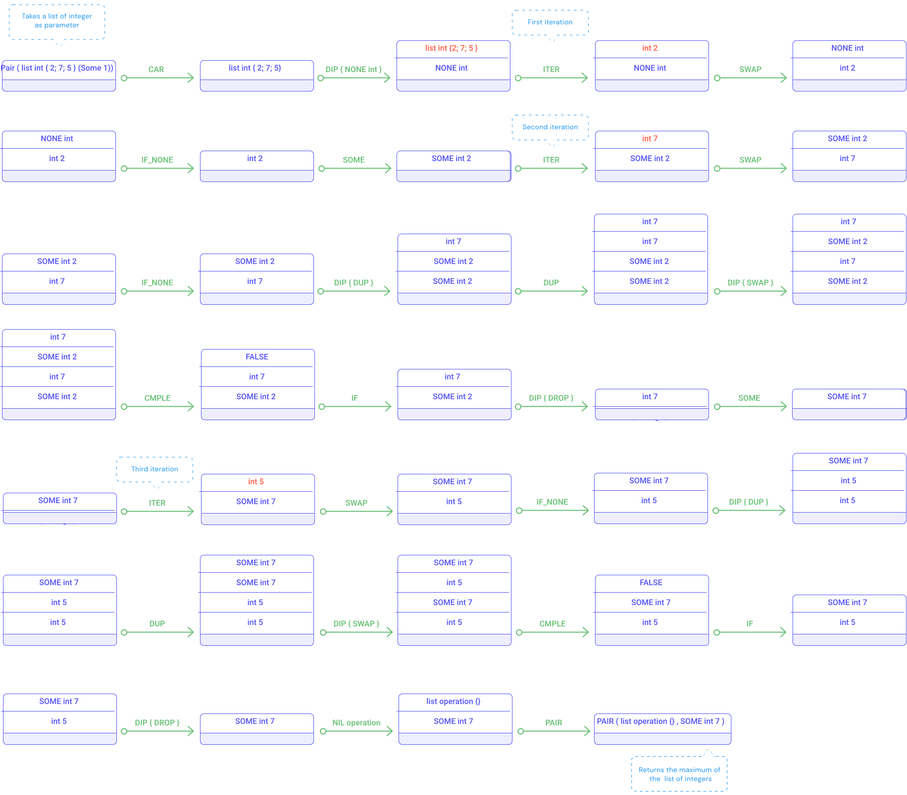
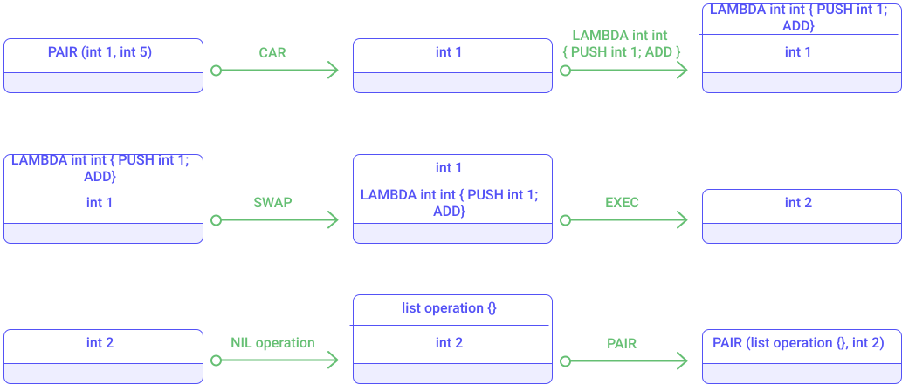

### Example 1 : Modulo with `LOOP` and `IF`

Let's illustrate the following Michelson instructions: `LOOP`, `DIP`, `DUP`, `SWAP`, `PUSH`, `CMPLE`, `IF`, `SUB`. The example below computes the *modulo* between two numbers (e.g. 7 % 5 = 2).

The idea is to repetitively subtract the divisor from the dividend. Once the dividend is smaller than the divisor, we successfully computed the remainder.

The following smart contract takes a pair of integers and computes the modulo of these two integers (using a `LOOP` instruction).

```js
parameter (pair int int) ;
storage int ;
code { CAR ;
       DUP ;
       UNPAIR ;
       COMPARE ;
       GT ;
       DIP { UNPAIR } ;
       LOOP { DIP { DUP } ;
              DUP ;
              DIP { SWAP } ;
              CMPLE ;
              IF
                     { PUSH bool False }
                     { DIP { DUP } ; SUB ; PUSH bool True } ; } ;
       DIP { DROP } ;
       NIL operation ;
       PAIR }
```

Now, let's simulate the execution of this snippet of code. For this example, we consider the initial stack initialized with 7 and 5 (in order to compute 7 % 5).

Notice that the `LOOP` instruction stops when it is given a `False` condition (in red in the diagram below). In our example, the condition is initialized to `True` because 7 is greater than 5 (and the modulo need to be computed).


<small className="figure">FIGURE 1: Illustration of the _Modulo_ example</small>

The execution of the "loop_example.tz" smart contract can be simulated with the following command:

```js
tezos-client run script loop_example.tz on storage '0' and input '(Pair 7 5)'
```

### Example 2 : Maximum of a list with `ITER` and `CMPLE`

Let's illustrate the following Michelson instructions: `CAR`, `CDR`, `ITER`, `DIP`, `DUP`, `DROP`, `SWAP`, `CMPLE`, `IF`, `NONE`, `SOME`, `IF_NONE`, `option`, `list`. The following snippet of code computes the maximum of a list of integers.

The idea is to repetitively take an element from the list and compare it with the maximum computed so far. Once the list is processed, the stack contains the biggest integer of the list.

```js
parameter (list int) ;
storage (option int) ;
code { CAR ;
       DIP { NONE int } ;
       ITER { SWAP ;
              IF_NONE
                { SOME }
                { DIP { DUP } ;
                  DUP ;
                  DIP { SWAP } ;
                  CMPLE;
                  IF { DROP } { DIP { DROP } };
                  SOME
                }
            } ;
       NIL operation ;
       PAIR }
```

Notice that the storage stores an `option int`. Indeed, if the given list is empty, then there is no maximum.


<small className="figure">FIGURE 2: Illustration of the _Maximum of a list_ example</small>

Notice in red in the diagram above that the `ITER` instruction is called recursively on each element of the given list of integers.

If you have setup a Tezos node, you can use the tezos-client program to simulate your smart contract (max_list.tz) with the following command. 

```js
tezos-client run script max_list.tz on storage 'None' and input '{1;2;5;3;7;2;15;4}'
```

### Example 3 : Executing a lambda with `EXEC` and `LAMBDA`

Let's illustrate the following Michelson instructions: `EXEC`, `LAMBDA`, `SWAP`, `PUSH`. The following snippet of code takes an integer and increment it using a lambda.

The idea is to define a lambda function (which increment an integer) and execute the function. Once the function has been applied the result is returned as new storage state.

```js
parameter int ;
storage int ;
code { CAR ;
       LAMBDA int int { PUSH int 1 ; ADD } ;
       SWAP ;
       EXEC ;
       NIL operation ;
       PAIR }
```


<small className="figure">FIGURE 3: Illustration of the execution of a lambda</small>

### Example 4 : Computing a sum with `LOOP_LEFT`

The following smart contract illustrates the `LOOP_LEFT` instruction usage. It takes an integer as parameter and computes the sum from zero to the given integer.

```js
parameter int ;
storage int ;
code { CAR ; PUSH int 0 ; SWAP ; PAIR ;
       LEFT int ;
       LOOP_LEFT {   DUP ;
                     CAR ;
                     DUP ;
                     PUSH int 1 ;
                     SWAP ;
                     SUB ;
                     DIP { SWAP ; CDR ; ADD };
                     DUP ;
                     GT ;
                     IF
                            { PAIR ; LEFT int }
                            { DROP ; RIGHT (pair int int) }  } ;
       NIL operation ;
       PAIR }
```

Let's breakdown the execution of this smart contract. In our example, the storage is used just to store the result of the execution. The diagram below shows how the sum of integers from 0 to 5 is computed.


<small className="figure">FIGURE 4: Illustration of the `LOOP_LEFT` instruction</small>

### Example 5 : Computing a factorial with `LOOP_LEFT`

Let's illustrate the following Michelson instructions: `LOOP_LEFT`. The following snippet of code takes an integer and computes factorial of the given integer; the result is saved in the storage.

```js
parameter int ;
storage int ;
code { PUSH int 1 ;
       SWAP ;
       CAR ;
       PAIR ;
       LEFT int ;
       LOOP_LEFT
            { DUP ;
              CAR ;
              SWAP ;
              CDR ;
              PUSH int 0 ;
              DIG 2 ;
              DUP ;
              DUG 3 ;
              COMPARE ;
              GT ;
              IF {   SWAP ;
                     DUP ;
                     DUG 2 ;
                     SWAP ;
                     MUL ;
                     PUSH int 1 ;
                     DIG 2 ;
                     SUB ;
                     PAIR ;
                     LEFT int }
                 { SWAP ; DROP ; RIGHT (pair int int) } } ;
       NIL operation ;
       PAIR }
```

